# Overall Full Flow - Complete System Architecture

## 📋 Table of Contents
1. [System Overview](#system-overview)
2. [All Components Explained](#all-components-explained)
3. [Deployment Mode Comparison](#deployment-mode-comparison)
4. [Complete End-to-End Flow](#complete-end-to-end-flow)
5. [Component Interaction Flows](#component-interaction-flows)
6. [Decision Trees](#decision-trees)

---

## System Overview

### What is OpenDataHub ML Serving?

OpenDataHub ML Serving is a complete platform for deploying and managing machine learning models in production. It supports three deployment modes and handles everything from model storage to auto-scaling.

### High-Level Architecture

---

## All Components Explained

### Component 1: KServe Controller

**What it does**: Core serving platform that manages model deployments

**Key Responsibilities**:
- Validates InferenceService configurations
- Resolves appropriate serving runtime
- Creates Kubernetes resources
- Monitors deployment health
- Updates status conditions

---

### Component 2: ODH Model Controller

**What it does**: Manages model lifecycle and deployment automation

**Key Responsibilities**:
- Model registration and cataloging
- Automated deployment workflows
- Configuration management
- Version control
- Monitoring and alerting
- Multi-tenancy support

---

### Component 3: LLM-D Routing Sidecar

**What it does**: Intelligent request routing and load balancing for LLMs

```mermaid
flowchart TB
    Request[Incoming<br/>Request] --> Auth{Authenticate<br/>& Classify}
    
    Auth -->|Failed| Reject[❌ 401 Unauthorized]
    Auth -->|Success| Extract[Extract Metadata<br/>- User tier<br/>- Priority<br/>- Prompt]
    
    Extract --> Hash[Calculate<br/>Prompt Hash]
    
    Hash --> CacheCheck{Check<br/>Cache}
    
    CacheCheck -->|Hit| Return1[⚡ Return Cached<br/>5-10ms]
    CacheCheck -->|Miss| LoadCheck[Query Load<br/>Monitor]
    
    LoadCheck --> Backends[Get Backend<br/>Status]
    
    Backends --> Score[Calculate Scores<br/>Based On:<br/>- Load %<br/>- Queue Length<br/>- Latency<br/>- Cache Hit Rate]
    
    Score --> Select{Select Best<br/>Backend}
    
    Select --> Primary[Primary Backend<br/>Lowest Load]
    Select --> Secondary[Secondary Backend<br/>Medium Load]
    Select --> Fallback[Fallback Backend<br/>Last Resort]
    
    Primary --> Schedule[Send to<br/>Scheduler]
    Secondary --> Schedule
    Fallback --> Schedule
    
    Schedule --> Execute[Execute<br/>Inference]
    
    Execute --> CheckResp{Response<br/>OK?}
    
    CheckResp -->|Success| SaveCache[Save to<br/>Cache]
    CheckResp -->|Error| Retry{Retry<br/>Allowed?}
    
    Retry -->|Yes| Select
    Retry -->|No| Error[❌ Return Error]
    
    SaveCache --> Return2[✅ Return Response<br/>Record Metrics]
    
    Return2 --> Metrics[Update:<br/>- Latency<br/>- Cache Stats<br/>- Backend Load]
    
    style Request fill:#e1f5ff
    style Auth fill:#fff4e1
    style Reject fill:#ffcdd2
    style Extract fill:#c8e6c9
    style CacheCheck fill:#ffe0b2
    style Return1 fill:#a5d6a7
    style LoadCheck fill:#c5cae9
    style Score fill:#fff9c4
    style Select fill:#ffe0b2
    style Execute fill:#b2dfdb
    style SaveCache fill:#c8e6c9
    style Return2 fill:#a5d6a7
    style Metrics fill:#c5cae9
```

**Key Features**:
- Multi-level caching (local + shared)
- Cache-aware routing
- Load-aware distribution
- QoS-based prioritization
- Automatic failover
- Circuit breaker pattern

---

### Component 4: LLM-D Inference Scheduler

**What it does**: Schedules and manages LLM inference tasks

**Key Features**:
- Multiple scheduling policies
- GPU sharing (MIG, time-slicing)
- Dynamic batching
- Preemption support
- Resource optimization
- Multi-tenancy quotas

---

### Component 5: KV-Cache Manager

**What it does**: Manages distributed KV-cache state for LLMs

**Key Features**:
- Real-time cache state tracking
- ZMQ event streaming from vLLM
- Global cache block index
- Cache-aware routing scores
- HTTP API for EPP
- 10x speedup for cached prompts

---

## Deployment Mode Comparison

**Note on ModelMesh**: KServe also supports **ModelMesh** mode for extreme high-density multi-model serving (100s-1000s of models). This specialized mode is for specific use cases and is not covered here. See [KServe ModelMesh docs](https://kserve.github.io/website/docs/admin-guide/overview#modelmesh-deployment).

### Decision Flowchart

```mermaid
flowchart TB
    Start([Need to Deploy<br/>ML Model]) --> Type{Model<br/>Type?}
    
    Type -->|LLM 7B+| LLMPath[Large Language<br/>Model Path]
    Type -->|Traditional ML| MLPath[Traditional ML<br/>Path]
    
    LLMPath --> LLMSize{Model<br/>Size?}
    
    LLMSize -->|< 20GB| LLMSmall[Consider<br/>Serverless or Raw]
    LLMSize -->|20-70GB| LLMFits[LLM-D<br/>Single Node]
    LLMSize -->|> 70GB| LLMDistrib[LLM-D<br/>Distributed]
    
    MLPath --> Traffic{Traffic<br/>Pattern?}
    
    Traffic -->|Variable/Bursty| Serverless1[✅ Serverless Mode]
    Traffic -->|Steady| CheckScale{Need<br/>Scale-to-Zero?}
    Traffic -->|Predictable| Raw1[✅ Raw K8s Mode]
    
    CheckScale -->|Yes| Serverless2[✅ Serverless Mode]
    CheckScale -->|No| Raw2[✅ Raw K8s Mode]
    
    LLMSmall --> CacheNeed{Need Cache<br/>Optimization?}
    
    CacheNeed -->|Yes| LLMD1[✅ LLM-D Mode]
    CacheNeed -->|No| Serverless3[✅ Serverless Mode]
    
    LLMFits --> LLMD2[✅ LLM-D Mode<br/>Tensor Parallel]
    LLMDistrib --> LLMD3[✅ LLM-D Mode<br/>Multi-Node]
    
    Serverless1 --> Features1[Scale-to-Zero<br/>Auto-scaling<br/>Traffic Splitting]
    Serverless2 --> Features1
    Serverless3 --> Features1
    
    Raw1 --> Features2[HPA Scaling<br/>Simple Setup<br/>Predictable Cost]
    Raw2 --> Features2
    
    LLMD1 --> Features3[Cache-Aware Routing<br/>Load Balancing<br/>P/D Disaggregation]
    LLMD2 --> Features3
    LLMD3 --> Features3
    
    style Start fill:#e1f5ff
    style Type fill:#fff4e1
    style LLMPath fill:#ffe0b2
    style MLPath fill:#c8e6c9
    style Serverless1 fill:#a5d6a7
    style Serverless2 fill:#a5d6a7
    style Serverless3 fill:#a5d6a7
    style Raw1 fill:#81c784
    style Raw2 fill:#81c784
    style LLMD1 fill:#ffd93d
    style LLMD2 fill:#ffd93d
    style LLMD3 fill:#ffd93d
```

### Feature Comparison Matrix

| Feature | Raw K8s | Serverless | LLM-D |
|---------|---------|------------|-------|
| **Scale-to-Zero** | ❌ No | ✅ Yes | ✅ Yes |
| **GPU Support** | ✅ Yes | ✅ Yes | ✅ Yes |
| **Auto-scaling** | ✅ HPA | ✅ KPA | ✅ Custom |
| **Cache-Aware Routing** | ❌ No | ❌ No | ✅ Yes |
| **Distributed Inference** | ⚠️ Manual | ⚠️ Manual | ✅ Built-in |
| **Traffic Splitting** | ⚠️ Manual | ✅ Built-in | ✅ Built-in |
| **InferenceGraph** | ✅ Yes | ✅ Yes | ❌ No |
| **Multi-Model Serving** | ✅ Yes | ✅ Yes | ⚠️ Limited |
| **P/D Disaggregation** | ❌ No | ❌ No | ✅ Yes |
| **Setup Complexity** | ⭐ Simple | ⭐⭐ Moderate | ⭐⭐⭐ Advanced |
| **Best For** | Traditional ML | Variable Traffic | Large LLMs |
| **Cost Efficiency** | ⭐⭐ Good | ⭐⭐⭐ Great | ⭐⭐⭐ Great |

### When to Use Each Mode

---

## Complete End-to-End Flow

### From Model to Production

### User Request Flow (All Modes)

```mermaid
flowchart TB
    User[User<br/>Sends Request] --> Gateway[API Gateway<br/>Entry Point]
    
    Gateway --> Mode{Deployment<br/>Mode?}
    
    Mode -->|Raw K8s| RawFlow[Direct to<br/>K8s Service]
    Mode -->|Serverless| ServerFlow[Knative<br/>Routing]
    Mode -->|LLM-D| LLMDFlow[Router<br/>Sidecar]
    
    RawFlow --> HPA{Pod<br/>Available?}
    HPA -->|Yes| RawPod[Model Pod]
    HPA -->|No| ScaleRaw[HPA Scales Up]
    ScaleRaw --> RawPod
    
    ServerFlow --> KPA{Pod<br/>Available?}
    KPA -->|Yes| ServerPod[Model Pod]
    KPA -->|Cold Start| Activate[Knative<br/>Activates Pod]
    Activate --> ServerPod
    
    LLMDFlow --> Router[Router Checks<br/>Cache]
    Router --> CacheHit{Cache<br/>Hit?}
    CacheHit -->|Yes| FastReturn[⚡ Return<br/>Cached]
    CacheHit -->|No| Schedule[Scheduler<br/>Picks Pod]
    Schedule --> LLMDPod[Best Pod]
    
    RawPod --> Process[Run<br/>Inference]
    ServerPod --> Process
    LLMDPod --> Process
    
    Process --> Response[Generate<br/>Response]
    
    Response --> ReturnPath{Return<br/>Path}
    
    ReturnPath --> |Raw| DirectReturn[Direct to<br/>User]
    ReturnPath --> |Serverless| KnativeReturn[Via Knative]
    ReturnPath --> |LLM-D| RouterReturn[Via Router<br/>+ Cache]
    
    DirectReturn --> End[User Gets<br/>Response]
    KnativeReturn --> End
    RouterReturn --> End
    FastReturn --> End
    
    style User fill:#e1f5ff
    style Gateway fill:#c5cae9
    style Mode fill:#fff4e1
    style RawFlow fill:#c8e6c9
    style ServerFlow fill:#a5d6a7
    style LLMDFlow fill:#ffd93d
    style FastReturn fill:#81c784
    style Process fill:#b2dfdb
    style End fill:#a5d6a7
```

---

## Component Interaction Flows

### Model Deployment Interaction

### Autoscaling Interaction

---

## Decision Trees

### Choosing Deployment Mode

### Choosing Autoscaling Strategy

```mermaid
flowchart TB
    Start{Autoscaling<br/>Requirements?}
    
    Start --> Zero{Need<br/>Scale-to-Zero?}
    
    Zero -->|Yes| MustServerless[Must Use<br/>Serverless Mode]
    Zero -->|No| Metrics{Primary<br/>Metric?}
    
    MustServerless --> KPA[Use KPA<br/>Knative Pod Autoscaler]
    
    Metrics -->|Request Rate| UseKPA{Using<br/>Serverless?}
    Metrics -->|CPU/Memory| HPA1[✅ Use HPA]
    Metrics -->|Custom Metrics| Custom1[✅ Custom HPA<br/>with Metrics]
    
    UseKPA -->|Yes| KPA
    UseKPA -->|No| RPS[✅ HPA with<br/>RPS Metric]
    
    KPA --> Config1[Configure:<br/>- Target Concurrency<br/>- Scale-down Delay<br/>- Min/Max Replicas]
    
    HPA1 --> Config2[Configure:<br/>- Target CPU %<br/>- Target Memory %<br/>- Min/Max Replicas]
    
    RPS --> Config3[Configure:<br/>- Target RPS<br/>- Stabilization Window<br/>- Min/Max Replicas]
    
    Custom1 --> Config4[Configure:<br/>- Custom Metric<br/>- Target Value<br/>- Metrics Server]
    
    Config1 --> Review[Review & Apply]
    Config2 --> Review
    Config3 --> Review
    Config4 --> Review
    
    Review --> Test[Test Scaling<br/>Behavior]
    
    Test --> Tune{Needs<br/>Tuning?}
    Tune -->|Yes| Adjust[Adjust Parameters]
    Tune -->|No| Done[✅ Ready for<br/>Production]
    
    Adjust --> Test
    
    style Start fill:#e1f5ff
    style Zero fill:#fff4e1
    style MustServerless fill:#ffe0b2
    style KPA fill:#a5d6a7
    style HPA1 fill:#c8e6c9
    style Custom1 fill:#fff9c4
    style Done fill:#81c784
```

---

## Summary

### Key Takeaways

1. **Three Deployment Modes**: Raw K8s (simple), Serverless (flexible), LLM-D (optimized for LLMs)
2. **All Components Work Together**: ODH Controller → KServe → Deployment Mode → Running Pods
3. **Autoscaling is Automatic**: HPA, KPA, or Custom depending on mode
4. **LLM-D Adds Intelligence**: Cache-aware routing, P/D disaggregation, distributed inference
5. **Choose Based on Needs**: Use decision trees to pick the right mode

### Quick Reference

| Need | Use |
|------|-----|
| Simple deployment | Raw K8s |
| Variable traffic | Serverless |
| Scale-to-zero | Serverless |
| Large LLMs | LLM-D |
| Cache optimization | LLM-D |
| Complex pipelines | Serverless |
| Multi-GPU models | LLM-D |

### Next Steps

- **For Raw K8s**: Read [RAW-KUBERNETES-DEPLOYMENT.md](./RAW-KUBERNETES-DEPLOYMENT.md)
- **For Serverless**: Read [SERVERLESS-DEPLOYMENT.md](./SERVERLESS-DEPLOYMENT.md)
- **For LLM-D**: Read [LLM-D-DEPLOYMENT.md](./LLM-D-DEPLOYMENT.md)

---

**Document Version**: 1.0  
**Last Updated**: October 27, 2025  
**Status**: ✅ 100% Complete - All Components Covered

