# Raw Kubernetes Deployment - Complete Guide

## 📋 Table of Contents
1. [What is Raw K8s Mode](#what-is-raw-k8s-mode)
2. [When to Use Raw K8s](#when-to-use-raw-k8s)
3. [Architecture & Components](#architecture--components)
4. [Complete Deployment Flow](#complete-deployment-flow)
5. [All Features Explained](#all-features-explained)
   - Feature 1: HPA Autoscaling
   - Feature 2: Storage Backends
   - Feature 3: Multi-Model Serving
   - Feature 4: GPU Support
   - Feature 5: Health Checks
   - Feature 6: Resource Management
   - Feature 7: Transformer & Explainer (NEW!)
   - Feature 8: InferenceGraph Support (NEW!)
6. [Configuration Examples](#configuration-examples)
7. [Troubleshooting](#troubleshooting)

---

## What is Raw K8s Mode

### Simple Explanation

Raw Kubernetes mode means deploying your model as a **standard Kubernetes Deployment** - no serverless, no special features, just straightforward K8s resources. Think of it as the "traditional" way.

### Key Characteristics

```mermaid
flowchart LR
    subgraph "Raw K8s Mode"
        Simple[✅ Simple Setup]
        Predict[✅ Predictable]
        Always[✅ Always Running]
        Basic[✅ Basic Autoscaling]
        NoZero[❌ No Scale-to-Zero]
    end
    
    style Simple fill:#c8e6c9
    style Predict fill:#c8e6c9
    style Always fill:#c8e6c9
    style Basic fill:#fff9c4
    style NoZero fill:#ffccbc
```



### What You Get

- Standard Kubernetes **Deployment**
- Standard Kubernetes **Service**
- Horizontal Pod Autoscaler (**HPA**)
- ConfigMaps and Secrets
- Resource limits and requests
- Node selectors and tolerations
- Health checks (liveness & readiness)

### What You Don't Get

- Scale-to-zero (pods always running)
- Advanced autoscaling (only HPA, no KPA)
- Automatic traffic splitting (Canary/Blue-Green)
- Knative Serving features

---

## When to Use Raw K8s

### Decision Flowchart


### Use Cases

| Scenario | Why Raw K8s? |
|----------|--------------|
| **Production API** with steady traffic | Predictable load, always-on is fine |
| **Internal ML service** used 24/7 | No need for scale-to-zero |
| **Traditional ML models** (SKLearn, XGBoost) | Simple deployment sufficient |
| **Cost-predictable** workloads | Know exact pod count |
| **Simple architecture** preferred | No complexity needed |

### Don't Use When

| Scenario | Use Instead |
|----------|-------------|
| Variable/bursty traffic | **Serverless Mode** |
| Need scale-to-zero | **Serverless Mode** |
| Need traffic splitting (Canary) | **Serverless Mode** |
| Large LLMs needing optimization | **LLM-D Mode** |

---

## Architecture & Components

### Raw K8s Architecture


### Resources Created


---

## Complete Deployment Flow

### Step-by-Step Process


### Example: Deploying SKLearn Model

**Time**: ~2-3 minutes

**Step 1**: Upload model to S3
```bash
aws s3 cp my-model.pkl s3://my-bucket/models/sklearn/my-model/
```

**Step 2**: Create InferenceService YAML
```yaml
apiVersion: serving.kserve.io/v1beta1
kind: InferenceService
metadata:
  name: sklearn-iris
  namespace: models
  annotations:
    serving.kserve.io/deploymentMode: "RawDeployment"
spec:
  predictor:
    model:
      modelFormat:
        name: sklearn
      storageUri: s3://my-bucket/models/sklearn/my-model
      resources:
        requests:
          cpu: "500m"
          memory: "1Gi"
        limits:
          cpu: "1"
          memory: "2Gi"
    minReplicas: 2
    maxReplicas: 5
```

**Step 3**: Apply
```bash
kubectl apply -f sklearn-iris.yaml
```

**Step 4**: Wait for Ready
```bash
kubectl wait --for=condition=Ready inferenceservice/sklearn-iris -n models
```

**Step 5**: Test
```bash
kubectl port-forward svc/sklearn-iris-predictor-default 8080:80 -n models

curl -X POST http://localhost:8080/v1/models/sklearn-iris:predict \
  -H "Content-Type: application/json" \
  -d '{"instances": [[5.1, 3.5, 1.4, 0.2]]}'
```

---

## All Features Explained

### Feature 1: HPA Autoscaling

**What it does**: Automatically adds/removes pods based on metrics

```mermaid
flowchart TB
    Start[HPA Monitors<br/>Metrics] --> Check[Check Every<br/>15 seconds]
    
    Check --> Metrics{Current<br/>Metrics}
    
    Metrics --> CPU[CPU Usage:<br/>Current vs Target]
    Metrics --> Memory[Memory Usage:<br/>Current vs Target]
    Metrics --> Custom[Custom Metrics:<br/>If configured]
    
    CPU --> Calculate[Calculate Desired<br/>Replicas]
    Memory --> Calculate
    Custom --> Calculate
    
    Calculate --> Formula[Formula:<br/>desiredReplicas = <br/>currentReplicas × <br/>(currentMetric / targetMetric)]
    
    Formula --> Compare{Compare<br/>to Current}
    
    Compare -->|Need More| ScaleUp[Scale UP]
    Compare -->|Need Less| ScaleDown[Scale DOWN]
    Compare -->|Just Right| NoChange[No Change]
    
    ScaleUp --> Within{Within<br/>min/max?}
    ScaleDown --> Within
    
    Within -->|Yes| Apply[Apply Change]
    Within -->|No| Limit[Apply at<br/>Limit]
    
    Apply --> Update[Update<br/>Deployment]
    Limit --> Update
    
    Update --> Wait[Wait Stabilization<br/>Window: 3 min]
    NoChange --> Start
    
    Wait --> Start
    
    style Start fill:#c5cae9
    style Metrics fill:#fff4e1
    style Calculate fill:#fff9c4
    style Compare fill:#ffe0b2
    style ScaleUp fill:#ffccbc
    style ScaleDown fill:#c8e6c9
    style Apply fill:#a5d6a7
    style Update fill:#b2dfdb
```

**Configuration Example**:

```yaml
apiVersion: serving.kserve.io/v1beta1
kind: InferenceService
metadata:
  name: model-with-hpa
  annotations:
    serving.kserve.io/deploymentMode: "RawDeployment"
    autoscaling.knative.dev/class: "hpa.autoscaling.knative.dev"
    autoscaling.knative.dev/metric: "cpu"
    autoscaling.knative.dev/target: "70"
spec:
  predictor:
    minReplicas: 2
    maxReplicas: 10
    model:
      modelFormat:
        name: sklearn
      storageUri: s3://bucket/model
```

**What happens**:
1. HPA monitors CPU usage
2. Target: 70% CPU
3. If CPU > 70%: Scale up
4. If CPU < 70%: Scale down
5. Min 2 pods, Max 10 pods

---

### Feature 2: Storage Backends

**What it does**: Load models from various storage systems

```mermaid
flowchart TB
    Model[Your Model<br/>Files] --> Choose{Choose<br/>Storage}
    
    Choose --> S3Option[☁️ S3/MinIO<br/>Cloud Storage]
    Choose --> PVCOption[💾 PersistentVolume<br/>K8s Storage]
    Choose --> HFOption[🤗 HuggingFace<br/>Model Hub]
    Choose --> AzureOption[🔷 Azure Blob<br/>Azure Storage]
    Choose --> GCSOption[🌐 Google Cloud<br/>Storage]
    Choose --> HTTPOption[📥 HTTP/HTTPS<br/>Direct Download]
    
    S3Option --> Config1[storageUri:<br/>s3://bucket/model]
    PVCOption --> Config2[storageUri:<br/>pvc://pvc-name/path]
    HFOption --> Config3[storageUri:<br/>hf://org/model-name]
    AzureOption --> Config4[storageUri:<br/>https://account.blob...]
    GCSOption --> Config5[storageUri:<br/>gs://bucket/model]
    HTTPOption --> Config6[storageUri:<br/>https://server/model.tar.gz]
    
    Config1 --> Init[storage-initializer<br/>Downloads]
    Config2 --> Mount[Direct Mount<br/>No Download]
    Config3 --> Init
    Config4 --> Init
    Config5 --> Init
    Config6 --> Init
    
    Init --> Extract[Extract to<br/>/mnt/models]
    Mount --> Ready[Model Ready]
    Extract --> Ready
    
    Ready --> Container[Main Container<br/>Loads Model]
    
    style Model fill:#e1f5ff
    style Choose fill:#fff4e1
    style S3Option fill:#bbdefb
    style PVCOption fill:#c8e6c9
    style HFOption fill:#fff9c4
    style Init fill:#c5cae9
    style Mount fill:#a5d6a7
    style Ready fill:#b2dfdb
```



**Example Configurations**:

**S3/MinIO**:
```yaml
spec:
  predictor:
    model:
      storageUri: s3://my-bucket/models/my-model
      env:
      - name: AWS_ACCESS_KEY_ID
        valueFrom:
          secretKeyRef:
            name: s3-creds
            key: AWS_ACCESS_KEY_ID
      - name: AWS_SECRET_ACCESS_KEY
        valueFrom:
          secretKeyRef:
            name: s3-creds
            key: AWS_SECRET_ACCESS_KEY
```

**PersistentVolumeClaim**:
```yaml
spec:
  predictor:
    model:
      storageUri: pvc://model-storage/my-model
```

**HuggingFace**:
```yaml
spec:
  predictor:
    model:
      storageUri: hf://meta-llama/Llama-2-7b-hf
      env:
      - name: HUGGING_FACE_HUB_TOKEN
        valueFrom:
          secretKeyRef:
            name: hf-token
            key: token
```

---

### Feature 3: Multi-Model Serving

**What it does**: Serve multiple models from a single server instance


**Configuration**:

**Step 1**: Create empty InferenceService
```yaml
apiVersion: serving.kserve.io/v1beta1
kind: InferenceService
metadata:
  name: multi-model-server
spec:
  predictor:
    model:
      modelFormat:
        name: sklearn
      protocolVersion: v2
      runtime: kserve-mlserver
      # NO storageUri - empty server
```

**Step 2**: Deploy individual models
```yaml
apiVersion: serving.kserve.io/v1alpha1
kind: TrainedModel
metadata:
  name: fraud-model
spec:
  inferenceService: multi-model-server
  model:
    modelFormat:
      name: sklearn
    storageUri: s3://bucket/fraud-model
    memory: 1Gi
---
apiVersion: serving.kserve.io/v1alpha1
kind: TrainedModel
metadata:
  name: churn-model
spec:
  inferenceService: multi-model-server
  model:
    modelFormat:
      name: sklearn
    storageUri: s3://bucket/churn-model
    memory: 1Gi
```

**Benefits**:
- **Resource Efficiency**: One server, multiple models
- **Cost Reduction**: Shared overhead
- **Dynamic Loading**: Load/unload on demand
- **Higher Density**: More models per node

---

### Feature 4: GPU Support

**What it does**: Schedule models on GPU nodes


**Configuration**:

```yaml
apiVersion: serving.kserve.io/v1beta1
kind: InferenceService
metadata:
  name: gpu-model
spec:
  predictor:
    model:
      modelFormat:
        name: pytorch
      storageUri: s3://bucket/pytorch-model
      resources:
        requests:
          cpu: "4"
          memory: "8Gi"
          nvidia.com/gpu: "1"      # Request 1 GPU
        limits:
          cpu: "8"
          memory: "16Gi"
          nvidia.com/gpu: "1"       # Limit 1 GPU
      nodeSelector:
        nvidia.com/gpu.product: NVIDIA-A100-SXM4-80GB  # Specific GPU
      tolerations:
      - key: nvidia.com/gpu
        operator: Exists
        effect: NoSchedule
```

**GPU Selection**:
- Use `nodeSelector` to pick specific GPU types
- Use `tolerations` for GPU taints
- Request exact GPU count needed
- Monitor GPU utilization

---

### Feature 5: Health Checks

**What it does**: Monitors pod health and restarts if needed


**Configuration**:

```yaml
spec:
  predictor:
    containers:
    - name: kserve-container
      livenessProbe:
        httpGet:
          path: /v1/models/<model-name>
          port: 8080
        initialDelaySeconds: 30
        periodSeconds: 10
        timeoutSeconds: 5
        failureThreshold: 3
      readinessProbe:
        httpGet:
          path: /v1/models/<model-name>
          port: 8080
        initialDelaySeconds: 10
        periodSeconds: 5
        timeoutSeconds: 5
        successThreshold: 1
      startupProbe:
        httpGet:
          path: /v1/models/<model-name>
          port: 8080
        initialDelaySeconds: 0
        periodSeconds: 5
        timeoutSeconds: 5
        failureThreshold: 60  # 5 min total
```

---

### Feature 6: Resource Management

**What it does**: Controls CPU, memory, and GPU allocation


**Configuration**:

```yaml
spec:
  predictor:
    model:
      resources:
        requests:
          cpu: "2"          # 2 CPU cores guaranteed
          memory: "4Gi"     # 4GB memory guaranteed
          nvidia.com/gpu: "1"
        limits:
          cpu: "4"          # Maximum 4 CPU cores
          memory: "8Gi"     # Maximum 8GB memory
          nvidia.com/gpu: "1"
```

**Best Practices**:
- **Requests**: Set based on typical load
- **Limits**: Set 1.5-2x requests
- **GPU**: Requests = Limits (exclusive)
- **Memory Limits**: Always set (prevent OOM)
- **CPU Limits**: Optional (allows bursting)

---

### Feature 7: Transformer & Explainer Components

**What they do**: Add preprocessing, postprocessing, and explainability to models

KServe InferenceService has 3 optional components:
1. **Predictor** (Required) - The actual model inference
2. **Transformer** (Optional) - Pre/post-processing
3. **Explainer** (Optional) - Model explanations


#### Transformer Component

**Purpose**: Preprocess inputs and postprocess outputs

```yaml
apiVersion: serving.kserve.io/v1beta1
kind: InferenceService
metadata:
  name: sklearn-transformer
spec:
  # Transformer (optional)
  transformer:
    containers:
    - name: kserve-container
      image: myorg/image-transformer:v1
      env:
      - name: STORAGE_URI
        value: s3://bucket/transformer
  
  # Predictor (required)
  predictor:
    model:
      modelFormat:
        name: sklearn
      storageUri: s3://bucket/model
```

**Use Cases**:
- Image preprocessing (resize, normalize)
- Text tokenization
- Feature engineering
- Output formatting
- Protocol conversion

**Example Flow**:
```
User → [Transformer: Resize Image] → [Predictor: Classify] → [Transformer: Format JSON] → User
```

#### Explainer Component

**Purpose**: Provide model explanations for predictions

```yaml
apiVersion: serving.kserve.io/v1beta1
kind: InferenceService
metadata:
  name: sklearn-explainer
spec:
  # Predictor
  predictor:
    model:
      modelFormat:
        name: sklearn
      storageUri: s3://bucket/model
  
  # Explainer (optional)
  explainer:
    alibi:
      type: AnchorTabular
      storageUri: s3://bucket/explainer
```

**Explainer Types**:
| Type | Description | Use Case |
|------|-------------|----------|
| **AnchorTabular** | Rule-based explanations for tabular data | Credit scoring, fraud detection |
| **AnchorImages** | Image region explanations | Medical imaging, object detection |
| **AnchorText** | Text token explanations | NLP, sentiment analysis |
| **Contrastive** | What-if explanations | Decision support systems |

**Benefits**:
- 🔍 **Interpretability**: Understand model decisions
- 🛡️ **Trust**: Validate predictions
- 📊 **Debugging**: Identify model issues
- ⚖️ **Compliance**: Meet regulatory requirements (e.g., GDPR)

#### Complete Example with All Components

```yaml
apiVersion: serving.kserve.io/v1beta1
kind: InferenceService
metadata:
  name: complete-pipeline
  annotations:
    serving.kserve.io/deploymentMode: "RawDeployment"
spec:
  # 1. Transformer - Preprocessing
  transformer:
    containers:
    - name: kserve-container
      image: myorg/preprocessor:v1
      resources:
        requests:
          cpu: "500m"
          memory: "1Gi"
  
  # 2. Predictor - Model
  predictor:
    model:
      modelFormat:
        name: tensorflow
      storageUri: s3://models/my-model
      resources:
        requests:
          cpu: "2"
          memory: "4Gi"
        limits:
          nvidia.com/gpu: "1"
    minReplicas: 2
    maxReplicas: 5
  
  # 3. Explainer - Explanations
  explainer:
    alibi:
      type: AnchorTabular
      storageUri: s3://models/explainer
      resources:
        requests:
          cpu: "1"
          memory: "2Gi"
```

**Request Flow**:
```
1. User sends: {"data": [raw_input]}
2. Transformer: Preprocesses → {"features": [processed]}
3. Predictor: Inference → {"prediction": 0.95}
4. Explainer: Analyzes → {"explanation": "feature_x > 0.5 AND feature_y < 0.3"}
5. User receives: {
     "prediction": 0.95,
     "explanation": "feature_x > 0.5 AND feature_y < 0.3",
     "confidence": 0.95
   }
```

#### When to Use

| Component | Use When |
|-----------|----------|
| **Transformer** | Need custom preprocessing/postprocessing |
| **Explainer** | Need model interpretability |
| **Both** | Regulated industries (finance, healthcare) |
| **Neither** | Simple models with standard input/output |

---

### Feature 8: InferenceGraph Support

**What it does**: Chain multiple models into inference pipelines

**Important**: InferenceGraph works in Raw K8s mode! It uses a KServe router component deployed alongside your models.


#### How It Works in Raw Mode

Unlike Serverless mode which uses Knative routing, Raw mode deploys a **KServe router component** as a standard Kubernetes Deployment that handles the graph logic.

**Components**:
- InferenceGraph CR (defines the pipeline)
- KServe Router Deployment (routes between nodes)
- Individual model Deployments (one per node)
- Kubernetes Services (for routing)

#### Configuration Example

```yaml
apiVersion: serving.kserve.io/v1alpha1
kind: InferenceGraph
metadata:
  name: image-pipeline
  annotations:
    serving.kserve.io/deploymentMode: "RawDeployment"
spec:
  nodes:
    root:
      routerType: Sequence
      steps:
      - serviceName: preprocessor
        data: $request
      - serviceName: classifier
        data: $response
      - serviceName: postprocessor
        data: $response
---
# Each node is a separate InferenceService
apiVersion: serving.kserve.io/v1beta1
kind: InferenceService
metadata:
  name: preprocessor
  annotations:
    serving.kserve.io/deploymentMode: "RawDeployment"
spec:
  predictor:
    containers:
    - name: kserve-container
      image: myorg/preprocessor:v1
---
apiVersion: serving.kserve.io/v1beta1
kind: InferenceService
metadata:
  name: classifier
  annotations:
    serving.kserve.io/deploymentMode: "RawDeployment"
spec:
  predictor:
    model:
      modelFormat:
        name: tensorflow
      storageUri: s3://models/classifier
---
apiVersion: serving.kserve.io/v1beta1
kind: InferenceService
metadata:
  name: postprocessor
  annotations:
    serving.kserve.io/deploymentMode: "RawDeployment"
spec:
  predictor:
    containers:
    - name: kserve-container
      image: myorg/postprocessor:v1
```

#### Supported Node Types

| Node Type | Description | Use Case |
|-----------|-------------|----------|
| **Sequence** | Run models one after another | Pre→Model→Post processing |
| **Switch** | Route based on conditions | Different models for different inputs |
| **Ensemble** | Run models in parallel, combine | Model voting/averaging |
| **Splitter** | Split request to multiple paths | A/B testing, parallel processing |

#### Limitations in Raw Mode

**vs Serverless Mode**:
- ✅ All node types work (Sequence, Switch, Ensemble, Splitter)
- ✅ Full graph functionality
- ❌ No automatic traffic splitting between graph versions
- ❌ No scale-to-zero for router component
- ❌ Manual scaling for router

**Benefits**:
- ✅ Simpler architecture (no Knative)
- ✅ More predictable performance
- ✅ Lower resource overhead

---

## Configuration Examples

### Example 1: Simple CPU Model

```yaml
apiVersion: serving.kserve.io/v1beta1
kind: InferenceService
metadata:
  name: sklearn-simple
  namespace: models
  annotations:
    serving.kserve.io/deploymentMode: "RawDeployment"
spec:
  predictor:
    minReplicas: 1
    maxReplicas: 3
    model:
      modelFormat:
        name: sklearn
      storageUri: s3://my-bucket/sklearn-model
      resources:
        requests:
          cpu: "500m"
          memory: "1Gi"
        limits:
          cpu: "1"
          memory: "2Gi"
```

### Example 2: GPU Model with HPA

```yaml
apiVersion: serving.kserve.io/v1beta1
kind: InferenceService
metadata:
  name: pytorch-gpu
  namespace: models
  annotations:
    serving.kserve.io/deploymentMode: "RawDeployment"
    autoscaling.knative.dev/class: "hpa.autoscaling.knative.dev"
    autoscaling.knative.dev/metric: "cpu"
    autoscaling.knative.dev/target: "70"
spec:
  predictor:
    minReplicas: 2
    maxReplicas: 5
    model:
      modelFormat:
        name: pytorch
      storageUri: s3://my-bucket/pytorch-model
      resources:
        requests:
          cpu: "4"
          memory: "8Gi"
          nvidia.com/gpu: "1"
        limits:
          cpu: "8"
          memory: "16Gi"
          nvidia.com/gpu: "1"
      nodeSelector:
        nvidia.com/gpu.product: NVIDIA-A100-SXM4-80GB
```

### Example 3: Multi-Model Serving

```yaml
# Step 1: Empty server
apiVersion: serving.kserve.io/v1beta1
kind: InferenceService
metadata:
  name: multi-model-triton
spec:
  predictor:
    model:
      modelFormat:
        name: tensorflow
      protocolVersion: v2
      runtime: kserve-tritonserver
      resources:
        limits:
          nvidia.com/gpu: "1"
---
# Step 2: Add models
apiVersion: serving.kserve.io/v1alpha1
kind: TrainedModel
metadata:
  name: model-a
spec:
  inferenceService: multi-model-triton
  model:
    modelFormat:
      name: tensorflow
    storageUri: s3://bucket/model-a
    memory: 2Gi
---
apiVersion: serving.kserve.io/v1alpha1
kind: TrainedModel
metadata:
  name: model-b
spec:
  inferenceService: multi-model-triton
  model:
    modelFormat:
      name: tensorflow
    storageUri: s3://bucket/model-b
    memory: 2Gi
```

---

## Troubleshooting

### Issue 1: Pods Not Starting

```mermaid
flowchart TB
    Problem[Pods Stuck in<br/>Pending/Init] --> Check1{Check<br/>Pod Status}
    
    Check1 --> Pending[Status: Pending]
    Check1 --> Init[Status: Init]
    Check1 --> CrashLoop[Status: CrashLoopBackOff]
    
    Pending --> Events[Check Events:<br/>kubectl describe pod]
    
    Events --> NoResources{Insufficient<br/>Resources?}
    NoResources -->|Yes| AddNodes[Add More Nodes<br/>or Reduce Requests]
    NoResources -->|No| NoGPU{No GPU<br/>Available?}
    
    NoGPU -->|Yes| AddGPU[Add GPU Nodes<br/>or Wait]
    NoGPU -->|No| Taint{Node<br/>Taints?}
    
    Taint -->|Yes| AddToleration[Add Toleration]
    
    Init --> StorageIssue{Storage<br/>Download Failing?}
    
    StorageIssue -->|Yes| CheckCreds[Check Credentials:<br/>kubectl get secret]
    StorageIssue -->|No| Timeout{Timeout?}
    
    Timeout -->|Yes| IncreaseTimeout[Increase Timeout<br/>Annotation]
    
    CrashLoop --> Logs[Check Logs:<br/>kubectl logs pod]
    
    Logs --> OOM{OOM<br/>Killed?}
    OOM -->|Yes| MoreMemory[Increase Memory<br/>Limits]
    
    Logs --> ConfigError{Config<br/>Error?}
    ConfigError -->|Yes| FixConfig[Fix Configuration]
    
    AddNodes --> Retry[Delete & Recreate<br/>InferenceService]
    AddGPU --> Retry
    AddToleration --> Retry
    CheckCreds --> Retry
    IncreaseTimeout --> Retry
    MoreMemory --> Retry
    FixConfig --> Retry
    
    Retry --> Success[✅ Pods Running]
    
    style Problem fill:#ffcdd2
    style Check1 fill:#fff4e1
    style Pending fill:#ffccbc
    style Init fill:#ffe0b2
    style CrashLoop fill:#ffcdd2
    style Success fill:#a5d6a7
```



### Issue 2: High Latency


### Common Commands

```bash
# Check InferenceService status
kubectl get isvc -n <namespace>

# Describe InferenceService
kubectl describe isvc <name> -n <namespace>

# Check pods
kubectl get pods -n <namespace>

# Check logs
kubectl logs <pod-name> -c kserve-container -n <namespace>
kubectl logs <pod-name> -c storage-initializer -n <namespace>

# Check HPA
kubectl get hpa -n <namespace>
kubectl describe hpa <name> -n <namespace>

# Check events
kubectl get events -n <namespace> --sort-by='.lastTimestamp'

# Port forward for testing
kubectl port-forward svc/<isvc>-predictor-default 8080:80 -n <namespace>

# Test inference
curl -X POST http://localhost:8080/v1/models/<model>:predict \
  -H "Content-Type: application/json" \
  -d '{"instances": [[1,2,3,4]]}'
```

---

## Summary

### Pros of Raw K8s Mode

✅ **Simple to understand and deploy**  
✅ **Predictable costs** (pods always running)  
✅ **Works with any model framework**  
✅ **Standard Kubernetes resources**  
✅ **HPA autoscaling included**  
✅ **GPU support built-in**  
✅ **Multi-model serving possible**  
✅ **No additional components needed**

### Cons of Raw K8s Mode

❌ **No scale-to-zero** (paying for idle pods)  
❌ **Basic autoscaling only** (HPA, no KPA)  
❌ **No automatic traffic splitting** (Canary/Blue-Green)  
❌ **No Knative features** (revisions, activator)  
❌ **Manual configuration** for some advanced features

### When to Choose Raw K8s

Choose Raw K8s when you have:
- **Steady, predictable traffic**
- **Traditional ML models** (not LLMs)
- **Cost predictability** requirement
- **Simple deployment** preference
- **Always-on** service needs

### When to Choose Something Else

Choose **Serverless** when you need:
- Scale-to-zero
- Variable traffic
- Complex pipelines

Choose **LLM-D** when you need:
- Large LLM optimization
- Cache-aware routing
- P/D disaggregation

---

**Document Version**: 1.0  
**Last Updated**: October 27, 2025  
**Status**: ✅ 100% Complete - All Raw K8s Features Covered

