# Serverless Deployment - Complete Guide

## 📋 Table of Contents
1. [What is Serverless Mode](#what-is-serverless-mode)
2. [When to Use Serverless](#when-to-use-serverless)
3. [Architecture & Components](#architecture--components)
4. [Complete Deployment Flow](#complete-deployment-flow)
5. [All Features Explained](#all-features-explained)
6. [InferenceGraph Pipelines](#inferencegraph-pipelines)
7. [Traffic Management](#traffic-management)
8. [Configuration Examples](#configuration-examples)
9. [Troubleshooting](#troubleshooting)

---

## What is Serverless Mode

### Simple Explanation

Serverless mode means your model deployment uses **Knative Serving** - it can automatically scale down to zero pods when not in use, and quickly scale up when requests arrive. You only pay for what you use!


### Key Characteristics

- **Scale-to-Zero**: Pods disappear when idle
- **Auto-Scale Up**: Activates on first request
- **Request-Based Scaling**: Based on concurrency/RPS
- **Traffic Splitting**: Built-in A/B testing
- **Revisions**: Automatic versioning
- **Cold Starts**: 60-90 seconds initial delay

---

## When to Use Serverless

### Decision Flowchart

```mermaid
flowchart TB
    Start{Need Serverless?} --> Pattern{Traffic<br/>Pattern?}
    
    Pattern -->|Variable| Variable[Variable Traffic<br/>Unpredictable Load]
    Pattern -->|Bursty| Bursty[Bursty Traffic<br/>Spikes & Valleys]
    Pattern -->|Steady| Steady[Steady Traffic<br/>24/7]
    Pattern -->|Infrequent| Infrequent[Infrequent<br/>Dev/Test]
    
    Variable --> CostQ{OK with<br/>Cold Starts?}
    Bursty --> CostQ
    Infrequent --> Perfect1[✅ Perfect Fit!]
    
    Steady --> CostCheck{Need Scale<br/>to Zero?}
    CostCheck -->|No| RawBetter[❌ Use Raw K8s<br/>More Predictable]
    CostCheck -->|Yes| Pipeline{Need Complex<br/>Pipelines?}
    
    CostQ -->|Yes| Pipeline
    CostQ -->|No| MinReplicas[Set minReplicas > 0<br/>Avoid Cold Starts]
    
    Pipeline -->|Yes| Perfect2[✅ Perfect Fit!<br/>InferenceGraph]
    Pipeline -->|No| Good[✅ Good Fit]
    
    MinReplicas --> Good
    
    Perfect1 --> Features[Get:<br/>- Scale-to-Zero<br/>- Traffic Splitting<br/>- Auto-scaling]
    Perfect2 --> Features
    Good --> Features
    
    style Perfect1 fill:#a5d6a7
    style Perfect2 fill:#a5d6a7
    style Good fill:#c8e6c9
    style RawBetter fill:#ffccbc
    style Features fill:#81c784
```



### Use Cases

| Scenario | Why Serverless? |
|----------|-----------------|
| **Dev/Test Environments** | Scale to zero when not testing, save 90% |
| **Batch Processing** | Run only when needed, zero cost idle |
| **Demo Applications** | No cost between demos |
| **A/B Testing** | Built-in traffic splitting |
| **Multi-Stage Pipelines** | InferenceGraph support |
| **Variable Traffic** | Auto-scales with demand |
| **Weekend/Night Shutdowns** | Automatic zero pods |

---

## Architecture & Components

### Serverless Architecture


### Key Components Explained

**1. Knative Activator**
- Catches requests when no pods exist
- Buffers requests during scale-from-zero
- Signals autoscaler to create pods
- Forwards requests once pods ready

**2. Knative Pod Autoscaler (KPA)**
- Monitors request concurrency
- Decides pod count needed
- Scales based on target concurrency
- Handles scale-to-zero

**3. Queue Proxy**
- Sidecar container in each pod
- Reports metrics to KPA
- Enforces concurrency limits
- Routes requests to model container

**4. Revision**
- Immutable snapshot of configuration
- Each change = new revision
- Traffic can split across revisions
- Named: `model-v1-001`, `model-v1-002`

---

## Complete Deployment Flow

### From YAML to Running (with Scale-to-Zero)

```mermaid
flowchart TB
    Start([Create InferenceService<br/>YAML]) --> Apply[kubectl apply]
    
    Apply --> KServe[KServe Controller<br/>Receives CR]
    
    KServe --> Detect{Detect<br/>Mode}
    
    Detect -->|serverless annotation<br/>OR default| Serverless[Serverless Mode]
    
    Serverless --> CreateKS[Create Knative<br/>Service]
    
    CreateKS --> KnativeCtrl[Knative Controller]
    
    KnativeCtrl --> CreateRev[Create Revision<br/>model-v1-001]
    
    CreateRev --> CreateRoute[Create Route<br/>Traffic Rules]
    
    CreateRoute --> CreateConfig[Create Configuration]
    
    CreateConfig --> InitialScale{minReplicas?}
    
    InitialScale -->|= 0| ScaleZero[Scale to 0<br/>No Pods Created]
    InitialScale -->|> 0| CreatePods[Create Initial<br/>Pods]
    
    ScaleZero --> Waiting[⏳ Waiting for<br/>First Request]
    
    CreatePods --> Download[Download Model]
    Download --> Load[Load Model]
    Load --> Ready1[Pods Ready]
    
    Ready1 --> RegisterKPA[Register with KPA]
    RegisterKPA --> Serving[✅ Serving Traffic]
    
    Waiting --> FirstReq{First<br/>Request?}
    FirstReq -->|Yes| Activate[Activator<br/>Catches Request]
    
    Activate --> Signal[Signal KPA<br/>Need Pods]
    Signal --> CreatePods
    
    Serving --> Monitor[KPA Monitors<br/>Concurrency]
    
    Monitor --> Decide{Scale<br/>Decision?}
    
    Decide -->|Need More| ScaleUp[Scale Up]
    Decide -->|Need Less| ScaleDown[Scale Down]
    Decide -->|Idle 60s| ScaleToZero[Scale to 0]
    Decide -->|Just Right| Monitor
    
    ScaleUp --> Monitor
    ScaleDown --> Monitor
    ScaleToZero --> Waiting
    
    style Start fill:#e1f5ff
    style KServe fill:#c8e6c9
    style Serverless fill:#fff9c4
    style CreateKS fill:#b2dfdb
    style ScaleZero fill:#a5d6a7
    style Waiting fill:#ffe0b2
    style Activate fill:#fff4e1
    style CreatePods fill:#c5cae9
    style Ready1 fill:#c8e6c9
    style Serving fill:#81c784
    style Monitor fill:#c5cae9
```



### Scale-from-Zero Flow (Cold Start)

```mermaid
flowchart TB
    Idle[0 Pods Running<br/>💰 $0 Cost] --> Req[User Request<br/>Arrives]
    
    Req --> Activator[Knative Activator<br/>Intercepts]
    
    Activator --> Buffer[Buffer Request<br/>Hold 60 seconds]
    
    Buffer --> SignalKPA[Signal KPA:<br/>Need Capacity!]
    
    SignalKPA --> CreatePod[Create Pod]
    
    CreatePod --> Schedule[K8s Schedules<br/>on Node]
    
    Schedule --> PullImage[Pull Container<br/>Image: 20-30s]
    
    PullImage --> StartContainer[Start Containers]
    
    StartContainer --> Init[storage-initializer<br/>Downloads Model]
    
    Init --> Download[Download from<br/>Storage: 30-40s]
    
    Download --> Extract[Extract Model]
    
    Extract --> MainStart[Main Container<br/>Starts]
    
    MainStart --> LoadModel[Load Model<br/>into Memory: 10-20s]
    
    LoadModel --> Warmup[Warmup Inference]
    
    Warmup --> Health[Health Check<br/>Passes]
    
    Health --> Ready[Pod Ready!<br/>~60-90s Total]
    
    Ready --> Activator2[Activator Forwards<br/>Buffered Request]
    
    Activator2 --> Process[Process Request]
    
    Process --> Response[Return Response]
    
    Response --> User[User Gets<br/>Response]
    
    User --> Note[Note: First request<br/>took 60-90s<br/>Subsequent requests<br/>fast 100-500ms]
    
    style Idle fill:#a5d6a7
    style Req fill:#e1f5ff
    style Activator fill:#fff9c4
    style Buffer fill:#ffe0b2
    style CreatePod fill:#c5cae9
    style Download fill:#ffccbc
    style LoadModel fill:#ffe0b2
    style Ready fill:#c8e6c9
    style Process fill:#b2dfdb
    style Response fill:#a5d6a7
    style Note fill:#fff4e1
```



**Cold Start Breakdown**:
- Image pull: 20-30s (cached after first time)
- Model download: 30-40s (depends on size)
- Model loading: 10-20s
- **Total: 60-90s** for first request

**Optimization Tips**:
- Set `minReplicas: 1` to avoid cold starts
- Use smaller models
- Cache models on nodes (PVC)
- Pre-warm with dummy requests

---

## All Features Explained

### Feature 1: Scale-to-Zero

**What it does**: Removes all pods when idle, saves money

```mermaid
flowchart TB
    Active[Pods Serving<br/>Traffic] --> Monitor[Monitor Traffic]
    
    Monitor --> Traffic{Traffic<br/>Coming?}
    
    Traffic -->|Yes| Serving[Keep Serving]
    Traffic -->|No| StartTimer[Start Idle<br/>Timer]
    
    Serving --> Monitor
    
    StartTimer --> Wait[Wait...]
    
    Wait --> Check{Still Idle<br/>After 60s?}
    
    Check -->|No - Traffic| Serving
    Check -->|Yes| GracefulShutdown[Graceful Shutdown]
    
    GracefulShutdown --> FinishReqs[Finish In-Flight<br/>Requests]
    
    FinishReqs --> Cleanup[Cleanup Resources]
    
    Cleanup --> Terminate[Terminate Pods]
    
    Terminate --> Zero[0 Pods<br/>💰 $0 Cost]
    
    Zero --> WakeUp{New Request?}
    
    WakeUp -->|Yes| ColdStart[Cold Start<br/>60-90s]
    WakeUp -->|No| Zero
    
    ColdStart --> Active
    
    style Active fill:#c8e6c9
    style Serving fill:#a5d6a7
    style Zero fill:#81c784
    style GracefulShutdown fill:#fff9c4
    style ColdStart fill:#ffccbc
```



**Configuration**:

```yaml
apiVersion: serving.kserve.io/v1beta1
kind: InferenceService
metadata:
  name: scale-to-zero-model
  annotations:
    autoscaling.knative.dev/min-scale: "0"       # Enable scale-to-zero
    autoscaling.knative.dev/scale-down-delay: "0s"  # Immediate scale down
    autoscaling.knative.dev/stable-window: "60s"    # Wait 60s idle
spec:
  predictor:
    minReplicas: 0  # Allow zero pods
    maxReplicas: 10
```

**Cost Savings Example**:
- Traditional (always on): 24/7 = $720/month
- Serverless (used 8hrs/day): 8/24 = $240/month
- **Savings: $480/month (67%)**

---

### Feature 2: KPA Autoscaling

**What it does**: Scales based on request concurrency


**Configuration**:

```yaml
metadata:
  annotations:
    autoscaling.knative.dev/target: "10"         # Target 10 concurrent/pod
    autoscaling.knative.dev/metric: "concurrency" # Use concurrency metric
    autoscaling.knative.dev/window: "60s"        # Evaluation window
    autoscaling.knative.dev/panic-threshold-percentage: "200"  # Panic at 200%
spec:
  predictor:
    containerConcurrency: 0  # 0 = unlimited, or set hard limit like 50
```

**Metrics Options**:
- `concurrency`: Concurrent requests per pod
- `rps`: Requests per second per pod

---

### Feature 3: Traffic Splitting

**What it does**: Route different % of traffic to different versions

```mermaid
flowchart TB
    Incoming[100%<br/>Incoming Traffic] --> Route[Route<br/>Configuration]
    
    Route --> Split{Traffic<br/>Split Rules}
    
    Split -->|80%| V1[Version 1<br/>Stable]
    Split -->|20%| V2[Version 2<br/>Canary]
    
    V1 --> Rev1[Revision<br/>model-001]
    V2 --> Rev2[Revision<br/>model-002]
    
    Rev1 --> Pod1[Pods v1]
    Rev2 --> Pod2[Pods v2]
    
    Pod1 --> Process1[Process<br/>Request]
    Pod2 --> Process2[Process<br/>Request]
    
    Process1 --> Metrics1[Collect Metrics:<br/>- Latency<br/>- Errors<br/>- Success Rate]
    
    Process2 --> Metrics2[Collect Metrics:<br/>- Latency<br/>- Errors<br/>- Success Rate]
    
    Metrics1 --> Compare[Compare<br/>Versions]
    Metrics2 --> Compare
    
    Compare --> Decision{V2 Better?}
    
    Decision -->|Yes| Promote[Gradually Increase<br/>V2 Traffic:<br/>20% → 50% → 100%]
    Decision -->|No| Rollback[Rollback<br/>100% to V1]
    
    Promote --> Final[V2 becomes<br/>100%]
    Rollback --> Final2[V1 stays<br/>100%]
    
    style Incoming fill:#e1f5ff
    style Route fill:#fff4e1
    style Split fill:#ffe0b2
    style V1 fill:#c8e6c9
    style V2 fill:#fff9c4
    style Compare fill:#c5cae9
    style Decision fill:#fff4e1
    style Promote fill:#a5d6a7
    style Rollback fill:#ffccbc
```



**Configuration**:

```yaml
apiVersion: serving.kserve.io/v1beta1
kind: InferenceService
metadata:
  name: canary-model
spec:
  predictor:
    model:
      modelFormat:
        name: sklearn
      storageUri: s3://bucket/model-v2  # New version
    canaryTrafficPercent: 20  # 20% to new version
```

**Use Cases**:
- **Canary**: 80/20 split, test new version
- **Blue-Green**: 100/0 → 0/100 instant switch
- **A/B Testing**: 50/50 split, compare metrics

---

### Feature 4: Revisions

**What it does**: Immutable snapshots of your model configuration


**View Revisions**:

```bash
kubectl get revisions -n <namespace>

# Output:
# NAME                    SERVICE   READY   AGE
# model-001               model     True    5d
# model-002               model     True    1h
```

**Rollback to Previous Revision**:

```yaml
apiVersion: serving.knative.dev/v1
kind: Service
metadata:
  name: model
spec:
  traffic:
  - revisionName: model-001  # Rollback to old version
    percent: 100
```

---

## InferenceGraph Pipelines

### What is InferenceGraph?

**Simple Explanation**: Chain multiple models together into a pipeline


### Node Types

#### 1. Sequence Node

**What it does**: Runs models in sequence (one after another)


**Configuration**:

```yaml
apiVersion: serving.kserve.io/v1alpha1
kind: InferenceGraph
metadata:
  name: sequential-pipeline
spec:
  nodes:
    root:
      routerType: Sequence
      steps:
      - serviceName: preprocessor
        data: $request
      - serviceName: classifier
        data: $response
      - serviceName: postprocessor
        data: $response
```

#### 2. Switch Node

**What it does**: Routes based on conditions (if/else logic)


**Configuration**:

```yaml
spec:
  nodes:
    root:
      routerType: Sequence
      steps:
      - serviceName: animal-detector
      - nodeName: breed-classifier
    
    breed-classifier:
      routerType: Switch
      steps:
      - serviceName: dog-classifier
        condition: "{ .predictions[0].class == 'dog' }"
      - serviceName: cat-classifier
        condition: "{ .predictions[0].class == 'cat' }"
      - serviceName: bird-classifier
        condition: "{ .predictions[0].class == 'bird' }"
      - serviceName: generic-classifier
        # Default - no condition
```

#### 3. Ensemble Node

**What it does**: Runs models in parallel, combines results


**Configuration**:

```yaml
spec:
  nodes:
    root:
      routerType: Ensemble
      steps:
      - serviceName: sklearn-model
      - serviceName: xgboost-model
      - serviceName: lightgbm-model
```

#### 4. Splitter Node

**What it does**: A/B testing - splits traffic randomly


**Configuration**:

```yaml
spec:
  nodes:
    root:
      routerType: Splitter
      steps:
      - serviceName: model-v1
        weight: 70
      - serviceName: model-v2
        weight: 30
```

---

## Traffic Management

### Canary Deployment

```mermaid
flowchart TB
    Start[Current: v1<br/>100% Traffic] --> NewVersion[Deploy v2]
    
    NewVersion --> Canary1[Canary: 10%<br/>v1: 90%, v2: 10%]
    
    Canary1 --> Monitor1[Monitor for<br/>10 minutes]
    
    Monitor1 --> Check1{Metrics<br/>Good?}
    
    Check1 -->|Yes| Canary2[Increase: 50%<br/>v1: 50%, v2: 50%]
    Check1 -->|No| Rollback1[❌ Rollback<br/>100% to v1]
    
    Canary2 --> Monitor2[Monitor for<br/>30 minutes]
    
    Monitor2 --> Check2{Still<br/>Good?}
    
    Check2 -->|Yes| Full[Promote: 100%<br/>v2: 100%]
    Check2 -->|No| Rollback2[❌ Rollback<br/>100% to v1]
    
    Full --> Cleanup[Cleanup v1]
    
    style Start fill:#c8e6c9
    style NewVersion fill:#fff9c4
    style Canary1 fill:#ffe0b2
    style Check1 fill:#fff4e1
    style Canary2 fill:#ffccbc
    style Check2 fill:#fff4e1
    style Full fill:#a5d6a7
    style Rollback1 fill:#ffcdd2
    style Rollback2 fill:#ffcdd2
```



**Steps**:

1. **Deploy new version with canary**:
```yaml
spec:
  predictor:
    model:
      storageUri: s3://bucket/model-v2
    canaryTrafficPercent: 10
```

2. **Monitor metrics** (10 minutes)

3. **Increase canary** if good:
```yaml
spec:
  predictor:
    canaryTrafficPercent: 50
```

4. **Promote to 100%**:
```yaml
spec:
  predictor:
    canaryTrafficPercent: 100
```

5. **Clean up old version**

### Blue-Green Deployment

```mermaid
flowchart TB
    Blue[Blue: v1<br/>100% Traffic] --> DeployGreen[Deploy Green: v2<br/>0% Traffic]
    
    DeployGreen --> Test[Test Green<br/>Manually]
    
    Test --> Ready{Ready to<br/>Switch?}
    
    Ready -->|Yes| Switch[Switch Traffic<br/>100% to Green]
    Ready -->|No| Fix[Fix Issues]
    
    Fix --> Test
    
    Switch --> Monitor[Monitor<br/>Green]
    
    Monitor --> Issues{Issues?}
    
    Issues -->|Yes| QuickRollback[❌ Instant Rollback<br/>100% to Blue]
    Issues -->|No| Success[✅ Success<br/>Delete Blue]
    
    QuickRollback --> Blue
    
    style Blue fill:#64b5f6
    style DeployGreen fill:#81c784
    style Test fill:#fff9c4
    style Switch fill:#ffe0b2
    style Monitor fill:#c5cae9
    style Issues fill:#fff4e1
    style Success fill:#a5d6a7
    style QuickRollback fill:#ffcdd2
```



---

## Configuration Examples

### Example 1: Basic Serverless

```yaml
apiVersion: serving.kserve.io/v1beta1
kind: InferenceService
metadata:
  name: serverless-sklearn
  annotations:
    autoscaling.knative.dev/target: "10"
    autoscaling.knative.dev/min-scale: "0"
spec:
  predictor:
    minReplicas: 0
    maxReplicas: 5
    model:
      modelFormat:
        name: sklearn
      storageUri: s3://my-bucket/sklearn-model
```

### Example 2: No Cold Start (minReplicas: 1)

```yaml
apiVersion: serving.kserve.io/v1beta1
kind: InferenceService
metadata:
  name: warm-start-model
  annotations:
    autoscaling.knative.dev/target: "100"
    autoscaling.knative.dev/min-scale: "1"  # Always 1 pod minimum
spec:
  predictor:
    minReplicas: 1  # Avoids cold starts
    maxReplicas: 10
    model:
      modelFormat:
        name: tensorflow
      storageUri: s3://my-bucket/tensorflow-model
```

### Example 3: Canary Deployment

```yaml
apiVersion: serving.kserve.io/v1beta1
kind: InferenceService
metadata:
  name: canary-rollout
spec:
  predictor:
    model:
      modelFormat:
        name: sklearn
      storageUri: s3://my-bucket/model-v2
    canaryTrafficPercent: 20  # 20% to new version
```

### Example 4: InferenceGraph Pipeline

```yaml
apiVersion: serving.kserve.io/v1alpha1
kind: InferenceGraph
metadata:
  name: ml-pipeline
spec:
  nodes:
    root:
      routerType: Sequence
      steps:
      - serviceName: feature-transformer
        data: $request
      - nodeName: ensemble
        data: $response
      - serviceName: result-formatter
        data: $response
    
    ensemble:
      routerType: Ensemble
      steps:
      - serviceName: model-1
      - serviceName: model-2
      - serviceName: model-3
```

---

## Troubleshooting

### Issue 1: Cold Start Too Slow


### Issue 2: Not Scaling to Zero

```mermaid
flowchart TB
    Problem[Pods Not<br/>Scaling to 0] --> Check{Check<br/>Configuration}
    
    Check --> MinReplicas{minReplicas<br/>Setting?}
    
    MinReplicas -->|> 0| Fix1[Set minReplicas: 0]
    MinReplicas -->|= 0| CheckAnnotation{Annotation?}
    
    CheckAnnotation --> MinScale{min-scale<br/>annotation?}
    
    MinScale -->|> 0| Fix2[Set min-scale: "0"]
    MinScale -->|= 0| CheckTraffic{Still Getting<br/>Traffic?}
    
    CheckTraffic -->|Yes| Fix3[Traffic not idle<br/>for 60s]
    CheckTraffic -->|No| CheckWindow{scale-down-delay?}
    
    CheckWindow -->|Too long| Fix4[Reduce delay:<br/>scale-down-delay: "0s"]
    
    Fix1 --> Retry[Apply Changes]
    Fix2 --> Retry
    Fix3 --> Wait[Wait 60s Idle]
    Fix4 --> Retry
    
    Retry --> Success[✅ Scales to 0]
    Wait --> Success
    
    style Problem fill:#ffccbc
    style Check fill:#fff4e1
    style Fix1 fill:#fff9c4
    style Fix2 fill:#fff9c4
    style Fix3 fill:#ffe0b2
    style Fix4 fill:#fff9c4
    style Success fill:#a5d6a7
```

### Commands

```bash
# Check Knative Service
kubectl get ksvc -n <namespace>

# Check Revisions
kubectl get revisions -n <namespace>

# Check KPA
kubectl get kpa -n <namespace>

# Describe InferenceService
kubectl describe isvc <name> -n <namespace>

# Force scale to 0 (testing)
kubectl annotate ksvc <name> \
  autoscaling.knative.dev/min-scale="0" \
  -n <namespace>

# Check activator logs
kubectl logs -n knative-serving -l app=activator

# Check autoscaler logs
kubectl logs -n knative-serving -l app=autoscaler
```

---

## Summary

### Pros of Serverless Mode

✅ **Scale-to-zero** - No cost when idle  
✅ **Auto-scaling** - Handles traffic spikes  
✅ **Traffic splitting** - Easy A/B testing  
✅ **Revisions** - Easy rollback  
✅ **InferenceGraph** - Complex pipelines  
✅ **Cost-effective** - Pay only for use  

### Cons of Serverless Mode

❌ **Cold starts** - 60-90s initial delay  
❌ **Complexity** - More components  
❌ **Less predictable** - Variable costs  
❌ **Knative required** - Additional dependency  

### When to Use

✅ **Variable traffic patterns**  
✅ **Dev/test environments**  
✅ **Batch processing**  
✅ **Need cost optimization**  
✅ **Complex ML pipelines**  

---

**Document Version**: 1.0  
**Last Updated**: October 27, 2025  
**Status**: ✅ 100% Complete - All Serverless Features Covered

