# KServe Quick Start Guide

## Overview

This is a quick reference guide to help you navigate the KServe documentation. All diagrams use **Mermaid flowcharts** for visualization.

## 🚀 5-Minute Understanding

### What is KServe?

KServe is a **Kubernetes-native platform** for serving both **Generative AI (LLMs)** and **Predictive AI (traditional ML)** models at scale.

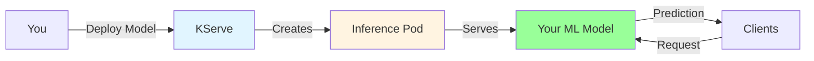

### Core Concepts

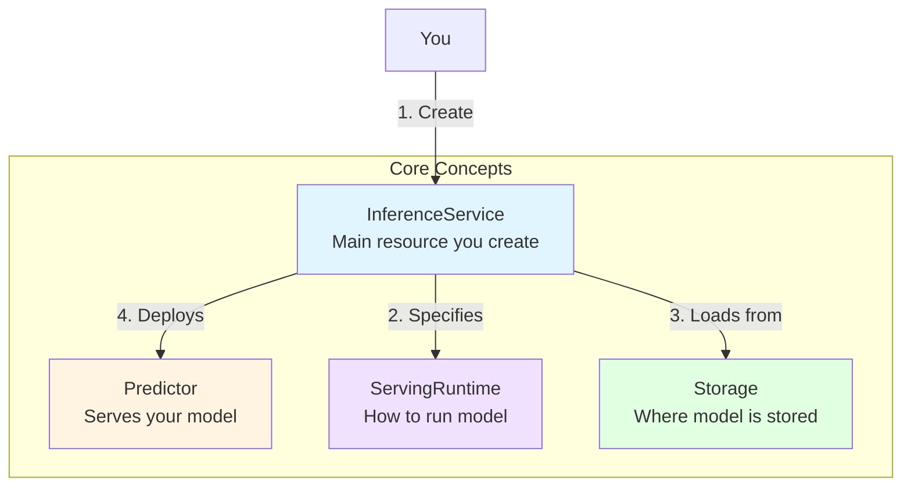

## 📖 Documentation Roadmap

### By Experience Level

#### **Beginner** (Start Here)
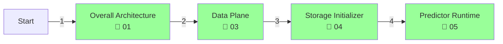

**Start with**: 
1. [Overall Architecture](./01-KSERVE-OVERALL-ARCHITECTURE.md) - Big picture
2. [Data Plane Components](./03-DATA-PLANE-COMPONENTS.md) - How it works
3. [Storage Initializer](./04-STORAGE-INITIALIZER.md) - Model loading
4. [Predictor Runtime](./05-PREDICTOR-RUNTIME.md) - Model serving

#### **Intermediate** (Deep Dive)
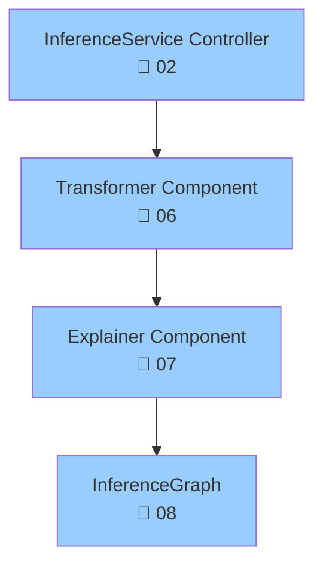

**Continue with**:
- [InferenceService Controller](./02-INFERENCESERVICE-CONTROLLER.md) - Control plane

#### **Advanced** (Expert Level)
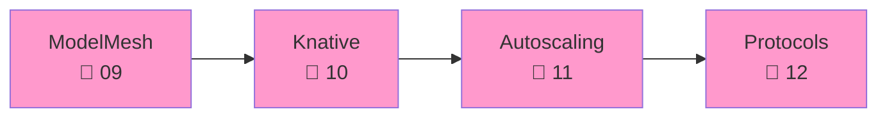

### By Use Case

#### **Deploying LLMs / Generative AI**

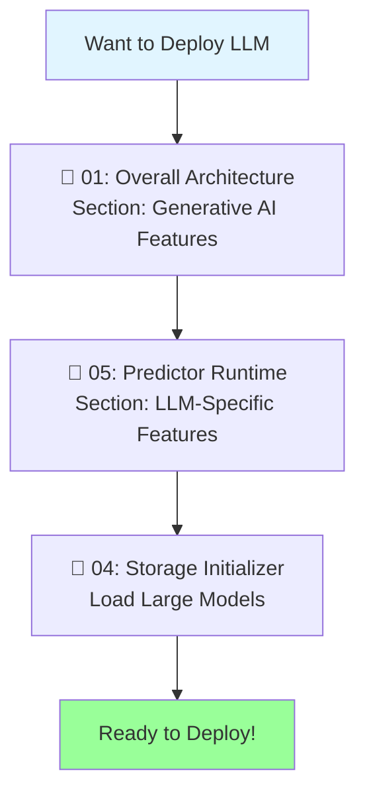

**Key Topics**:
- vLLM Runtime
- GPU Memory Management
- KV Cache Offloading
- OpenAI Protocol
- Streaming Responses

#### **Deploying Traditional ML Models**

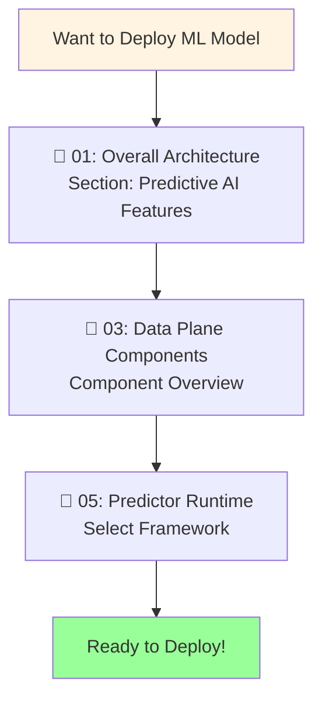

**Key Topics**:
- TensorFlow/PyTorch/SKLearn
- Transformer (Pre/Post-processing)
- Explainer (Model Interpretability)
- Batching

#### **High-Scale Multi-Model Serving**

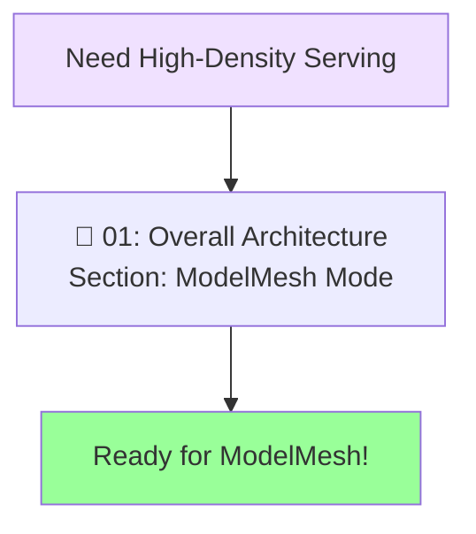

#### **Auto-Scaling Setup**

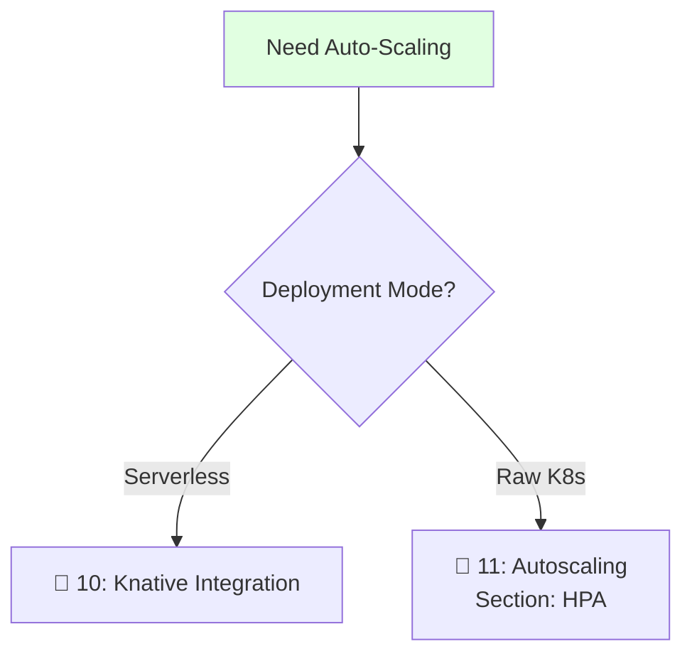

## 📋 Component Quick Reference

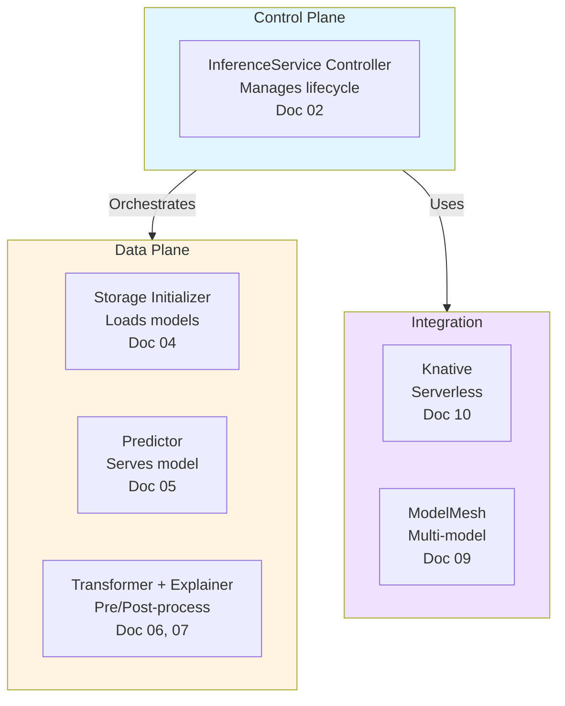

## 🎯 Common Tasks

### Task 1: Deploy Your First Model

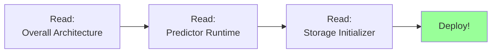

**Documentation Path**:
1. [Overall Architecture](./01-KSERVE-OVERALL-ARCHITECTURE.md) → Deployment Modes
2. [Predictor Runtime](./05-PREDICTOR-RUNTIME.md) → Select your framework
3. [Storage Initializer](./04-STORAGE-INITIALIZER.md) → Configure storage

### Task 2: Add Pre-processing


**Documentation Path**:
- Coming: [Transformer Component](./06-TRANSFORMER-COMPONENT.md)

### Task 3: Enable Auto-Scaling

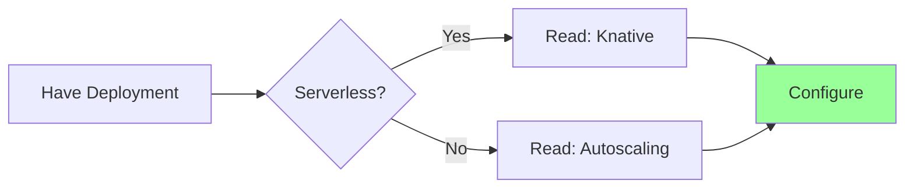

**Documentation Path**:
- Coming: [Knative Integration](./10-KNATIVE-INTEGRATION.md)
- Coming: [Autoscaling Mechanisms](./11-AUTOSCALING-MECHANISMS.md)

### Task 4: Setup Canary Deployment

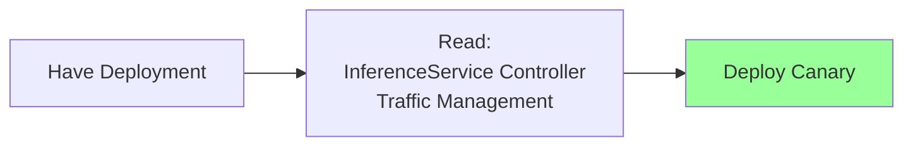

**Documentation Path**:
- [InferenceService Controller](./02-INFERENCESERVICE-CONTROLLER.md) → Traffic Management

## 🔍 Find Information About...

### Components

| Component | Documentation | Key Topics |
|-----------|--------------|------------|
| **InferenceService** | [📄 02](./02-INFERENCESERVICE-CONTROLLER.md) | CRD, Reconciliation, Webhooks |
| **Storage** | [📄 04](./04-STORAGE-INITIALIZER.md) | S3, GCS, Azure, PVC, HTTP |
| **Predictor** | [📄 05](./05-PREDICTOR-RUNTIME.md) | Runtimes, GPU, LLMs |
| **Transformer** | 🔜 06 | Pre/Post-processing |
| **Explainer** | 🔜 07 | Model interpretability |
| **Router** | 🔜 08 | InferenceGraph, Pipelines |

### Features

| Feature | Where to Find |
|---------|---------------|
| **LLM Serving** | [📄 05](./05-PREDICTOR-RUNTIME.md) → LLM Features |
| **GPU Support** | [📄 05](./05-PREDICTOR-RUNTIME.md) → GPU Management |
| **Batching** | [📄 05](./05-PREDICTOR-RUNTIME.md) → Dynamic Batching |
| **Scale-to-Zero** | [📄 01](./01-KSERVE-OVERALL-ARCHITECTURE.md) + 🔜 10 |
| **Canary Rollout** | [📄 02](./02-INFERENCESERVICE-CONTROLLER.md) → Traffic |
| **Model Caching** | [📄 04](./04-STORAGE-INITIALIZER.md) + [📄 05](./05-PREDICTOR-RUNTIME.md) |

### Deployment Modes

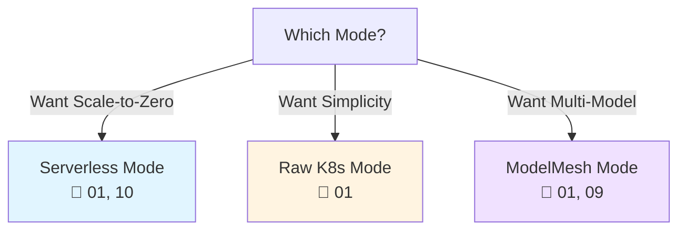

## 📊 Documentation Status

| Document | Status | Topics Covered |
|----------|--------|----------------|
| 📄 00 Quick Start | ✅ Complete | Navigation guide |
| 📄 01 Overall Architecture | ✅ Complete | Full architecture |
| 📄 02 InferenceService Controller | ✅ Complete | Control plane |
| 📄 03 Data Plane Components | ✅ Complete | Runtime components |
| 📄 04 Storage Initializer | ✅ Complete | Model loading |
| 📄 05 Predictor Runtime | ✅ Complete | Model serving |
| 📄 06 Transformer | 🔜 Coming | Pre/Post-processing |
| 📄 07 Explainer | 🔜 Coming | Interpretability |
| 📄 08 InferenceGraph | 🔜 Coming | Routing, Pipelines |
| 📄 09 ModelMesh | 🔜 Coming | Multi-model serving |
| 📄 10 Knative | 🔜 Coming | Serverless |
| 📄 11 Autoscaling | 🔜 Coming | Scaling mechanisms |
| 📄 12 Protocols | 🔜 Coming | V1, V2, OpenAI |

## 🎓 Learning Paths

### Path 1: Quick Deployment (30 minutes)
```
Overall Architecture (10m) 
    ↓
Predictor Runtime (10m)
    ↓
Storage Initializer (10m)
    ↓
Deploy your first model!
```

### Path 2: Full Understanding (2 hours)
```
Overall Architecture (15m)
    ↓
InferenceService Controller (30m)
    ↓
Data Plane Components (30m)
    ↓
Storage Initializer (20m)
    ↓
Predictor Runtime (25m)
    ↓
Expert level!
```

### Path 3: LLM Specialist (1 hour)
```
Overall Architecture → Generative AI (15m)
    ↓
Predictor Runtime → LLM Features (30m)
    ↓
Storage Initializer → Large Models (15m)
    ↓
Deploy LLMs!
```

## 🚦 Getting Started Checklist

- [ ] Read [Overall Architecture](./01-KSERVE-OVERALL-ARCHITECTURE.md)
- [ ] Understand deployment modes
- [ ] Choose your serving runtime
- [ ] Configure storage for your model
- [ ] Review [Predictor Runtime](./05-PREDICTOR-RUNTIME.md) for your framework
- [ ] Deploy your first InferenceService
- [ ] Test inference endpoint
- [ ] Set up monitoring
- [ ] Configure autoscaling
- [ ] Deploy to production!

## 🔗 External Resources

### Official Documentation
- [KServe Website](https://kserve.github.io/website/)
- [KServe GitHub](https://github.com/kserve/kserve)
- [Getting Started Guide](https://kserve.github.io/website/docs/getting-started)

### Related Projects
- [OpenDataHub KServe](https://github.com/opendatahub-io/kserve)
- [Knative Serving](https://knative.dev/docs/serving/)
- [ModelMesh](https://github.com/kserve/modelmesh-serving)

## 💡 Tips for Using This Documentation

1. **Start with the flowcharts**: Visual understanding first
2. **Follow the links**: Documentation is interconnected
3. **Use the search guide**: In README.md
4. **Check "Related Components"**: At the end of each doc
5. **Refer to examples**: YAML specs provided throughout

## ❓ FAQ Navigation

**Q: How do I deploy an LLM?**
→ [Overall Architecture](./01-KSERVE-OVERALL-ARCHITECTURE.md) → Generative AI
→ [Predictor Runtime](./05-PREDICTOR-RUNTIME.md) → LLM Features

**Q: How does autoscaling work?**
→ [Overall Architecture](./01-KSERVE-OVERALL-ARCHITECTURE.md) → Autoscaling
→ Coming: Autoscaling Mechanisms

**Q: How do I load models from S3?**
→ [Storage Initializer](./04-STORAGE-INITIALIZER.md) → S3 Download Flow

**Q: What's the difference between deployment modes?**
→ [Overall Architecture](./01-KSERVE-OVERALL-ARCHITECTURE.md) → Deployment Modes

**Q: How do I add pre-processing?**
→ Coming: [Transformer Component](./06-TRANSFORMER-COMPONENT.md)

---

**Ready to dive in?** Start with the [Overall Architecture](./01-KSERVE-OVERALL-ARCHITECTURE.md)!

