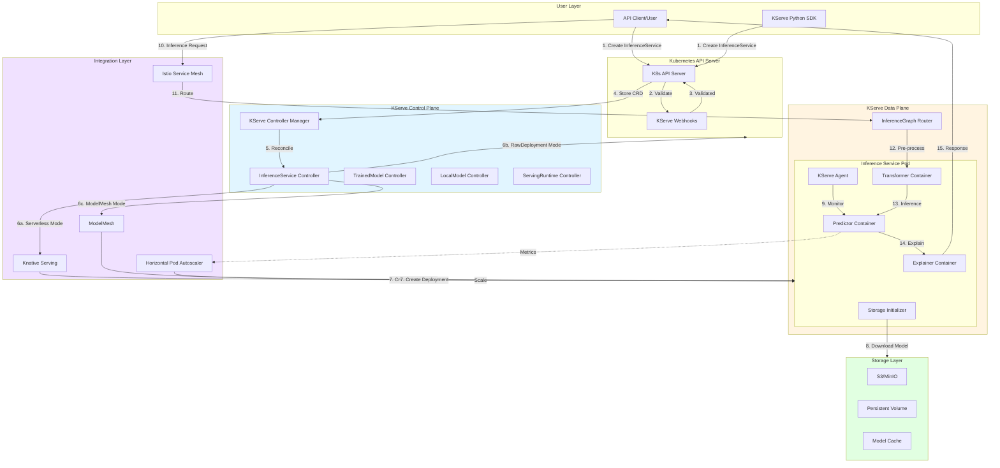
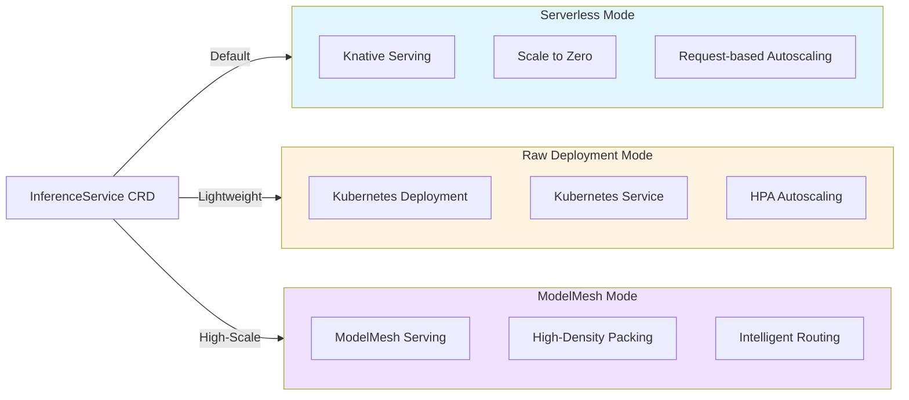
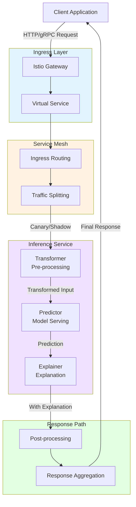
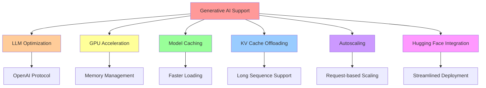
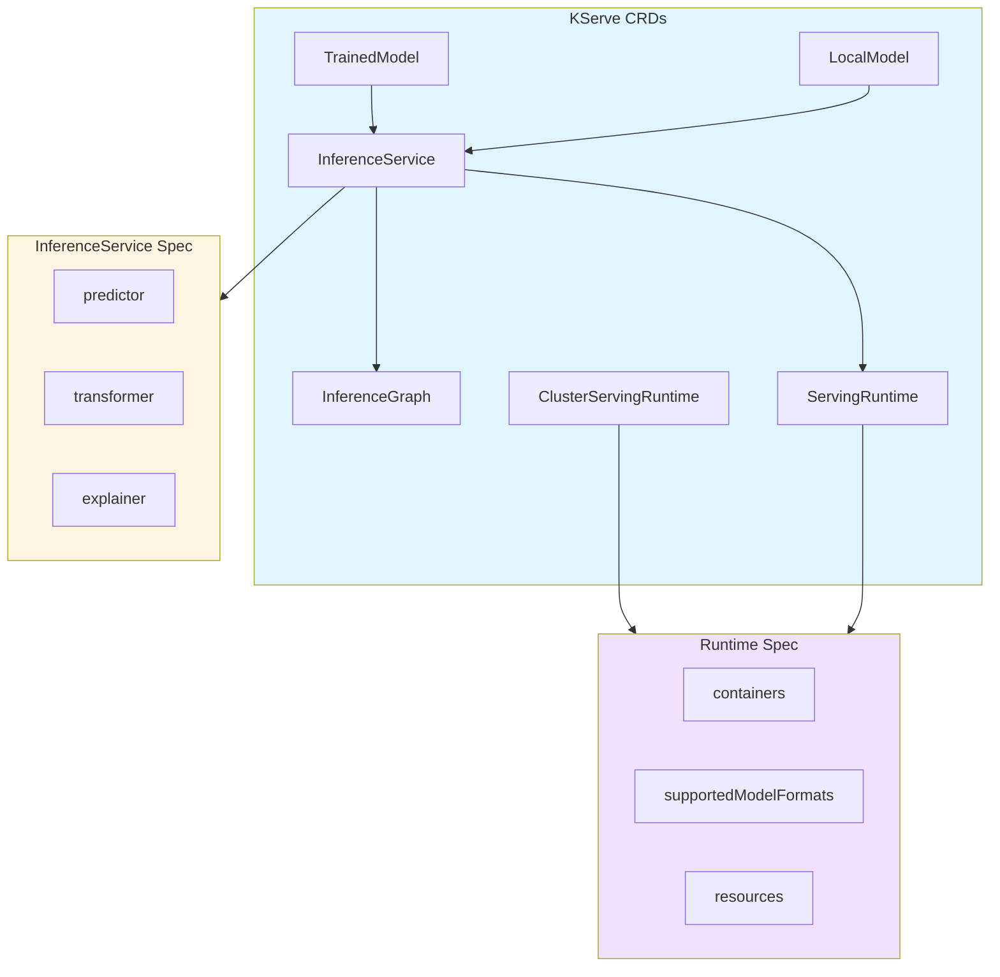
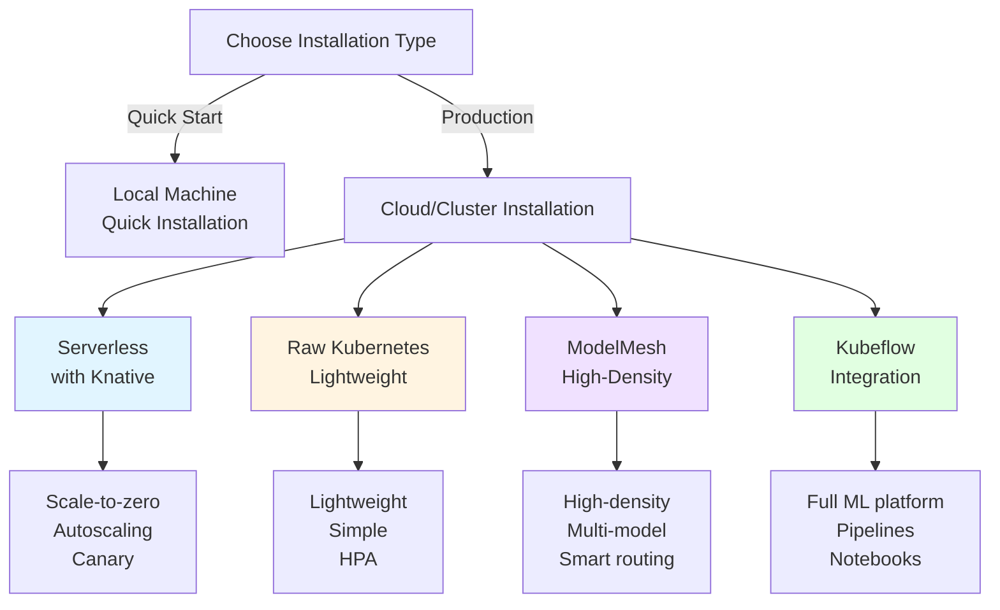
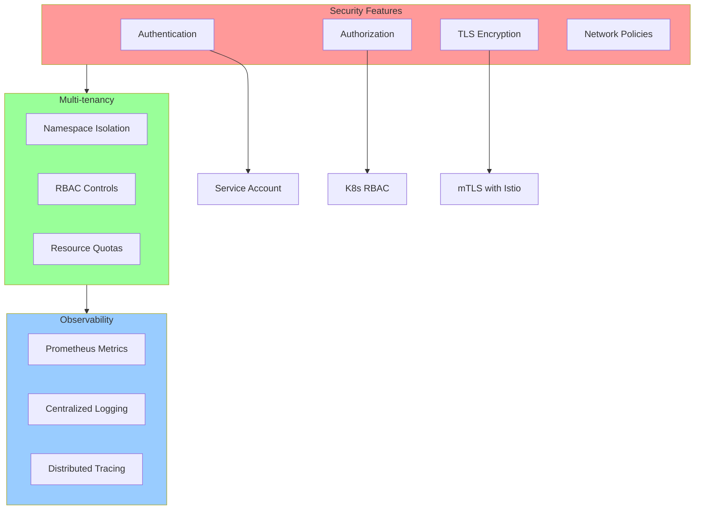

# KServe Overall Architecture

## Overview

KServe is a standardized distributed generative and predictive AI inference platform for scalable, multi-framework deployment on Kubernetes. It provides a unified platform for both Generative AI (LLMs) and Predictive AI (traditional ML models) inference workloads.

## High-Level Architecture Flow

## Core Components Overview

### 1. Control Plane Components

The control plane manages the lifecycle of inference services through various controllers:

- **KServe Controller Manager**: Main orchestrator that coordinates all controllers
- **InferenceService Controller**: Manages InferenceService CRD lifecycle
- **TrainedModel Controller**: Handles TrainedModel resources
- **LocalModel Controller**: Manages local model deployments
- **ServingRuntime Controller**: Controls runtime configurations

### 2. Data Plane Components

The data plane handles actual inference requests and model serving:

- **Storage Initializer**: Downloads models from storage (S3, PVC, etc.)
- **KServe Agent**: Sidecar container for monitoring and logging
- **Predictor**: Core container that serves the ML model
- **Transformer**: Optional pre/post-processing component
- **Explainer**: Optional component for model explanations
- **Router**: Routes requests in InferenceGraph pipelines

### 3. Integration Components

KServe integrates with various Kubernetes ecosystem components:

- **Knative Serving**: Enables serverless deployment with scale-to-zero
- **ModelMesh**: Provides high-density model serving
- **Istio**: Service mesh for networking and traffic management
- **HPA**: Autoscaling based on metrics

### 4. Storage Layer

Models can be stored in various backends:

- **S3/MinIO**: Object storage for model artifacts
- **PVC**: Kubernetes persistent volumes
- **Model Cache**: In-memory caching for faster loading

## Deployment Modes

## Request Flow

### Standard Inference Request Flow

## Feature Categories

### Generative AI Features

### Predictive AI Features

```mermaid
flowchart TB
    PredAI[Predictive AI Support]
    
    PredAI --> MultiFramework[Multi-Framework Support]
    PredAI --> IntelligentRoute[Intelligent Routing]
    PredAI --> AdvDeploy[Advanced Deployments]
    PredAI --> PredAutoScale[Autoscaling]
    PredAI --> Explain[Model Explainability]
    PredAI --> Monitor[Advanced Monitoring]
    
    MultiFramework --> TF[TensorFlow]
    MultiFramework --> PyTorch[PyTorch]
    MultiFramework --> SKLearn[Scikit-learn]
    MultiFramework --> XGB[XGBoost]
    
    IntelligentRoute --> PTE[Predictor-Transformer-Explainer]
    
    AdvDeploy --> Canary[Canary Rollouts]
    AdvDeploy --> Pipeline[Inference Pipelines]
    AdvDeploy --> Ensemble[Ensembles]
    
    PredAutoScale --> ScaleZero[Scale to Zero]
    
    Explain --> FeatureAttr[Feature Attribution]
    
    Monitor --> PayloadLog[Payload Logging]
    Monitor --> OutlierDet[Outlier Detection]
    Monitor --> DriftDet[Drift Detection]
    
    style PredAI fill:#99ccff
    style MultiFramework fill:#99ff99
    style IntelligentRoute fill:#ffcc99
    style AdvDeploy fill:#ff99cc
    style PredAutoScale fill:#ccff99
    style Explain fill:#ffff99
    style Monitor fill:#cc99ff
```

## Custom Resource Definitions (CRDs)

## Key Features Summary

### Core Capabilities

1. **Unified Platform**: Single platform for both Generative and Predictive AI
2. **Multi-Framework Support**: TensorFlow, PyTorch, XGBoost, Scikit-learn, Hugging Face, ONNX
3. **Flexible Deployment**: Serverless, Raw K8s, and ModelMesh modes
4. **Auto-scaling**: Request-based scaling with scale-to-zero capability
5. **Advanced Traffic Management**: Canary rollouts, A/B testing, shadow deployments
6. **Model Explainability**: Built-in support for model interpretability
7. **GPU Optimization**: Efficient GPU utilization with memory management
8. **Cost Efficiency**: Scale-to-zero reduces infrastructure costs

### Deployment Flexibility

| Mode | Use Case | Features |
|------|----------|----------|
| **Serverless** | Variable workloads | Scale-to-zero, autoscaling, canary |
| **Raw K8s** | Consistent workloads | Lightweight, simple, predictable |
| **ModelMesh** | High-density serving | Many models, intelligent routing |

### Protocol Support

- **V1 Protocol**: Original KServe inference protocol
- **V2 Protocol**: Open Inference Protocol (standard across frameworks)
- **OpenAI Protocol**: For LLM and generative AI workloads
- **gRPC**: High-performance binary protocol
- **HTTP/REST**: Standard web protocol

## Installation Options

## Security and Isolation

## Next Steps

For detailed component-specific information, refer to:

- [InferenceService Controller](./02-INFERENCESERVICE-CONTROLLER.md)
- [Data Plane Components](./03-DATA-PLANE-COMPONENTS.md)
- [Storage Initializer](./04-STORAGE-INITIALIZER.md)
- [Predictor Runtime](./05-PREDICTOR-RUNTIME.md)
- [Transformer Component](./06-TRANSFORMER-COMPONENT.md)
- [Explainer Component](./07-EXPLAINER-COMPONENT.md)
- [InferenceGraph Router](./08-INFERENCEGRAPH-ROUTER.md)
- [ModelMesh Integration](./09-MODELMESH-INTEGRATION.md)
- [Knative Integration](./10-KNATIVE-INTEGRATION.md)
- [Autoscaling Mechanisms](./11-AUTOSCALING-MECHANISMS.md)
- [Model Protocols](./12-MODEL-PROTOCOLS.md)

## References

- [KServe Official Website](https://kserve.github.io/website/)
- [KServe GitHub Repository](https://github.com/kserve/kserve)
- [OpenDataHub KServe Fork](https://github.com/opendatahub-io/kserve)
- [KServe API Reference](https://kserve.github.io/website/docs/reference/crd-api)

