# InferenceService Controller

## Overview

The InferenceService Controller is the core component of KServe's control plane. It manages the complete lifecycle of InferenceService resources, from creation to deletion, handling reconciliation loops and coordinating with other Kubernetes resources.

## Controller Architecture

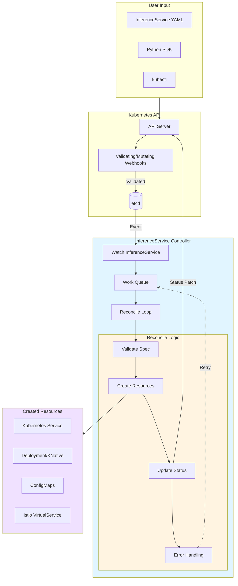

## Reconciliation Flow

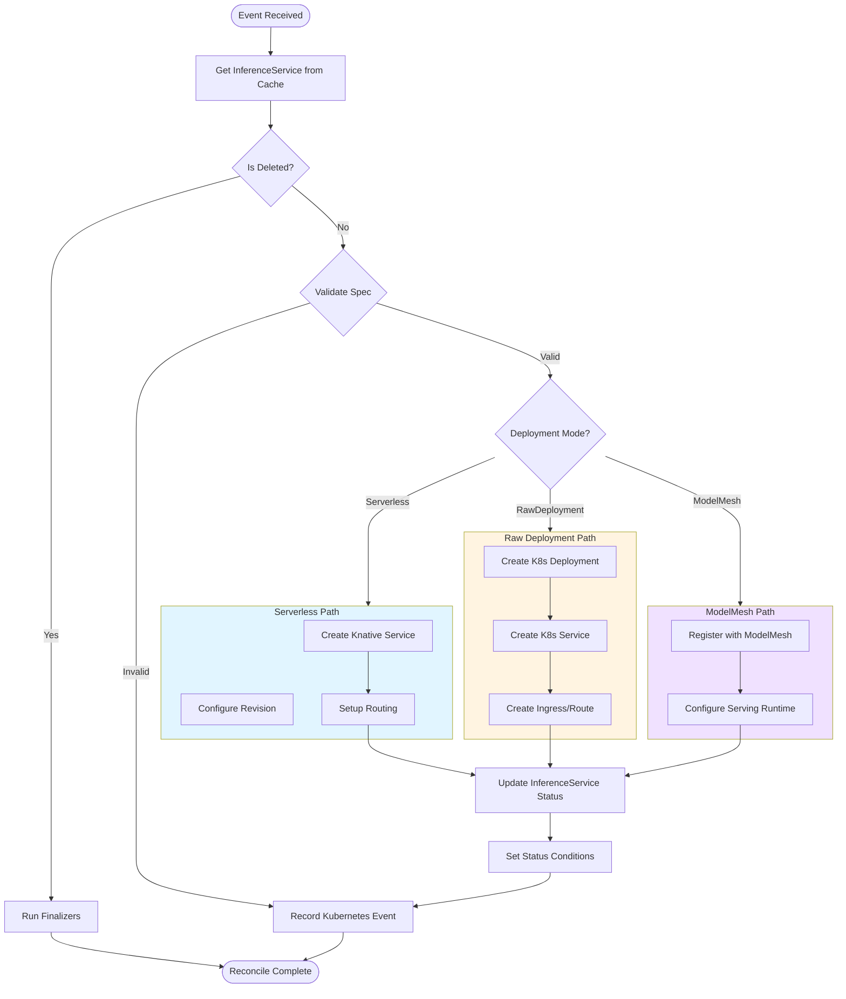

## InferenceService CRD Structure

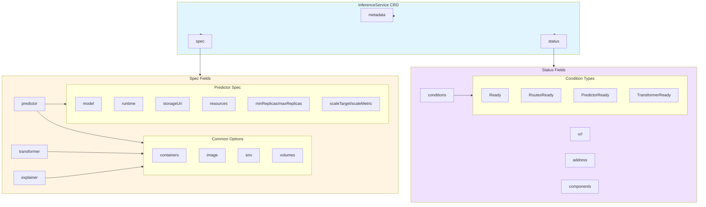

## Controller State Machine

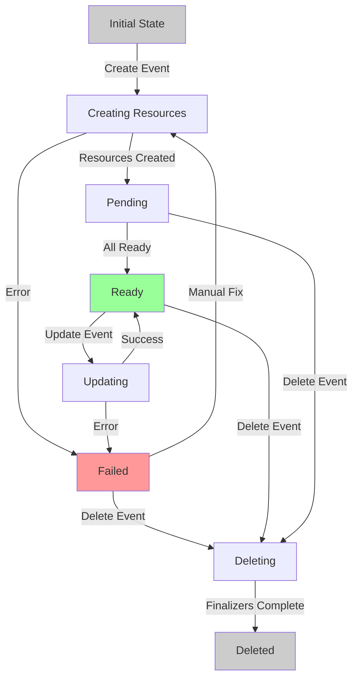

## Component Creation Logic

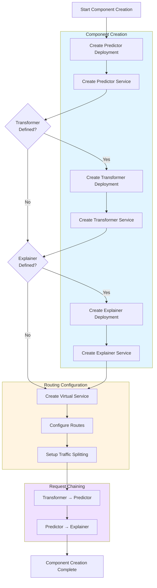

## Webhook Processing

### Validating Webhook Flow

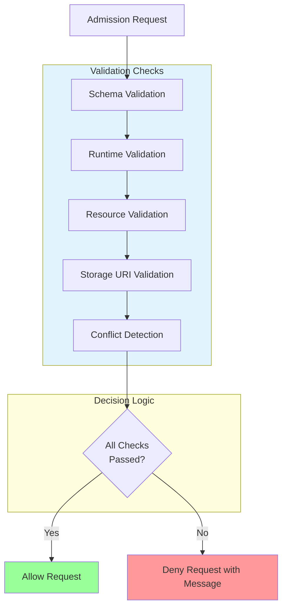

### Mutating Webhook Flow

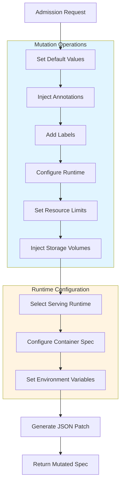

## Status Management

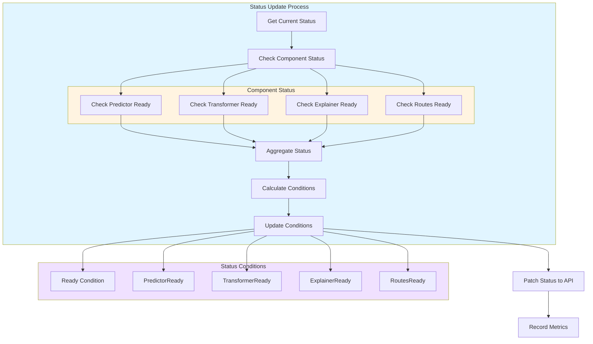

## Traffic Management

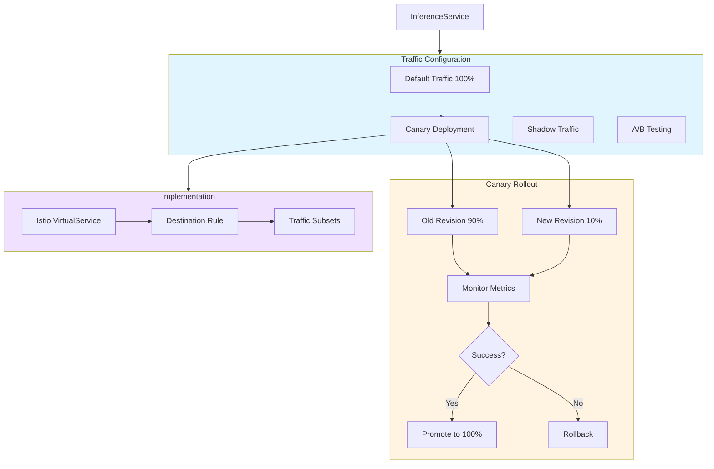

## Error Handling and Recovery

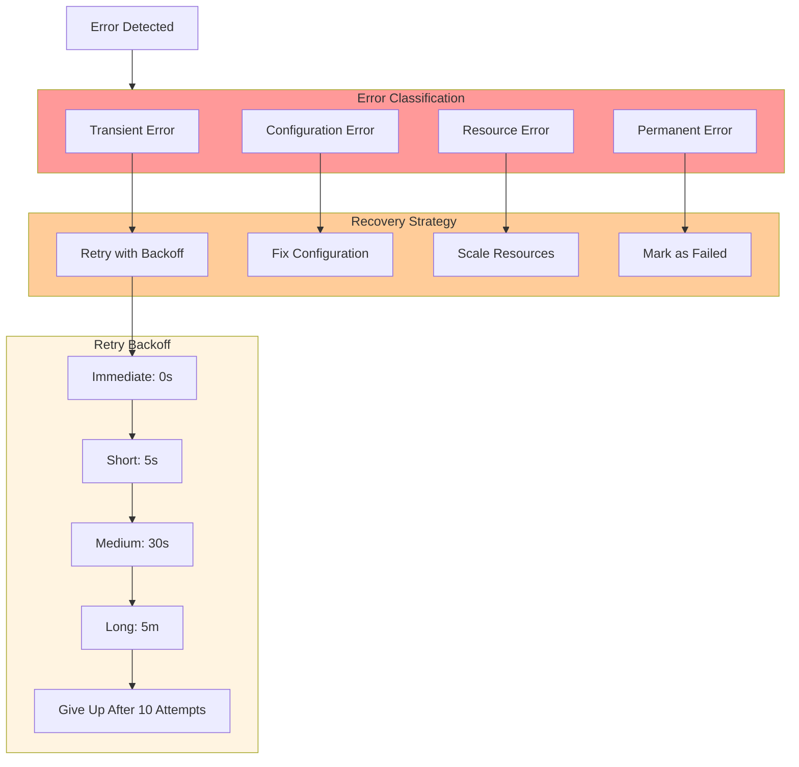

## Controller Metrics

The InferenceService Controller exposes various metrics:

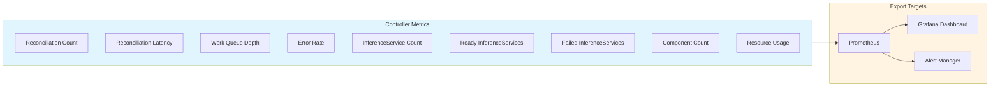

## Key Features

### 1. Multi-Mode Deployment Support

The controller supports three deployment modes:

- **Serverless (Knative)**: Scale-to-zero, autoscaling, traffic splitting
- **Raw Kubernetes**: Traditional deployments with HPA
- **ModelMesh**: High-density multi-model serving

### 2. Component Management

Manages three types of components:

- **Predictor**: Required - serves the model
- **Transformer**: Optional - pre/post-processing
- **Explainer**: Optional - model explanations

### 3. Advanced Traffic Control

- Canary deployments with percentage-based routing
- Shadow traffic for testing
- A/B testing support
- Blue-green deployments

### 4. Status Tracking

Comprehensive status tracking with:

- Ready conditions for each component
- URL and address information
- Error messages and reasons
- Last transition timestamps

### 5. Webhook Integration

- **Validating Webhook**: Ensures spec correctness
- **Mutating Webhook**: Sets defaults and injects configurations

## Configuration Options

### Controller Manager Configuration

```yaml
apiVersion: v1
kind: ConfigMap
metadata:
  name: inferenceservice-config
data:
  deploy:
    defaultDeploymentMode: "Serverless"
  ingress:
    ingressGateway: "knative-serving/knative-ingress-gateway"
    ingressService: "istio-ingressgateway.istio-system.svc.cluster.local"
  logger:
    logLevel: "info"
  metricsAggregator:
    enableMetricAggregation: "true"
```

### Leader Election

The controller uses leader election for high availability:

```yaml
leaderElection:
  enabled: true
  leaseDuration: 15s
  renewDeadline: 10s
  retryPeriod: 2s
```

## Performance Optimization

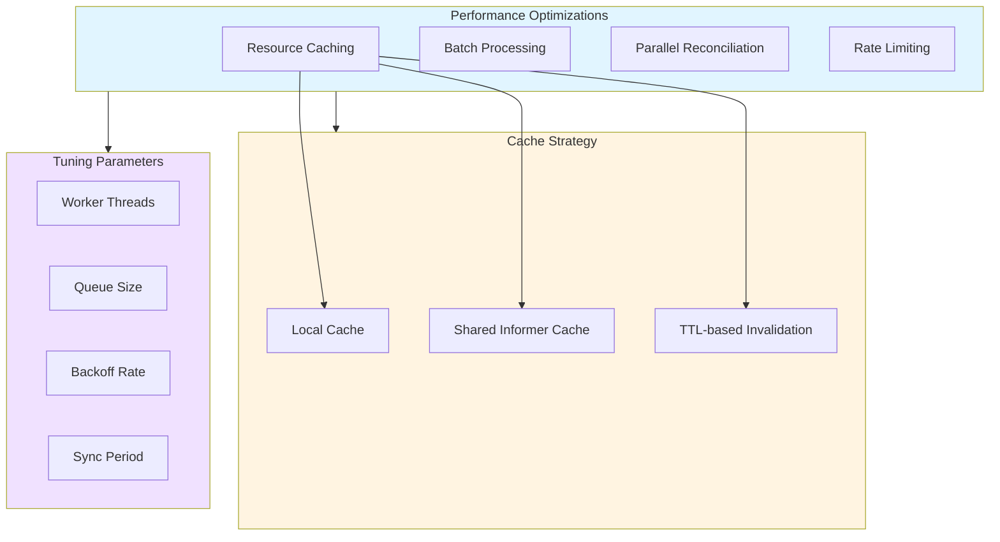

## Best Practices

1. **Resource Limits**: Always specify resource requests and limits
2. **Health Checks**: Configure proper liveness and readiness probes
3. **Monitoring**: Enable metrics collection and alerting
4. **Logging**: Use structured logging with appropriate log levels
5. **Version Control**: Use revisions for rollback capability
6. **Testing**: Validate changes in staging before production

## Troubleshooting

Common issues and solutions:

| Issue | Possible Cause | Solution |
|-------|---------------|----------|
| InferenceService stuck in Creating | Resource constraints | Check node resources, adjust limits |
| Routes not ready | Istio misconfiguration | Verify VirtualService and Gateway |
| Predictor not ready | Image pull error | Check image name and registry access |
| Status not updating | Controller not running | Check controller pod logs |

## Related Components

- [Data Plane Components](./03-DATA-PLANE-COMPONENTS.md)
- [Knative Integration](./10-KNATIVE-INTEGRATION.md)
- [ModelMesh Integration](./09-MODELMESH-INTEGRATION.md)
- [Autoscaling Mechanisms](./11-AUTOSCALING-MECHANISMS.md)

