# Data Plane Components

## Overview

The data plane in KServe handles the actual inference workload. It consists of multiple components that work together to receive requests, process them, serve predictions, and return responses. These components run as containers within Kubernetes pods.

## Data Plane Architecture

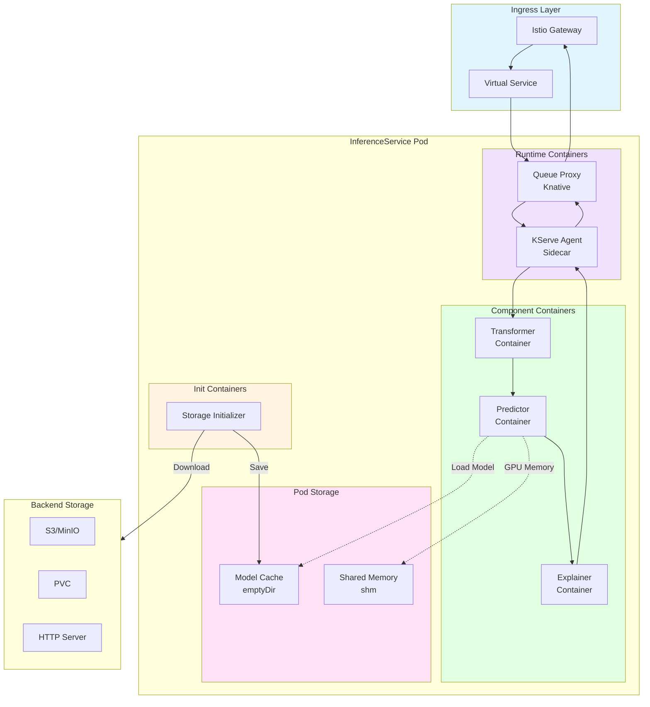

## Component Request Flow

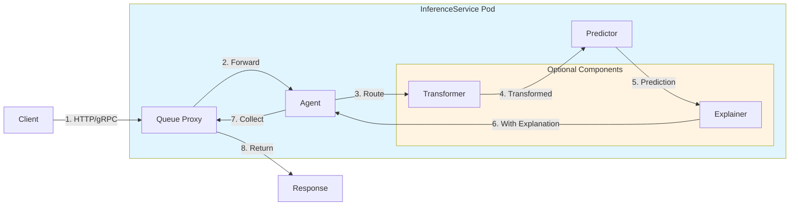

## Storage Initializer

```mermaid
flowchart TB
    Start([Pod Starting])
    
    subgraph InitContainer["Init Container: Storage Initializer"]
        ParseURI[Parse Storage URI]
        DetectProtocol{Protocol Type?}
        
        subgraph S3Download["S3 Download"]
            ConfigureS3[Configure S3 Client]
            AuthenticateS3[Authenticate]
            DownloadS3[Download from Bucket]
        end
        
        subgraph PVCCopy["PVC Copy"]
            MountPVC[Mount PVC]
            CopyFiles[Copy Files]
        end
        
        subgraph HTTPDownload["HTTP Download"]
            ConfigureHTTP[Configure HTTP Client]
            DownloadHTTP[Download via HTTP]
        end
        
        subgraph GCSDownload["GCS Download"]
            ConfigureGCS[Configure GCS Client]
            AuthenticateGCS[Authenticate]
            DownloadGCS[Download from GCS]
        end
        
        ExtractModel[Extract Model Files]
        ValidateModel[Validate Model]
        SaveToCache[Save to /mnt/models]
    end
    
    Complete([Init Complete])
    StartMain[Start Main Container]
    
    Start --> ParseURI
    ParseURI --> DetectProtocol
    
    DetectProtocol -->|s3://| ConfigureS3
    DetectProtocol -->|pvc://| MountPVC
    DetectProtocol -->|http(s)://| ConfigureHTTP
    DetectProtocol -->|gs://| ConfigureGCS
    
    ConfigureS3 --> AuthenticateS3
    AuthenticateS3 --> DownloadS3
    DownloadS3 --> ExtractModel
    
    MountPVC --> CopyFiles
    CopyFiles --> ExtractModel
    
    ConfigureHTTP --> DownloadHTTP
    DownloadHTTP --> ExtractModel
    
    ConfigureGCS --> AuthenticateGCS
    AuthenticateGCS --> DownloadGCS
    DownloadGCS --> ExtractModel
    
    ExtractModel --> ValidateModel
    ValidateModel --> SaveToCache
    SaveToCache --> Complete
    Complete --> StartMain
    
    style InitContainer fill:#e1f5ff
    style S3Download fill:#fff4e1
    style PVCCopy fill:#f0e1ff
    style HTTPDownload fill:#e1ffe1
    style GCSDownload fill:#ffe1f5
```

## KServe Agent (Sidecar)

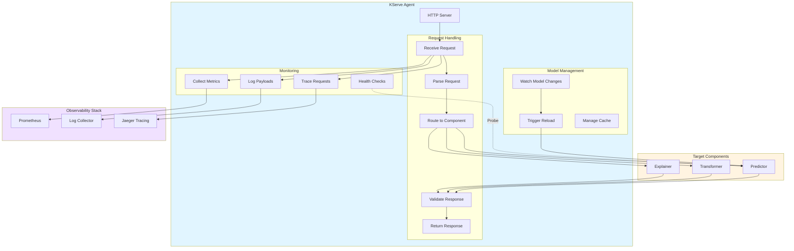

## Queue Proxy (Knative)

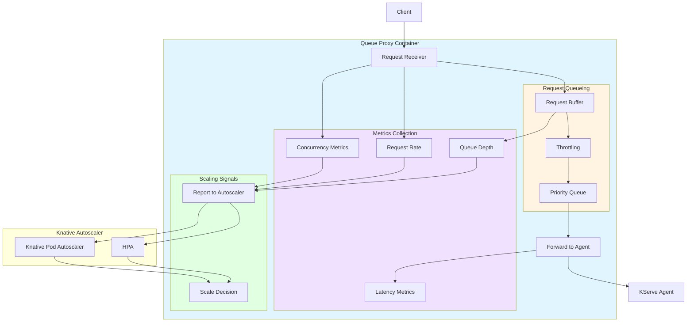

## Predictor Container

```mermaid
flowchart TB
    subgraph Predictor["Predictor Container"]
        ModelServer[Model Server Process]
        
        subgraph Initialization["Initialization"]
            LoadModel[Load Model from Cache]
            AllocateGPU[Allocate GPU Memory]
            WarmUp[Warm-up Inference]
            Ready[Mark Ready]
        end
        
        subgraph InferenceLoop["Inference Loop"]
            ReceiveRequest[Receive Request]
            ValidateInput[Validate Input]
            PreProcess[Preprocess]
            RunInference[Run Inference]
            PostProcess[Postprocess]
            ReturnPrediction[Return Prediction]
        end
        
        subgraph ModelTypes["Model Server Types"]
            VLLM[vLLM Server<br/>LLM]
            TorchServe[TorchServe<br/>PyTorch]
            TFServing[TF Serving<br/>TensorFlow]
            Triton[Triton<br/>Multi-framework]
            SKLearn[SKLearn Server]
            Custom[Custom Server]
        end
        
        subgraph Resources["Resource Management"]
            GPUMem[GPU Memory]
            CPUMem[CPU Memory]
            BatchSize[Batch Size]
            Threading[Threading]
        end
    end
    
    ModelServer --> LoadModel
    LoadModel --> AllocateGPU
    AllocateGPU --> WarmUp
    WarmUp --> Ready
    
    Ready --> ReceiveRequest
    ReceiveRequest --> ValidateInput
    ValidateInput --> PreProcess
    PreProcess --> RunInference
    RunInference --> PostProcess
    PostProcess --> ReturnPrediction
    ReturnPrediction --> ReceiveRequest
    
    ModelServer -.->|Implementation| ModelTypes
    RunInference -.->|Uses| Resources
    
    style Predictor fill:#e1f5ff
    style Initialization fill:#fff4e1
    style InferenceLoop fill:#f0e1ff
    style ModelTypes fill:#e1ffe1
    style Resources fill:#ffe1f5
```

## Transformer Container

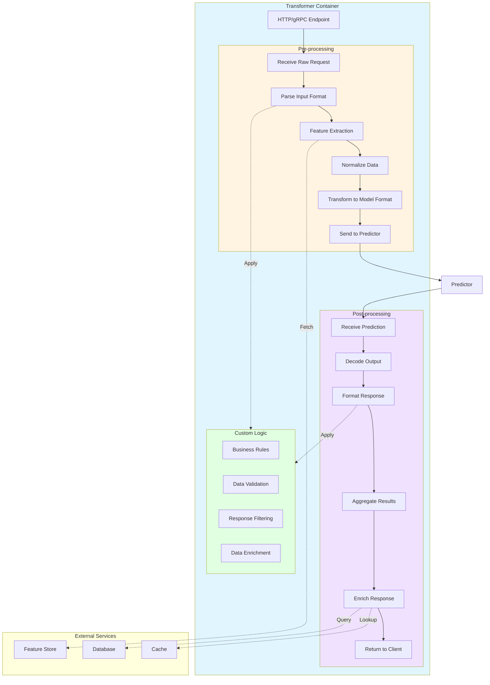

## Explainer Container

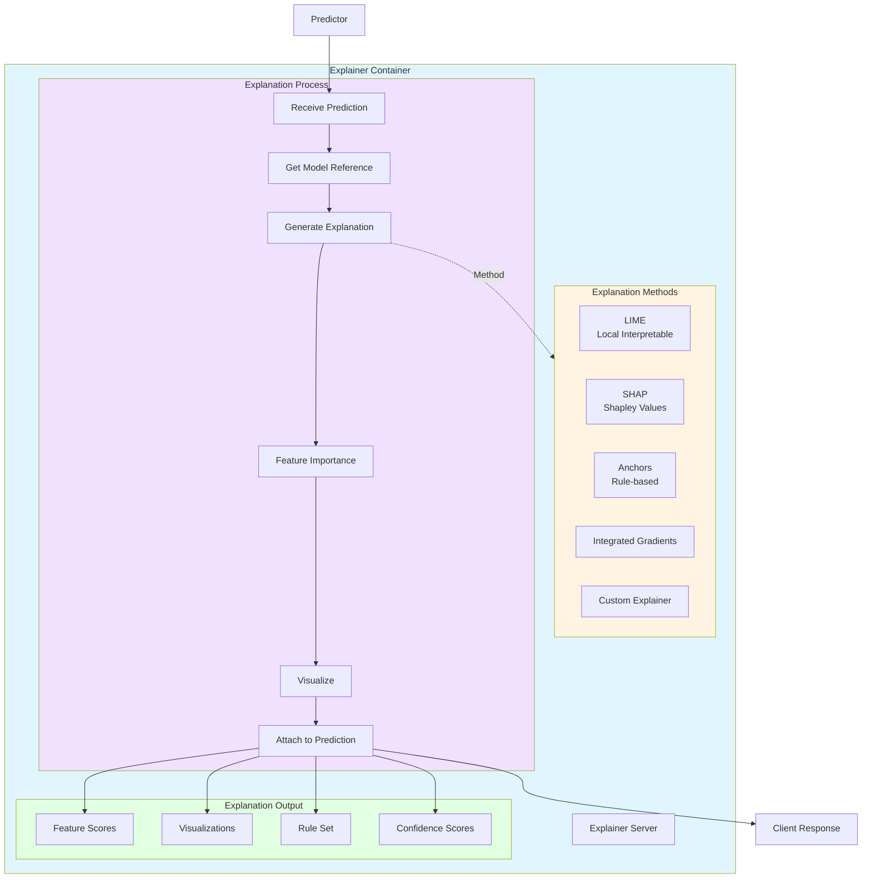

## Pod Resource Configuration

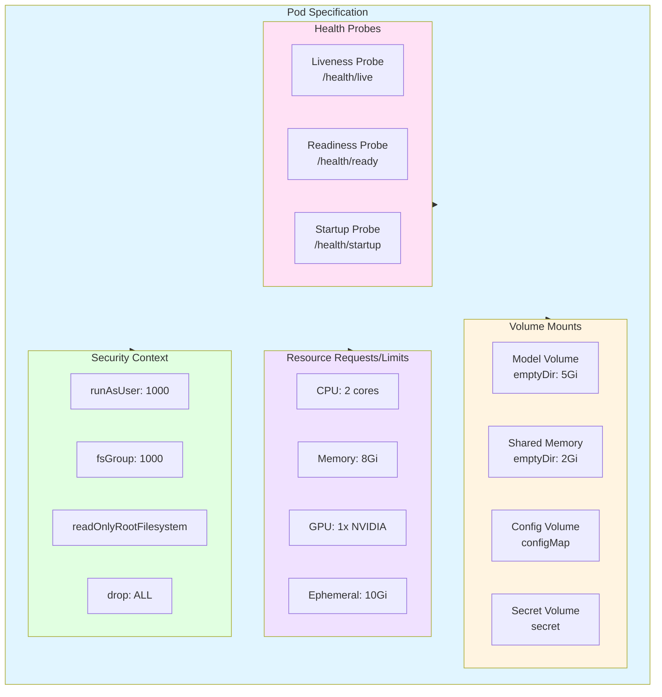

## Multi-Container Coordination

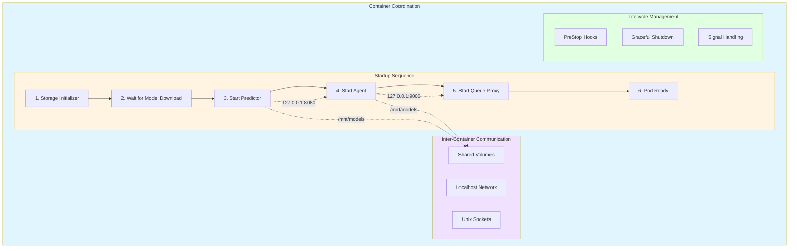

## Container Specifications

### Storage Initializer Container

```yaml
initContainers:
- name: storage-initializer
  image: kserve/storage-initializer:v0.11.0
  args:
    - srcURI
    - s3://my-bucket/model
    - /mnt/models
  env:
    - name: AWS_ACCESS_KEY_ID
      valueFrom:
        secretKeyRef:
          name: s3-secret
          key: access_key
  volumeMounts:
    - name: model-dir
      mountPath: /mnt/models
  resources:
    requests:
      cpu: 100m
      memory: 256Mi
    limits:
      cpu: 1
      memory: 1Gi
```

### Predictor Container

```yaml
containers:
- name: kserve-container
  image: pytorch/torchserve:latest
  command:
    - python
    - -m
    - kserve.model_server
  env:
    - name: STORAGE_URI
      value: pvc://my-pvc/model
    - name: PROTOCOL
      value: v2
  ports:
    - containerPort: 8080
      protocol: TCP
  resources:
    requests:
      cpu: 2
      memory: 8Gi
      nvidia.com/gpu: 1
    limits:
      cpu: 4
      memory: 16Gi
      nvidia.com/gpu: 1
  volumeMounts:
    - name: model-dir
      mountPath: /mnt/models
    - name: shm
      mountPath: /dev/shm
```

### Agent Container

```yaml
containers:
- name: agent
  image: kserve/agent:v0.11.0
  ports:
    - containerPort: 9000
      protocol: TCP
  env:
    - name: MODEL_NAME
      value: my-model
    - name: ENABLE_LATENCY_LOGGING
      value: "true"
  resources:
    requests:
      cpu: 100m
      memory: 128Mi
    limits:
      cpu: 1
      memory: 512Mi
```

## Performance Considerations

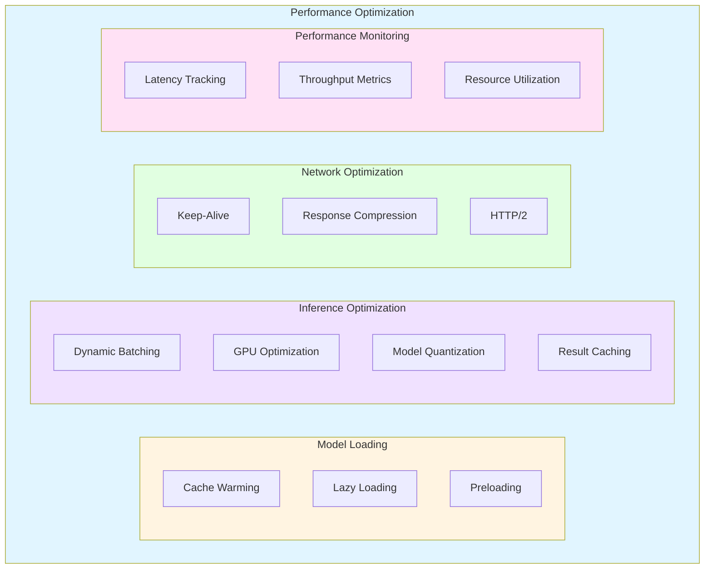

## Data Plane Scaling

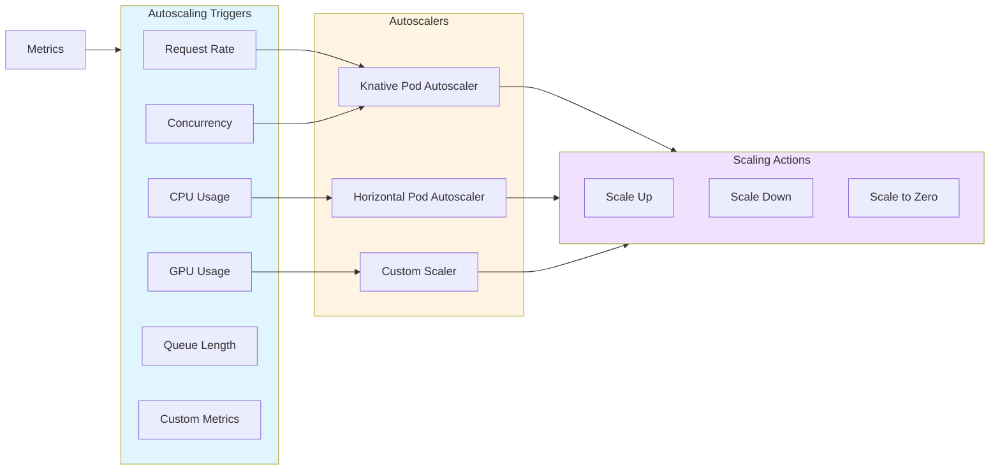

## Related Components

- [Storage Initializer](./04-STORAGE-INITIALIZER.md)
- [Predictor Runtime](./05-PREDICTOR-RUNTIME.md)
- [Transformer Component](./06-TRANSFORMER-COMPONENT.md)
- [Explainer Component](./07-EXPLAINER-COMPONENT.md)
- [Autoscaling Mechanisms](./11-AUTOSCALING-MECHANISMS.md)

