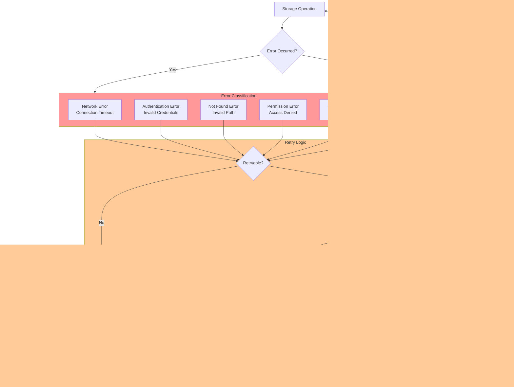

# Storage Initializer

## Overview

The Storage Initializer is an init container in KServe that downloads model artifacts from various storage backends before the main inference containers start. It supports multiple protocols including S3, GCS, Azure Blob Storage, HTTP/HTTPS, and PVC.

## Storage Initializer Architecture


## Storage Protocol Detection


## S3 Download Flow


## Configuration and Credentials


## Model Validation


## Archive Extraction


## Error Handling and Retry



## Performance Optimization


## Storage Initializer Container Spec

```yaml
apiVersion: v1
kind: Pod
metadata:
  name: inference-service-pod
spec:
  initContainers:
  - name: storage-initializer
    image: kserve/storage-initializer:v0.11.0
    args:
      - "s3://my-bucket/models/my-model"
      - "/mnt/models"
    env:
      - name: AWS_ACCESS_KEY_ID
        valueFrom:
          secretKeyRef:
            name: s3-credentials
            key: awsAccessKeyID
      - name: AWS_SECRET_ACCESS_KEY
        valueFrom:
          secretKeyRef:
            name: s3-credentials
            key: awsSecretAccessKey
      - name: AWS_REGION
        value: "us-west-2"
      - name: S3_ENDPOINT
        value: "s3.amazonaws.com"
      - name: S3_USE_HTTPS
        value: "true"
      - name: S3_VERIFY_SSL
        value: "true"
    volumeMounts:
      - name: model-dir
        mountPath: /mnt/models
    resources:
      requests:
        cpu: 100m
        memory: 256Mi
      limits:
        cpu: 1
        memory: 1Gi
  
  containers:
  - name: kserve-container
    image: pytorch/torchserve:latest
    volumeMounts:
      - name: model-dir
        mountPath: /mnt/models
        readOnly: true
  
  volumes:
  - name: model-dir
    emptyDir:
      sizeLimit: 10Gi
```

## Multi-Protocol Example

### S3 with IAM Role

```yaml
storageUri: s3://my-bucket/model-path
serviceAccountName: kserve-sa  # Has IAM role attached
```

### GCS with Service Account

```yaml
storageUri: gs://my-bucket/model-path
env:
  - name: GOOGLE_APPLICATION_CREDENTIALS
    value: /var/secrets/google/key.json
volumeMounts:
  - name: gcp-credentials
    mountPath: /var/secrets/google
    readOnly: true
volumes:
  - name: gcp-credentials
    secret:
      secretName: gcp-service-account
```

### Azure Blob Storage

```yaml
storageUri: https://mystorageaccount.blob.core.windows.net/container/model
env:
  - name: AZURE_STORAGE_ACCOUNT
    value: mystorageaccount
  - name: AZURE_STORAGE_KEY
    valueFrom:
      secretKeyRef:
        name: azure-secret
        key: azurestorageaccountkey
```

### HTTP with Authentication

```yaml
storageUri: https://my-server.com/models/my-model.tar.gz
env:
  - name: HTTP_HEADER_AUTHORIZATION
    valueFrom:
      secretKeyRef:
        name: http-secret
        key: authorization
```

### PVC

```yaml
storageUri: pvc://my-pvc/model-directory
volumes:
  - name: model-pvc
    persistentVolumeClaim:
      claimName: my-pvc
```

## Troubleshooting

### Common Issues

| Issue | Cause | Solution |
|-------|-------|----------|
| Authentication Failed | Missing/invalid credentials | Verify secret configuration |
| Connection Timeout | Network issues | Check endpoint and firewall rules |
| Model Not Found | Incorrect path | Verify storage URI |
| Insufficient Space | Small emptyDir | Increase volume size limit |
| Slow Downloads | Large model | Use compression, parallel downloads |
| Extraction Failed | Corrupted archive | Verify checksums, re-download |

## Best Practices

1. **Use Compressed Archives**: Reduce download time and bandwidth
2. **Implement Checksums**: Verify data integrity
3. **Set Appropriate Timeouts**: Balance reliability and responsiveness
4. **Monitor Download Progress**: Provide visibility into long operations
5. **Cache Models**: Reuse downloaded models when possible
6. **Use IAM Roles**: Avoid credential management when possible
7. **Set Resource Limits**: Prevent resource exhaustion
8. **Enable Retry Logic**: Handle transient failures automatically

## Related Components

- [Data Plane Components](./03-DATA-PLANE-COMPONENTS.md)
- [Predictor Runtime](./05-PREDICTOR-RUNTIME.md)

