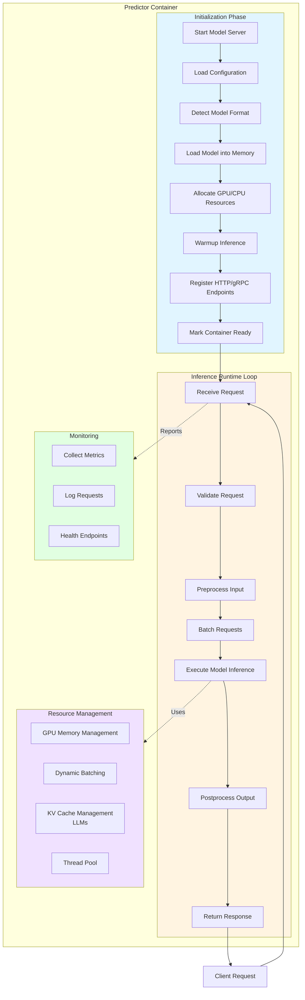
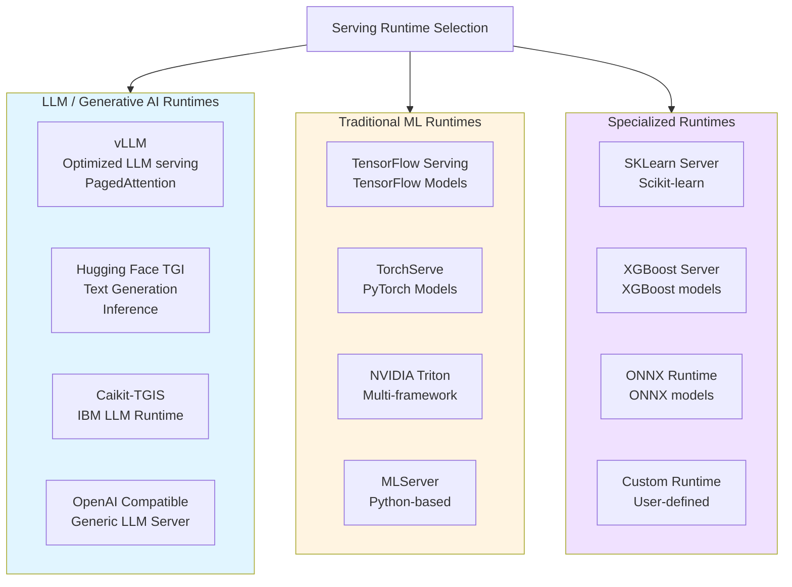
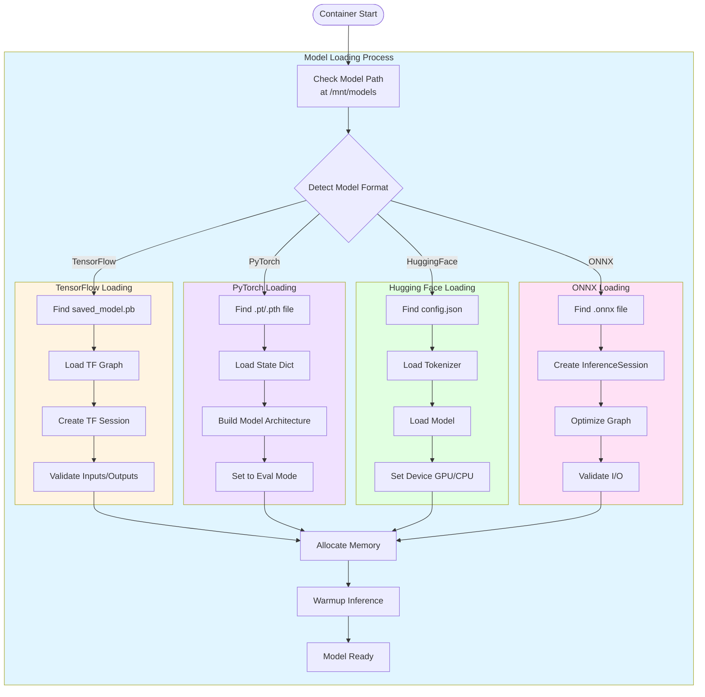
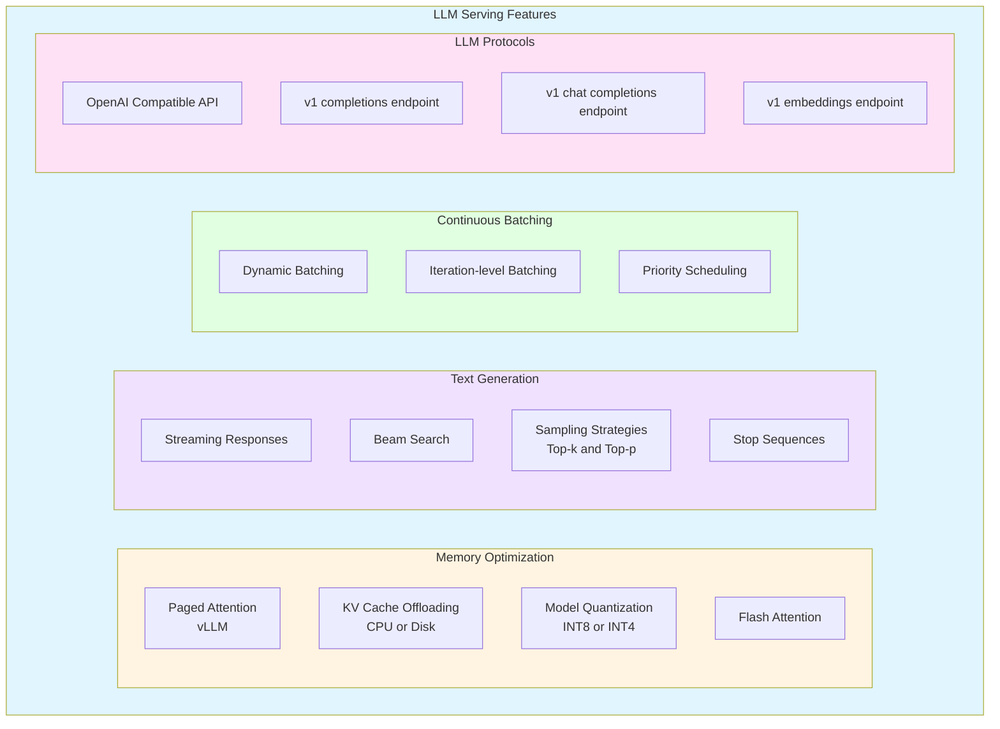
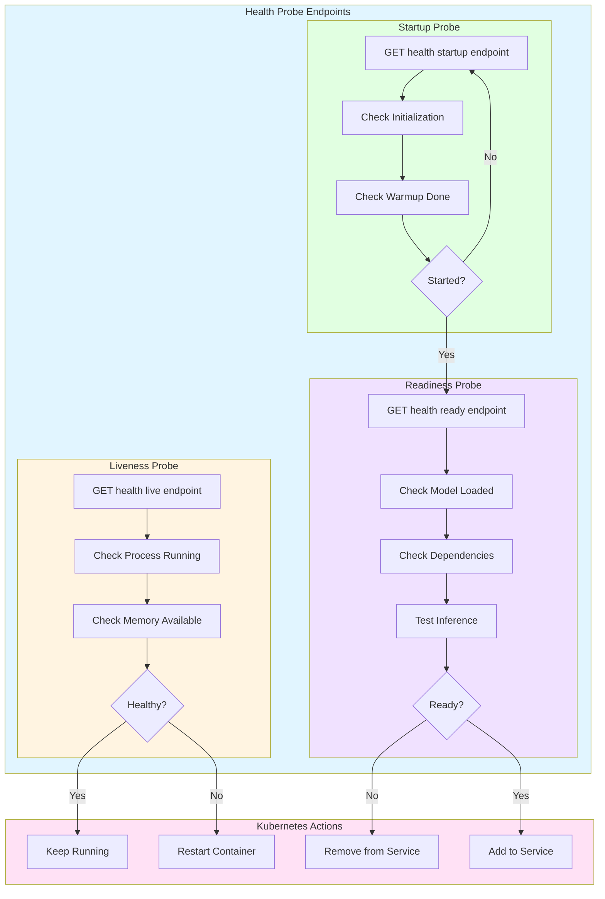
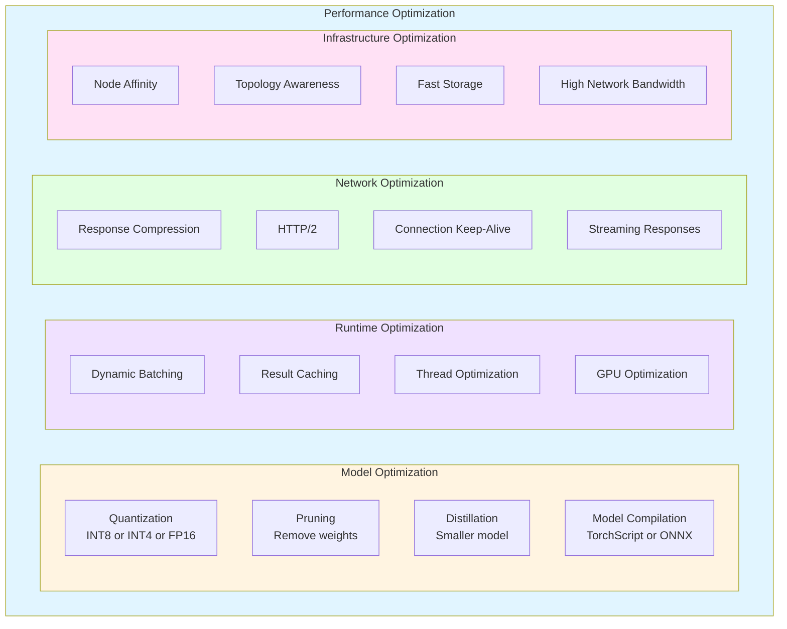
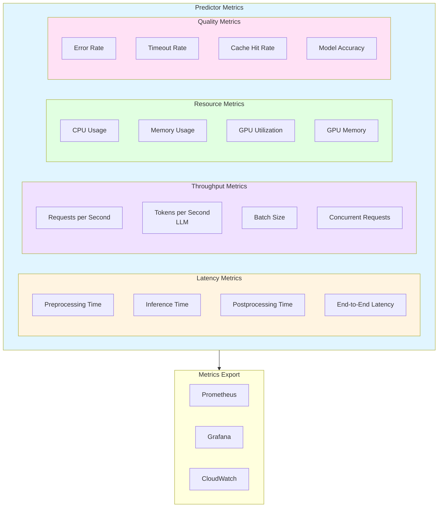
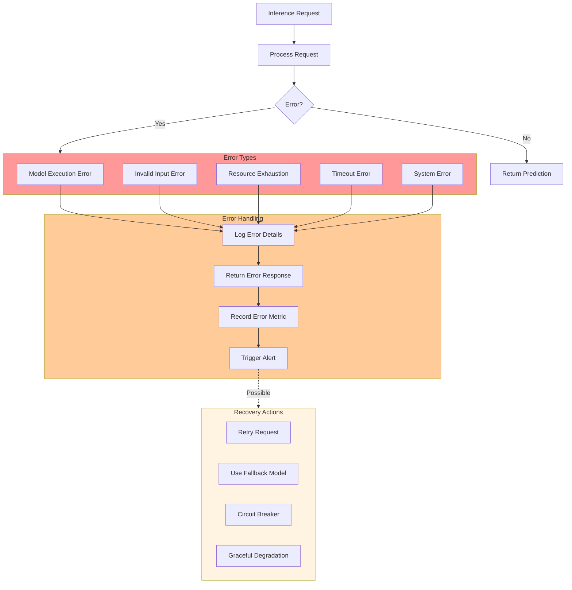

# Predictor Runtime

## Overview

The Predictor is the core component in KServe that serves the machine learning model. It handles inference requests, loads models, manages resources, and returns predictions. KServe supports multiple serving runtimes for different ML frameworks.

## Predictor Architecture



## Serving Runtime Types



## Model Loading Flow



## Request Processing Flow

```mermaid
flowchart TB
    IncomingRequest[Incoming Request]
    
    subgraph RequestProcessing["Request Processing Pipeline"]
        ParseRequest[Parse Request<br/>JSON or Proto]
        ValidateSchema[Validate Schema]
        ExtractTensor[Extract Tensor Data]
        
        subgraph Preprocessing["Preprocessing"]
            DecodeInput[Decode Input]
            Normalize[Normalize Data]
            Reshape[Reshape Tensors]
            TypeConvert[Type Conversion]
        end
        
        subgraph Batching["Dynamic Batching"]
            CheckBatch{Batching<br/>Enabled?}
            AddToQueue[Add to Batch Queue]
            WaitOrTimeout[Wait for Batch/Timeout]
            FormBatch[Form Batch]
        end
        
        subgraph Inference["Model Inference"]
            PrepareInputs[Prepare Model Inputs]
            ExecuteModel[Execute Model Forward Pass]
            CollectOutputs[Collect Outputs]
        end
        
        subgraph Postprocessing["Postprocessing"]
            ProcessOutput[Process Raw Output]
            ApplyActivation[Apply Activation]
            DecodeOutput[Decode Output]
            FormatResponse[Format Response]
        end
        
        ReturnResponse[Return Response]
    end
    
    IncomingRequest --> ParseRequest
    ParseRequest --> ValidateSchema
    ValidateSchema --> ExtractTensor
    ExtractTensor --> DecodeInput
    
    DecodeInput --> Normalize
    Normalize --> Reshape
    Reshape --> TypeConvert
    TypeConvert --> CheckBatch
    
    CheckBatch -->|Yes| AddToQueue
    CheckBatch -->|No| PrepareInputs
    AddToQueue --> WaitOrTimeout
    WaitOrTimeout --> FormBatch
    FormBatch --> PrepareInputs
    
    PrepareInputs --> ExecuteModel
    ExecuteModel --> CollectOutputs
    CollectOutputs --> ProcessOutput
    
    ProcessOutput --> ApplyActivation
    ApplyActivation --> DecodeOutput
    DecodeOutput --> FormatResponse
    FormatResponse --> ReturnResponse
    
    style RequestProcessing fill:#e1f5ff
    style Preprocessing fill:#fff4e1
    style Batching fill:#f0e1ff
    style Inference fill:#e1ffe1
    style Postprocessing fill:#ffe1f5
```



## LLM-Specific Features



## GPU Resource Management

```mermaid
flowchart TB
    subgraph GPUManagement["GPU Resource Management"]
        subgraph Allocation["GPU Allocation"]
            DetectGPU[Detect Available GPUs]
            CheckMemory[Check GPU Memory]
            AllocateGPU[Allocate GPU Device]
            SetDevice[Set CUDA Device]
        end
        
        subgraph MemoryMgmt["Memory Management"]
            ModelMemory[Model Parameters<br/>Weights on GPU]
            ActivationMemory[Activation Memory<br/>Intermediate tensors]
            KVCache[KV Cache<br/>LLM attention cache]
            CUDACache[CUDA Memory Cache]
        end
        
        subgraph Optimization["GPU Optimization"]
            TensorCore[Tensor Core Usage]
            MixedPrecision[Mixed Precision<br/>FP16 or BF16]
            CUDAGraphs[CUDA Graphs]
            MemoryPool[Memory Pooling]
        end
        
        subgraph Monitoring["GPU Monitoring"]
            TrackUsage[Track GPU Usage]
            MonitorTemp[Monitor Temperature]
            CheckOOM[OOM Detection]
            ReportMetrics[Report Metrics]
        end
    end
    
    DetectGPU --> CheckMemory
    CheckMemory --> AllocateGPU
    AllocateGPU --> SetDevice
    
    SetDevice --> ModelMemory
    ModelMemory --> ActivationMemory
    ActivationMemory --> KVCache
    KVCache --> CUDACache
    
    CUDACache -.->|Optimize| Optimization
    Optimization -.->|Monitor| Monitoring
    
    style GPUManagement fill:#e1f5ff
    style Allocation fill:#fff4e1
    style MemoryMgmt fill:#f0e1ff
    style Optimization fill:#e1ffe1
    style Monitoring fill:#ffe1f5
```



## Health and Readiness Probes



## Model Server Configurations

### vLLM Runtime (LLM)

```yaml
apiVersion: serving.kserve.io/v1beta1
kind: InferenceService
metadata:
  name: llama-model
spec:
  predictor:
    model:
      modelFormat:
        name: vllm
      storageUri: s3://bucket/llama-2-7b
      runtime: vllm-runtime
      args:
        - --max-model-len=4096
        - --gpu-memory-utilization=0.9
        - --tensor-parallel-size=2
      resources:
        limits:
          nvidia.com/gpu: 2
          memory: 32Gi
        requests:
          nvidia.com/gpu: 2
          memory: 32Gi
```

### TorchServe Runtime (PyTorch)

```yaml
apiVersion: serving.kserve.io/v1beta1
kind: InferenceService
metadata:
  name: pytorch-model
spec:
  predictor:
    model:
      modelFormat:
        name: pytorch
      storageUri: s3://bucket/resnet50.mar
      runtime: torchserve-runtime
      protocolVersion: v2
      resources:
        limits:
          nvidia.com/gpu: 1
          memory: 8Gi
        requests:
          cpu: 2
          memory: 4Gi
```

### TensorFlow Serving Runtime

```yaml
apiVersion: serving.kserve.io/v1beta1
kind: InferenceService
metadata:
  name: tensorflow-model
spec:
  predictor:
    model:
      modelFormat:
        name: tensorflow
      storageUri: s3://bucket/mnist-model
      runtime: tensorflow-serving
      protocolVersion: v2
      resources:
        limits:
          cpu: 4
          memory: 8Gi
        requests:
          cpu: 2
          memory: 4Gi
```

### Triton Inference Server (Multi-framework)

```yaml
apiVersion: serving.kserve.io/v1beta1
kind: InferenceService
metadata:
  name: triton-model
spec:
  predictor:
    model:
      modelFormat:
        name: triton
      storageUri: s3://bucket/model-repository
      runtime: triton-runtime
      protocolVersion: v2
      args:
        - --model-control-mode=explicit
        - --strict-model-config=false
      resources:
        limits:
          nvidia.com/gpu: 1
          memory: 16Gi
```

## Performance Optimization Strategies



## Metrics and Monitoring



## Error Handling



## Best Practices

1. **Model Loading**
   - Use model caching to reduce startup time
   - Implement warmup inference before marking ready
   - Validate model integrity after loading

2. **Resource Management**
   - Set appropriate resource requests and limits
   - Monitor GPU memory usage
   - Use dynamic batching for throughput

3. **Performance**
   - Enable model quantization when possible
   - Use GPU optimization features (Tensor Cores, mixed precision)
   - Implement result caching for repeated requests

4. **Reliability**
   - Configure proper health probes
   - Implement graceful shutdown
   - Handle errors gracefully

5. **Monitoring**
   - Export comprehensive metrics
   - Set up alerts for errors and latency
   - Track resource utilization

## Related Components

- [Data Plane Components](./03-DATA-PLANE-COMPONENTS.md)
- [Storage Initializer](./04-STORAGE-INITIALIZER.md)
- [Model Protocols](./12-MODEL-PROTOCOLS.md)
- [Autoscaling Mechanisms](./11-AUTOSCALING-MECHANISMS.md)

