# KServe Raw Kubernetes Deployment Mode

## Overview

Raw Kubernetes deployment mode is KServe's **lightweight** deployment option that uses standard Kubernetes resources (Deployment + Service) instead of Knative Serving. This mode is simpler, more predictable, but lacks some serverless features like scale-to-zero.

## Raw Deployment vs Serverless

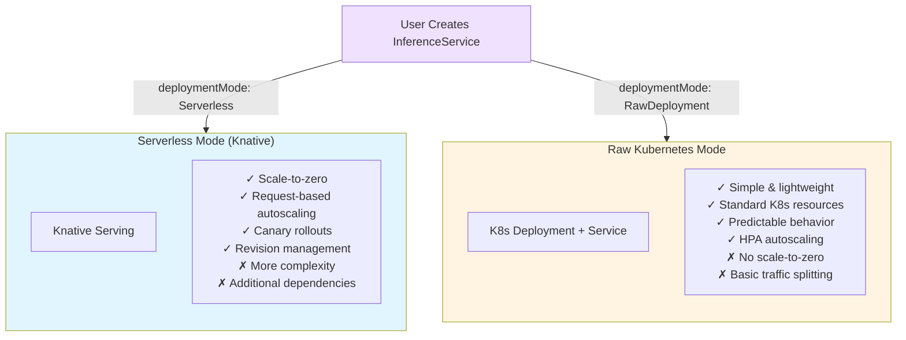

**Simple Explanation:**
Think of it like choosing between:
- **Serverless Mode**: Like AWS Lambda - complex but auto-scales, even to zero
- **Raw Mode**: Like a regular container - simple, always running, uses standard Kubernetes

## Raw Deployment Architecture

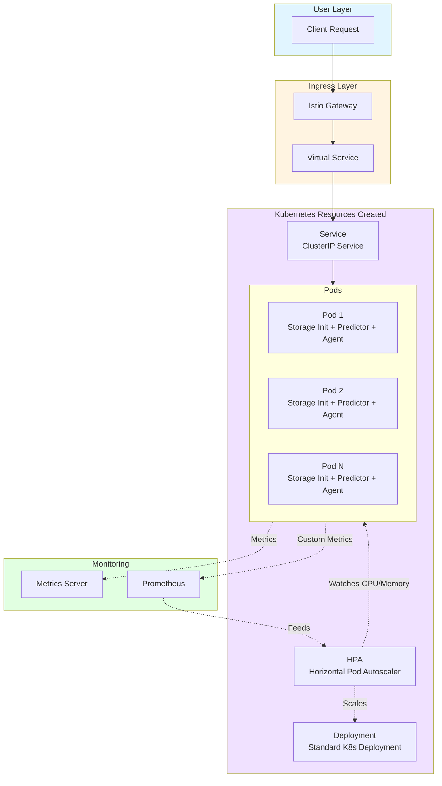

**Simple Explanation:**
In Raw mode, KServe creates regular Kubernetes resources you already know:
- **Deployment**: Manages your inference pods (just like any app)
- **Service**: Provides a stable endpoint to reach pods
- **HPA**: Scales pods based on CPU/memory (standard Kubernetes autoscaling)
- No special Knative magic - just plain Kubernetes!

## Configuration Flow

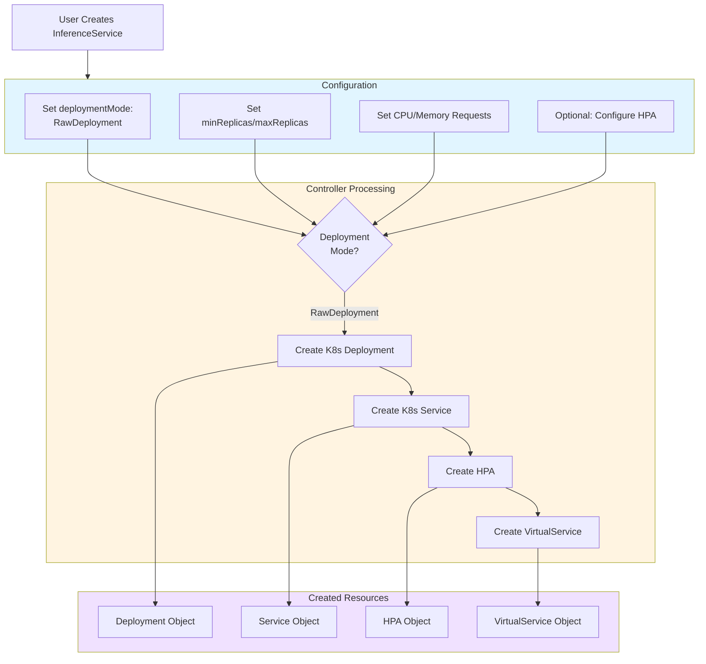

**Simple Explanation:**
When you set `deploymentMode: RawDeployment`:
1. Controller sees: "Ah, user wants simple Kubernetes mode"
2. Creates: Regular Deployment (not Knative Service)
3. Creates: Regular Service (ClusterIP type)
4. Creates: HPA if you want autoscaling
5. Creates: VirtualService for Istio routing (if using Istio)

That's it! No Knative, no serverless complexity.

## InferenceService YAML Example

### Basic Raw Deployment

```yaml
apiVersion: serving.kserve.io/v1beta1
kind: InferenceService
metadata:
  name: pytorch-raw
  namespace: models
  annotations:
    serving.kserve.io/deploymentMode: RawDeployment
spec:
  predictor:
    model:
      modelFormat:
        name: pytorch
      storageUri: s3://my-bucket/pytorch-model
      resources:
        requests:
          cpu: 2
          memory: 4Gi
        limits:
          cpu: 4
          memory: 8Gi
          nvidia.com/gpu: 1
    minReplicas: 2
    maxReplicas: 5
```

**Simple Explanation:**
```
This says: "Create a regular Kubernetes deployment with:
- Always keep 2 pods running (no scale-to-zero!)
- Can scale up to 5 pods max
- Each pod gets 2 CPUs and 4GB RAM
- PyTorch model from S3
- Simple and straightforward!"
```

### With HPA Configuration

```yaml
apiVersion: serving.kserve.io/v1beta1
kind: InferenceService
metadata:
  name: pytorch-hpa
  annotations:
    serving.kserve.io/deploymentMode: RawDeployment
spec:
  predictor:
    model:
      modelFormat:
        name: pytorch
      storageUri: s3://my-bucket/model
      resources:
        requests:
          cpu: 2
          memory: 4Gi
    minReplicas: 2
    maxReplicas: 10
    scaleTarget: 80  # Target CPU utilization percentage
    scaleMetric: cpu  # Scale based on CPU
```

**Simple Explanation:**
```
This adds autoscaling:
- Start with 2 pods
- Scale up to 10 pods if needed
- When average CPU across pods > 80%, add more pods
- When CPU drops, remove pods (but keep minimum 2)
- Standard Kubernetes HPA behavior
```

## What Gets Created

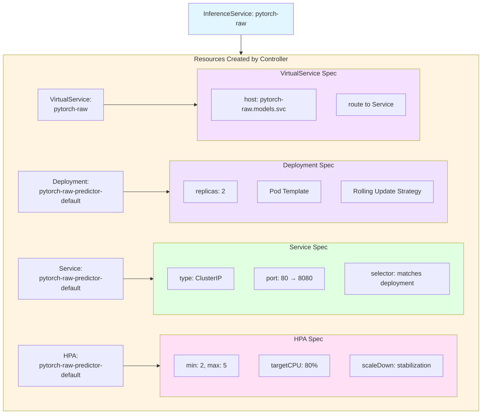

**Simple Explanation:**
For one InferenceService, you get four standard Kubernetes objects:
1. **Deployment**: Manages your inference pods (like nginx, redis, any app)
2. **Service**: Gives pods a stable DNS name 
3. **HPA**: Automatically adds/removes pods based on load
4. **VirtualService**: Routes external traffic to the Service (Istio only)

You can see all of these with regular `kubectl get` commands!

## Request Flow

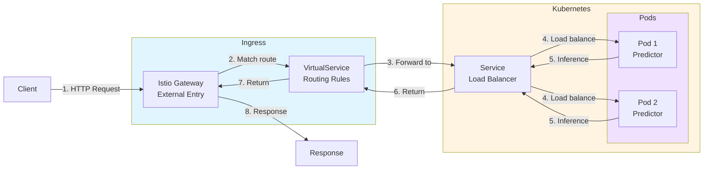

**Simple Explanation:**
Request flow is straightforward (no Knative in the middle!):
1. Client sends request to Istio Gateway
2. VirtualService routes to your Service
3. Service load-balances to one of your pods
4. Pod does inference and returns result
5. Response goes back through same path

It's just like accessing any Kubernetes service - simple!

## Scaling Behavior

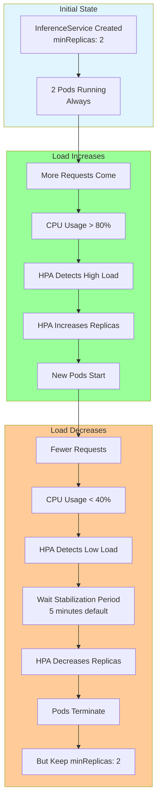

**Simple Explanation:**
Raw mode scaling is predictable:
- **Always running**: Minimum 2 pods (no scale-to-zero!)
- **Scale up**: When CPU > 80%, HPA adds pods (happens in seconds)
- **Scale down**: When CPU < 40%, HPA waits 5 minutes then removes pods
- **Cost**: You pay for minimum pods even with zero traffic
- **Benefit**: No cold start! Requests always answered immediately

## Comparison with Serverless

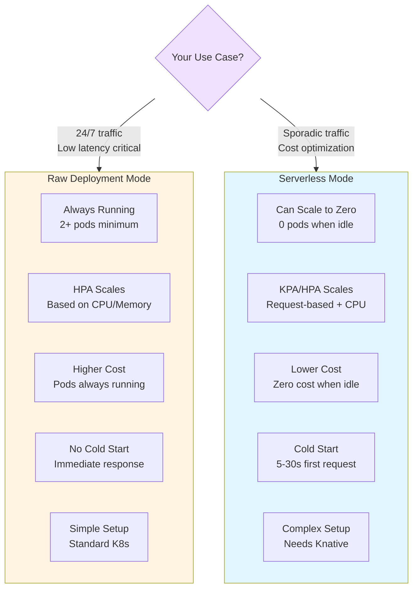

**Simple Explanation:**

**Choose Raw Deployment when:**
- You have steady, 24/7 traffic
- You can't tolerate cold starts
- You want simple, predictable behavior
- You're familiar with standard Kubernetes
- Cost of running minimum pods is acceptable

**Choose Serverless when:**
- Traffic is sporadic or unpredictable
- Cost optimization is critical
- You can tolerate 5-30 second cold starts
- You want advanced features (canary, revisions)
- You don't mind managing Knative

## Pod Structure

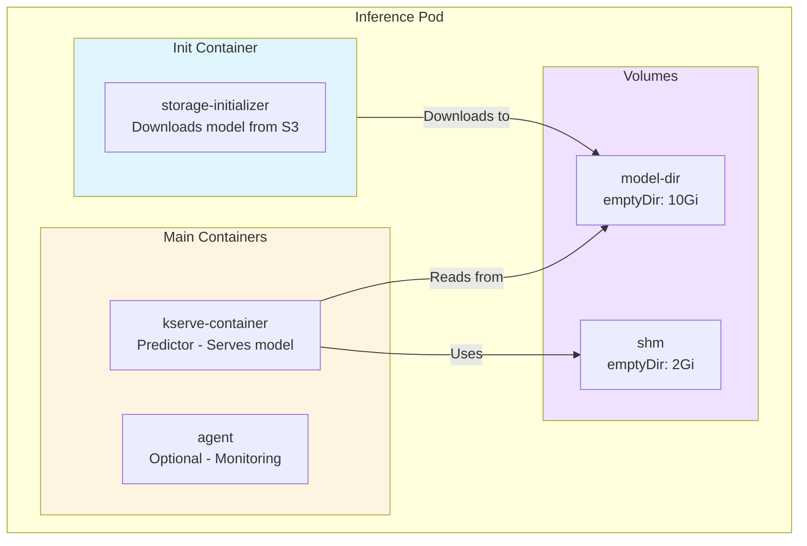

**Simple Explanation:**
Each pod in Raw mode has the same structure as Serverless:
1. **Init container** downloads your model once
2. **Predictor container** loads model and serves requests
3. **Agent container** (optional) monitors and logs
4. **Volumes** store the model and provide shared memory

Nothing special - just standard Kubernetes pod structure!

## Monitoring & Operations

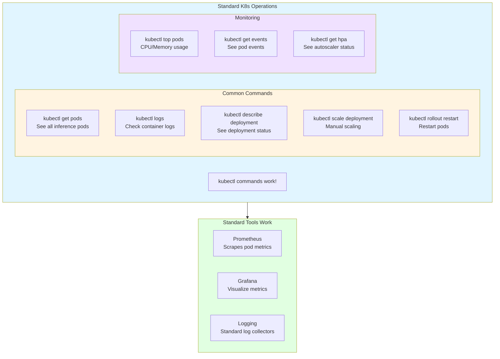

**Simple Explanation:**
Everything you know about Kubernetes works:
- `kubectl get/describe/logs` - all work normally
- Standard monitoring tools - Prometheus, Grafana work out of the box
- No special commands needed - it's just a Kubernetes deployment!
- Debug just like any other app in Kubernetes

## Updating Models

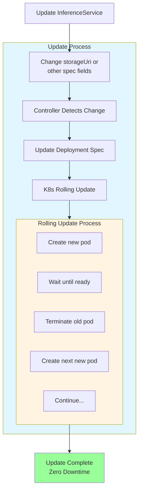

**Simple Explanation:**
Updating is safe and predictable:
1. Update your InferenceService YAML (new model, new image, etc.)
2. Controller updates the Deployment
3. Kubernetes does standard rolling update:
   - Starts new pod with new model
   - Waits until new pod is ready
   - Terminates old pod
   - Repeats for all pods
4. Zero downtime! Traffic always goes to ready pods

## Networking Configuration

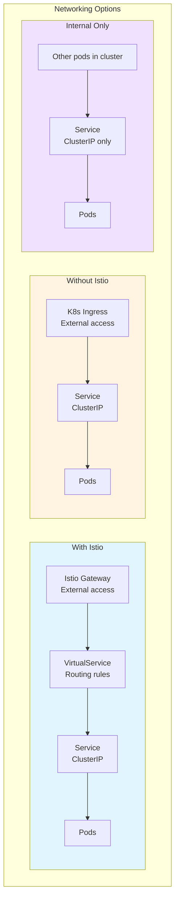

**Simple Explanation:**
You have options for how clients reach your model:
- **With Istio**: Use Gateway + VirtualService (most common)
- **Without Istio**: Use standard Kubernetes Ingress
- **Internal only**: Just use the Service (cluster-internal access)

All standard Kubernetes networking - nothing special!

## Best Practices

### 1. Resource Configuration

```yaml
# Good: Set proper resource limits
resources:
  requests:
    cpu: 2
    memory: 4Gi
  limits:
    cpu: 4
    memory: 8Gi
    nvidia.com/gpu: 1
```

**Why**: HPA needs requests to calculate scaling. Limits prevent pods from consuming all node resources.

### 2. Replica Configuration

```yaml
# Good: Set reasonable min/max
minReplicas: 2  # Always have 2 for HA
maxReplicas: 10  # Cap at 10 to control costs
```

**Why**: Min ensures availability, max prevents runaway scaling costs.

### 3. HPA Configuration

```yaml
# Good: Configure HPA properly
scaleTarget: 70  # Not too aggressive
scaleMetric: cpu  # Use CPU for predictable scaling
```

**Why**: 70% gives room for traffic spikes. CPU is reliable metric for inference workloads.

### 4. Health Probes

```yaml
# Ensure probes are configured
readinessProbe:
  httpGet:
    path: /v1/models/my-model
    port: 8080
  initialDelaySeconds: 30
livenessProbe:
  httpGet:
    path: /health
    port: 8080
  periodSeconds: 10
```

**Why**: Prevents traffic to unhealthy pods, restarts hung containers.

## Troubleshooting

### Problem: Pods Not Scaling

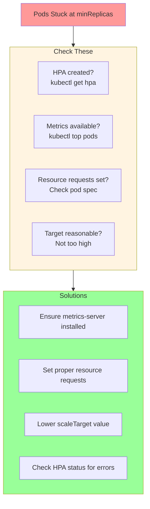

### Problem: High Latency

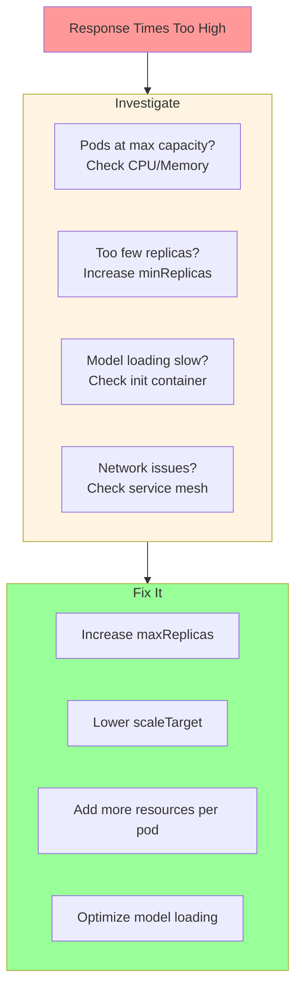

## When to Use Raw Deployment

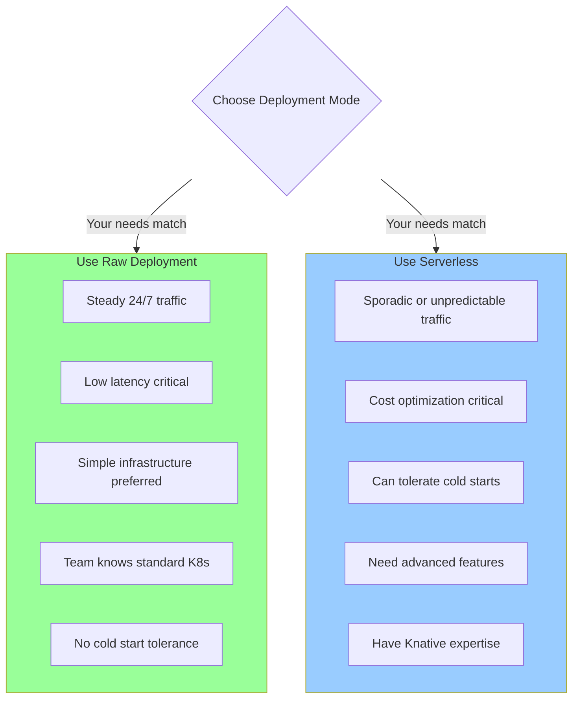

**Simple Explanation:**
Pick Raw Deployment if you need:
- ✅ Simple and predictable
- ✅ Always ready (no cold start)
- ✅ Standard Kubernetes (no Knative)
- ✅ Easy to understand and debug
- ❌ Accept: Always running (costs more)
- ❌ Accept: Basic scaling (no request-based autoscaling)

## Summary

**Raw Kubernetes Deployment Mode = Simple & Predictable**

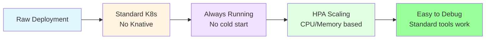

**Key Takeaway**: If you know Kubernetes, you know Raw Deployment mode. It's just a regular Deployment with an InferenceService wrapper - simple, reliable, and predictable!

## Related Components

- [Overall Architecture](./01-KSERVE-OVERALL-ARCHITECTURE.md) - Deployment modes comparison
- [InferenceService Controller](./02-INFERENCESERVICE-CONTROLLER.md) - How controller creates resources
- [Knative Integration](./10-KNATIVE-INTEGRATION.md) - Serverless alternative (coming soon)
- [Autoscaling Mechanisms](./11-AUTOSCALING-MECHANISMS.md) - HPA deep dive (coming soon)

