# KServe LLMD Integration

## Overview

LLMD (LLM Disaggregated) is an advanced KServe extension that enables **Prefill/Decode disaggregation** for Large Language Model serving. It separates prompt processing (prefill) from token generation (decode) to achieve 2-3x better throughput and GPU utilization.

## What is LLMD?

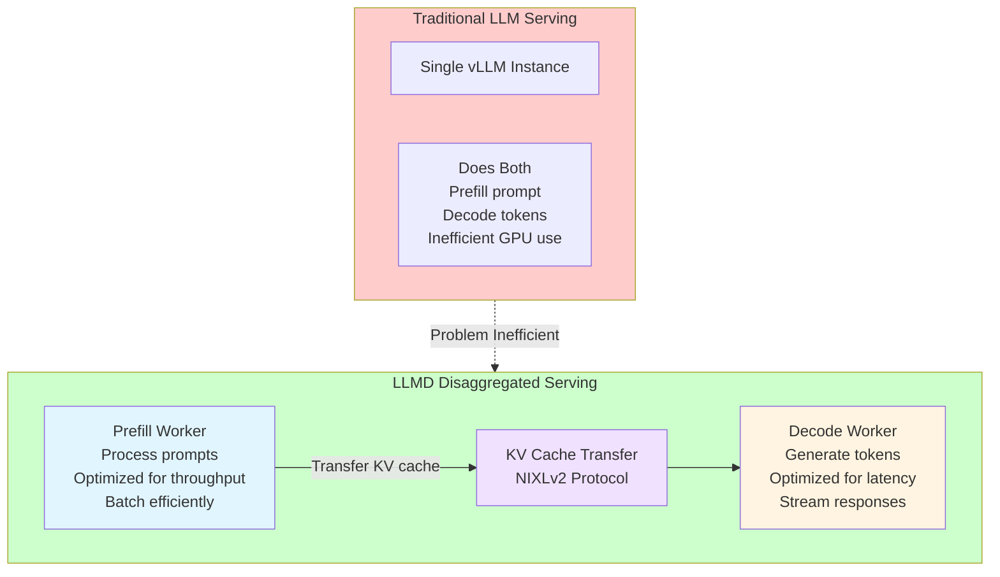

**Simple Explanation:**
Think of serving LLMs like a restaurant:

**Traditional way (Single Worker):**
- One chef does everything: takes order, cooks, serves
- Slow because chef waits between tasks
- Can't optimize for different types of work

**LLMD way (Specialized Workers):**
- **Prefill worker** = Kitchen prep chef (batch processes many orders efficiently)
- **Decode worker** = Line cook (quickly cooks and serves one order at a time)
- **Transfer** = Pass prepared ingredients from prep to line
- Result: 2-3x more customers served!

## LLMD Architecture in KServe

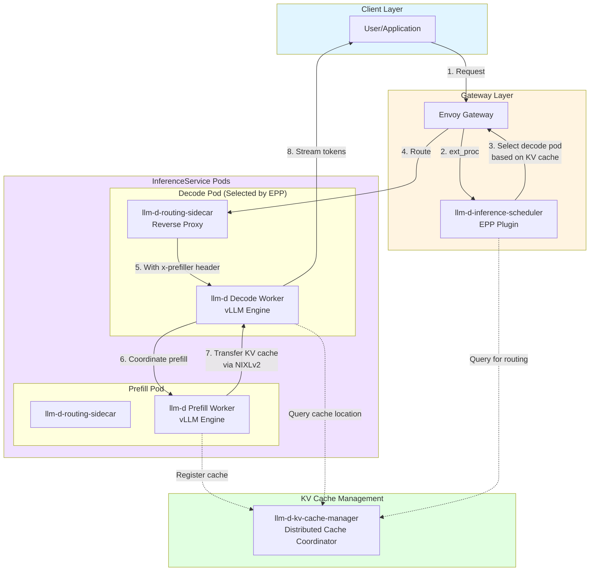

**Simple Explanation:**
Here's the flow in plain English:

1. **User sends request** to gateway (like any API call)
2. **Smart routing (EPP)** decides which decode pod should handle it (based on where KV cache is)
3. **Routing sidecar** acts as a guard, adds security headers
4. **Decode worker** sees new request, asks prefill worker to process the prompt
5. **Prefill worker** processes prompt, creates KV cache, sends it to decode worker
6. **Decode worker** receives KV cache, starts generating tokens, streams back to user
7. **KV cache manager** keeps track of where all cached prompts are stored

It's like a smart restaurant where:
- Host (EPP) seats customers at tables with their favorite chef
- Prep kitchen (prefill) processes ingredients 
- Line chef (decode) cooks and serves
- Manager (KV cache) tracks which ingredients are where

## LLMD Components

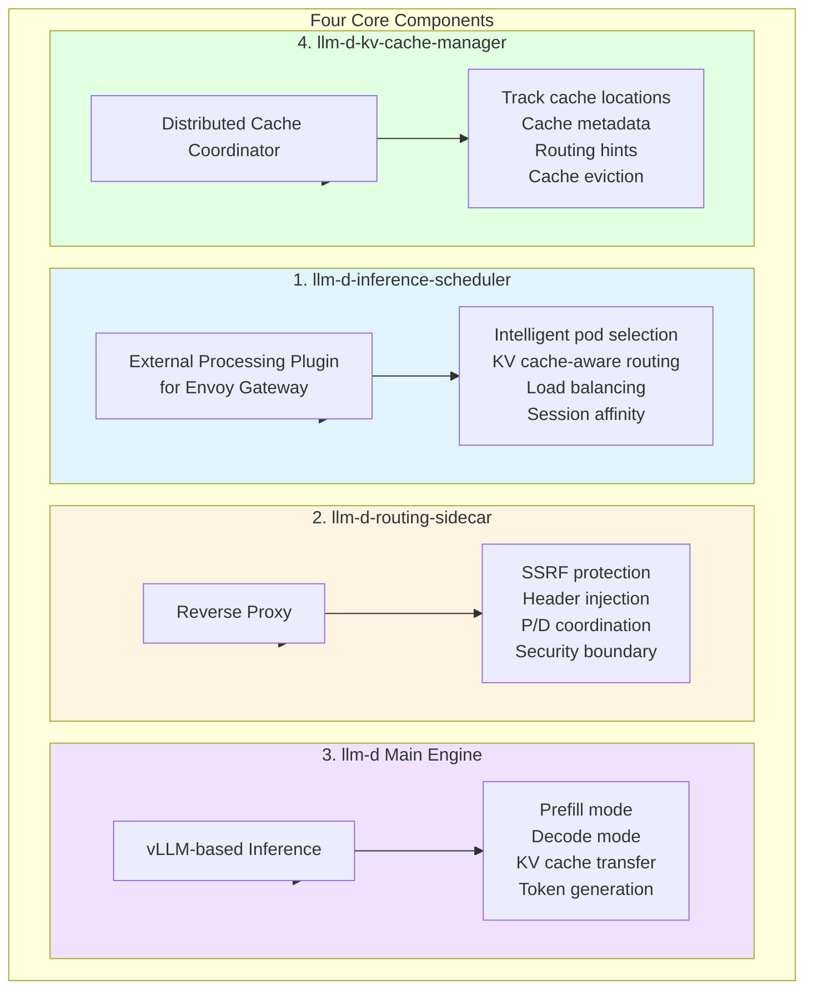

**Simple Explanation:**

**Component 1 - Scheduler (EPP):**
Like a smart restaurant host who knows:
- Which chef has your favorite dish ingredients ready (KV cache)
- Which chef is least busy
- Seats you at the best table

**Component 2 - Sidecar:**
Like a security guard who:
- Checks your credentials
- Adds an authorized stamp (header)
- Makes sure you can only talk to allowed workers

**Component 3 - Engine (llm-d):**
The actual chefs:
- Prefill chef: Preps ingredients (processes prompt)
- Decode chef: Cooks and serves (generates tokens)
- Both use vLLM (professional cooking equipment)

**Component 4 - KV Cache Manager:**
Like a restaurant manager's logbook:
- Tracks which ingredients (KV cache) are where
- Helps host decide where to seat customers
- Manages inventory (cache eviction)

## Request Flow Detailed

```mermaid
flowchart TB
    Start[User Sends<br/>Generate completion for<br/>Once upon a time]
    
    subgraph Step1["Step 1: Smart Routing"]
        Gateway[Envoy Gateway receives]
        CheckEPP{EPP Check<br/>KV cache exists?}
        QueryCache[EPP queries KV manager]
        SelectPod[EPP selects best decode pod]
    end
    
    subgraph Step2["Step 2: Security and Routing"]
        Sidecar[Sidecar intercepts request]
        ValidateSSRF[Validate not SSRF attack]
        InjectHeader[Inject x-prefiller header<br/>with prefill pod address]
        ForwardDecode[Forward to decode worker]
    end
    
    subgraph Step3["Step 3: Prefill Processing"]
        DecodeCheck{Decode Check<br/>KV cache available?}
        RequestPrefill[Decode asks prefill<br/>Process this prompt]
        PrefillProcess[Prefill processes<br/>Once upon a time]
        CreateKV[Prefill creates KV cache]
        TransferKV[Transfer KV via NIXLv2]
    end
    
    subgraph Step4["Step 4: Token Generation"]
        DecodeGenerate[Decode generates tokens<br/>there was a...]
        StreamBack[Stream tokens to user]
        UpdateCache[Update KV manager]
    end
    
    End[User receives<br/>Once upon a time,<br/>there was a...]
    
    Start --> Gateway
    Gateway --> CheckEPP
    CheckEPP -->|No cache| QueryCache
    CheckEPP -->|Has cache| SelectPod
    QueryCache --> SelectPod
    SelectPod --> Sidecar
    
    Sidecar --> ValidateSSRF
    ValidateSSRF --> InjectHeader
    InjectHeader --> ForwardDecode
    ForwardDecode --> DecodeCheck
    
    DecodeCheck -->|No| RequestPrefill
    RequestPrefill --> PrefillProcess
    PrefillProcess --> CreateKV
    CreateKV --> TransferKV
    TransferKV --> DecodeGenerate
    
    DecodeCheck -->|Yes| DecodeGenerate
    DecodeGenerate --> StreamBack
    StreamBack --> UpdateCache
    UpdateCache --> End
    
    style Step1 fill:#e1f5ff
    style Step2 fill:#fff4e1
    style Step3 fill:#f0e1ff
    style Step4 fill:#e1ffe1
```

**Simple Explanation (Story Mode):**

**You:** "Hey AI, complete this: 'Once upon a time'"

**Step 1 - Smart Host (EPP):**
- "Let me check... do we have this prompt cached anywhere?"
- "Yes! Pod-3 has it. I'll send you there."
- "No? Okay, let me pick the least busy decode pod."

**Step 2 - Security Guard (Sidecar):**
- "Hold on, let me verify you're legit (not an attack)"
- "Looks good! I'll stamp your request with the prefill address"
- "Okay, go through to the decode chef"

**Step 3 - Kitchen (Prefill):**
- Decode chef: "I don't have this prompt ready. Hey prep chef!"
- Prep chef: "Got it! Processing 'Once upon a time'..."
- Prep chef: "Done! Here's the KV cache (prepared ingredients)"
- *Transfers cache to decode chef*

**Step 4 - Service (Decode):**
- Decode chef: "Got the cache! Now generating tokens..."
- Decode chef: "there... was... a... beautiful..."
- *Streams each word back to you as they're generated*
- Updates manager: "I have this cache if anyone needs it"

**You receive:** "Once upon a time, there was a beautiful princess..."

## InferenceService with LLMD

### Prefill Worker ISVC

```yaml
apiVersion: serving.kserve.io/v1beta1
kind: InferenceService
metadata:
  name: llama-prefill
  namespace: llm
  annotations:
    serving.kserve.io/deploymentMode: RawDeployment
spec:
  predictor:
    containers:
    - name: kserve-container
      image: quay.io/opendatahub/llm-d:latest
      env:
        - name: PREFILL_MODE
          value: "true"
        - name: MODEL_NAME
          value: "llama-2-7b"
        - name: MAX_BATCH_SIZE
          value: "128"
      resources:
        limits:
          nvidia.com/gpu: 2
          memory: 32Gi
    
    # Sidecar for security
    - name: routing-sidecar
      image: quay.io/opendatahub/llm-d-routing-sidecar:latest
      
    minReplicas: 2
    maxReplicas: 10
```

**Simple Explanation:**
This creates the "prep kitchen":
- Uses LLMD image in PREFILL mode
- Can batch up to 128 requests (efficient!)
- Has routing sidecar for security
- Scales from 2-10 pods based on load

### Decode Worker ISVC

```yaml
apiVersion: serving.kserve.io/v1beta1
kind: InferenceService
metadata:
  name: llama-decode
  namespace: llm
  annotations:
    serving.kserve.io/deploymentMode: RawDeployment
    serving.kserve.io/llmd-prefiller-service: "llama-prefill-predictor-default"
spec:
  predictor:
    containers:
    - name: kserve-container
      image: quay.io/opendatahub/llm-d:latest
      env:
        - name: DECODE_MODE
          value: "true"
        - name: MODEL_NAME
          value: "llama-2-7b"
        - name: ENABLE_KV_TRANSFER
          value: "true"
      resources:
        limits:
          nvidia.com/gpu: 1
          memory: 16Gi
    
    # Sidecar for security and routing
    - name: routing-sidecar
      image: quay.io/opendatahub/llm-d-routing-sidecar:latest
      
    minReplicas: 5
    maxReplicas: 20
```

**Simple Explanation:**
This creates the "line kitchen":
- Uses LLMD image in DECODE mode
- Knows where prefill workers are
- Has sidecar for coordinating with prefill
- More decode pods than prefill (5-20) because decode is per-request

## LLMD Benefits

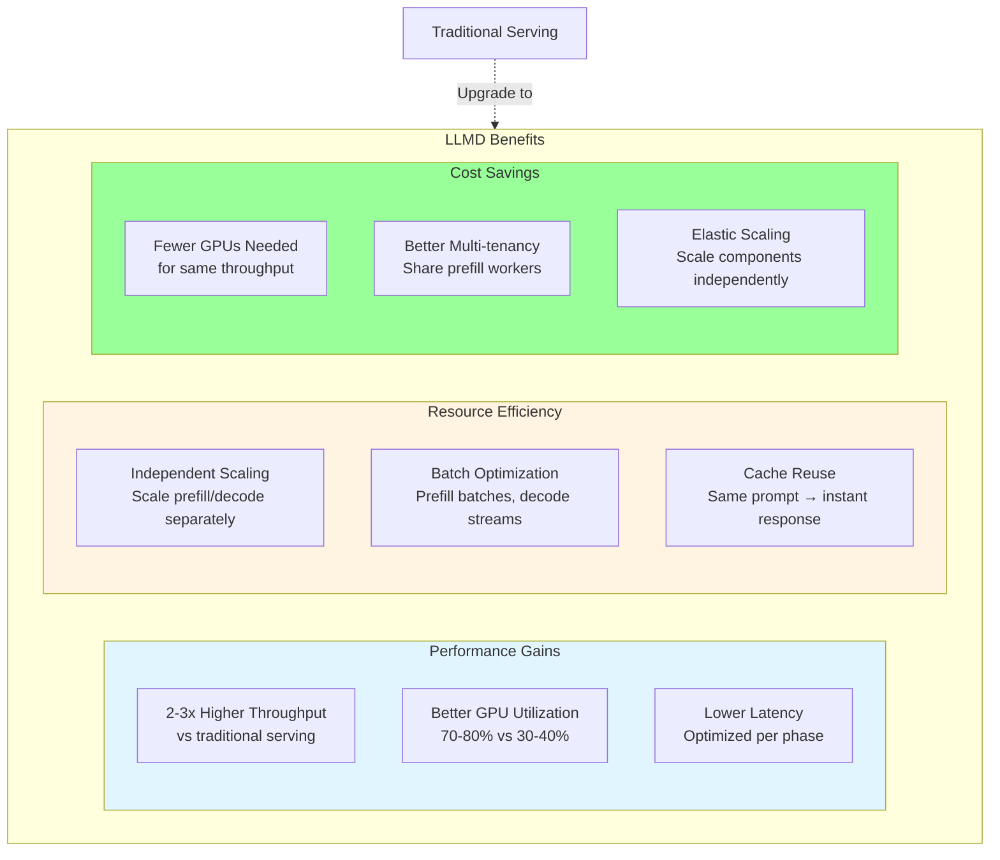

**Simple Explanation:**

**Performance Benefits:**
- **2-3x throughput**: Like having specialized workers vs generalists
- **Better GPU use**: GPUs are busy 70-80% of time (vs 30-40% wasted before)
- **Lower latency**: Each phase optimized for its job

**Efficiency Benefits:**
- **Independent scaling**: Need more prep? Scale prefill. Need more serving? Scale decode.
- **Batch optimization**: Prefill can batch 100 prompts together. Decode handles one stream at a time.
- **Cache reuse**: Process prompt once, decode many times (think ChatGPT system prompts)

**Cost Benefits:**
- **Fewer GPUs**: 10 GPUs with LLMD = 20-30 GPUs traditional
- **Multi-tenancy**: Multiple customers share same prefill workers
- **Elastic**: Scale only what you need

## KV Cache Management

```mermaid
flowchart TB
    subgraph CacheFlow["KV Cache Lifecycle"]
        Create[Prefill creates KV cache<br/>for prompt]
        Register[Register with KV manager<br/>Pod-X has cache for prompt-123]
        Use[Decode uses KV cache<br/>Generates tokens]
        Track[KV manager tracks usage<br/>Reference counting]
        Check{Cache full?}
        Keep[Keep in memory]
        Evict[Evict LRU cache]
        
        Create --> Register
        Register --> Use
        Use --> Track
        Track --> Check
        Check -->|No| Keep
        Check -->|Yes| Evict
        Keep -.->|Next request| Use
    end
    
    subgraph Routing["Smart Routing"]
        NewReq[New request arrives]
        EPPCheck{EPP Cache exists?}
        RouteWithCache[Route to pod with cache]
        RouteLeastBusy[Route to least busy pod]
        Fast[Fast response]
        Normal[Normal flow]
        
        NewReq --> EPPCheck
        EPPCheck -->|Yes| RouteWithCache
        EPPCheck -->|No| RouteLeastBusy
        RouteWithCache --> Fast
        RouteLeastBusy --> Normal
    end
    
    style CacheFlow fill:#e1f5ff
    style Routing fill:#f0e1ff
    style Fast fill:#99ff99
    style Normal fill:#fff4e1
```

**Simple Explanation:**

**Cache Lifecycle (Like Restaurant Ingredients):**
1. **Create**: Prep chef processes prompt, creates "ingredients" (KV cache)
2. **Register**: Manager writes in logbook: "Pod-X has ingredients for 'Once upon a time'"
3. **Use**: Line chef uses ingredients to cook (generate tokens)
4. **Track**: Manager tracks how often ingredients are used
5. **Keep or Evict**: If fridge is full, throw out least-used ingredients

**Smart Routing (Like Smart Host):**
- New customer arrives
- Host checks logbook: "Do we have ingredients for this dish?"
- **Yes?** Seat at table where ingredients are ready (instant cooking!)
- **No?** Seat at least busy table (normal cooking time)

Result: Popular prompts get instant responses!

## Deployment Architecture

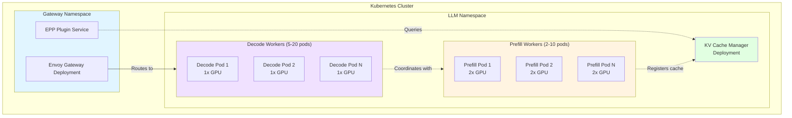

**Simple Explanation:**

**The Restaurant Layout:**
- **Front desk (Gateway)**: Envoy with smart host (EPP)
- **Prep kitchen (Prefill)**: 2-10 prep chefs with big stations (2 GPUs each)
- **Line kitchen (Decode)**: 5-20 line chefs with smaller stations (1 GPU each)
- **Manager office (KV Manager)**: Tracks inventory and seating

**Why this layout?**
- More line chefs than prep chefs (customers want individual attention)
- Prep chefs have bigger stations (they process in batches)
- Line chefs have smaller stations (they handle one order at a time)
- Manager coordinates everything

## Monitoring LLMD

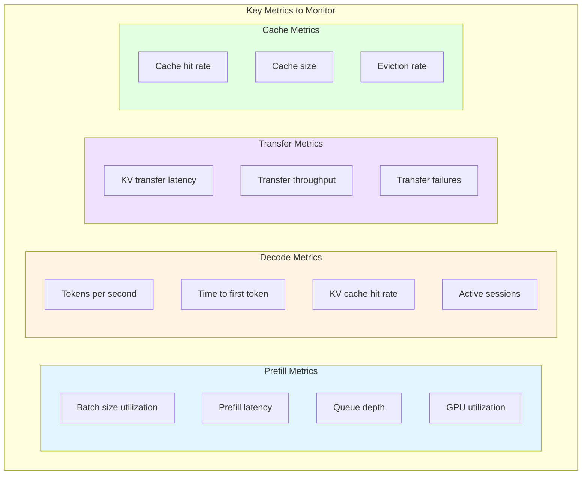

**Simple Explanation:**

**Watch these numbers (Restaurant Metrics):**

**Prep Kitchen (Prefill):**
- Batch size: How many orders prep chef handles at once
- Prefill latency: How long to prep ingredients
- Queue depth: How many orders waiting for prep
- GPU: Is prep chef using equipment efficiently?

**Line Kitchen (Decode):**
- Tokens/second: How fast chef serves food
- Time to first token: How long till first bite served
- Cache hit rate: How often ingredients are ready
- Active sessions: How many customers being served

**Ingredient Transfer:**
- Transfer latency: How fast prep sends to line
- Throughput: How much can be transferred
- Failures: Did any transfers drop?

**Inventory (Cache):**
- Hit rate: How often ingredients are pre-made
- Cache size: How much fits in fridge
- Eviction: How often we throw away old ingredients

## When to Use LLMD

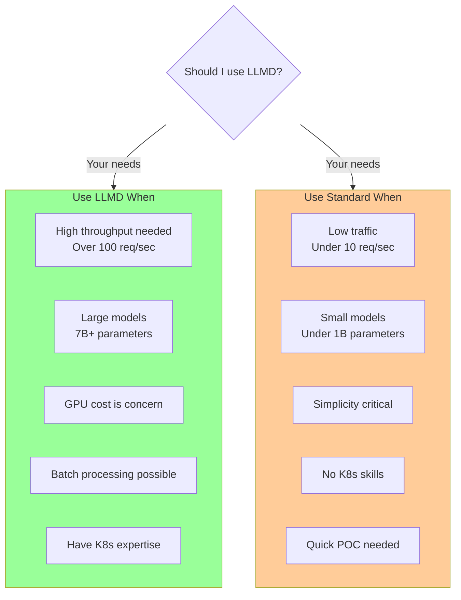

**Simple Explanation:**

**Use LLMD when:**
- ✅ You serve lots of requests (busy restaurant needs specialized staff)
- ✅ You use big models (complex dishes need prep chefs)
- ✅ GPU costs hurt (efficiency matters)
- ✅ You can batch requests (prep can work ahead)
- ✅ You know Kubernetes well (can manage complex kitchen)

**Use standard KServe when:**
- ✅ Low traffic (one chef can handle everything)
- ✅ Small models (simple dishes, no prep needed)
- ✅ You want simple (one chef easier to manage)
- ✅ You're new to K8s (start simple!)
- ✅ Just testing (don't build full restaurant for food truck)

## LLMD vs Standard Serving Comparison

```mermaid
flowchart LR
    subgraph Standard["Standard KServe"]
        S1[Single vLLM instance]
        S2[Does prefill + decode]
        S3[GPU util: 30-40%]
        S4[Throughput: baseline]
        S5[Simple setup]
        S6[1 InferenceService]
    end
    
    subgraph LLMD["LLMD KServe"]
        L1[Separate prefill/decode]
        L2[Specialized workers]
        L3[GPU util: 70-80%]
        L4[Throughput: 2-3x]
        L5[Complex setup]
        L6[2 InferenceServices + components]
    end
    
    Standard -.->|Upgrade for scale| LLMD
    
    style Standard fill:#fff4e1
    style LLMD fill:#99ff99
```

## Summary

**LLMD = High-Performance LLM Serving Through Specialization**

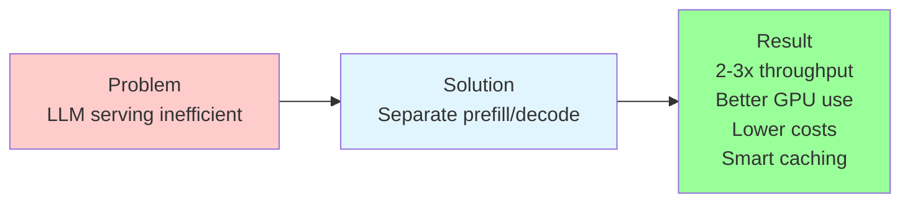

**Key Takeaway:** LLMD is like having a specialized restaurant kitchen instead of one chef doing everything. It's more complex to set up, but serves 2-3x more customers with the same resources!

## Related Documentation

- [Predictor Runtime](./05-PREDICTOR-RUNTIME.md) - LLM serving basics
- [Raw Kubernetes Deployment](./06-RAW-KUBERNETES-DEPLOYMENT.md) - LLMD uses this mode
- [Overall Architecture](./01-KSERVE-OVERALL-ARCHITECTURE.md) - KServe fundamentals
- [LLMD Component Docs](../llmd/) - Detailed LLMD component documentation

