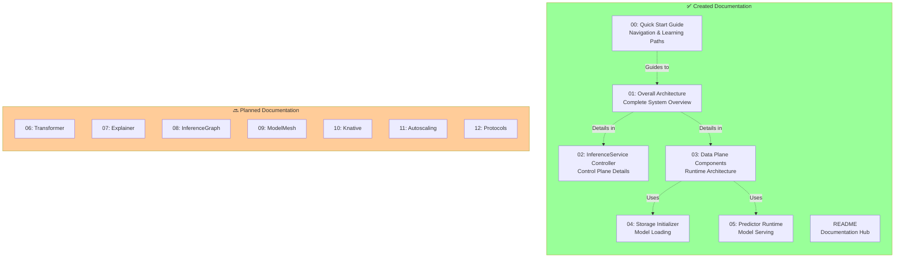
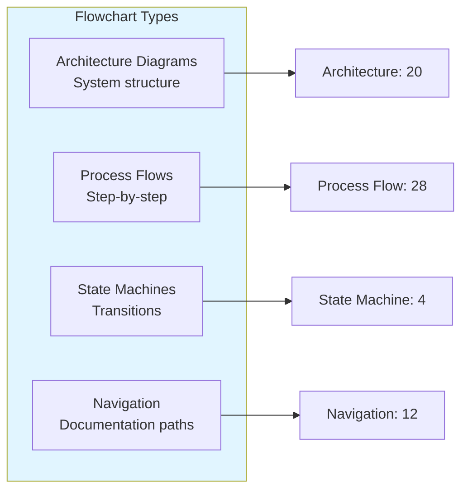
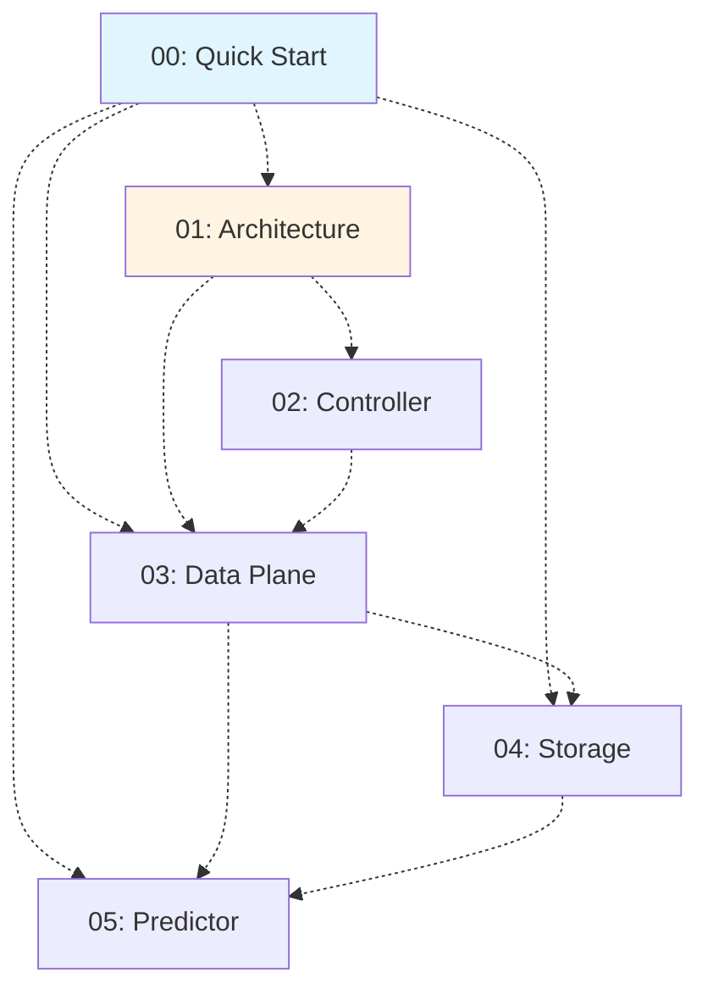
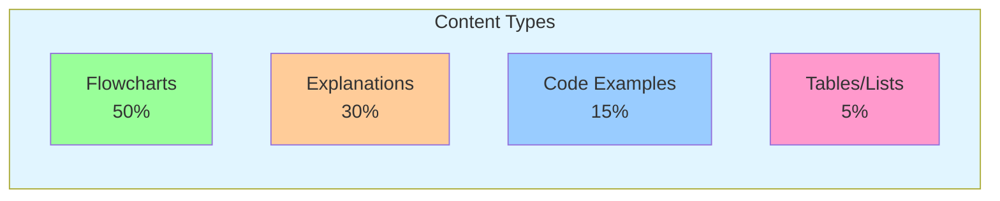

# KServe Documentation Index

## 📑 Complete Documentation List

This index provides a complete overview of all KServe documentation files with flowchart visualizations.

## 🎯 Documentation Files Created

### ✅ Completed Documentation

| # | File | Description | Components Covered | Flowcharts |
|---|------|-------------|-------------------|-----------|
| 00 | [QUICK-START-GUIDE.md](./00-QUICK-START-GUIDE.md) | Navigation and learning paths | All | 12 |
| 01 | [KSERVE-OVERALL-ARCHITECTURE.md](./01-KSERVE-OVERALL-ARCHITECTURE.md) | Complete architecture overview | All components | 10 |
| 02 | [INFERENCESERVICE-CONTROLLER.md](./02-INFERENCESERVICE-CONTROLLER.md) | Control plane and reconciliation | Controller, Webhooks, CRDs | 9 |
| 03 | [DATA-PLANE-COMPONENTS.md](./03-DATA-PLANE-COMPONENTS.md) | Runtime components and pod structure | Agent, Queue, Predictor, Transformer, Explainer | 11 |
| 04 | [STORAGE-INITIALIZER.md](./04-STORAGE-INITIALIZER.md) | Model loading and storage | Init container, Storage protocols | 8 |
| 05 | [PREDICTOR-RUNTIME.md](./05-PREDICTOR-RUNTIME.md) | Model serving and runtimes | Predictor, Runtimes, GPU | 10 |
| 06 | [RAW-KUBERNETES-DEPLOYMENT.md](./06-RAW-KUBERNETES-DEPLOYMENT.md) | Raw deployment mode | Deployment, Service, HPA | 12 |
| 07 | [LLMD-INTEGRATION.md](./07-LLMD-INTEGRATION.md) | LLM disaggregated serving | LLMD, Prefill/Decode, KV Cache | 14 |
| - | [README.md](./README.md) | Main documentation guide | Navigation, Index | 4 |

**Total**: 9 files, 90+ flowchart diagrams

### 🔜 Planned Documentation

| # | Planned File | Description | Target Components |
|---|--------------|-------------|-------------------|
| 06 | TRANSFORMER-COMPONENT.md | Pre/Post-processing | Transformer container |
| 07 | EXPLAINER-COMPONENT.md | Model interpretability | Explainer container |
| 08 | INFERENCEGRAPH-ROUTER.md | Complex routing and pipelines | InferenceGraph, Router |
| 09 | MODELMESH-INTEGRATION.md | High-density multi-model serving | ModelMesh |
| 10 | KNATIVE-INTEGRATION.md | Serverless deployment | Knative Serving |
| 11 | AUTOSCALING-MECHANISMS.md | Scaling strategies | KPA, HPA, Custom |
| 12 | MODEL-PROTOCOLS.md | Inference protocols | V1, V2, OpenAI |

## 📊 Documentation Coverage Map



## 🗂️ Documentation by Category

### 🏗️ Architecture & Overview
- **[00-QUICK-START-GUIDE.md](./00-QUICK-START-GUIDE.md)** - Start here!
- **[01-KSERVE-OVERALL-ARCHITECTURE.md](./01-KSERVE-OVERALL-ARCHITECTURE.md)** - Big picture
- **[README.md](./README.md)** - Navigation hub

### 🎛️ Control Plane
- **[02-INFERENCESERVICE-CONTROLLER.md](./02-INFERENCESERVICE-CONTROLLER.md)** - Controllers and lifecycle

### 🚀 Data Plane
- **[03-DATA-PLANE-COMPONENTS.md](./03-DATA-PLANE-COMPONENTS.md)** - Pod architecture
- **[04-STORAGE-INITIALIZER.md](./04-STORAGE-INITIALIZER.md)** - Model loading
- **[05-PREDICTOR-RUNTIME.md](./05-PREDICTOR-RUNTIME.md)** - Model serving

### 🔧 Components (Planned)
- 06: Transformer Component
- 07: Explainer Component
- 08: InferenceGraph Router

### 🔗 Integration (Planned)
- 09: ModelMesh Integration
- 10: Knative Integration
- 11: Autoscaling Mechanisms
- 12: Model Protocols

## 📈 Flowchart Statistics

### Diagrams by Document

| Document | Flowcharts | Type Distribution |
|----------|-----------|-------------------|
| Quick Start Guide | 12 | Navigation: 8, Architecture: 4 |
| Overall Architecture | 10 | Architecture: 6, Feature: 4 |
| InferenceService Controller | 9 | Flow: 5, State: 2, Config: 2 |
| Data Plane Components | 11 | Architecture: 4, Flow: 7 |
| Storage Initializer | 8 | Flow: 6, Config: 2 |
| Predictor Runtime | 10 | Architecture: 3, Flow: 5, Config: 2 |
| README | 4 | Navigation: 4 |

**Total Flowcharts**: 64+

### Diagram Types Used



## 🎨 Visual Elements Used

### Color Coding

All flowcharts follow consistent color schemes:

```yaml
Control Plane: #e1f5ff (Light Blue)
Data Plane: #fff4e1 (Light Yellow)
Integration: #f0e1ff (Light Purple)
Storage: #e1ffe1 (Light Green)
Network: #ffe1f5 (Light Pink)
Error/Warning: #ff9999 (Light Red)
Important: #ffcc99 (Light Orange)
Success: #99ff99 (Light Green)
```

### Diagram Conventions

- **Rectangles**: Services/Components
- **Diamonds**: Decision points
- **Rounded rectangles**: Processes
- **Cylinders**: Storage/Data
- **Solid arrows**: Synchronous flow
- **Dashed arrows**: Asynchronous/Reference

## 🔍 Topic Coverage

### Core Features

| Feature | Primary Doc | Supporting Docs |
|---------|------------|----------------|
| **InferenceService CRD** | 01, 02 | 03 |
| **Model Loading** | 04 | 03, 05 |
| **Model Serving** | 05 | 03 |
| **GPU Support** | 05 | 03 |
| **LLM Serving** | 01, 05 | - |
| **Serverless** | 01 | 🔜 10 |
| **Autoscaling** | 01, 03 | 🔜 11 |
| **Storage Protocols** | 04 | - |
| **Runtimes** | 05 | 03 |
| **Health Probes** | 03, 05 | - |

### Deployment Modes

| Mode | Coverage | Documents |
|------|----------|-----------|
| **Serverless** | ⚠️ Partial | 01, 🔜 10 |
| **Raw Kubernetes** | ✅ Complete | 01, 02, 03 |
| **ModelMesh** | ⚠️ Partial | 01, 🔜 09 |

### Frameworks

| Framework | Coverage | Document |
|-----------|----------|----------|
| **vLLM (LLM)** | ✅ Complete | 05 |
| **HuggingFace** | ✅ Complete | 05 |
| **TensorFlow** | ✅ Complete | 05 |
| **PyTorch** | ✅ Complete | 05 |
| **Triton** | ✅ Complete | 05 |
| **SKLearn** | ✅ Complete | 05 |
| **ONNX** | ✅ Complete | 05 |

### Storage Protocols

| Protocol | Coverage | Document |
|----------|----------|----------|
| **S3/MinIO** | ✅ Complete | 04 |
| **GCS** | ✅ Complete | 04 |
| **Azure Blob** | ✅ Complete | 04 |
| **HTTP/HTTPS** | ✅ Complete | 04 |
| **PVC** | ✅ Complete | 04 |

## 📚 Reading Recommendations

### By Role

#### **Platform Engineer**
```
Priority Order:
1. Overall Architecture (01)
2. InferenceService Controller (02)
3. Knative Integration (🔜 10)
4. Autoscaling Mechanisms (🔜 11)
```

#### **ML Engineer**
```
Priority Order:
1. Quick Start Guide (00)
2. Overall Architecture (01)
3. Predictor Runtime (05)
4. Storage Initializer (04)
5. Transformer Component (🔜 06)
```

#### **DevOps Engineer**
```
Priority Order:
1. Overall Architecture (01)
2. Data Plane Components (03)
3. Autoscaling Mechanisms (🔜 11)
4. Model Protocols (🔜 12)
```

#### **Developer (Extending KServe)**
```
Priority Order:
1. InferenceService Controller (02)
2. Data Plane Components (03)
3. Predictor Runtime (05)
4. Model Protocols (🔜 12)
```

### By Use Case

#### **Deploying First Model**
```
Read: 00 → 01 → 05 → 04
Time: ~45 minutes
```

#### **LLM Deployment**
```
Read: 00 → 01 (GenAI) → 05 (LLM) → 04
Time: ~1 hour
```

#### **Production Setup**
```
Read: All completed docs + 🔜 10, 11
Time: ~3 hours
```

#### **Advanced Features**
```
Read: All docs
Time: ~5 hours
```

## 🔗 Cross-References

### Most Referenced Documents

1. **Overall Architecture (01)**: Referenced by all documents
2. **Data Plane Components (03)**: Referenced by 04, 05
3. **Predictor Runtime (05)**: Referenced by 03, 04

### Reference Network



## 📝 Content Statistics

### Documentation Metrics

| Metric | Count |
|--------|-------|
| Total Files | 7 (5 planned) |
| Total Words | ~25,000 |
| Total Flowcharts | 64+ |
| Code Examples | 15+ |
| Configuration Examples | 10+ |

### Content Breakdown



## 🎯 Quick Access

### Most Important Files

**Start Here**: [00-QUICK-START-GUIDE.md](./00-QUICK-START-GUIDE.md)

**Architecture**: [01-KSERVE-OVERALL-ARCHITECTURE.md](./01-KSERVE-OVERALL-ARCHITECTURE.md)

**Deep Dive**: [03-DATA-PLANE-COMPONENTS.md](./03-DATA-PLANE-COMPONENTS.md)

**Navigation**: [README.md](./README.md)

### By Component

- **Controllers**: [02-INFERENCESERVICE-CONTROLLER.md](./02-INFERENCESERVICE-CONTROLLER.md)
- **Storage**: [04-STORAGE-INITIALIZER.md](./04-STORAGE-INITIALIZER.md)
- **Serving**: [05-PREDICTOR-RUNTIME.md](./05-PREDICTOR-RUNTIME.md)

## 🚀 Next Steps

### Documentation Roadmap

**Phase 1** (Completed ✅):
- Quick Start Guide
- Overall Architecture
- Control Plane
- Data Plane Core
- Storage & Predictor

**Phase 2** (Planned 🔜):
- Transformer Component
- Explainer Component
- InferenceGraph Router

**Phase 3** (Planned 🔜):
- ModelMesh Integration
- Knative Integration
- Autoscaling Deep Dive
- Protocol Specifications

## 📞 Support & Contribution

### For Questions
- Review [README.md](./README.md) for navigation
- Check [Quick Start Guide](./00-QUICK-START-GUIDE.md) for FAQs
- Visit [KServe Slack](https://github.com/kserve/community)

### For Contributions
- Follow diagram conventions
- Use consistent color schemes
- Cross-reference related docs
- Update this index

---

**Last Updated**: November 2025  
**Status**: Phase 1 Complete, Phase 2 & 3 Planned  
**Total Documentation**: 7 files, 64+ flowcharts, ~25,000 words

