# KServe Documentation - Flowchart Collection

## Overview

This directory contains comprehensive documentation for KServe (formerly KFServing), a standardized distributed generative and predictive AI inference platform for Kubernetes. All documentation uses **Mermaid flowcharts** to visualize architecture, components, and data flows.

## 📚 Documentation Structure

### Core Architecture

1. **[01-KSERVE-OVERALL-ARCHITECTURE.md](./01-KSERVE-OVERALL-ARCHITECTURE.md)**
   - Complete KServe architecture overview
   - Control plane and data plane components
   - Deployment modes (Serverless, Raw K8s, ModelMesh)
   - Feature categories and capabilities
   - Request flow and CRD structure

### Control Plane Components

2. **[02-INFERENCESERVICE-CONTROLLER.md](./02-INFERENCESERVICE-CONTROLLER.md)**
   - InferenceService controller architecture
   - Reconciliation loops and state machines
   - Webhook processing (validating and mutating)
   - Status management and traffic control
   - Component creation logic

### Data Plane Components

3. **[03-DATA-PLANE-COMPONENTS.md](./03-DATA-PLANE-COMPONENTS.md)**
   - Data plane architecture and pod structure
   - Storage Initializer init container
   - KServe Agent sidecar
   - Queue Proxy (Knative)
   - Predictor, Transformer, and Explainer containers
   - Multi-container coordination

4. **[04-STORAGE-INITIALIZER.md](./04-STORAGE-INITIALIZER.md)**
   - Storage protocol support (S3, GCS, Azure, HTTP, PVC)
   - Download and extraction flows
   - Authentication and credential management
   - Model validation
   - Error handling and retry logic

5. **[05-PREDICTOR-RUNTIME.md](./05-PREDICTOR-RUNTIME.md)**
   - Serving runtime types and configurations
   - Model loading and inference flows
   - LLM-specific features
   - GPU resource management
   - Performance optimization

### Deployment Modes

6. **[06-RAW-KUBERNETES-DEPLOYMENT.md](./06-RAW-KUBERNETES-DEPLOYMENT.md)**
   - Raw Kubernetes deployment mode
   - Standard K8s resources (Deployment + Service)
   - HPA autoscaling
   - Comparison with Serverless mode
   - When to use Raw deployment

### Advanced Features

7. **[07-LLMD-INTEGRATION.md](./07-LLMD-INTEGRATION.md)**
   - LLMD (LLM Disaggregated) architecture
   - Prefill/Decode separation
   - KV cache management
   - 2-3x throughput improvements
   - LLMD deployment patterns

## 🎯 Quick Navigation

### By Use Case

#### **Generative AI / LLM Serving**
- Overall Architecture → Generative AI Features
- Predictor Runtime (Coming: `05-PREDICTOR-RUNTIME.md`)
- Model Protocols (Coming: `12-MODEL-PROTOCOLS.md`)
- Autoscaling Mechanisms (Coming: `11-AUTOSCALING-MECHANISMS.md`)

#### **Predictive AI / Traditional ML**
- Overall Architecture → Predictive AI Features
- Transformer Component (Coming: `06-TRANSFORMER-COMPONENT.md`)
- Explainer Component (Coming: `07-EXPLAINER-COMPONENT.md`)
- InferenceGraph Router (Coming: `08-INFERENCEGRAPH-ROUTER.md`)

#### **High-Density Serving**
- ModelMesh Integration (Coming: `09-MODELMESH-INTEGRATION.md`)
- Overall Architecture → ModelMesh Mode

#### **Serverless Deployment**
- Knative Integration (Coming: `10-KNATIVE-INTEGRATION.md`)
- Overall Architecture → Serverless Mode
- Autoscaling Mechanisms (Coming: `11-AUTOSCALING-MECHANISMS.md`)

### By Component Type

#### **Control Plane**
- InferenceService Controller
- TrainedModel Controller (Covered in Controller doc)
- LocalModel Controller (Covered in Controller doc)
- ServingRuntime Controller (Covered in Controller doc)

#### **Data Plane**
- Storage Initializer
- KServe Agent
- Queue Proxy
- Predictor Container
- Transformer Container
- Explainer Container

#### **Integration**
- Knative Serving (Coming soon)
- ModelMesh (Coming soon)
- Istio Service Mesh (Covered in Overall Architecture)

## 📖 Reading Guide

### For Beginners

Start with these documents in order:
1. **Overall Architecture** - Get the big picture
2. **Data Plane Components** - Understand the runtime
3. **Storage Initializer** - Learn model loading
4. **InferenceService Controller** - Understand control plane

### For Developers

Focus on these areas:
1. **InferenceService Controller** - Controller development
2. **Data Plane Components** - Runtime implementation
3. **Model Protocols** (Coming soon) - Protocol implementation
4. **Custom Runtime Development** (Coming soon)

### For Operators

Essential documents:
1. **Overall Architecture** - Understanding deployment modes
2. **Autoscaling Mechanisms** (Coming soon) - Scaling configuration
3. **Storage Initializer** - Storage setup
4. **Monitoring and Observability** (Covered throughout)

## 🔄 Component Interaction Flowchart

```mermaid
flowchart TB
    User[User/Client]
    
    subgraph ControlPlane["Control Plane"]
        ISVCController[InferenceService Controller<br/>📄 02-CONTROLLER]
    end
    
    subgraph DataPlane["Data Plane"]
        StorageInit[Storage Initializer<br/>📄 04-STORAGE]
        Agent[KServe Agent<br/>📄 03-DATA-PLANE]
        Predictor[Predictor<br/>📄 05-PREDICTOR]
        Transformer[Transformer<br/>📄 06-TRANSFORMER]
        Explainer[Explainer<br/>📄 07-EXPLAINER]
    end
    
    subgraph Integration["Integration Layer"]
        Knative[Knative<br/>📄 10-KNATIVE]
        ModelMesh[ModelMesh<br/>📄 09-MODELMESH]
        InfGraph[InferenceGraph<br/>📄 08-INFERENCEGRAPH]
    end
    
    User -->|1. Create ISVC| ISVCController
    ISVCController -->|2. Deploy| Knative
    ISVCController -->|2. Or Deploy| ModelMesh
    
    Knative -->|3. Create Pod| StorageInit
    StorageInit -->|4. Load Model| Predictor
    
    User -->|5. Inference Request| Agent
    Agent -->|6. Route| Transformer
    Transformer -->|7. Transform| Predictor
    Predictor -->|8. Predict| Explainer
    Explainer -->|9. Response| User
    
    InfGraph -.->|Complex Routing| Agent
    
    style ControlPlane fill:#e1f5ff
    style DataPlane fill:#fff4e1
    style Integration fill:#f0e1ff
```

## 🎨 Diagram Conventions

### Colors
- **Blue (#e1f5ff)**: Control plane / Management
- **Yellow (#fff4e1)**: Data plane / Runtime
- **Purple (#f0e1ff)**: Integration / External systems
- **Green (#e1ffe1)**: Storage / Persistence
- **Pink (#ffe1f5)**: Network / Communication
- **Red (#ff9999)**: Errors / Warnings
- **Orange (#ffcc99)**: Important / Attention

### Shapes
- **Rectangle**: Component / Service
- **Diamond**: Decision point
- **Circle**: Start / End point
- **Cylinder**: Storage / Database
- **Parallelogram**: Input / Output
- **Rounded Rectangle**: Subprocess

### Line Styles
- **Solid Arrow (→)**: Direct flow / Synchronous
- **Dashed Arrow (-.->)**: Indirect / Asynchronous
- **Bold Arrow (==>)**: Primary path

## 📋 Feature Coverage Matrix

| Feature | Architecture | Controller | Data Plane | Specific Doc |
|---------|-------------|------------|------------|--------------|
| InferenceService CRD | ✅ | ✅ | ✅ | 01, 02 |
| Storage Protocols | ✅ | ⚠️ | ✅ | 04 |
| Predictor Runtime | ✅ | ⚠️ | ✅ | 🔜 05 |
| Transformer | ✅ | ⚠️ | ✅ | 🔜 06 |
| Explainer | ✅ | ⚠️ | ✅ | 🔜 07 |
| InferenceGraph | ✅ | ⚠️ | ⚠️ | 🔜 08 |
| ModelMesh | ✅ | ⚠️ | ⚠️ | 🔜 09 |
| Knative | ✅ | ⚠️ | ✅ | 🔜 10 |
| Autoscaling | ✅ | ⚠️ | ✅ | 🔜 11 |
| Protocols (V1/V2/OpenAI) | ✅ | ❌ | ⚠️ | 🔜 12 |

Legend:
- ✅ Fully documented
- ⚠️ Partially documented
- ❌ Not documented
- 🔜 Coming soon

## 🚀 KServe Deployment Modes

### Serverless Mode (Default)

### Raw Kubernetes Mode

### ModelMesh Mode

## 📊 Component Interaction Summary

```mermaid
flowchart TB
    subgraph User["User Layer"]
        Client[Client/User]
        SDK[Python SDK]
    end
    
    subgraph Control["Control Plane<br/>📄 02"]
        Controller[Controllers]
    end
    
    subgraph Init["Initialization<br/>📄 04"]
        Storage[Storage Initializer]
    end
    
    subgraph Runtime["Data Plane<br/>📄 03"]
        Agent[Agent]
        Predictor[Predictor]
    end
    
    subgraph Optional["Optional<br/>📄 06,07,08"]
        Transformer[Transformer]
        Explainer[Explainer]
        Graph[InferenceGraph]
    end
    
    subgraph Platform["Platform<br/>📄 09,10"]
        Knative[Knative]
        ModelMesh[ModelMesh]
    end
    
    User --> Control
    Control --> Platform
    Platform --> Init
    Init --> Runtime
    Runtime --> Optional
    
    style Control fill:#e1f5ff
    style Init fill:#fff4e1
    style Runtime fill:#f0e1ff
    style Optional fill:#e1ffe1
    style Platform fill:#ffe1f5
```

## 🔗 External References

### Official Documentation
- [KServe Website](https://kserve.github.io/website/)
- [KServe GitHub](https://github.com/kserve/kserve)
- [API Reference](https://kserve.github.io/website/docs/reference/crd-api)
- [Developer Guide](https://kserve.github.io/website/docs/developer-guide)

### Related Projects
- [OpenDataHub KServe Fork](https://github.com/opendatahub-io/kserve)
- [Knative Serving](https://knative.dev/docs/serving/)
- [ModelMesh Serving](https://github.com/kserve/modelmesh-serving)
- [Istio](https://istio.io/)

### Specifications
- [Open Inference Protocol](https://github.com/kserve/kserve/tree/master/docs/predict-api/v2)
- [OpenAI API Specification](https://platform.openai.com/docs/api-reference)

## 📝 Contributing

When adding new documentation:

1. **Follow the naming convention**: `NN-COMPONENT-NAME.md`
2. **Use Mermaid flowcharts**: No sequence diagrams, only flowcharts
3. **Include these sections**:
   - Overview
   - Architecture diagrams
   - Flow diagrams
   - Configuration examples
   - Related components
4. **Update this README**: Add to navigation and coverage matrix
5. **Cross-reference**: Link to related documents

## 🔍 Search Guide

To find information about:

- **Architecture**: Start with `01-OVERALL-ARCHITECTURE.md`
- **Controllers**: See `02-INFERENCESERVICE-CONTROLLER.md`
- **Runtime**: Check `03-DATA-PLANE-COMPONENTS.md`
- **Storage**: Read `04-STORAGE-INITIALIZER.md`
- **Specific Component**: Use the navigation above

## ⚠️ Status

This documentation is actively being developed. Files marked as "Coming soon" are planned but not yet created.

**Current Status**: 4/12 files complete
**Last Updated**: November 2025

## 📞 Support

For questions or issues:
- KServe Slack: [Join here](https://github.com/kserve/community/blob/main/README.md#questions-and-issues)
- GitHub Issues: [KServe Issues](https://github.com/kserve/kserve/issues)
- Documentation Issues: [Report here](https://github.com/kserve/website/issues)

---

**Note**: This documentation focuses on architecture and component interactions. For API usage, deployment guides, and tutorials, refer to the [official KServe website](https://kserve.github.io/website/).

