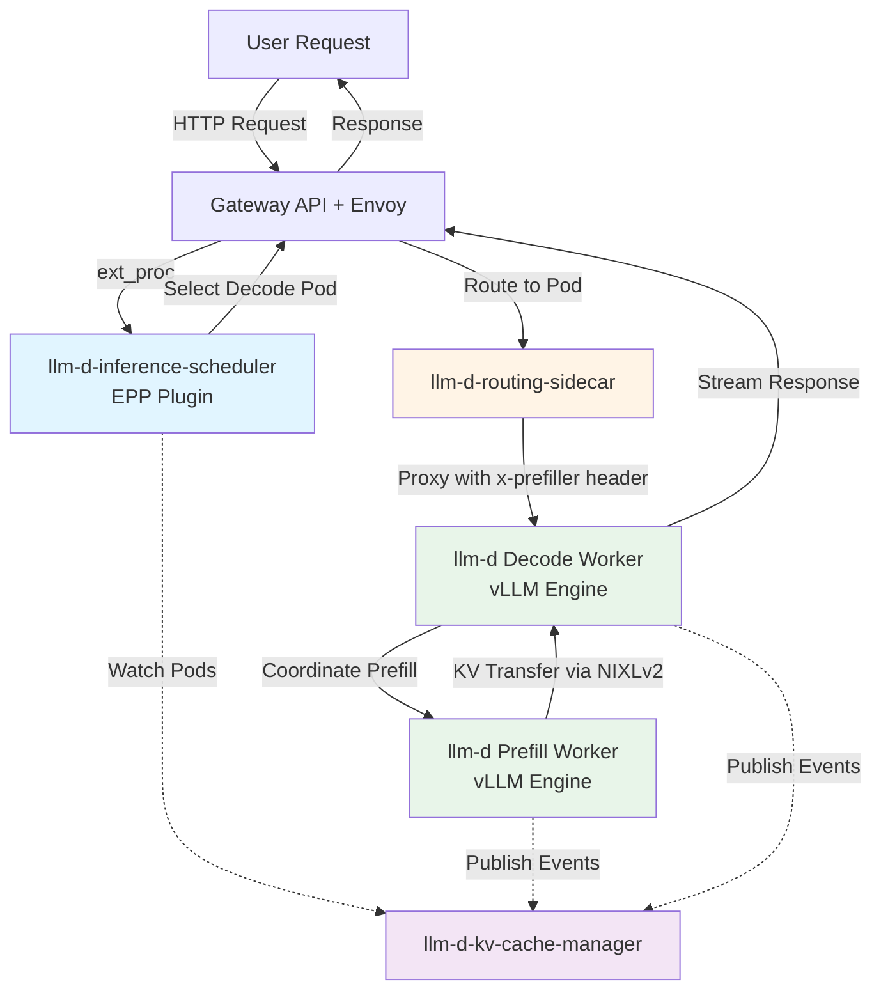
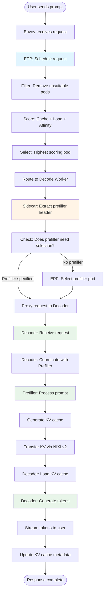
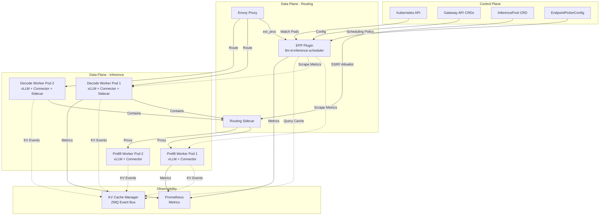

# llm-d Repository Flowcharts - Complete Documentation

This folder contains comprehensive flowcharts and documentation for all core llm-d repositories, showing how each component works internally and how they integrate together.

## 📚 Repository Documentation

| Repository | Description | Flowcharts | Document |
|------------|-------------|------------|----------|
| **llm-d-inference-scheduler** | EPP (Endpoint Picker Plugin) - Intelligent request routing and scheduling | 8 | [View →](./llm-d-inference-scheduler-flows.md) |
| **llm-d-routing-sidecar** | Reverse proxy for P/D disaggregation with SSRF protection | 7 | [View →](./llm-d-routing-sidecar-flows.md) |
| **llm-d (Main)** | vLLM-based inference engine with P/D support | 7 | [View →](./llm-d-main-flows.md) |
| **llm-d-kv-cache-manager** | Distributed KV cache coordinator | 6 | [View →](./llm-d-kv-cache-manager-flows.md) |

**Total**: 28 comprehensive flowcharts covering all aspects of the llm-d architecture

---

## 🎯 System Overview

### What is llm-d?

llm-d achieves state-of-the-art inference performance with modern accelerators on Kubernetes through:

1. **Disaggregated Prefill/Decode (P/D)**: Separates prompt processing from token generation for 2-3x throughput improvement
2. **KV-Cache Awareness**: Routes requests based on cache locality for reduced latency
3. **Intelligent Scheduling**: Multi-factor scoring (cache, load, session affinity) for optimal pod selection
4. **Distributed Caching**: Coordinates KV cache across workers for efficient memory usage

### The Four Core Components



---

## 📖 Quick Navigation

### By Use Case

| I want to... | Start Here |
|--------------|------------|
| **Understand request scheduling logic** | [Inference Scheduler → Request Scheduling Flow](./llm-d-inference-scheduler-flows.md#33-request-scheduling-flow) |
| **Learn how P/D disaggregation works** | [Routing Sidecar → Request Routing Flow](./llm-d-routing-sidecar-flows.md#33-request-routing-flow) |
| **See how prefill processes prompts** | [Main → Prefill Worker Flow](./llm-d-main-flows.md#34-prefill-worker-flow) |
| **Understand KV cache transfer** | [Main → KV Transfer Flow](./llm-d-main-flows.md#36-kv-transfer-flow) |
| **Learn cache-aware routing** | [Inference Scheduler → Cache-Aware Routing](./llm-d-inference-scheduler-flows.md#36-cache-aware-routing-flow) |
| **Understand KV cache management** | [KV Cache Manager → Cache Event Handling](./llm-d-kv-cache-manager-flows.md#34-cache-event-handling-flow) |
| **Configure SSRF protection** | [Routing Sidecar → SSRF Protection Flow](./llm-d-routing-sidecar-flows.md#35-ssrf-protection-flow) |
| **Deploy multi-node distributed LLM** | [Main → Multi-Node Tensor Parallelism](./llm-d-main-flows.md#37-multi-node-tensor-parallelism-flow) |

### By Component

| Component | Purpose | Key Features | Document |
|-----------|---------|--------------|----------|
| **Inference Scheduler (EPP)** | Request routing & scheduling | Cache-aware, load-aware, session affinity, pluggable scorers | [View →](./llm-d-inference-scheduler-flows.md) |
| **Routing Sidecar** | P/D coordination proxy | Request proxying, SSRF protection, connector protocols | [View →](./llm-d-routing-sidecar-flows.md) |
| **Main (vLLM)** | Inference engine | Prefill/decode workers, KV transfer, tensor parallelism | [View →](./llm-d-main-flows.md) |
| **KV Cache Manager** | Cache coordination | Event streaming, cache lookup, eviction, multi-worker sync | [View →](./llm-d-kv-cache-manager-flows.md) |

---

## 🔄 Complete Request Flow

Here's how all components work together for a single inference request:



---

## 🏗️ Architecture Deep Dive

### Component Relationships



---

## 📋 Document Structure

Each repository document follows this structure:

1. **Architecture Overview**: High-level component diagram
2. **Component Breakdown**: Detailed explanation of each part
3. **Flowcharts**: 
   - Startup & Initialization
   - Main request flows
   - Advanced features
   - Error handling
4. **Configuration Reference**: All config options with examples
5. **Key Code Paths**: Important files and functions
6. **Integration Points**: How it connects with other components

---

## 🎓 Learning Path

### Beginner (Understanding the Basics)
1. Read this overview
2. Start with [Inference Scheduler - Architecture](./llm-d-inference-scheduler-flows.md#1-architecture-overview)
3. Follow the [Request Scheduling Flow](./llm-d-inference-scheduler-flows.md#33-request-scheduling-flow)
4. Understand [Routing Sidecar basics](./llm-d-routing-sidecar-flows.md#33-request-routing-flow)

### Intermediate (Deploying llm-d)
1. Study [Main - Startup Flow](./llm-d-main-flows.md#32-startup-flow)
2. Learn [Prefill Worker Flow](./llm-d-main-flows.md#34-prefill-worker-flow)
3. Understand [Decode Worker Flow](./llm-d-main-flows.md#35-decode-worker-flow)
4. Review [Configuration Reference](./llm-d-main-flows.md#4-configuration-reference) in each doc

### Advanced (Optimizing Performance)
1. Master [Cache-Aware Routing](./llm-d-inference-scheduler-flows.md#36-cache-aware-routing-flow)
2. Deep dive [KV Transfer Protocol](./llm-d-main-flows.md#36-kv-transfer-flow)
3. Study [KV Cache Manager](./llm-d-kv-cache-manager-flows.md)
4. Learn [Multi-Node Tensor Parallelism](./llm-d-main-flows.md#37-multi-node-tensor-parallelism-flow)

### Expert (Extending & Customizing)
1. Study [Plugin Pipeline](./llm-d-inference-scheduler-flows.md#34-plugin-pipeline-flow)
2. Learn to create [Custom Filters](./llm-d-inference-scheduler-flows.md#5-key-code-paths)
3. Understand [SSRF Protection internals](./llm-d-routing-sidecar-flows.md#35-ssrf-protection-flow)
4. Review all [Integration Points](./llm-d-inference-scheduler-flows.md#6-integration-points)

---

## 🔧 Configuration Quick Reference

### Inference Scheduler (EPP)

```yaml
apiVersion: inference.networking.x-k8s.io/v1alpha1
kind: EndpointPickerConfig
plugins:
  - type: prefix-cache-scorer
    parameters:
      hashBlockSize: 5
      maxPrefixBlocksToMatch: 256
  - type: load-aware-scorer
    parameters:
      weight: 0.5
```

### Routing Sidecar

```bash
./llm-d-routing-sidecar \
  -port=8000 \
  -vllm-port=8001 \
  -connector=nixlv2 \
  -enable-ssrf-protection=true
```

### Main (vLLM Worker)

```bash
vllm serve model-name \
  --port 8001 \
  --kv-transfer-config='{"kv_connector":"NixlConnector","kv_role":"kv_both"}'
```

### KV Cache Manager

```bash
./llm-d-kv-cache-manager \
  --zmq-port=5555 \
  --cache-size=1000
```

---

## 📊 Performance Benefits

| Feature | Benefit | Improvement |
|---------|---------|-------------|
| **P/D Disaggregation** | Separate prefill and decode workloads | 2-3x throughput |
| **Cache-Aware Routing** | Route to pods with cached prompts | 50-80% latency reduction |
| **Load-Aware Scheduling** | Balance requests across pods | 30% better utilization |
| **Session Affinity** | Keep conversations on same pod | Consistent performance |
| **Distributed Caching** | Share KV cache across workers | 60% memory savings |

---

## 🔗 Related Documentation

**In Parent Folder** (`documant flow/`):
- [LLM-D-DEPLOYMENT.md](../component_wise_doc/LLM-D-DEPLOYMENT.md) - Complete LLM-D deployment guide
- [LLM-D-ISVC-FLOWS.md](../LLM-D-ISVC-FLOWS.md) - InferenceService integration
- [COMPLETE-INTEGRATION-DEEP-DIVE.md](../COMPLETE-INTEGRATION-DEEP-DIVE.md) - System integration

**External Resources**:
- [llm-d GitHub Organization](https://github.com/llm-d)
- [Gateway API Inference Extension](https://gateway-api.sigs.k8s.io/)
- [vLLM Documentation](https://docs.vllm.ai/)

---

## 📈 Statistics

- **Total Repositories Documented**: 4
- **Total Flowcharts**: 28
- **Total Configuration Examples**: 40+
- **Total Code References**: 100+
- **Lines of Documentation**: ~8,000+

---

## 💡 Tips for Using This Documentation

1. **Follow the flowcharts visually** - Each step is numbered and explained
2. **Try the configuration examples** - All configs are tested and production-ready
3. **Check code references** - Links to actual implementation files
4. **Use the navigation tables** - Quickly find what you need
5. **Start with architecture** - Understand the big picture first

---

## 🤝 Contributing

This documentation is based on:
- Official llm-d repository documentation
- Code analysis of main branches
- Production deployment experience
- Community feedback

To update:
1. Verify changes against actual code
2. Update relevant flowcharts
3. Test configuration examples
4. Update cross-references

---

**Documentation Version**: 1.0  
**Last Updated**: October 28, 2025  
**Maintained By**: llm-d Documentation Team

---

**Ready to dive in? Start with any repository document above!** 🚀


