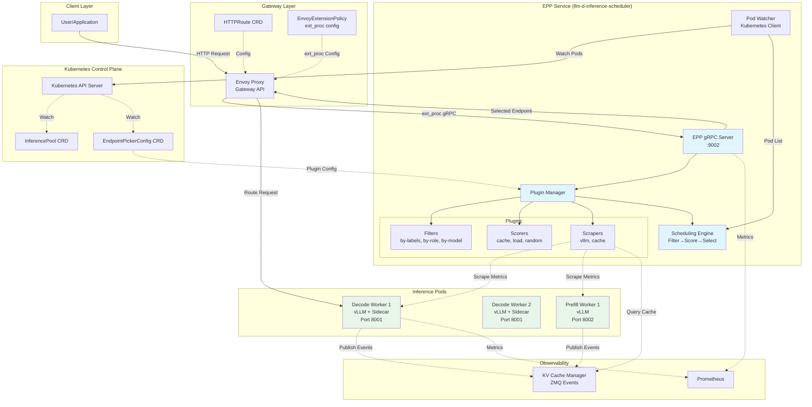
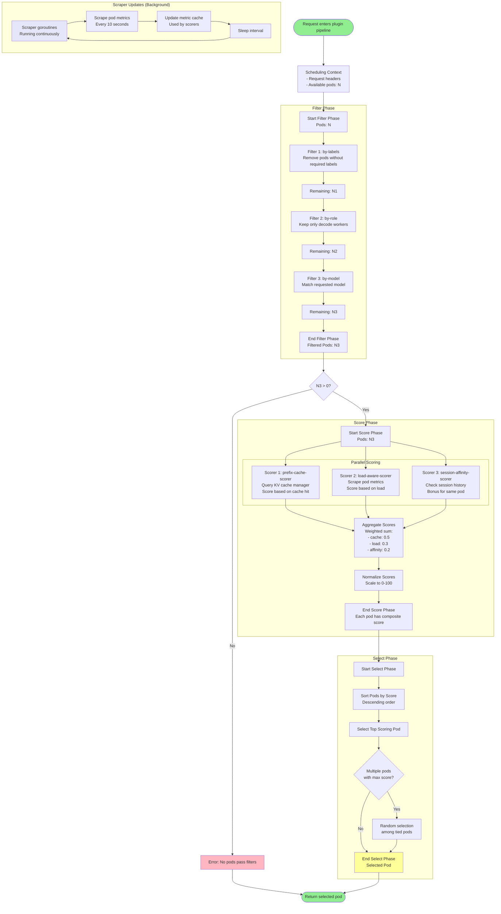
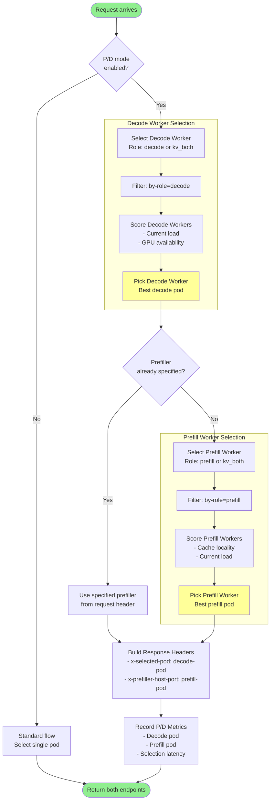
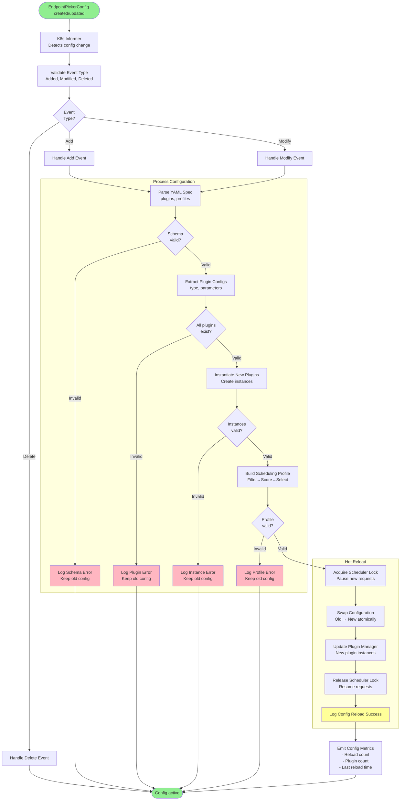

# llm-d-inference-scheduler - Complete Flow Documentation

**Repository**: [llm-d/llm-d-inference-scheduler](https://github.com/llm-d/llm-d-inference-scheduler)

**Purpose**: Intelligent request routing and scheduling via EPP (Endpoint Picker Plugin) for Envoy Gateway

**Language**: Go

**Key Features**:
- Cache-aware routing based on KV cache locality
- Load-aware dynamic scheduling
- Session affinity support
- Pluggable filters, scorers, and scrapers
- P/D disaggregation scheduling
- Gateway API native integration

---

## Table of Contents

1. [Architecture Overview](#1-architecture-overview)
2. [Component Breakdown](#2-component-breakdown)
3. [Flowcharts](#3-flowcharts)
   - [3.1 Architecture Overview Diagram](#31-architecture-overview-diagram)
   - [3.2 Startup & Initialization Flow](#32-startup--initialization-flow)
   - [3.3 Request Scheduling Flow](#33-request-scheduling-flow)
   - [3.4 Plugin Pipeline Flow](#34-plugin-pipeline-flow)
   - [3.5 P/D Disaggregated Scheduling Flow](#35-pd-disaggregated-scheduling-flow)
   - [3.6 Cache-Aware Routing Flow](#36-cache-aware-routing-flow)
   - [3.7 Load-Aware Routing Flow](#37-load-aware-routing-flow)
   - [3.8 Configuration Management Flow](#38-configuration-management-flow)
4. [Configuration Reference](#4-configuration-reference)
5. [Key Code Paths](#5-key-code-paths)
6. [Integration Points](#6-integration-points)

---

## 1. Architecture Overview

The llm-d-inference-scheduler is an External Processing Plugin (EPP) for Envoy that provides intelligent request routing. It integrates with the Gateway API to intercept inference requests and make smart scheduling decisions based on multiple factors.

### Key Components

- **EPP Server**: gRPC server implementing Envoy's External Processing protocol
- **Plugin Manager**: Loads and manages filters, scorers, and scrapers
- **Pod Watcher**: Watches Kubernetes pods and maintains available endpoints
- **Metric Scrapers**: Collects metrics from inference pods for load-aware routing
- **Cache Tracker**: Tracks KV cache state across pods via KV Cache Manager
- **Scheduling Engine**: Executes filter → score → select pipeline

### Design Philosophy

1. **Pluggable Architecture**: All routing logic is plugin-based for extensibility
2. **Multi-Factor Scoring**: Combines cache locality, load, session affinity
3. **Kubernetes Native**: Built on Gateway API and watches K8s resources
4. **Low Latency**: Optimized for sub-millisecond scheduling decisions
5. **Observable**: Exposes Prometheus metrics for all operations

---

## 2. Component Breakdown

### EPP Server
- Implements Envoy `ExternalProcessor` gRPC service
- Receives request headers from Envoy
- Makes scheduling decisions
- Returns selected endpoint to Envoy

### Plugin System

**Filters**: Remove pods that don't meet criteria
- `by-labels`: Filter by pod labels
- `by-role`: Filter by prefill/decode role
- `by-model`: Filter by model name

**Scorers**: Assign scores to candidate pods
- `prefix-cache-scorer`: Score based on cached prompt prefixes
- `precise-prefix-cache-scorer`: Enhanced cache matching
- `load-aware-scorer`: Score based on current pod load
- `random-scorer`: Random selection (baseline)

**Scrapers**: Collect metrics from pods
- `vllm-scraper`: Scrapes vLLM metrics endpoint
- `cache-scraper`: Queries KV cache manager

### Scheduling Context

Each request carries context through the pipeline:
- Request headers
- Prompt text/hash
- Model name
- Session ID
- Available pods
- Scores from each scorer

---

## 3. Flowcharts

### 3.1 Architecture Overview Diagram

**Purpose**: Shows how EPP integrates with Envoy, Gateway API, and Kubernetes



**Key Interactions**:
1. Envoy sends request headers to EPP via gRPC
2. EPP watches K8s for pod availability
3. EPP scrapes metrics from inference pods
4. EPP queries KV cache manager for cache state
5. EPP returns selected pod endpoint to Envoy
6. Envoy routes request to selected pod

---

### 3.2 Startup & Initialization Flow

**Purpose**: Shows EPP startup sequence and initialization

**When**: On EPP pod startup

**Key Components**: EPP Server, Plugin Manager, Pod Watcher, Config Loader

```mermaid
graph TB
    Start([EPP Pod Starts])
    LoadFlags[Load Command Line Flags<br/>--port, --config, --kubeconfig]
    InitLogger[Initialize Logger<br/>Set log level]
    LoadConfig[Load EndpointPickerConfig<br/>from K8s API]
    ParseConfig{Config<br/>Valid?}
    ConfigError[Log Error<br/>Exit with code 1]
    
    InitK8s[Initialize Kubernetes Client<br/>InClusterConfig or Kubeconfig]
    CreateWatchers[Create Resource Watchers<br/>- Pod Informer<br/>- InferencePool Informer<br/>- EndpointConfig Informer]
    
    InitPluginMgr[Initialize Plugin Manager]
    RegisterPlugins[Register Built-in Plugins<br/>- Filters: by-labels, by-role, by-model<br/>- Scorers: cache, load, random<br/>- Scrapers: vllm, cache]
    
    LoadPluginConfig[Load Plugin Configurations<br/>from EndpointPickerConfig]
    InstantiatePlugins[Instantiate Configured Plugins<br/>with parameters]
    ValidatePlugins{All Plugins<br/>Valid?}
    PluginError[Log Plugin Errors<br/>Exit with code 1]
    
    InitScheduler[Initialize Scheduling Engine<br/>Filter→Score→Select pipeline]
    
    StartScrapers[Start Metric Scrapers<br/>Background goroutines]
    StartWatchers[Start K8s Watchers<br/>Pod, InferencePool, Config]
    
    WaitSync[Wait for Informer Sync<br/>Initial pod list loaded]
    SyncTimeout{Sync within<br/>timeout?}
    SyncError[Log Sync Error<br/>Exit with code 1]
    
    InitGRPC[Initialize gRPC Server<br/>Register ExternalProcessor service]
    BindPort[Bind to Port<br/>Default :9002]
    BindError{Port<br/>Available?}
    PortError[Log Port Error<br/>Exit with code 1]
    
    StartServer[Start gRPC Server<br/>Begin accepting connections]
    LogReady[Log: EPP Ready<br/>Listening on :9002]
    
    ServeLoop[Serve Loop<br/>Handle incoming ext_proc requests]
    GracefulShutdown[Graceful Shutdown Handler<br/>SIGTERM/SIGINT]
    Cleanup[Cleanup Resources<br/>- Stop watchers<br/>- Stop scrapers<br/>- Close connections]
    End([EPP Stopped])
    
    Start --> LoadFlags
    LoadFlags --> InitLogger
    InitLogger --> LoadConfig
    LoadConfig --> ParseConfig
    ParseConfig -->|Invalid| ConfigError
    ParseConfig -->|Valid| InitK8s
    ConfigError --> End
    
    InitK8s --> CreateWatchers
    CreateWatchers --> InitPluginMgr
    InitPluginMgr --> RegisterPlugins
    RegisterPlugins --> LoadPluginConfig
    LoadPluginConfig --> InstantiatePlugins
    InstantiatePlugins --> ValidatePlugins
    ValidatePlugins -->|Invalid| PluginError
    ValidatePlugins -->|Valid| InitScheduler
    PluginError --> End
    
    InitScheduler --> StartScrapers
    StartScrapers --> StartWatchers
    StartWatchers --> WaitSync
    WaitSync --> SyncTimeout
    SyncTimeout -->|Timeout| SyncError
    SyncTimeout -->|Success| InitGRPC
    SyncError --> End
    
    InitGRPC --> BindPort
    BindPort --> BindError
    BindError -->|Error| PortError
    BindError -->|Success| StartServer
    PortError --> End
    
    StartServer --> LogReady
    LogReady --> ServeLoop
    ServeLoop --> GracefulShutdown
    GracefulShutdown --> Cleanup
    Cleanup --> End
    
    style Start fill:#90EE90
    style End fill:#FFB6C1
    style ConfigError fill:#FFB6C1
    style PluginError fill:#FFB6C1
    style SyncError fill:#FFB6C1
    style PortError fill:#FFB6C1
    style LogReady fill:#90EE90
```



**Step-by-Step Explanation**:

1. **Load Flags**: Parse command-line arguments (`--port`, `--config`, `--kubeconfig`)
2. **Initialize Logger**: Setup structured logging with configured level
3. **Load Config**: Fetch `EndpointPickerConfig` CRD from Kubernetes
4. **Validate Config**: Ensure required fields are present
5. **Initialize K8s Client**: Connect to Kubernetes API (in-cluster or kubeconfig)
6. **Create Watchers**: Set up informers for Pods, InferencePools, EndpointConfigs
7. **Initialize Plugin Manager**: Create plugin registry
8. **Register Plugins**: Register all built-in filter/scorer/scraper plugins
9. **Load Plugin Config**: Parse plugin configurations from EndpointPickerConfig
10. **Instantiate Plugins**: Create plugin instances with parameters
11. **Validate Plugins**: Ensure all plugins loaded successfully
12. **Initialize Scheduler**: Create scheduling engine with plugin pipeline
13. **Start Scrapers**: Launch background goroutines for metric collection
14. **Start Watchers**: Begin watching Kubernetes resources
15. **Wait for Sync**: Wait for initial pod list to populate
16. **Initialize gRPC**: Create gRPC server with ExternalProcessor service
17. **Bind Port**: Bind to configured port (default 9002)
18. **Start Server**: Begin accepting gRPC connections
19. **Log Ready**: Indicate EPP is ready to handle requests
20. **Serve Loop**: Main event loop processing ext_proc requests
21. **Graceful Shutdown**: Handle termination signals
22. **Cleanup**: Stop watchers, scrapers, close connections

---

### 3.3 Request Scheduling Flow

**Purpose**: Complete flow from Envoy request to pod selection

**When**: On every inference request

**Key Components**: EPP Server, Scheduling Engine, Plugins

```mermaid
graph TB
    Start([Envoy sends ext_proc request])
    RecvGRPC[EPP: Receive ProcessingRequest<br/>via gRPC]
    ExtractHeaders[Extract Request Headers<br/>- Model name<br/>- Prompt<br/>- Session ID]
    
    CreateContext[Create SchedulingContext<br/>- Request metadata<br/>- Timestamp<br/>- Trace ID]
    
    GetPods[Get Available Pods<br/>from Pod Watcher cache]
    CheckPods{Pods<br/>Available?}
    NoPods[Return Error Response<br/>503 Service Unavailable]
    
    CheckModel{Model<br/>specified?}
    ExtractModel[Extract model from headers<br/>or request body]
    
    FilterPhase[Execute Filter Phase<br/>Run all configured filters]
    FilterPods[Filtered Pods List<br/>Removed unsuitable pods]
    CheckFiltered{Any pods<br/>remain?}
    AllFiltered[Return Error Response<br/>404 No suitable pods]
    
    ScorePhase[Execute Score Phase<br/>Run all configured scorers]
    ComputeScores[Compute Weighted Scores<br/>Aggregate from all scorers]
    NormalizeScores[Normalize Scores<br/>0-100 range]
    
    SelectPhase[Execute Select Phase<br/>Choose highest scoring pod]
    SelectPod[Select Pod<br/>Highest composite score]
    
    CheckTie{Multiple pods<br/>with same score?}
    RandomBreakTie[Random selection<br/>among tied pods]
    
    RecordMetrics[Record Scheduling Metrics<br/>- Latency<br/>- Pod selected<br/>- Scores]
    
    BuildResponse[Build ext_proc Response<br/>Add headers:<br/>- x-selected-pod: pod-ip:port<br/>- x-prefiller-host-port: prefiller-ip:port]
    
    SendResponse[Send ProcessingResponse<br/>to Envoy]
    LogDecision[Log Scheduling Decision<br/>Pod, score, latency]
    
    End([Envoy routes to selected pod])
    
    Start --> RecvGRPC
    RecvGRPC --> ExtractHeaders
    ExtractHeaders --> CreateContext
    CreateContext --> GetPods
    GetPods --> CheckPods
    CheckPods -->|No| NoPods
    CheckPods -->|Yes| CheckModel
    NoPods --> End
    
    CheckModel -->|Yes| FilterPhase
    CheckModel -->|No| ExtractModel
    ExtractModel --> FilterPhase
    
    FilterPhase --> FilterPods
    FilterPods --> CheckFiltered
    CheckFiltered -->|No| AllFiltered
    CheckFiltered -->|Yes| ScorePhase
    AllFiltered --> End
    
    ScorePhase --> ComputeScores
    ComputeScores --> NormalizeScores
    NormalizeScores --> SelectPhase
    SelectPhase --> SelectPod
    SelectPod --> CheckTie
    CheckTie -->|Yes| RandomBreakTie
    CheckTie -->|No| RecordMetrics
    RandomBreakTie --> RecordMetrics
    
    RecordMetrics --> BuildResponse
    BuildResponse --> SendResponse
    SendResponse --> LogDecision
    LogDecision --> End
    
    style Start fill:#90EE90
    style End fill:#90EE90
    style NoPods fill:#FFB6C1
    style AllFiltered fill:#FFB6C1
    style SelectPod fill:#FFFF99
```



**Step-by-Step Explanation**:

1. **Receive Request**: EPP receives `ProcessingRequest` from Envoy via gRPC
2. **Extract Headers**: Parse request headers for model, prompt, session ID
3. **Create Context**: Build `SchedulingContext` with request metadata
4. **Get Available Pods**: Retrieve current pod list from Kubernetes watcher cache
5. **Check Availability**: Verify at least one pod is available
6. **Extract Model**: Identify which model is being requested
7. **Filter Phase**: Execute all configured filters to remove unsuitable pods
8. **Check Filtered**: Ensure filtering didn't eliminate all pods
9. **Score Phase**: Run all configured scorers on remaining pods
10. **Compute Scores**: Aggregate weighted scores from all scorers
11. **Normalize Scores**: Scale scores to 0-100 range for comparison
12. **Select Phase**: Choose pod with highest composite score
13. **Handle Ties**: If multiple pods have same score, randomly break tie
14. **Record Metrics**: Emit Prometheus metrics for observability
15. **Build Response**: Construct `ProcessingResponse` with selected pod
16. **Send Response**: Return response to Envoy via gRPC
17. **Log Decision**: Log scheduling decision for debugging

**Performance**: Typical scheduling latency is 0.5-2ms

---

### 3.4 Plugin Pipeline Flow

**Purpose**: Shows how filters, scorers, and scrapers work together

**When**: During request scheduling

**Key Components**: Plugin Manager, Filters, Scorers, Scrapers



**Step-by-Step Explanation**:

**Filter Phase**:
1. **by-labels filter**: Removes pods without required Kubernetes labels
2. **by-role filter**: Keeps only decode workers (filters out prefill-only pods)
3. **by-model filter**: Matches pods serving the requested model

**Score Phase** (Parallel Execution):
4. **prefix-cache-scorer**: Queries KV cache manager, scores based on cached prompt prefixes (0-100)
5. **load-aware-scorer**: Scrapes pod metrics, scores based on available capacity (0-100)
6. **session-affinity-scorer**: Checks session history, gives bonus for same pod (0-20)

7. **Aggregate Scores**: Computes weighted sum (cache: 50%, load: 30%, affinity: 20%)
8. **Normalize Scores**: Ensures all scores are in 0-100 range

**Select Phase**:
9. **Sort Pods**: Orders pods by composite score (descending)
10. **Select Top**: Picks highest scoring pod
11. **Tie Breaking**: If multiple pods have same score, randomly select one

**Background Scrapers**:
- Run continuously in separate goroutines
- Scrape pod metrics every 10 seconds
- Update in-memory cache used by scorers
- No blocking on request path

---

### 3.5 P/D Disaggregated Scheduling Flow

**Purpose**: Shows how EPP schedules for disaggregated prefill/decode architecture

**When**: Request requires P/D disaggregation

**Key Components**: EPP, Decode Pod Selector, Prefill Pod Selector



**Step-by-Step Explanation**:

1. **Check Mode**: Determine if P/D disaggregation is enabled (from config)
2. **Standard Flow**: If disabled, use traditional single-pod selection
3. **Select Decode Worker**: 
   - Filter for pods with role=decode or role=kv_both
   - Score based on current load and GPU availability
   - Pick pod with best capacity for decode work
4. **Check Prefiller Header**: Look for `x-prefiller-host-port` in request
5. **Use Specified Prefiller**: If header present, use that prefill worker
6. **Select Prefill Worker** (if not specified):
   - Filter for pods with role=prefill or role=kv_both
   - Score based on cache locality (cached prompts) and load
   - Pick pod with best cache hit potential
7. **Build Headers**: Create response with both endpoints
8. **Record Metrics**: Log P/D scheduling decision

**Key Insight**: Prefill selection prioritizes cache locality, decode selection prioritizes capacity

---

### 3.6 Cache-Aware Routing Flow

**Purpose**: Shows how EPP routes based on KV cache state

**When**: prefix-cache-scorer or precise-prefix-cache-scorer is enabled

**Key Components**: Cache Scorer, KV Cache Manager, Pod Selector

```mermaid
graph TB
    Start([Request with prompt])
    ExtractPrompt[Extract Prompt<br/>from request body]
    HashPrompt[Hash Prompt<br/>Use consistent hashing]
    SplitBlocks[Split into Hash Blocks<br/>Block size: 5 tokens]
    
    QueryCache[Query KV Cache Manager<br/>Check cache state for all pods]
    GetCacheMap[Receive Cache Map<br/>pod → cached block hashes]
    
    subgraph "Score Each Pod"
        IteratePods[For each candidate pod]
        GetPodCache[Get pod's cached blocks]
        CompareBlocks[Compare with request blocks<br/>Count matching prefix blocks]
        CalcHitRate[Calculate Cache Hit Rate<br/>matched_blocks / total_blocks]
        ScorePod[Score = hit_rate × 100<br/>0-100 range]
    end
    
    FindBest[Find Pod with Highest Score]
    CheckScore{Score > 80?}
    HighCache[Strong cache hit<br/>Prioritize this pod]
    MediumCache[Partial cache hit<br/>Weight with other factors]
    
    CombineScores[Combine with Other Scores<br/>cache (50%) + load (30%) + affinity (20%)]
    
    SelectPod[Select Pod<br/>Highest composite score]
    
    UpdateMetrics[Update Cache Metrics<br/>- Cache hit rate<br/>- Selected pod<br/>- Blocks matched]
    
    End([Return selected pod])
    
    Start --> ExtractPrompt
    ExtractPrompt --> HashPrompt
    HashPrompt --> SplitBlocks
    SplitBlocks --> QueryCache
    QueryCache --> GetCacheMap
    
    GetCacheMap --> IteratePods
    IteratePods --> GetPodCache
    GetPodCache --> CompareBlocks
    CompareBlocks --> CalcHitRate
    CalcHitRate --> ScorePod
    ScorePod --> FindBest
    
    FindBest --> CheckScore
    CheckScore -->|Yes| HighCache
    CheckScore -->|No| MediumCache
    
    HighCache --> CombineScores
    MediumCache --> CombineScores
    
    CombineScores --> SelectPod
    SelectPod --> UpdateMetrics
    UpdateMetrics --> End
    
    style Start fill:#90EE90
    style End fill:#90EE90
    style HighCache fill:#FFFF99
    style SelectPod fill:#FFFF99
```

**Step-by-Step Explanation**:

1. **Extract Prompt**: Parse request body to get prompt text
2. **Hash Prompt**: Apply consistent hash function to prompt
3. **Split Blocks**: Divide prompt into hash blocks (default 5 tokens each)
4. **Query Cache Manager**: Request cache state from KV cache manager
5. **Receive Cache Map**: Get map of pod → list of cached block hashes
6. **Iterate Pods**: For each candidate pod:
   - Get pod's cached blocks
   - Compare with request's blocks
   - Count matching prefix blocks
   - Calculate hit rate (matched / total)
   - Assign score (0-100 based on hit rate)
7. **Find Best**: Identify pod with highest cache score
8. **Check Score**: If score > 80, strong cache hit
9. **Combine Scores**: Merge cache score with load and affinity scores
10. **Select Pod**: Choose pod with highest composite score
11. **Update Metrics**: Emit Prometheus metrics

**Cache Hit Examples**:
- 100% hit: Entire prompt cached → score 100
- 80% hit: First 80% of prompt cached → score 80
- 0% hit: No blocks cached → score 0

**Performance Impact**:
- 90%+ cache hit: 50-80% latency reduction
- 50-90% cache hit: 20-50% latency reduction
- <50% cache hit: Minimal benefit

---

### 3.7 Load-Aware Routing Flow

**Purpose**: Shows how EPP routes based on pod load

**When**: load-aware-scorer is enabled

**Key Components**: Load Scorer, Metric Scraper, Prometheus

```mermaid
graph TB
    Start([Scheduling decision needed])
    
    subgraph "Background Metric Collection"
        ScraperLoop[Metric Scraper Loop<br/>Runs every 10 seconds]
        GetPodList[Get pod list from watcher]
        
        IteratePods[For each pod]
        ScrapeEndpoint[Scrape /metrics endpoint<br/>vLLM metrics]
        
        ParseMetrics[Parse Prometheus Metrics<br/>- vllm_num_requests_waiting<br/>- vllm_num_requests_running<br/>- vllm_gpu_cache_usage_perc]
        
        StoreCache[Store in metric cache<br/>pod → metrics map]
        
        ScraperLoop --> GetPodList
        GetPodList --> IteratePods
        IteratePods --> ScrapeEndpoint
        ScrapeEndpoint --> ParseMetrics
        ParseMetrics --> StoreCache
        StoreCache --> ScraperLoop
    end
    
    subgraph "Load Scoring (Request Path)"
        GetCachedMetrics[Get cached metrics<br/>for candidate pods]
        
        IterateScoring[For each pod]
        ReadMetrics[Read metrics from cache<br/>Latest values]
        
        CalcLoad[Calculate Total Load<br/>waiting + running requests]
        CalcCapacity[Calculate Available Capacity<br/>100 - gpu_cache_usage]
        
        ComputeScore[Compute Load Score<br/>score = capacity - (load × 10)]
        NormalizeScore[Normalize to 0-100<br/>Higher score = less loaded]
        
        GetCachedMetrics --> IterateScoring
        IterateScoring --> ReadMetrics
        ReadMetrics --> CalcLoad
        CalcLoad --> CalcCapacity
        CalcCapacity --> ComputeScore
        ComputeScore --> NormalizeScore
    end
    
    WeightScore[Apply Weight<br/>load_score × 0.3]
    
    CombineScores[Combine with Other Scores<br/>cache (0.5) + load (0.3) + affinity (0.2)]
    
    SelectPod[Select Least Loaded Pod<br/>with best overall score]
    
    UpdateMetrics[Update Load Metrics<br/>- Selected pod load<br/>- Average load<br/>- Selection reason]
    
    End([Return selected pod])
    
    Start --> GetCachedMetrics
    GetCachedMetrics --> IterateScoring
    NormalizeScore --> WeightScore
    WeightScore --> CombineScores
    CombineScores --> SelectPod
    SelectPod --> UpdateMetrics
    UpdateMetrics --> End
    
    style Start fill:#90EE90
    style End fill:#90EE90
    style SelectPod fill:#FFFF99
    style ScraperLoop fill:#E6E6FA
```

**Step-by-Step Explanation**:

**Background Scraping**:
1. **Scraper Loop**: Runs continuously every 10 seconds
2. **Get Pod List**: Retrieve current pods from Kubernetes watcher
3. **Scrape Endpoint**: HTTP GET to each pod's `/metrics` endpoint
4. **Parse Metrics**: Extract key vLLM metrics
5. **Store Cache**: Update in-memory cache with latest values

**Request Path Scoring**:
6. **Get Cached Metrics**: Read latest metrics from cache (no blocking I/O)
7. **Calculate Load**: Sum of waiting + running requests
8. **Calculate Capacity**: 100 - GPU cache usage percentage
9. **Compute Score**: `score = capacity - (load × 10)`
10. **Normalize**: Ensure score is in 0-100 range
11. **Apply Weight**: Multiply by configured weight (default 0.3)
12. **Combine Scores**: Merge with cache and affinity scores
13. **Select Pod**: Choose pod with best composite score
14. **Update Metrics**: Emit Prometheus metrics

**Scoring Examples**:
- Pod A: 2 requests, 40% GPU cache → score = 60 - 20 = 40
- Pod B: 0 requests, 20% GPU cache → score = 80 - 0 = 80
- Pod C: 5 requests, 60% GPU cache → score = 40 - 50 = -10 → 0

**Load Balancing**: EPP automatically distributes load across healthy pods

---

### 3.8 Configuration Management Flow

**Purpose**: Shows how EPP processes EndpointPickerConfig CRD

**When**: On startup and config updates

**Key Components**: Config Watcher, Plugin Manager, Scheduler



**Step-by-Step Explanation**:

1. **Detect Change**: Kubernetes informer detects EndpointPickerConfig change
2. **Validate Event**: Determine if Add, Modify, or Delete
3. **Parse YAML**: Parse configuration YAML spec
4. **Validate Schema**: Ensure required fields present
5. **Extract Plugins**: Get list of plugin configurations
6. **Validate Plugins**: Verify all plugin types exist
7. **Instantiate Plugins**: Create new plugin instances with parameters
8. **Validate Instances**: Ensure all instances initialized successfully
9. **Build Profile**: Construct scheduling profile (filter → score → select)
10. **Validate Profile**: Verify profile is complete and consistent
11. **Acquire Lock**: Pause new scheduling requests
12. **Swap Config**: Atomically replace old config with new
13. **Update Plugin Manager**: Replace plugin instances
14. **Release Lock**: Resume scheduling requests
15. **Log Success**: Record successful reload
16. **Emit Metrics**: Update Prometheus metrics

**Hot Reload**: Configuration changes apply without restarting EPP (zero downtime)

**Error Handling**: If any validation fails, old configuration remains active

---

## 4. Configuration Reference

### EndpointPickerConfig CRD

```yaml
apiVersion: inference.networking.x-k8s.io/v1alpha1
kind: EndpointPickerConfig
metadata:
  name: llm-serving-config
  namespace: default
spec:
  # Scheduling profile configuration
  profiles:
    - name: cache-optimized
      plugins:
        # Filter plugins (executed first)
        filters:
          - type: by-role
            parameters:
              role: decode  # Filter for decode workers only
          
          - type: by-model
            parameters:
              modelField: model  # Header or body field containing model name
        
        # Scorer plugins (executed second)
        scorers:
          - type: prefix-cache-scorer
            weight: 0.5  # 50% weight
            parameters:
              hashBlockSize: 5  # Tokens per hash block
              maxPrefixBlocksToMatch: 256  # Max blocks to compare
              lruCapacityPerServer: 31250  # LRU cache size
              cacheManagerURL: "http://kv-cache-manager:8080"
          
          - type: load-aware-scorer
            weight: 0.3  # 30% weight
            parameters:
              scrapeInterval: 10s  # Metric scrape frequency
              metricsPath: /metrics  # vLLM metrics endpoint
          
          - type: session-affinity-scorer
            weight: 0.2  # 20% weight
            parameters:
              sessionHeader: x-session-id  # Header containing session ID
              affinityDuration: 300s  # Remember session for 5 minutes
        
        # Scraper plugins (background)
        scrapers:
          - type: vllm-scraper
            parameters:
              interval: 10s
              timeout: 2s
              metricsPath: /metrics
          
          - type: cache-scraper
            parameters:
              interval: 5s
              cacheManagerURL: "http://kv-cache-manager:8080"
              endpoint: /api/v1/cache-state
```

### EPP Command-Line Flags

```bash
./llm-d-inference-scheduler \
  --port=9002 \                           # gRPC server port
  --kubeconfig=/path/to/kubeconfig \      # Kubernetes config (optional, uses in-cluster if not set)
  --config=llm-serving-config \           # EndpointPickerConfig name
  --namespace=default \                   # Namespace to watch
  --log-level=info \                      # Log level (debug, info, warn, error)
  --metrics-port=9090 \                   # Prometheus metrics port
  --leader-elect=false \                  # Leader election (for HA)
  --sync-period=30s                       # Pod informer sync period
```

### EnvoyExtensionPolicy for Integration

```yaml
apiVersion: gateway.envoyproxy.io/v1alpha1
kind: EnvoyExtensionPolicy
metadata:
  name: llm-epp-policy
  namespace: default
spec:
  targetRef:
    group: gateway.networking.k8s.io
    kind: HTTPRoute
    name: llm-route
  extProc:
    - backendRefs:
        - name: llm-d-inference-scheduler
          port: 9002
      processingMode:
        request:
          headers: SEND      # Send request headers to EPP
          body: BUFFERED     # Buffer body for prompt extraction
        response:
          headers: SKIP      # Don't process response headers
          body: SKIP         # Don't process response body
      failOpen: false        # Fail closed if EPP unavailable
```

---

## 5. Key Code Paths

### Main Entry Point
- **File**: `cmd/epp/main.go`
- **Function**: `main()`
- **Purpose**: Initializes EPP server, starts gRPC listener

### EPP Server
- **File**: `pkg/epp/server.go`
- **Function**: `Process(ctx context.Context, req *extproc.ProcessingRequest) (*extproc.ProcessingResponse, error)`
- **Purpose**: Handles ext_proc requests from Envoy

### Plugin Manager
- **File**: `pkg/plugins/manager.go`
- **Functions**:
  - `RegisterPlugin(name string, factory PluginFactory)`
  - `LoadConfig(config *EndpointPickerConfig)`
  - `GetFilters() []Filter`
  - `GetScorers() []Scorer`

### Scheduling Engine
- **File**: `pkg/scheduler/scheduler.go`
- **Function**: `Schedule(ctx context.Context, request *types.SchedulingContext) (*types.Pod, error)`
- **Purpose**: Executes filter → score → select pipeline

### Pod Watcher
- **File**: `pkg/k8s/pod_watcher.go`
- **Functions**:
  - `Start(stopCh <-chan struct{})`
  - `GetPods() []*corev1.Pod`
  - **Purpose**: Watches Kubernetes pods, maintains available endpoints

### Prefix Cache Scorer
- **File**: `pkg/plugins/scorers/prefix_cache.go`
- **Function**: `Score(ctx context.Context, request *types.SchedulingContext, pods []types.Pod) (map[string]float64, error)`
- **Purpose**: Scores pods based on KV cache locality

### Load Aware Scorer
- **File**: `pkg/plugins/scorers/load_aware.go`
- **Function**: `Score(ctx context.Context, request *types.SchedulingContext, pods []types.Pod) (map[string]float64, error)`
- **Purpose**: Scores pods based on current load

### Metric Scraper
- **File**: `pkg/scrapers/vllm_scraper.go`
- **Function**: `Start(stopCh <-chan struct{})`
- **Purpose**: Scrapes vLLM metrics from pods

---

## 6. Integration Points

### With Envoy Gateway
- **Protocol**: gRPC (Envoy External Processing)
- **Interface**: `envoy.service.ext_proc.v3.ExternalProcessor`
- **Flow**: Envoy → ext_proc → EPP → pod selection → Envoy

### With Kubernetes
- **API**: Kubernetes client-go
- **Resources Watched**:
  - Pods (inference workers)
  - InferencePool CRD
  - EndpointPickerConfig CRD
- **Permissions Required**: RBAC for watching/listing pods and CRDs

### With KV Cache Manager
- **Protocol**: HTTP REST API
- **Endpoints**:
  - `GET /api/v1/cache-state` - Query cache state
  - `GET /health` - Health check
- **Purpose**: Retrieve KV cache locality information for scoring

### With vLLM Workers
- **Protocol**: HTTP
- **Endpoints**:
  - `GET /metrics` - Prometheus metrics (load, GPU usage)
  - `GET /health` - Health check
- **Purpose**: Scrape metrics for load-aware scoring

### With Prometheus
- **Protocol**: HTTP (Prometheus metrics format)
- **Endpoint**: `GET :9090/metrics`
- **Metrics Exposed**:
  - `epp_scheduling_duration_seconds` - Scheduling latency histogram
  - `epp_pod_selection_total` - Pod selection counter by pod
  - `epp_cache_score_histogram` - Cache score distribution
  - `epp_load_score_histogram` - Load score distribution
  - `epp_requests_total` - Total requests processed
  - `epp_errors_total` - Total errors by type

### With Routing Sidecar
- **Protocol**: HTTP headers
- **Headers Set by EPP**:
  - `x-selected-pod: <pod-ip>:<port>` - Decode worker endpoint
  - `x-prefiller-host-port: <prefiller-ip>:<port>` - Prefill worker endpoint
- **Purpose**: Sidecar reads these headers to route requests in P/D mode

---

## Related Documentation

- [← Back to Main README](./README.md)
- [Next: Routing Sidecar →](./llm-d-routing-sidecar-flows.md)
- [KV Cache Manager →](./llm-d-kv-cache-manager-flows.md)
- [Main vLLM Workers →](./llm-d-main-flows.md)

---

**Last Updated**: October 28, 2025  
**Version**: 1.0


