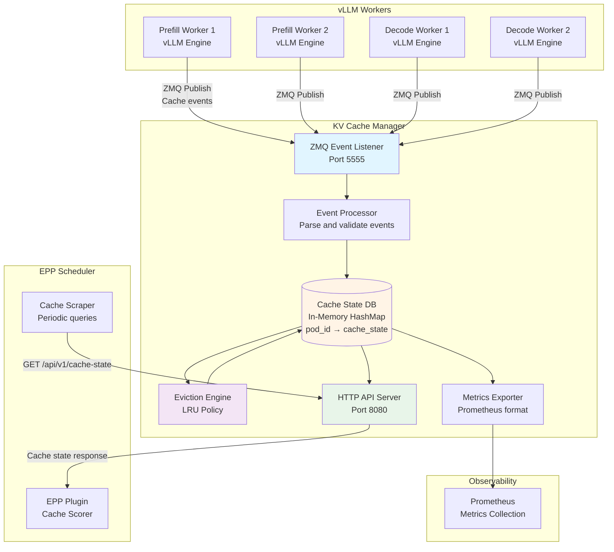

# llm-d-kv-cache-manager - Complete Flow Documentation

**Repository**: [llm-d/llm-d-kv-cache-manager](https://github.com/llm-d/llm-d-kv-cache-manager)

**Purpose**: Distributed KV cache coordinator for cache-aware routing

**Language**: Go

**Key Features**:
- ZMQ-based event streaming from vLLM workers
- Real-time cache state tracking
- Cache lookup API for EPP scheduler
- LRU eviction policy
- Multi-worker cache coordination
- Prometheus metrics export

---

## Table of Contents

1. [Architecture Overview](#1-architecture-overview)
2. [Component Breakdown](#2-component-breakdown)
3. [Flowcharts](#3-flowcharts)
   - [3.1 Architecture Overview Diagram](#31-architecture-overview-diagram)
   - [3.2 Startup & Initialization Flow](#32-startup--initialization-flow)
   - [3.3 Cache Event Handling Flow](#33-cache-event-handling-flow)
   - [3.4 Cache Lookup Flow](#34-cache-lookup-flow)
   - [3.5 Cache Eviction Flow](#35-cache-eviction-flow)
   - [3.6 Multi-Worker Coordination Flow](#36-multi-worker-coordination-flow)
4. [Configuration Reference](#4-configuration-reference)
5. [Key Code Paths](#5-key-code-paths)
6. [Integration Points](#6-integration-points)

---

## 1. Architecture Overview

The llm-d-kv-cache-manager is a centralized service that tracks KV cache state across all prefill and decode workers. It receives cache events via ZMQ, maintains an in-memory cache map, and provides a lookup API for the EPP scheduler to make cache-aware routing decisions.

### Core Responsibilities

1. **Event Collection**: Receive KV cache events from vLLM workers via ZMQ
2. **State Tracking**: Maintain current cache state for each worker pod
3. **Lookup API**: Provide cache state queries for EPP scheduler
4. **Eviction Management**: Implement LRU eviction when cache is full
5. **Observability**: Export Prometheus metrics for monitoring

### Design Philosophy

- **Centralized State**: Single source of truth for cache state
- **Low Latency**: Sub-millisecond cache lookups
- **High Throughput**: Handle 1000s of events per second
- **Fault Tolerant**: Continue operating if some workers fail
- **Eventually Consistent**: Accept minor delays in state updates

---

## 2. Component Breakdown

### ZMQ Event Listener
- Subscribes to cache events from all vLLM workers
- Non-blocking I/O for high throughput
- Handles multiple concurrent publishers

### Cache State Manager
- In-memory hash map: `pod_id → cache_state`
- Cache state includes:
  - Block hashes currently cached
  - Prompt hashes
  - LRU timestamps
  - Cache capacity usage

### Lookup API Server
- HTTP/REST API for cache queries
- Endpoints:
  - `GET /api/v1/cache-state`: Query cache state for all pods
  - `GET /api/v1/cache-state/:pod-id`: Query specific pod
  - `GET /health`: Health check
  - `GET /metrics`: Prometheus metrics

### Eviction Engine
- LRU (Least Recently Used) policy
- Per-pod eviction decisions
- Triggered when pod reaches capacity

### Metrics Collector
- Tracks cache hit rates
- Monitors event processing rate
- Records eviction statistics

---

## 3. Flowcharts

### 3.1 Architecture Overview Diagram

**Purpose**: Shows how KV cache manager integrates with workers and EPP



**Data Flow**:
1. **Workers → Manager**: vLLM workers publish cache events via ZMQ
2. **Manager Processing**: Events are processed and state is updated
3. **Manager → EPP**: EPP queries cache state via HTTP API
4. **Eviction**: Manager evicts old entries when capacity is reached
5. **Monitoring**: Prometheus scrapes metrics

---

### 3.2 Startup & Initialization Flow

**Purpose**: Shows KV cache manager initialization

**When**: On manager service startup

**Key Components**: ZMQ Listener, HTTP Server, Cache DB

```mermaid
graph TB
    Start([Manager service starts])
    
    ParseConfig[Parse Configuration<br/>--zmq-port, --http-port<br/>--cache-capacity, --eviction-policy]
    
    InitLogger[Initialize Logger<br/>Set log level and format]
    
    subgraph "ZMQ Setup"
        CreateZMQContext[Create ZMQ Context<br/>IO threads]
        
        CreateSubSocket[Create SUB Socket<br/>Subscribe to cache events]
        
        BindZMQ[Bind to ZMQ Port<br/>Default: 5555]
        BindCheck{Bind<br/>successful?}
        ZMQBindError[Error: Port in use<br/>Exit code 1]
        
        SetZMQOptions[Set ZMQ Options<br/>- High water mark<br/>- Receive timeout<br/>- Reconnect interval]
        
        SubscribeAll[Subscribe to All Topics<br/>Topic filter: "" (all)]
    end
    
    subgraph "Cache State Initialization"
        InitCacheDB[Initialize Cache State DB<br/>In-memory HashMap]
        
        SetCapacity[Set Cache Capacity<br/>Per-pod limits]
        
        InitLRU[Initialize LRU Structures<br/>Doubly-linked list + HashMap]
        
        AllocateMemory[Allocate Memory<br/>For cache entries]
        
        MemoryCheck{Memory<br/>available?}
        MemoryError[Error: Insufficient memory<br/>Exit code 1]
    end
    
    subgraph "HTTP API Setup"
        CreateRouter[Create HTTP Router<br/>gorilla/mux]
        
        RegisterRoutes[Register API Routes<br/>- GET /api/v1/cache-state<br/>- GET /api/v1/cache-state/:pod-id<br/>- GET /health<br/>- GET /metrics]
        
        CreateHTTPServer[Create HTTP Server<br/>Timeouts configured]
        
        BindHTTP[Bind to HTTP Port<br/>Default: 8080]
        HTTPBindCheck{Bind<br/>successful?}
        HTTPBindError[Error: Port in use<br/>Exit code 1]
    end
    
    subgraph "Background Goroutines"
        StartEventProcessor[Start Event Processor<br/>Goroutine]
        
        StartEvictionLoop[Start Eviction Loop<br/>Periodic cleanup]
        
        StartMetricsCollector[Start Metrics Collector<br/>Update statistics]
        
        StartHealthChecker[Start Health Checker<br/>Monitor system health]
    end
    
    LogReady[Log: Manager Ready<br/>- ZMQ listening on :5555<br/>- HTTP API on :8080<br/>- Cache capacity<br/>- Eviction policy]
    
    ServeLoop[Main Event Loop<br/>- Receive ZMQ events<br/>- Serve HTTP requests<br/>- Run eviction checks]
    
    GracefulShutdown[Handle Shutdown Signal<br/>SIGTERM/SIGINT]
    
    CloseZMQ[Close ZMQ Socket<br/>Stop receiving events]
    
    DrainEvents[Drain Pending Events<br/>Process remaining messages]
    
    PersistState[Persist State (Optional)<br/>Save to disk/DB]
    
    CloseHTTP[Stop HTTP Server<br/>Drain connections]
    
    CleanupMemory[Cleanup Memory<br/>Free cache structures]
    
    End([Manager stopped])
    
    Start --> ParseConfig
    ParseConfig --> InitLogger
    InitLogger --> CreateZMQContext
    
    CreateZMQContext --> CreateSubSocket
    CreateSubSocket --> BindZMQ
    BindZMQ --> BindCheck
    BindCheck -->|Failed| ZMQBindError
    BindCheck -->|Success| SetZMQOptions
    ZMQBindError --> End
    
    SetZMQOptions --> SubscribeAll
    SubscribeAll --> InitCacheDB
    
    InitCacheDB --> SetCapacity
    SetCapacity --> InitLRU
    InitLRU --> AllocateMemory
    AllocateMemory --> MemoryCheck
    MemoryCheck -->|Failed| MemoryError
    MemoryCheck -->|Success| CreateRouter
    MemoryError --> End
    
    CreateRouter --> RegisterRoutes
    RegisterRoutes --> CreateHTTPServer
    CreateHTTPServer --> BindHTTP
    BindHTTP --> HTTPBindCheck
    HTTPBindCheck -->|Failed| HTTPBindError
    HTTPBindCheck -->|Success| StartEventProcessor
    HTTPBindError --> End
    
    StartEventProcessor --> StartEvictionLoop
    StartEvictionLoop --> StartMetricsCollector
    StartMetricsCollector --> StartHealthChecker
    StartHealthChecker --> LogReady
    
    LogReady --> ServeLoop
    ServeLoop --> GracefulShutdown
    GracefulShutdown --> CloseZMQ
    CloseZMQ --> DrainEvents
    DrainEvents --> PersistState
    PersistState --> CloseHTTP
    CloseHTTP --> CleanupMemory
    CleanupMemory --> End
    
    style Start fill:#90EE90
    style End fill:#FFB6C1
    style LogReady fill:#FFFF99
    style ZMQBindError fill:#FFB6C1
    style MemoryError fill:#FFB6C1
    style HTTPBindError fill:#FFB6C1
```

**Initialization Steps**:

1. **Parse Config**: Read configuration from flags/env vars
2. **ZMQ Setup**: Create and bind ZMQ SUB socket
3. **Cache DB Init**: Initialize in-memory cache state database
4. **HTTP Setup**: Create HTTP server with API routes
5. **Start Goroutines**: Launch background workers
6. **Serve**: Begin event processing loop

**Typical Startup Time**: 1-2 seconds

---

### 3.3 Cache Event Handling Flow

**Purpose**: Shows how cache events are received and processed

**When**: vLLM worker publishes a cache event

**Key Components**: ZMQ Listener, Event Processor, Cache State DB

```mermaid
graph TB
    Start([ZMQ event arrives])
    
    RecvZMQ[Receive ZMQ Message<br/>Non-blocking recv]
    
    CheckTimeout{Timeout<br/>reached?}
    ContinueLoop[Continue event loop<br/>No message]
    
    ParseMessage[Parse ZMQ Message<br/>JSON deserialization]
    
    ValidateMessage{Message<br/>valid?}
    InvalidMsg[Log Error: Invalid message<br/>Increment error counter<br/>Discard message]
    
    ExtractFields[Extract Event Fields<br/>- event_type<br/>- pod_id<br/>- request_id<br/>- block_hashes<br/>- prompt_hash<br/>- timestamp]
    
    DetermineEventType{Event<br/>Type?}
    
    subgraph "Request Started Event"
        ReqStarted[Event: request_started]
        UpdateReqCount[Update Request Count<br/>For pod]
        LogReqStart[Log Request Started<br/>Pod, request ID]
    end
    
    subgraph "Prefill Complete Event"
        PrefillComplete[Event: prefill_complete]
        ExtractBlocks[Extract KV Block Hashes<br/>List of block IDs]
        ExtractPromptHash[Extract Prompt Hash<br/>For cache matching]
        
        GetPodState[Get Pod Cache State<br/>From cache DB]
        PodExists{Pod<br/>exists?}
        CreatePodState[Create New Pod State<br/>Initialize entry]
        
        CheckCapacity{Cache at<br/>capacity?}
        TriggerEviction[Trigger Eviction<br/>Free space first]
        
        AddBlocks[Add Blocks to Cache State<br/>Update block map]
        UpdatePromptHash[Add Prompt Hash<br/>To prompt list]
        UpdateLRU[Update LRU Timestamp<br/>Mark as recently used]
        
        IncrementCacheSize[Increment Cache Size<br/>Track memory usage]
        
        PublishMetric[Publish Cache Metric<br/>Cache size, hit rate]
        
        LogPrefillComplete[Log Prefill Complete<br/>Pod, blocks added]
    end
    
    subgraph "Request Finished Event"
        ReqFinished[Event: request_finished]
        DecrementReqCount[Decrement Request Count<br/>For pod]
        UpdateLastActive[Update Last Active Time<br/>For LRU]
        LogReqFinish[Log Request Finished<br/>Pod, request ID, duration]
    end
    
    subgraph "Cache Invalidation Event"
        CacheInvalidate[Event: cache_invalidate]
        InvalidateBlocks[Invalidate Specified Blocks<br/>Remove from cache state]
        UpdateCacheSize[Update Cache Size<br/>Freed memory]
        LogInvalidation[Log Cache Invalidation<br/>Pod, blocks removed]
    end
    
    UpdateTimestamp[Update Event Timestamp<br/>Last event received]
    
    IncrementEventCounter[Increment Event Counter<br/>Prometheus metric]
    
    CheckBacklog{Event backlog<br/>growing?}
    BacklogWarn[Log Warning: Event backlog<br/>May need scaling]
    
    AckEvent[Acknowledge Event<br/>Processed successfully]
    
    End([Continue listening])
    
    Start --> RecvZMQ
    RecvZMQ --> CheckTimeout
    CheckTimeout -->|Yes| ContinueLoop
    CheckTimeout -->|No| ParseMessage
    ContinueLoop --> Start
    
    ParseMessage --> ValidateMessage
    ValidateMessage -->|Invalid| InvalidMsg
    ValidateMessage -->|Valid| ExtractFields
    InvalidMsg --> Start
    
    ExtractFields --> DetermineEventType
    
    DetermineEventType -->|request_started| ReqStarted
    DetermineEventType -->|prefill_complete| PrefillComplete
    DetermineEventType -->|request_finished| ReqFinished
    DetermineEventType -->|cache_invalidate| CacheInvalidate
    
    ReqStarted --> UpdateReqCount
    UpdateReqCount --> LogReqStart
    LogReqStart --> UpdateTimestamp
    
    PrefillComplete --> ExtractBlocks
    ExtractBlocks --> ExtractPromptHash
    ExtractPromptHash --> GetPodState
    GetPodState --> PodExists
    PodExists -->|No| CreatePodState
    PodExists -->|Yes| CheckCapacity
    CreatePodState --> CheckCapacity
    
    CheckCapacity -->|Yes| TriggerEviction
    CheckCapacity -->|No| AddBlocks
    TriggerEviction --> AddBlocks
    
    AddBlocks --> UpdatePromptHash
    UpdatePromptHash --> UpdateLRU
    UpdateLRU --> IncrementCacheSize
    IncrementCacheSize --> PublishMetric
    PublishMetric --> LogPrefillComplete
    LogPrefillComplete --> UpdateTimestamp
    
    ReqFinished --> DecrementReqCount
    DecrementReqCount --> UpdateLastActive
    UpdateLastActive --> LogReqFinish
    LogReqFinish --> UpdateTimestamp
    
    CacheInvalidate --> InvalidateBlocks
    InvalidateBlocks --> UpdateCacheSize
    UpdateCacheSize --> LogInvalidation
    LogInvalidation --> UpdateTimestamp
    
    UpdateTimestamp --> IncrementEventCounter
    IncrementEventCounter --> CheckBacklog
    CheckBacklog -->|Yes| BacklogWarn
    CheckBacklog -->|No| AckEvent
    BacklogWarn --> AckEvent
    
    AckEvent --> End
    End --> Start
    
    style Start fill:#90EE90
    style End fill:#90EE90
    style AddBlocks fill:#FFFF99
    style PublishMetric fill:#FFFF99
    style InvalidMsg fill:#FFB6C1
    style BacklogWarn fill:#FFA500
```



**Event Types**:

1. **request_started**: New inference request begins
2. **prefill_complete**: KV cache generated, add blocks to state
3. **request_finished**: Request completes, update stats
4. **cache_invalidate**: Explicit cache invalidation (rare)

**Processing Rate**: 1000-5000 events/second typical

---

### 3.4 Cache Lookup Flow

**Purpose**: Shows how EPP queries cache state

**When**: EPP scheduler makes routing decision

**Key Components**: HTTP API, Cache State DB

```mermaid
graph TB
    Start([EPP makes cache query])
    
    RecvHTTPReq[Receive HTTP Request<br/>GET /api/v1/cache-state]
    
    ParseQuery[Parse Query Parameters<br/>- prompt_hash (optional)<br/>- pod_ids (optional)<br/>- include_details (bool)]
    
    ValidateQuery{Query<br/>valid?}
    BadRequest[Return 400 Bad Request<br/>Invalid parameters]
    
    CheckPromptHash{Prompt hash<br/>provided?}
    
    subgraph "Prompt-Based Lookup"
        HashPrompt[Hash Provided Prompt<br/>Consistent hashing]
        
        SplitBlocks[Split into Hash Blocks<br/>Block size from config]
        
        IteratePods[For each pod in system]
        
        GetPodCache[Get Pod Cache State<br/>Read lock]
        
        CompareBlocks[Compare Block Hashes<br/>Count matches]
        
        CalcHitRate[Calculate Hit Rate<br/>matched / total blocks]
        
        ScorePod[Score Pod<br/>0-100 based on hit rate]
        
        AddToResults[Add to Results<br/>pod_id, score, hit_rate]
    end
    
    subgraph "Full State Lookup"
        GetAllPods[Get All Pod States<br/>Read lock on cache DB]
        
        FilterPods{Filter by<br/>pod_ids?}
        ApplyFilter[Apply Pod ID Filter<br/>Return subset]
        
        CheckDetails{Include<br/>details?}
        
        MinimalInfo[Return Minimal Info<br/>pod_id, cache_size]
        
        DetailedInfo[Return Detailed Info<br/>- pod_id<br/>- cache_size<br/>- cached_blocks<br/>- prompt_hashes<br/>- last_updated<br/>- lru_timestamp]
    end
    
    SortResults[Sort Results<br/>By score/cache size]
    
    BuildResponse[Build JSON Response<br/>- pod_states<br/>- metadata<br/>- timestamp]
    
    CacheResponse{Cacheable<br/>response?}
    SetCacheHeaders[Set Cache-Control Headers<br/>max-age=1]
    
    SendResponse[Send HTTP Response<br/>200 OK]
    
    UpdateMetrics[Update Query Metrics<br/>- Query count<br/>- Query latency<br/>- Cache hit/miss]
    
    LogQuery[Log Cache Query<br/>Prompt hash, pod count, latency]
    
    End([Response sent])
    
    Start --> RecvHTTPReq
    RecvHTTPReq --> ParseQuery
    ParseQuery --> ValidateQuery
    ValidateQuery -->|Invalid| BadRequest
    ValidateQuery -->|Valid| CheckPromptHash
    BadRequest --> End
    
    CheckPromptHash -->|Yes| HashPrompt
    CheckPromptHash -->|No| GetAllPods
    
    HashPrompt --> SplitBlocks
    SplitBlocks --> IteratePods
    IteratePods --> GetPodCache
    GetPodCache --> CompareBlocks
    CompareBlocks --> CalcHitRate
    CalcHitRate --> ScorePod
    ScorePod --> AddToResults
    AddToResults --> SortResults
    
    GetAllPods --> FilterPods
    FilterPods -->|Yes| ApplyFilter
    FilterPods -->|No| CheckDetails
    ApplyFilter --> CheckDetails
    
    CheckDetails -->|Yes| DetailedInfo
    CheckDetails -->|No| MinimalInfo
    
    DetailedInfo --> SortResults
    MinimalInfo --> SortResults
    
    SortResults --> BuildResponse
    BuildResponse --> CacheResponse
    CacheResponse -->|Yes| SetCacheHeaders
    CacheResponse -->|No| SendResponse
    SetCacheHeaders --> SendResponse
    
    SendResponse --> UpdateMetrics
    UpdateMetrics --> LogQuery
    LogQuery --> End
    
    style Start fill:#90EE90
    style End fill:#90EE90
    style SendResponse fill:#FFFF99
    style BadRequest fill:#FFB6C1
```

**API Examples**:

```bash
# Get all pod cache states
GET /api/v1/cache-state

# Get cache state for specific prompt
GET /api/v1/cache-state?prompt_hash=abc123

# Get detailed cache state
GET /api/v1/cache-state?include_details=true

# Get specific pods
GET /api/v1/cache-state?pod_ids=pod1,pod2
```

**Response Format**:

```json
{
  "pod_states": {
    "pod-1": {
      "pod_id": "pod-1",
      "cache_size": 1024,
      "cached_blocks": ["block-1", "block-2"],
      "prompt_hashes": ["hash-a", "hash-b"],
      "last_updated": "2025-10-28T10:00:00Z",
      "hit_rate": 0.85
    }
  },
  "timestamp": "2025-10-28T10:00:01Z",
  "total_pods": 1
}
```

**Query Latency**: < 1ms for typical workloads

---

### 3.5 Cache Eviction Flow

**Purpose**: Shows LRU eviction when cache is full

**When**: Pod cache reaches capacity

**Key Components**: Eviction Engine, LRU Structures

```mermaid
graph TB
    Start([Eviction check triggered])
    
    CheckTrigger{Eviction<br/>trigger?}
    
    PeriodicCheck[Periodic Check<br/>Every 60 seconds]
    CapacityCheck[Capacity Reached<br/>During block add]
    ManualTrigger[Manual Trigger<br/>Admin API call]
    
    IteratePods[For each pod]
    
    GetPodState[Get Pod Cache State<br/>Read lock]
    
    CheckCapacity{Cache size ≥<br/>capacity?}
    SkipPod[Skip Pod<br/>Not at capacity]
    
    UpgradeToWriteLock[Upgrade to Write Lock<br/>Prepare for eviction]
    
    subgraph "LRU Selection"
        GetLRUList[Get LRU List<br/>Sorted by last access]
        
        CalcEvictCount[Calculate Eviction Count<br/>Free 20% of capacity]
        
        SelectVictims[Select Oldest Entries<br/>From LRU list]
        
        CheckPinned{Entries<br/>pinned?}
        SkipPinned[Skip Pinned Entries<br/>Cannot evict]
    end
    
    subgraph "Eviction Execution"
        RemoveBlocks[Remove Blocks<br/>From cache state]
        
        RemovePromptHashes[Remove Associated Prompt Hashes]
        
        UpdateLRU[Update LRU List<br/>Remove evicted entries]
        
        FreeMemory[Free Memory<br/>Release structures]
        
        UpdateCacheSize[Update Cache Size<br/>Reflect freed space]
    end
    
    LogEviction[Log Eviction<br/>- Pod ID<br/>- Blocks evicted<br/>- Space freed]
    
    PublishMetric[Publish Eviction Metric<br/>- Eviction count<br/>- Cache size after<br/>- Eviction rate]
    
    CheckError{Eviction<br/>errors?}
    LogError[Log Error<br/>Could not evict enough]
    
    ReleaseLock[Release Write Lock]
    
    CheckMorePods{More pods<br/>to check?}
    NextPod[Move to next pod]
    
    UpdateGlobalStats[Update Global Stats<br/>Total cache size<br/>Total evictions]
    
    End([Eviction check complete])
    
    Start --> CheckTrigger
    
    CheckTrigger -->|Periodic| PeriodicCheck
    CheckTrigger -->|Capacity| CapacityCheck
    CheckTrigger -->|Manual| ManualTrigger
    
    PeriodicCheck --> IteratePods
    CapacityCheck --> IteratePods
    ManualTrigger --> IteratePods
    
    IteratePods --> GetPodState
    GetPodState --> CheckCapacity
    CheckCapacity -->|No| SkipPod
    CheckCapacity -->|Yes| UpgradeToWriteLock
    SkipPod --> CheckMorePods
    
    UpgradeToWriteLock --> GetLRUList
    GetLRUList --> CalcEvictCount
    CalcEvictCount --> SelectVictims
    SelectVictims --> CheckPinned
    CheckPinned -->|Pinned| SkipPinned
    CheckPinned -->|Not pinned| RemoveBlocks
    SkipPinned --> SelectVictims
    
    RemoveBlocks --> RemovePromptHashes
    RemovePromptHashes --> UpdateLRU
    UpdateLRU --> FreeMemory
    FreeMemory --> UpdateCacheSize
    
    UpdateCacheSize --> LogEviction
    LogEviction --> PublishMetric
    PublishMetric --> CheckError
    CheckError -->|Error| LogError
    CheckError -->|Success| ReleaseLock
    LogError --> ReleaseLock
    
    ReleaseLock --> CheckMorePods
    CheckMorePods -->|Yes| NextPod
    CheckMorePods -->|No| UpdateGlobalStats
    NextPod --> GetPodState
    
    UpdateGlobalStats --> End
    
    style Start fill:#90EE90
    style End fill:#90EE90
    style RemoveBlocks fill:#FFFF99
    style PublishMetric fill:#FFFF99
    style LogError fill:#FFB6C1
```



**Eviction Policy**:

1. **LRU (Least Recently Used)**: Default policy
2. **Eviction Threshold**: When cache reaches 100% capacity
3. **Eviction Amount**: Free 20% of capacity
4. **Protected Entries**: Recently accessed entries (< 10 seconds) not evicted
5. **Pinned Entries**: Manually pinned entries never evicted

**Configuration**:

```yaml
eviction:
  policy: lru                  # lru, lfu, fifo
  threshold_percent: 100       # Trigger at 100% capacity
  evict_percent: 20            # Evict 20% when triggered
  check_interval: 60s          # Periodic check every 60 seconds
  protect_recent: 10s          # Protect entries accessed within 10s
```

**Eviction Metrics**:
- `cache_evictions_total`: Total evictions
- `cache_eviction_latency_seconds`: Time to evict
- `cache_evicted_blocks_total`: Total blocks evicted

---

### 3.6 Multi-Worker Coordination Flow

**Purpose**: Shows how cache manager coordinates multiple workers

**When**: Multiple prefill/decode workers publishing events

**Key Components**: ZMQ Multi-Publisher, Cache State Aggregation

```mermaid
graph TB
    Start([Multiple workers running])
    
    subgraph "Worker 1 (Prefill)"
        W1Process[Process Request<br/>Generate KV cache]
        W1Publish[Publish Event<br/>ZMQ to manager]
    end
    
    subgraph "Worker 2 (Prefill)"
        W2Process[Process Request<br/>Generate KV cache]
        W2Publish[Publish Event<br/>ZMQ to manager]
    end
    
    subgraph "Worker 3 (Decode)"
        W3Process[Generate Tokens<br/>Use KV cache]
        W3Publish[Publish Event<br/>ZMQ to manager]
    end
    
    subgraph "Worker 4 (Decode)"
        W4Process[Generate Tokens<br/>Use KV cache]
        W4Publish[Publish Event<br/>ZMQ to manager]
    end
    
    subgraph "KV Cache Manager"
        ZMQRecv[ZMQ Receive<br/>From any worker]
        
        IdentifyWorker[Identify Worker<br/>From pod_id in event]
        
        RouteEvent{Event<br/>Type?}
        
        subgraph "Prefill Event Processing"
            PrefillEvent[Prefill Complete]
            UpdatePrefillState[Update Prefill Worker State<br/>Add blocks to cache]
            IndexBlocks[Index Blocks<br/>For fast lookup]
        end
        
        subgraph "Decode Event Processing"
            DecodeEvent[Request Finished]
            UpdateDecodeState[Update Decode Worker State<br/>Mark request complete]
            TrackUsage[Track KV Cache Usage<br/>Which blocks used]
        end
        
        AggregateState[Aggregate Global State<br/>Combine all worker states]
        
        UpdateCrossRef[Update Cross-References<br/>- Block → Workers map<br/>- Prompt → Blocks map]
        
        DetectDuplicates{Duplicate<br/>blocks?}
        MarkShared[Mark as Shared<br/>Multiple workers have same block]
        
        UpdateGlobalCache[Update Global Cache View<br/>Total cached blocks<br/>Total memory usage]
    end
    
    subgraph "EPP Query Handling"
        EPPQuery[EPP: Query Cache State<br/>For routing decision]
        
        CheckCoverage[Check Coverage<br/>Which workers have blocks?]
        
        RankWorkers[Rank Workers<br/>By cache hit potential]
        
        ReturnRanked[Return Ranked List<br/>Best workers for request]
    end
    
    subgraph "Consistency Management"
        ConflictCheck{State<br/>conflicts?}
        
        ResolveConflict[Resolve Conflict<br/>Last-write-wins]
        
        LogConflict[Log Conflict<br/>For debugging]
        
        SyncState[Synchronize State<br/>Ensure consistency]
    end
    
    End([Coordination complete])
    
    Start --> W1Process
    Start --> W2Process
    Start --> W3Process
    Start --> W4Process
    
    W1Process --> W1Publish
    W2Process --> W2Publish
    W3Process --> W3Publish
    W4Process --> W4Publish
    
    W1Publish --> ZMQRecv
    W2Publish --> ZMQRecv
    W3Publish --> ZMQRecv
    W4Publish --> ZMQRecv
    
    ZMQRecv --> IdentifyWorker
    IdentifyWorker --> RouteEvent
    
    RouteEvent -->|Prefill| PrefillEvent
    RouteEvent -->|Decode| DecodeEvent
    
    PrefillEvent --> UpdatePrefillState
    UpdatePrefillState --> IndexBlocks
    IndexBlocks --> AggregateState
    
    DecodeEvent --> UpdateDecodeState
    UpdateDecodeState --> TrackUsage
    TrackUsage --> AggregateState
    
    AggregateState --> UpdateCrossRef
    UpdateCrossRef --> DetectDuplicates
    DetectDuplicates -->|Yes| MarkShared
    DetectDuplicates -->|No| UpdateGlobalCache
    MarkShared --> UpdateGlobalCache
    
    UpdateGlobalCache --> EPPQuery
    
    EPPQuery --> CheckCoverage
    CheckCoverage --> RankWorkers
    RankWorkers --> ReturnRanked
    
    ReturnRanked --> ConflictCheck
    ConflictCheck -->|Conflict| ResolveConflict
    ConflictCheck -->|No conflict| End
    ResolveConflict --> LogConflict
    LogConflict --> SyncState
    SyncState --> End
    
    style Start fill:#90EE90
    style End fill:#90EE90
    style AggregateState fill:#FFFF99
    style ReturnRanked fill:#FFFF99
    style ResolveConflict fill:#FFA500
```



**Multi-Worker Scenarios**:

1. **Duplicate Blocks**: Multiple workers cache same prompt
   - Manager tracks all copies
   - EPP can route to any worker with cache

2. **Partial Overlaps**: Prompts with common prefixes
   - Manager identifies shared prefixes
   - Routes to worker with longest match

3. **Load Distribution**: Spread load across workers
   - Manager tracks per-worker load
   - EPP balances cache affinity vs load

4. **Worker Failures**: Worker pod crashes
   - Manager detects via missing heartbeats
   - Removes worker from cache state
   - EPP automatically uses remaining workers

**Consistency Guarantees**:
- **Eventually Consistent**: State may lag by 10-100ms
- **Monotonic Reads**: Queries see most recent state seen
- **Conflict Resolution**: Last-write-wins for updates

---

## 4. Configuration Reference

### Command-Line Flags

```bash
./llm-d-kv-cache-manager \
  --zmq-port=5555 \                    # ZMQ event listener port
  --http-port=8080 \                   # HTTP API port
  --cache-capacity=10000 \             # Per-pod cache capacity (blocks)
  --eviction-policy=lru \              # Eviction policy (lru, lfu, fifo)
  --eviction-threshold=100 \           # Eviction trigger (% capacity)
  --eviction-percent=20 \              # Amount to evict (% of capacity)
  --log-level=info \                   # Log level (debug, info, warn, error)
  --metrics-port=9090                  # Prometheus metrics port
```

### Environment Variables

```bash
# ZMQ Configuration
export ZMQ_PORT=5555
export ZMQ_IO_THREADS=4

# Cache Configuration
export CACHE_CAPACITY_PER_POD=10000
export EVICTION_POLICY=lru

# HTTP API
export HTTP_PORT=8080
export HTTP_READ_TIMEOUT=5s
export HTTP_WRITE_TIMEOUT=10s
```

### Kubernetes Deployment

```yaml
apiVersion: apps/v1
kind: Deployment
metadata:
  name: kv-cache-manager
  namespace: default
spec:
  replicas: 1  # Single instance (stateful)
  template:
    spec:
      containers:
        - name: manager
          image: quay.io/llm-d/llm-d-kv-cache-manager:latest
          args:
            - "--zmq-port=5555"
            - "--http-port=8080"
            - "--cache-capacity=10000"
            - "--eviction-policy=lru"
          ports:
            - containerPort: 5555
              name: zmq
              protocol: TCP
            - containerPort: 8080
              name: http
            - containerPort: 9090
              name: metrics
          resources:
            requests:
              memory: "1Gi"
              cpu: "500m"
            limits:
              memory: "2Gi"
              cpu: "1000m"
---
apiVersion: v1
kind: Service
metadata:
  name: kv-cache-manager
  namespace: default
spec:
  selector:
    app: kv-cache-manager
  ports:
    - name: zmq
      port: 5555
      targetPort: 5555
    - name: http
      port: 8080
      targetPort: 8080
    - name: metrics
      port: 9090
      targetPort: 9090
```

### ZMQ Event Format

```json
{
  "event_type": "prefill_complete",
  "pod_id": "prefill-worker-1",
  "request_id": "req-abc123",
  "block_hashes": ["hash1", "hash2", "hash3"],
  "prompt_hash": "prompt-hash-xyz",
  "timestamp": "2025-10-28T10:00:00Z",
  "metadata": {
    "model": "llama-70b",
    "sequence_length": 512
  }
}
```

---

## 5. Key Code Paths

### Main Entry Point
- **File**: `cmd/manager/main.go`
- **Function**: `main()`
- **Purpose**: Initializes manager, starts services

### ZMQ Event Listener
- **File**: `pkg/zmq/listener.go`
- **Functions**:
  - `NewListener(port int) *Listener`
  - `Start() error`
  - `ReceiveEvent() (*Event, error)`
- **Purpose**: Receives and parses ZMQ events

### Cache State Manager
- **File**: `pkg/cache/manager.go`
- **Functions**:
  - `UpdateCacheState(podID string, blocks []string) error`
  - `GetCacheState(podID string) (*CacheState, error)`
  - `QueryCacheForPrompt(promptHash string) ([]PodScore, error)`
- **Purpose**: Manages in-memory cache state

### Eviction Engine
- **File**: `pkg/eviction/lru.go`
- **Functions**:
  - `Evict(podID string, targetFreePercent int) error`
  - `GetLRUEntries(podID string, count int) ([]string, error)`
- **Purpose**: Implements LRU eviction policy

### HTTP API Handler
- **File**: `pkg/api/handler.go`
- **Functions**:
  - `HandleCacheStateQuery(w http.ResponseWriter, r *http.Request)`
  - `HandleHealthCheck(w http.ResponseWriter, r *http.Request)`
- **Purpose**: HTTP API endpoints

---

## 6. Integration Points

### With vLLM Workers
- **Protocol**: ZMQ PUB/SUB
- **Port**: 5555 (default)
- **Events Published by Workers**:
  - `request_started`
  - `prefill_complete`
  - `request_finished`
  - `cache_invalidate`

### With EPP Scheduler
- **Protocol**: HTTP REST API
- **Endpoints**:
  - `GET /api/v1/cache-state`: Query all pod cache states
  - `GET /api/v1/cache-state?prompt_hash=<hash>`: Query for specific prompt
- **Query Frequency**: 10-100 times per second

### With Prometheus
- **Protocol**: HTTP (metrics endpoint)
- **Endpoint**: `GET /metrics`
- **Metrics Exported**:
  - `cache_events_received_total`: Total events received
  - `cache_blocks_stored_total`: Total blocks in cache
  - `cache_size_bytes`: Cache size in bytes
  - `cache_evictions_total`: Total evictions
  - `cache_hit_rate`: Cache hit rate (from EPP queries)
  - `cache_lookup_duration_seconds`: Lookup latency

### With Kubernetes
- **API**: Kubernetes client-go (optional)
- **Resources**: Can watch Pod lifecycle for automatic cleanup
- **Permissions**: Read access to Pods

---

## Related Documentation

- [← Back to Main README](./README.md)
- [Inference Scheduler (EPP) ←](./llm-d-inference-scheduler-flows.md)
- [Routing Sidecar ←](./llm-d-routing-sidecar-flows.md)
- [Main vLLM Workers ←](./llm-d-main-flows.md)

---

**Last Updated**: October 28, 2025  
**Version**: 1.0


