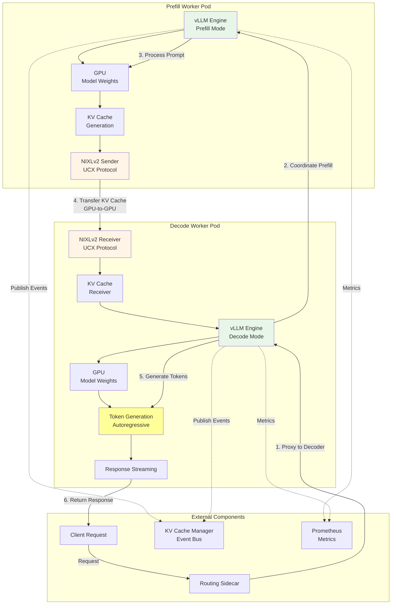
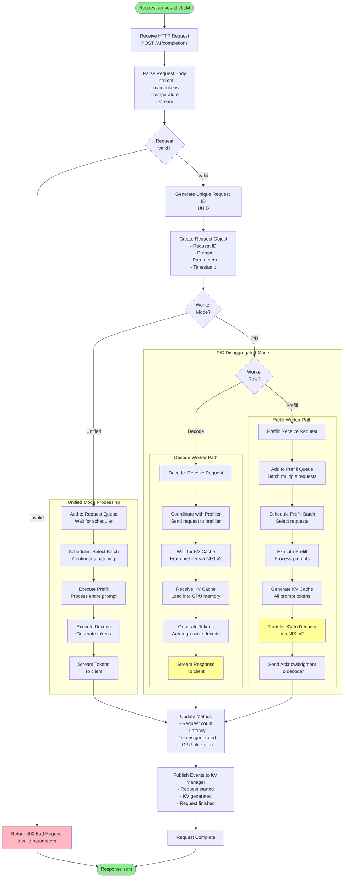

# llm-d (Main Repository) - Complete Flow Documentation

**Repository**: [llm-d/llm-d](https://github.com/llm-d/llm-d)

**Purpose**: vLLM-based inference engine with disaggregated prefill/decode support

**Language**: Python (vLLM), Shell (deployment scripts)

**Key Features**:
- High-performance LLM inference engine (vLLM)
- Disaggregated prefill and decode execution
- NIXLv2 connector for KV cache transfer
- Multi-node tensor parallelism support
- GPU optimization and memory management
- Continuous batching for high throughput

**Base**: Built on top of vLLM engine

---

## Table of Contents

1. [Architecture Overview](#1-architecture-overview)
2. [Component Breakdown](#2-component-breakdown)
3. [Flowcharts](#3-flowcharts)
   - [3.1 Architecture Overview Diagram](#31-architecture-overview-diagram)
   - [3.2 Startup Flow](#32-startup-flow)
   - [3.3 Request Lifecycle Flow](#33-request-lifecycle-flow)
   - [3.4 Prefill Worker Flow](#34-prefill-worker-flow)
   - [3.5 Decode Worker Flow](#35-decode-worker-flow)
   - [3.6 KV Transfer Flow (NIXLv2)](#36-kv-transfer-flow-nixlv2)
   - [3.7 Multi-Node Tensor Parallelism Flow](#37-multi-node-tensor-parallelism-flow)
4. [Configuration Reference](#4-configuration-reference)
5. [Key Code Paths](#5-key-code-paths)
6. [Integration Points](#6-integration-points)

---

## 1. Architecture Overview

The llm-d main repository provides vLLM-based inference workers that can operate in prefill mode, decode mode, or both. These workers are the core inference engines that process prompts and generate tokens.

### Deployment Modes

1. **Unified Mode**: Single worker handles both prefill and decode (traditional)
2. **Disaggregated Mode**: Separate prefill and decode workers (optimized)
3. **Multi-Node Mode**: Model distributed across multiple nodes via tensor parallelism

### Key Innovations

- **KV Cache Transfer**: NIXLv2 protocol for GPU-to-GPU cache transfer
- **Disaggregated P/D**: Separate optimization for prompt processing vs token generation
- **Tensor Parallelism**: Distribute large models across multiple GPUs/nodes
- **Continuous Batching**: Efficient request batching for high throughput
- **GPU Memory Management**: Optimized memory usage with PagedAttention

---

## 2. Component Breakdown

### vLLM Engine Core
- High-performance LLM inference engine
- PagedAttention for memory efficiency
- Continuous batching for throughput optimization
- GPU kernel optimizations (FlashAttention, etc.)

### KV Connector System
- **NIXLv2 Connector**: Latest, GPU-to-GPU transfer (recommended)
- **NIXL Connector**: Legacy, slower (deprecated)
- **LMCache Connector**: Alternative approach (deprecated)

### Prefill Worker
- Processes input prompts
- Generates KV cache for all tokens
- Transfers KV cache to decode worker
- Optimized for batch processing

### Decode Worker
- Receives KV cache from prefill worker
- Generates output tokens autoregressively
- Streams responses to client
- Optimized for low latency

### Multi-Node Coordinator
- Manages tensor parallelism across nodes
- Synchronizes model shards
- Coordinates computation and communication

---

## 3. Flowcharts

### 3.1 Architecture Overview Diagram

**Purpose**: Shows vLLM worker architecture and P/D disaggregation



**Key Components**:
1. **Prefill Worker**: Processes prompts, generates KV cache
2. **Decode Worker**: Receives KV, generates tokens
3. **NIXLv2 Connector**: High-speed GPU-to-GPU KV transfer
4. **KV Cache Manager**: Tracks cache state across workers
5. **Routing Sidecar**: Coordinates P/D communication

---

### 3.2 Startup Flow

**Purpose**: Shows vLLM worker initialization

**When**: On worker pod startup

**Key Components**: vLLM Engine, Model Loader, GPU Manager

```mermaid
graph TB
    Start([vLLM worker starts])
    ParseArgs[Parse Command-Line Arguments<br/>--model, --port, --kv-transfer-config<br/>--tensor-parallel-size, --enforce-eager]
    
    InitLogging[Initialize Logging<br/>Set VLLM_LOGGING_LEVEL]
    
    DetectMode{KV Transfer<br/>Config?}
    UnifiedMode[Unified Mode<br/>Single worker for P & D]
    PDMode[P/D Disaggregated Mode<br/>Separate prefill & decode]
    
    subgraph "GPU Initialization"
        DetectGPUs[Detect Available GPUs<br/>CUDA device count]
        CheckGPU{GPUs<br/>Available?}
        NoGPUError[Error: No GPUs found<br/>Exit code 1]
        
        SelectGPUs[Select GPUs<br/>Based on --device flag]
        InitCUDA[Initialize CUDA<br/>Set device context]
        AllocateMemory[Allocate GPU Memory<br/>For model and KV cache]
        
        CheckMemory{Enough<br/>Memory?}
        MemoryError[Error: Insufficient GPU memory<br/>Exit code 1]
    end
    
    subgraph "Model Loading"
        DownloadModel[Download Model<br/>From HuggingFace/S3/Local]
        LoadWeights[Load Model Weights<br/>To GPU memory]
        
        CheckTP{Tensor Parallel<br/>Size > 1?}
        
        subgraph "Tensor Parallelism Setup"
            InitTP[Initialize Tensor Parallel<br/>NCCL communicator]
            ShardWeights[Shard Model Weights<br/>Across GPUs/nodes]
            SyncWeights[Synchronize Weights<br/>All workers ready]
        end
        
        CompileModel[Compile Model<br/>or use Eager mode]
    end
    
    subgraph "KV Connector Setup"
        ParseKVConfig[Parse kv-transfer-config<br/>Connector type and role]
        
        ConnectorType{Connector<br/>Type?}
        
        InitNIXLv2[Initialize NIXLv2 Connector<br/>Setup UCX context]
        SetupUCX[Setup UCX Communication<br/>VLLM_NIXL_SIDE_CHANNEL_PORT]
        
        InitLegacy[Initialize Legacy Connector<br/>NIXL or LMCache]
        
        DetermineRole{KV<br/>Role?}
        RolePrefill[Role: Prefill<br/>Send KV only]
        RoleDecode[Role: Decode<br/>Receive KV only]
        RoleBoth[Role: Both<br/>Can send or receive]
    end
    
    subgraph "Server Startup"
        InitHTTP[Initialize HTTP Server<br/>FastAPI/uvicorn]
        RegisterEndpoints[Register API Endpoints<br/>- /v1/completions<br/>- /v1/chat/completions<br/>- /health<br/>- /metrics]
        
        BindPort[Bind to Port<br/>Default 8001]
        PortCheck{Port<br/>Available?}
        PortError[Error: Port in use<br/>Exit code 1]
    end
    
    InitScheduler[Initialize Request Scheduler<br/>Continuous batching]
    StartScheduler[Start Scheduler Loop<br/>Background thread]
    
    PublishReady[Publish Ready Event<br/>To KV Cache Manager]
    
    LogReady[Log: vLLM Ready<br/>- Model loaded<br/>- Port listening<br/>- KV role<br/>- GPU memory allocated]
    
    ServeLoop[Serve Loop<br/>Accept inference requests]
    
    GracefulShutdown[Handle SIGTERM<br/>Graceful shutdown]
    DrainRequests[Drain Active Requests<br/>Wait for completion]
    ReleaseGPU[Release GPU Memory<br/>Cleanup CUDA context]
    
    End([vLLM stopped])
    
    Start --> ParseArgs
    ParseArgs --> InitLogging
    InitLogging --> DetectMode
    
    DetectMode -->|No config| UnifiedMode
    DetectMode -->|Has config| PDMode
    
    UnifiedMode --> DetectGPUs
    PDMode --> DetectGPUs
    
    DetectGPUs --> CheckGPU
    CheckGPU -->|No| NoGPUError
    CheckGPU -->|Yes| SelectGPUs
    NoGPUError --> End
    
    SelectGPUs --> InitCUDA
    InitCUDA --> AllocateMemory
    AllocateMemory --> CheckMemory
    CheckMemory -->|No| MemoryError
    CheckMemory -->|Yes| DownloadModel
    MemoryError --> End
    
    DownloadModel --> LoadWeights
    LoadWeights --> CheckTP
    
    CheckTP -->|Yes| InitTP
    CheckTP -->|No| CompileModel
    
    InitTP --> ShardWeights
    ShardWeights --> SyncWeights
    SyncWeights --> CompileModel
    
    CompileModel --> ParseKVConfig
    
    ParseKVConfig --> ConnectorType
    ConnectorType -->|nixlv2| InitNIXLv2
    ConnectorType -->|nixl/lmcache| InitLegacy
    
    InitNIXLv2 --> SetupUCX
    SetupUCX --> DetermineRole
    
    InitLegacy --> DetermineRole
    
    DetermineRole -->|prefill| RolePrefill
    DetermineRole -->|decode| RoleDecode
    DetermineRole -->|kv_both| RoleBoth
    
    RolePrefill --> InitHTTP
    RoleDecode --> InitHTTP
    RoleBoth --> InitHTTP
    
    InitHTTP --> RegisterEndpoints
    RegisterEndpoints --> BindPort
    BindPort --> PortCheck
    PortCheck -->|Failed| PortError
    PortCheck -->|Success| InitScheduler
    PortError --> End
    
    InitScheduler --> StartScheduler
    StartScheduler --> PublishReady
    PublishReady --> LogReady
    LogReady --> ServeLoop
    
    ServeLoop --> GracefulShutdown
    GracefulShutdown --> DrainRequests
    DrainRequests --> ReleaseGPU
    ReleaseGPU --> End
    
    style Start fill:#90EE90
    style End fill:#FFB6C1
    style LogReady fill:#FFFF99
    style NoGPUError fill:#FFB6C1
    style MemoryError fill:#FFB6C1
    style PortError fill:#FFB6C1
```



**Startup Sequence**:

1. **Parse Arguments**: Read vLLM configuration
2. **Detect Mode**: Unified vs P/D disaggregated
3. **GPU Init**: Detect, select, and initialize GPUs
4. **Memory Allocation**: Reserve GPU memory for model and KV cache
5. **Model Loading**: Download and load model weights to GPU
6. **Tensor Parallelism**: If enabled, shard model across GPUs/nodes
7. **KV Connector**: Initialize NIXLv2 or legacy connector
8. **Determine Role**: Prefill, decode, or both
9. **HTTP Server**: Start API server
10. **Request Scheduler**: Initialize continuous batching scheduler
11. **Publish Ready**: Notify KV cache manager
12. **Serve**: Begin accepting inference requests

**Typical Startup Time**:
- Small models (< 7B): 10-30 seconds
- Medium models (7B-70B): 30-120 seconds
- Large models (> 70B): 120-600 seconds

---

### 3.3 Request Lifecycle Flow

**Purpose**: Complete flow from request arrival to response completion

**When**: Every inference request

**Key Components**: HTTP Server, Scheduler, Engine, GPU



**Performance Metrics**:
- **Unified Mode**: Single-step processing, simpler but less optimized
- **P/D Mode**: Two-step processing, higher throughput, lower latency

---

### 3.4 Prefill Worker Flow

**Purpose**: Detailed flow of prefill worker processing

**When**: Prefill worker receives prompt processing request

**Key Components**: Prefill Engine, KV Generator, NIXLv2 Sender

```mermaid
graph TB
    Start([Prefill request arrives])
    RecvRequest[Receive Request from Decoder<br/>Via HTTP or coordinator]
    
    ExtractPrompt[Extract Prompt<br/>Tokenize input text]
    CheckPromptLen{Prompt Length<br/>within limits?}
    PromptTooLong[Return Error<br/>Prompt exceeds max length]
    
    QueueRequest[Add to Prefill Queue<br/>Wait for batch]
    
    subgraph "Batch Formation"
        BatchTimer[Batch Timer<br/>Wait up to 10ms]
        CheckBatch{Batch size ≥<br/>threshold?}
        TimeoutBatch[Timeout Reached<br/>Process current batch]
        FullBatch[Batch Full<br/>Process immediately]
    end
    
    SelectBatch[Select Batch of Requests<br/>Up to batch_size]
    
    subgraph "Prefill Execution"
        PrepareInputs[Prepare Input Tensors<br/>Pad and concatenate prompts]
        
        AllocateKV[Allocate KV Cache<br/>GPU memory blocks]
        CheckMemory{Enough GPU<br/>memory?}
        WaitMemory[Wait for Memory<br/>Ongoing requests to finish]
        
        ForwardPass[Forward Pass Through Model<br/>Process all prompt tokens]
        
        GenerateKV[Generate KV Cache<br/>Key and Value tensors<br/>For all layers and tokens]
        
        ComputeLogits[Compute Logits<br/>For last token]
        
        StoreKV[Store KV Cache<br/>In GPU memory]
    end
    
    subgraph "KV Cache Metadata"
        CreateMetadata[Create KV Metadata<br/>- Request ID<br/>- Block count<br/>- Block IDs<br/>- Sequence length]
        
        HashPrompt[Hash Prompt<br/>For cache tracking]
        
        PackageKV[Package KV Cache<br/>Metadata + tensors]
    end
    
    subgraph "KV Transfer via NIXLv2"
        GetDecoderEndpoint[Get Decoder Endpoint<br/>From request or coordinator]
        
        EstablishUCX[Establish UCX Connection<br/>To decoder]
        ConnectionCheck{Connection<br/>successful?}
        ConnectionError[Return Error<br/>Cannot reach decoder]
        
        SendMetadata[Send KV Metadata<br/>Block info, sequence length]
        
        TransferBlocks[Transfer KV Blocks<br/>GPU-to-GPU via UCX<br/>Direct memory transfer]
        
        VerifyTransfer[Verify Transfer<br/>Checksum validation]
        TransferCheck{Transfer<br/>successful?}
        RetryTransfer[Retry Transfer<br/>Up to 3 attempts]
        TransferFailed[Return Error<br/>KV transfer failed]
        
        ReceiveAck[Receive Acknowledgment<br/>From decoder]
    end
    
    PublishEvent[Publish Prefill Event<br/>To KV Cache Manager<br/>- Request ID<br/>- Block hashes<br/>- Prompt hash]
    
    UpdateMetrics[Update Metrics<br/>- Prefill latency<br/>- Tokens processed<br/>- KV blocks generated<br/>- Transfer time]
    
    LogCompletion[Log Prefill Complete<br/>Request ID, latency, tokens]
    
    End([Prefill complete, KV transferred])
    
    Start --> RecvRequest
    RecvRequest --> ExtractPrompt
    ExtractPrompt --> CheckPromptLen
    CheckPromptLen -->|Too long| PromptTooLong
    CheckPromptLen -->|OK| QueueRequest
    PromptTooLong --> End
    
    QueueRequest --> BatchTimer
    BatchTimer --> CheckBatch
    CheckBatch -->|No| TimeoutBatch
    CheckBatch -->|Yes| FullBatch
    TimeoutBatch --> SelectBatch
    FullBatch --> SelectBatch
    
    SelectBatch --> PrepareInputs
    PrepareInputs --> AllocateKV
    AllocateKV --> CheckMemory
    CheckMemory -->|No| WaitMemory
    CheckMemory -->|Yes| ForwardPass
    WaitMemory --> CheckMemory
    
    ForwardPass --> GenerateKV
    GenerateKV --> ComputeLogits
    ComputeLogits --> StoreKV
    
    StoreKV --> CreateMetadata
    CreateMetadata --> HashPrompt
    HashPrompt --> PackageKV
    
    PackageKV --> GetDecoderEndpoint
    GetDecoderEndpoint --> EstablishUCX
    EstablishUCX --> ConnectionCheck
    ConnectionCheck -->|Failed| ConnectionError
    ConnectionCheck -->|Success| SendMetadata
    ConnectionError --> End
    
    SendMetadata --> TransferBlocks
    TransferBlocks --> VerifyTransfer
    VerifyTransfer --> TransferCheck
    TransferCheck -->|Failed| RetryTransfer
    TransferCheck -->|Success| ReceiveAck
    RetryTransfer --> TransferBlocks
    
    ReceiveAck --> PublishEvent
    PublishEvent --> UpdateMetrics
    UpdateMetrics --> LogCompletion
    LogCompletion --> End
    
    style Start fill:#90EE90
    style End fill:#90EE90
    style TransferBlocks fill:#FFFF99
    style PublishEvent fill:#FFFF99
    style PromptTooLong fill:#FFB6C1
    style ConnectionError fill:#FFB6C1
    style TransferFailed fill:#FFB6C1
```



**Key Operations**:

1. **Batch Formation**: Wait up to 10ms to form batch of requests
2. **Forward Pass**: Process entire prompt through model
3. **KV Generation**: Create key/value tensors for all layers
4. **KV Transfer**: Send KV cache to decoder via NIXLv2 (GPU-to-GPU)
5. **Event Publishing**: Notify KV cache manager for routing optimization

**Performance**:
- **Batch Size**: 1-32 requests (configurable)
- **Prefill Time**: 50-500ms depending on prompt length
- **Transfer Time**: 10-50ms via NIXLv2 (GPU-to-GPU)

---

### 3.5 Decode Worker Flow

**Purpose**: Detailed flow of decode worker token generation

**When**: Decode worker generates response tokens

**Key Components**: Decode Engine, Token Generator, Response Streamer

```mermaid
graph TB
    Start([Decode request arrives])
    RecvRequest[Receive Request<br/>From sidecar proxy]
    
    ExtractHeaders[Extract Headers<br/>x-prefiller-host-port<br/>Request ID]
    
    CheckPrefiller{Prefiller<br/>specified?}
    
    subgraph "Coordinate Prefill"
        SendToPrefiller[Send Request to Prefiller<br/>Via coordinator]
        
        WaitKVNotification[Wait for KV Notification<br/>Prefiller starting transfer]
        
        PrepareKVReceive[Prepare to Receive KV<br/>Allocate GPU memory]
        
        ReceiveKVMeta[Receive KV Metadata<br/>Block count, sequence length]
        
        ReceiveKVBlocks[Receive KV Blocks<br/>Via NIXLv2 UCX<br/>GPU-to-GPU transfer]
        
        VerifyKV[Verify KV Cache<br/>Checksum validation]
        KVCheck{KV valid?}
        KVError[Return Error<br/>KV verification failed]
        
        LoadKV[Load KV into Engine<br/>Attention mechanism ready]
        
        SendAckToPrefiller[Send Acknowledgment<br/>KV received successfully]
    end
    
    subgraph "Token Generation Loop"
        InitGeneration[Initialize Generation<br/>Start position = prompt length]
        
        LoopStart[Generation Loop Iteration]
        
        PrepareContext[Prepare Context<br/>KV cache + last token]
        
        ForwardPass[Forward Pass<br/>Single token prediction]
        
        ComputeLogits[Compute Logits<br/>Next token probabilities]
        
        ApplySampling[Apply Sampling Strategy<br/>- Temperature<br/>- Top-p<br/>- Top-k]
        
        SelectToken[Select Next Token<br/>Based on probabilities]
        
        CheckStop{Stop<br/>condition?}
        
        EOS[End-of-Sequence<br/>token generated]
        MaxTokens[Max tokens<br/>reached]
        
        UpdateKV[Update KV Cache<br/>Add new token's KV]
        
        StreamToken[Stream Token to Client<br/>Server-Sent Events]
        
        IncrementPos[Increment Position<br/>pos += 1]
    end
    
    FinalizeResponse[Finalize Response<br/>Build completion object]
    
    PublishEvent[Publish Decode Event<br/>To KV Cache Manager<br/>- Request complete<br/>- Tokens generated]
    
    UpdateMetrics[Update Metrics<br/>- Decode latency<br/>- Tokens per second<br/>- Time to first token<br/>- Total tokens]
    
    LogCompletion[Log Decode Complete<br/>Request ID, tokens, latency]
    
    End([Response complete])
    
    Start --> RecvRequest
    RecvRequest --> ExtractHeaders
    ExtractHeaders --> CheckPrefiller
    
    CheckPrefiller -->|Yes| SendToPrefiller
    CheckPrefiller -->|No| InitGeneration
    
    SendToPrefiller --> WaitKVNotification
    WaitKVNotification --> PrepareKVReceive
    PrepareKVReceive --> ReceiveKVMeta
    ReceiveKVMeta --> ReceiveKVBlocks
    ReceiveKVBlocks --> VerifyKV
    VerifyKV --> KVCheck
    KVCheck -->|Failed| KVError
    KVCheck -->|Success| LoadKV
    KVError --> End
    LoadKV --> SendAckToPrefiller
    SendAckToPrefiller --> InitGeneration
    
    InitGeneration --> LoopStart
    LoopStart --> PrepareContext
    PrepareContext --> ForwardPass
    ForwardPass --> ComputeLogits
    ComputeLogits --> ApplySampling
    ApplySampling --> SelectToken
    SelectToken --> CheckStop
    
    CheckStop -->|EOS| EOS
    CheckStop -->|Max tokens| MaxTokens
    CheckStop -->|Continue| UpdateKV
    
    EOS --> FinalizeResponse
    MaxTokens --> FinalizeResponse
    
    UpdateKV --> StreamToken
    StreamToken --> IncrementPos
    IncrementPos --> LoopStart
    
    FinalizeResponse --> PublishEvent
    PublishEvent --> UpdateMetrics
    UpdateMetrics --> LogCompletion
    LogCompletion --> End
    
    style Start fill:#90EE90
    style End fill:#90EE90
    style StreamToken fill:#FFFF99
    style ReceiveKVBlocks fill:#FFFF99
    style KVError fill:#FFB6C1
```



**Token Generation Details**:

1. **Coordinate Prefill**: Request prefiller to process prompt
2. **Receive KV**: Get KV cache via NIXLv2 (GPU-to-GPU)
3. **Load KV**: Load cache into attention mechanism
4. **Generate Loop**: 
   - Forward pass with KV cache
   - Compute next token logits
   - Apply sampling (temperature, top-p)
   - Select token
   - Stream to client
   - Update KV cache
   - Repeat until EOS or max tokens

**Performance Metrics**:
- **Time to First Token (TTFT)**: 100-300ms (with P/D) vs 200-600ms (unified)
- **Tokens Per Second**: 20-100 tokens/sec depending on model size
- **Decode Latency**: 10-50ms per token

---

### 3.6 KV Transfer Flow (NIXLv2)

**Purpose**: Detailed KV cache transfer protocol

**When**: Prefiller transfers KV cache to decoder

**Key Components**: NIXLv2 Connector, UCX Protocol, GPU Memory

```mermaid
graph TB
    Start([KV transfer initiated])
    
    subgraph "Prefiller Side"
        PrefillComplete[Prefill Complete<br/>KV cache generated]
        
        PrepareTransfer[Prepare Transfer<br/>- Serialize metadata<br/>- Get GPU pointers]
        
        GetDecoderAddr[Get Decoder Address<br/>From request header]
        
        subgraph "UCX Connection Setup"
            CheckConnection{UCX connection<br/>exists?}
            ReuseConnection[Reuse Existing Connection]
            CreateConnection[Create New UCX Connection]
            
            UCXHandshake[UCX Handshake<br/>Exchange endpoints]
            HandshakeCheck{Handshake<br/>successful?}
            HandshakeError[Return Error<br/>Cannot connect]
        end
        
        SendNotification[Send Transfer Notification<br/>Side channel message<br/>Port: VLLM_NIXL_SIDE_CHANNEL_PORT]
        
        WaitReady[Wait for Decoder Ready<br/>Ack on side channel]
        
        subgraph "Metadata Transfer"
            SendMetadata[Send KV Metadata<br/>- Request ID<br/>- Block count<br/>- Block sizes<br/>- Sequence length<br/>- Layer count]
            
            MetadataSize[Metadata Size<br/>~1-10 KB]
        end
        
        subgraph "Block Transfer"
            IterateBlocks[For each KV block]
            
            GetBlockPtr[Get GPU Block Pointer<br/>Device memory address]
            
            InitUCXPut[Initiate UCX Put<br/>GPU-to-GPU RDMA]
            
            TransferBlock[Transfer Block Data<br/>Direct GPU memory copy<br/>No CPU involvement]
            
            BlockSize[Block Size<br/>Typical: 512KB - 2MB per block]
            
            ComputeChecksum[Compute Block Checksum<br/>On GPU]
            
            SendChecksum[Send Checksum<br/>For verification]
        end
        
        AllBlocksSent[All Blocks Transferred]
        
        WaitVerification[Wait for Verification<br/>Decoder checks data]
        
        RecvAck[Receive Final Acknowledgment<br/>Transfer successful]
        
        CleanupSender[Cleanup<br/>Release resources]
    end
    
    subgraph "Decoder Side"
        RecvNotification[Receive Transfer Notification<br/>Side channel]
        
        AllocateKVMemory[Allocate GPU Memory<br/>For incoming KV blocks]
        MemoryCheck{Memory<br/>available?}
        OutOfMemory[Return Error<br/>Insufficient GPU memory]
        
        SendReadySignal[Send Ready Signal<br/>To prefiller]
        
        RecvMetadata[Receive KV Metadata<br/>Parse block info]
        
        PrepareRecvBuffers[Prepare Receive Buffers<br/>GPU memory pointers]
        
        ReceiveLoop[For each expected block]
        
        RecvBlock[Receive Block via UCX<br/>GPU-to-GPU]
        
        VerifyChecksum[Verify Block Checksum<br/>On GPU]
        ChecksumValid{Checksum<br/>matches?}
        ChecksumError[Request Retransmit<br/>Block corrupted]
        
        StoreBlock[Store Block<br/>In KV cache structure]
        
        AllBlocksRecv[All Blocks Received]
        
        FinalVerify[Final Verification<br/>All blocks present and valid]
        FinalCheck{All blocks<br/>valid?}
        VerifyError[Return Error<br/>Incomplete transfer]
        
        SendFinalAck[Send Final Acknowledgment<br/>Transfer complete]
        
        LoadIntoEngine[Load KV into Engine<br/>Ready for decode]
        
        CleanupReceiver[Cleanup<br/>Release temp resources]
    end
    
    End([KV transfer complete])
    
    Start --> PrefillComplete
    PrefillComplete --> PrepareTransfer
    PrepareTransfer --> GetDecoderAddr
    GetDecoderAddr --> CheckConnection
    
    CheckConnection -->|Exists| ReuseConnection
    CheckConnection -->|New| CreateConnection
    
    ReuseConnection --> SendNotification
    CreateConnection --> UCXHandshake
    UCXHandshake --> HandshakeCheck
    HandshakeCheck -->|Failed| HandshakeError
    HandshakeCheck -->|Success| SendNotification
    HandshakeError --> End
    
    SendNotification --> RecvNotification
    
    RecvNotification --> AllocateKVMemory
    AllocateKVMemory --> MemoryCheck
    MemoryCheck -->|No| OutOfMemory
    MemoryCheck -->|Yes| SendReadySignal
    OutOfMemory --> End
    
    SendReadySignal --> WaitReady
    WaitReady --> SendMetadata
    
    SendMetadata --> RecvMetadata
    RecvMetadata --> PrepareRecvBuffers
    PrepareRecvBuffers --> IterateBlocks
    
    IterateBlocks --> GetBlockPtr
    GetBlockPtr --> InitUCXPut
    InitUCXPut --> TransferBlock
    TransferBlock --> ComputeChecksum
    ComputeChecksum --> SendChecksum
    SendChecksum --> ReceiveLoop
    
    ReceiveLoop --> RecvBlock
    RecvBlock --> VerifyChecksum
    VerifyChecksum --> ChecksumValid
    ChecksumValid -->|No| ChecksumError
    ChecksumValid -->|Yes| StoreBlock
    ChecksumError --> RecvBlock
    
    StoreBlock --> AllBlocksRecv
    AllBlocksRecv --> AllBlocksSent
    
    AllBlocksSent --> WaitVerification
    
    AllBlocksRecv --> FinalVerify
    FinalVerify --> FinalCheck
    FinalCheck -->|Failed| VerifyError
    FinalCheck -->|Success| SendFinalAck
    VerifyError --> End
    
    SendFinalAck --> RecvAck
    RecvAck --> LoadIntoEngine
    LoadIntoEngine --> CleanupSender
    CleanupSender --> CleanupReceiver
    CleanupReceiver --> End
    
    style Start fill:#90EE90
    style End fill:#90EE90
    style TransferBlock fill:#FFFF99
    style RecvBlock fill:#FFFF99
    style HandshakeError fill:#FFB6C1
    style OutOfMemory fill:#FFB6C1
    style ChecksumError fill:#FFA500
    style VerifyError fill:#FFB6C1
```



**NIXLv2 Protocol Details**:

1. **Side Channel**: TCP socket for metadata and control messages
2. **UCX Data Channel**: GPU-to-GPU RDMA for KV blocks
3. **Zero-Copy**: Direct GPU memory transfer, no CPU copying
4. **Checksum**: Per-block validation for integrity
5. **Retry**: Automatic retransmission on corruption

**Performance**:
- **Transfer Speed**: 10-100 GB/s (depending on GPU interconnect)
- **Typical Latency**: 10-50ms for full KV cache
- **Overhead**: < 5% compared to unified mode

**UCX Configuration**:
```bash
# Environment variables for UCX
UCX_TLS="cuda_ipc,cuda_copy,tcp"  # Transports
VLLM_NIXL_SIDE_CHANNEL_PORT=5555  # Control port
VLLM_NIXL_SIDE_CHANNEL_HOST=localhost
```

---

### 3.7 Multi-Node Tensor Parallelism Flow

**Purpose**: Shows how model is distributed across multiple nodes

**When**: Model too large for single node, requires multi-GPU/node

**Key Components**: Tensor Parallel Manager, NCCL, Model Shards

```mermaid
graph TB
    Start([Multi-node deployment])
    
    subgraph "Initialization Phase"
        DetectNodes[Detect Nodes<br/>--tensor-parallel-size N]
        
        AssignRanks[Assign Ranks to Workers<br/>Rank 0, 1, ..., N-1]
        
        InitNCCL[Initialize NCCL<br/>Collective communication]
        
        ExchangeEndpoints[Exchange Endpoints<br/>All-to-all handshake]
        
        TestComm[Test Communication<br/>All-reduce ping]
        CommCheck{Communication<br/>working?}
        CommError[Error: NCCL setup failed<br/>Check network]
    end
    
    subgraph "Model Sharding"
        LoadFullModel[Rank 0: Load Full Model<br/>From HuggingFace/storage]
        
        ShardWeights[Shard Model Weights<br/>Split across tensor dimension]
        
        subgraph "Example: Llama-70B"
            Layer1[Layer 1<br/>Shard to Node 0-3]
            Layer2[Layer 2<br/>Shard to Node 0-3]
            LayerN[Layer N<br/>Shard to Node 0-3]
        end
        
        DistributeShards[Distribute Shards<br/>Via NCCL Broadcast]
        
        EachNodeRecv[Each Node: Receive Shard<br/>Load to GPU memory]
        
        SyncBarrier[Synchronization Barrier<br/>All nodes ready]
    end
    
    subgraph "Inference Execution"
        RequestArrives[Request Arrives<br/>To any node]
        
        BroadcastInput[Broadcast Input<br/>To all nodes]
        
        LayerLoop[For each layer]
        
        LocalCompute[Each Node: Compute Local Shard<br/>Matrix multiplication]
        
        subgraph "Communication Patterns"
            AllReduce[All-Reduce Operation<br/>Sum results across nodes]
            
            AllGather[All-Gather Operation<br/>Collect results]
            
            ReduceScatter[Reduce-Scatter<br/>Distribute partial results]
        end
        
        CombineResults[Combine Results<br/>Complete layer output]
        
        NextLayer[Move to Next Layer]
        
        CheckLastLayer{Last<br/>layer?}
        
        FinalOutput[Final Output<br/>Logits for next token]
    end
    
    subgraph "Token Generation"
        SelectToken[Select Token<br/>On rank 0]
        
        BroadcastToken[Broadcast Token<br/>To all nodes]
        
        UpdateKV[Each Node: Update Local KV<br/>For new token]
        
        CheckGenComplete{Generation<br/>complete?}
        
        LoopGeneration[Generate Next Token]
    end
    
    Complete[Request Complete]
    
    End([Multi-node inference done])
    
    Start --> DetectNodes
    DetectNodes --> AssignRanks
    AssignRanks --> InitNCCL
    InitNCCL --> ExchangeEndpoints
    ExchangeEndpoints --> TestComm
    TestComm --> CommCheck
    CommCheck -->|Failed| CommError
    CommCheck -->|Success| LoadFullModel
    CommError --> End
    
    LoadFullModel --> ShardWeights
    ShardWeights --> Layer1
    ShardWeights --> Layer2
    ShardWeights --> LayerN
    
    Layer1 --> DistributeShards
    Layer2 --> DistributeShards
    LayerN --> DistributeShards
    
    DistributeShards --> EachNodeRecv
    EachNodeRecv --> SyncBarrier
    SyncBarrier --> RequestArrives
    
    RequestArrives --> BroadcastInput
    BroadcastInput --> LayerLoop
    LayerLoop --> LocalCompute
    LocalCompute --> AllReduce
    AllReduce --> AllGather
    AllGather --> ReduceScatter
    ReduceScatter --> CombineResults
    CombineResults --> CheckLastLayer
    CheckLastLayer -->|No| NextLayer
    CheckLastLayer -->|Yes| FinalOutput
    NextLayer --> LayerLoop
    
    FinalOutput --> SelectToken
    SelectToken --> BroadcastToken
    BroadcastToken --> UpdateKV
    UpdateKV --> CheckGenComplete
    CheckGenComplete -->|No| LoopGeneration
    CheckGenComplete -->|Yes| Complete
    LoopGeneration --> LayerLoop
    
    Complete --> End
    
    style Start fill:#90EE90
    style End fill:#90EE90
    style LocalCompute fill:#FFFF99
    style AllReduce fill:#FFFF99
    style CommError fill:#FFB6C1
```



**Multi-Node Configuration**:

```bash
# Worker 0 (Rank 0)
vllm serve model-name \
  --tensor-parallel-size=4 \
  --distributed-executor-backend=ray

# Worker 1 (Rank 1)
# Same command, Ray handles coordination

# Worker 2 (Rank 2)
# Same command

# Worker 3 (Rank 3)
# Same command
```

**Communication Overhead**:
- **All-Reduce**: Most expensive, but required for correctness
- **Bandwidth**: Requires high-speed interconnect (NVLink, InfiniBand)
- **Latency Added**: 10-30% overhead compared to single-node

**Supported Models**:
- Llama-70B: 4 GPUs minimum
- Llama-405B: 16 GPUs minimum
- GPT-4 scale: 64+ GPUs

---

## 4. Configuration Reference

### vLLM Command-Line Arguments

```bash
vllm serve <model-name> \
  --port 8001 \                              # HTTP server port
  --host 0.0.0.0 \                           # Bind address
  --model <model-name> \                     # Model name or path
  --tensor-parallel-size 1 \                 # Number of GPUs for tensor parallelism
  --enforce-eager \                          # Disable CUDA graphs (for P/D mode)
  --max-model-len 2048 \                     # Max sequence length
  --max-num-seqs 256 \                       # Max concurrent sequences
  --gpu-memory-utilization 0.9 \             # GPU memory fraction to use
  --kv-transfer-config '{"kv_connector":"NixlConnector","kv_role":"kv_both"}' \  # P/D config
  --trust-remote-code \                      # Allow custom model code
  --dtype auto                               # Data type (auto, float16, bfloat16)
```

### KV Transfer Configuration

```json
{
  "kv_connector": "NixlConnector",  // NIXLv2 connector
  "kv_role": "kv_both"               // prefill, decode, or kv_both
}
```

### Environment Variables

```bash
# UCX Configuration for NIXLv2
export UCX_TLS="cuda_ipc,cuda_copy,tcp"
export VLLM_NIXL_SIDE_CHANNEL_PORT=5555
export VLLM_NIXL_SIDE_CHANNEL_HOST=localhost

# Logging
export VLLM_LOGGING_LEVEL=INFO  # DEBUG, INFO, WARNING, ERROR

# Model Cache
export HF_HOME=/models  # HuggingFace cache directory
```

### Kubernetes Deployment

```yaml
apiVersion: v1
kind: Pod
metadata:
  name: vllm-worker
spec:
  containers:
    - name: vllm
      image: ghcr.io/llm-d/llm-d:latest
      command:
        - vllm
        - serve
        - Qwen/Qwen3-0.6B
        - --port=8001
        - --enforce-eager
        - --kv-transfer-config={"kv_connector":"NixlConnector","kv_role":"kv_both"}
      env:
        - name: UCX_TLS
          value: "cuda_ipc,cuda_copy,tcp"
        - name: VLLM_NIXL_SIDE_CHANNEL_PORT
          value: "5555"
        - name: HF_HOME
          value: "/models"
      resources:
        limits:
          nvidia.com/gpu: "1"
      volumeMounts:
        - name: model-cache
          mountPath: /models
  volumes:
    - name: model-cache
      emptyDir: {}
```

---

## 5. Key Code Paths

### Main Entry Point
- **File**: `vllm/entrypoints/openai/api_server.py`
- **Function**: `run_server(args)`
- **Purpose**: Starts vLLM HTTP server

### Engine Initialization
- **File**: `vllm/engine/llm_engine.py`
- **Class**: `LLMEngine`
- **Method**: `__init__()` , `from_engine_args()`
- **Purpose**: Initializes vLLM engine with model and config

### Request Processing
- **File**: `vllm/engine/llm_engine.py`
- **Method**: `add_request()`, `step()`
- **Purpose**: Adds requests to queue and executes scheduler step

### KV Connector (NIXLv2)
- **File**: `vllm/distributed/kv_transfer/nixl_connector.py`
- **Class**: `NixlConnector`
- **Methods**: `send_kv_cache()`, `receive_kv_cache()`
- **Purpose**: Handles KV cache transfer

### Tensor Parallelism
- **File**: `vllm/model_executor/parallel_utils/parallel_state.py`
- **Functions**: `initialize_model_parallel()`, `get_tensor_model_parallel_world_size()`
- **Purpose**: Manages multi-GPU/node parallelism

### Scheduler
- **File**: `vllm/core/scheduler.py`
- **Class**: `Scheduler`
- **Method**: `schedule()`
- **Purpose**: Continuous batching and request scheduling

---

## 6. Integration Points

### With Routing Sidecar
- **Protocol**: HTTP
- **Endpoints**: `/v1/completions`, `/v1/chat/completions`
- **Headers**: Sidecar adds prefiller coordination headers
- **Flow**: Sidecar → Decoder → Prefiller (via coordinator)

### With EPP Scheduler
- **Interaction**: EPP selects which decoder pod receives request
- **No Direct Communication**: EPP talks to Envoy, which routes to decoder

### With KV Cache Manager
- **Protocol**: ZMQ (event streaming)
- **Events Published**:
  - Request started
  - Prefill complete (with KV block hashes)
  - Request finished
- **Purpose**: Track cache state for routing decisions

### With NIXLv2 Connector
- **Protocol**: UCX (GPU-to-GPU RDMA)
- **Ports**: Side channel (TCP), data channel (UCX)
- **Purpose**: High-speed KV cache transfer

### With Prometheus
- **Protocol**: HTTP (metrics endpoint)
- **Endpoint**: `/metrics`
- **Metrics**:
  - `vllm_num_requests_running`: Current active requests
  - `vllm_num_requests_waiting`: Queued requests
  - `vllm_gpu_cache_usage_perc`: GPU cache utilization
  - `vllm_time_to_first_token_seconds`: TTFT latency
  - `vllm_time_per_output_token_seconds`: Generation speed
  - `vllm_request_duration_seconds`: End-to-end latency

---

## Related Documentation

- [← Back to Main README](./README.md)
- [Next: KV Cache Manager →](./llm-d-kv-cache-manager-flows.md)
- [Routing Sidecar ←](./llm-d-routing-sidecar-flows.md)
- [Inference Scheduler (EPP) ←](./llm-d-inference-scheduler-flows.md)

---

**Last Updated**: October 28, 2025  
**Version**: 1.0


