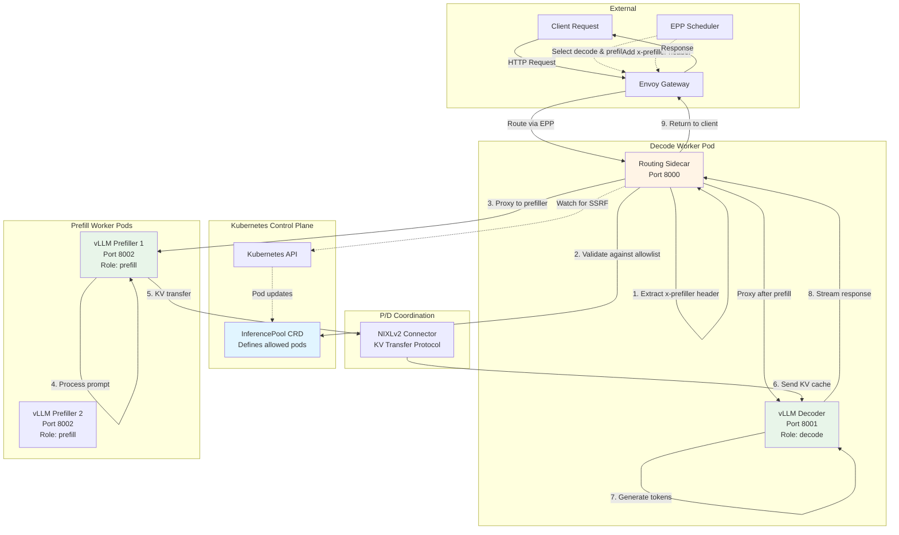
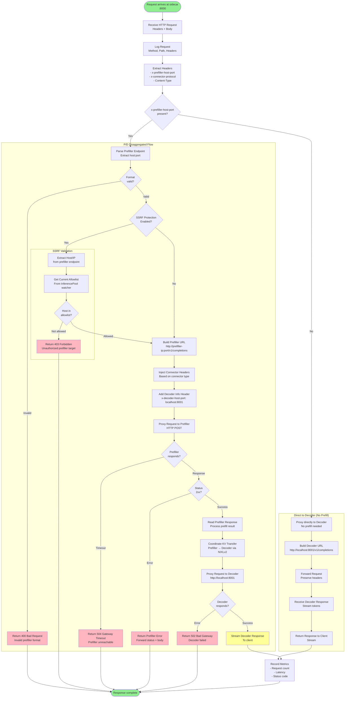
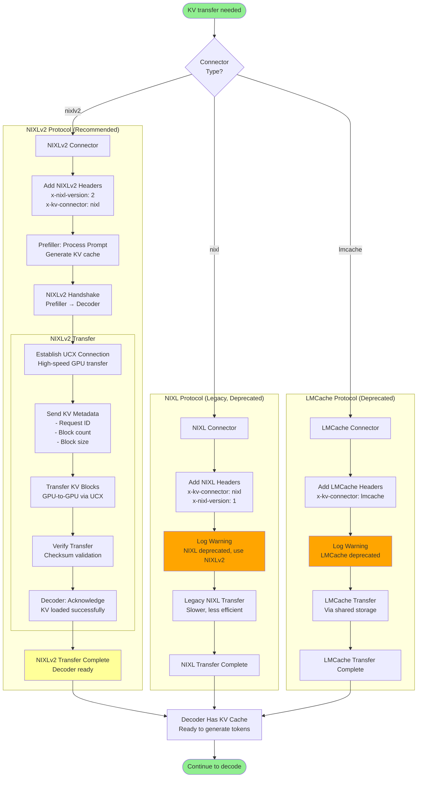

# llm-d-routing-sidecar - Complete Flow Documentation

**Repository**: [llm-d/llm-d-routing-sidecar](https://github.com/llm-d/llm-d-routing-sidecar)

**Purpose**: Reverse proxy for disaggregated prefill/decode (P/D) inference with SSRF protection

**Language**: Go

**Key Features**:
- Request proxying from decoder to prefiller
- SSRF protection via InferencePool allowlisting
- Multiple connector protocol support (NIXLv2, NIXL, LMCache)
- TLS support for secure connections
- Automatic prefiller discovery
- Health checking and failover

**Note**: This component runs as a sidecar container in decode worker pods

---

## Table of Contents

1. [Architecture Overview](#1-architecture-overview)
2. [Component Breakdown](#2-component-breakdown)
3. [Flowcharts](#3-flowcharts)
   - [3.1 Architecture Overview Diagram](#31-architecture-overview-diagram)
   - [3.2 Startup & Initialization Flow](#32-startup--initialization-flow)
   - [3.3 Request Routing Flow](#33-request-routing-flow)
   - [3.4 Connector Protocol Flow](#34-connector-protocol-flow)
   - [3.5 SSRF Protection Flow](#35-ssrf-protection-flow)
   - [3.6 TLS & Security Flow](#36-tls--security-flow)
   - [3.7 Error Handling & Retry Flow](#37-error-handling--retry-flow)
4. [Configuration Reference](#4-configuration-reference)
5. [Key Code Paths](#5-key-code-paths)
6. [Integration Points](#6-integration-points)

---

## 1. Architecture Overview

The llm-d-routing-sidecar is a reverse proxy that enables disaggregated prefill/decode (P/D) inference. It runs as a sidecar container alongside the vLLM decode worker, intercepting inference requests and coordinating with prefill workers for prompt processing.

### Key Responsibilities

1. **Request Proxying**: Receives inference requests destined for decoder
2. **Header Extraction**: Reads `x-prefiller-host-port` header to identify prefiller
3. **Prefill Coordination**: Forwards requests to prefiller for prompt processing
4. **KV Transfer**: Coordinates KV cache transfer between prefiller and decoder
5. **SSRF Protection**: Validates prefiller targets against allowlist
6. **Response Streaming**: Streams decoder's response back to client

### Deployment Model

```
┌─────────────────────────────────────────┐
│  Decode Worker Pod                      │
│  ┌────────────────┐  ┌───────────────┐ │
│  │ Routing Sidecar│  │ vLLM Decoder  │ │
│  │  (Port 8000)   │──│  (Port 8001)  │ │
│  └────────────────┘  └───────────────┘ │
└─────────────────────────────────────────┘
```

---

## 2. Component Breakdown

### Reverse Proxy Core
- HTTP server listening on port 8000 (configurable)
- Forwards requests to local vLLM decoder on port 8001
- Supports HTTP/1.1 and streaming responses

### Prefiller Coordinator
- Extracts prefiller endpoint from request headers
- Validates endpoint against SSRF allowlist
- Proxies request to prefiller if specified
- Handles prefiller responses and errors

### SSRF Protection Engine
- Watches InferencePool CRD for allowed pods
- Maintains dynamic allowlist of valid prefiller IPs
- Validates all prefiller targets before proxying
- Returns 403 Forbidden for unauthorized targets

### Connector Protocol Handler
- Supports multiple KV transfer protocols:
  - **NIXLv2**: Latest protocol (recommended)
  - **NIXL**: Legacy protocol (deprecated)
  - **LMCache**: Alternative protocol (deprecated)
- Injects connector-specific headers
- Handles protocol negotiation

### TLS Manager
- Supports TLS for prefiller and decoder connections
- Certificate loading and validation
- Configurable TLS verification (for testing)

---

## 3. Flowcharts

### 3.1 Architecture Overview Diagram

**Purpose**: Shows sidecar integration with decoder, prefiller, and control plane



**Key Flows**:
1. Request arrives at sidecar (from Envoy)
2. Sidecar extracts `x-prefiller-host-port` header (set by EPP)
3. Sidecar validates prefiller target (SSRF protection)
4. Sidecar proxies request to prefiller
5. Prefiller processes prompt, generates KV cache
6. Prefiller transfers KV cache to decoder (via NIXLv2)
7. Decoder generates tokens using transferred cache
8. Decoder streams response to sidecar
9. Sidecar returns response to client

---

### 3.2 Startup & Initialization Flow

**Purpose**: Shows sidecar startup sequence

**When**: On sidecar container startup

**Key Components**: Main, Config Parser, SSRF Watcher, HTTP Server

```mermaid
graph TB
    Start([Sidecar container starts])
    ParseFlags[Parse Command-Line Flags<br/>-port, -vllm-port, -connector<br/>-enable-ssrf-protection]
    
    InitLogger[Initialize Logger<br/>Set log level]
    
    LoadConfig[Load Configuration<br/>- Proxy port (default 8000)<br/>- Decoder port (default 8001)<br/>- Connector type (nixlv2)]
    
    CheckSSRF{SSRF Protection<br/>Enabled?}
    
    subgraph "SSRF Setup (if enabled)"
        ReadEnv[Read Environment Variables<br/>INFERENCE_POOL_NAMESPACE<br/>INFERENCE_POOL_NAME]
        ValidateEnv{Required env<br/>vars set?}
        EnvError[Log Error: Missing env vars<br/>Exit code 1]
        
        InitK8s[Initialize Kubernetes Client<br/>InClusterConfig]
        K8sError{K8s client<br/>initialized?}
        K8sInitError[Log Error: K8s connection failed<br/>Exit code 1]
        
        CreateInformer[Create InferencePool Informer<br/>Watch namespace for pool]
        AddHandlers[Add Event Handlers<br/>- OnAdd: Update allowlist<br/>- OnUpdate: Update allowlist<br/>- OnDelete: Clear allowlist]
        
        StartInformer[Start Informer<br/>Background goroutine]
        WaitSync[Wait for Cache Sync<br/>Initial pod list]
        SyncTimeout{Sync<br/>successful?}
        SyncError[Log Error: Sync timeout<br/>Exit code 1]
    end
    
    InitProxy[Initialize Reverse Proxy<br/>HTTP handler]
    
    CheckTLS{TLS<br/>Enabled?}
    LoadCerts[Load TLS Certificates<br/>tls.crt, tls.key]
    CertError{Certs<br/>valid?}
    CertLoadError[Use self-signed cert<br/>Log warning]
    
    SetupRoutes[Setup HTTP Routes<br/>- /* → proxyHandler<br/>- /health → healthHandler]
    
    CreateServer[Create HTTP Server<br/>Bind to port]
    BindError{Port<br/>available?}
    PortBindError[Log Error: Port in use<br/>Exit code 1]
    
    LogReady[Log: Sidecar Ready<br/>- Listening on :8000<br/>- Decoder at :8001<br/>- Connector: nixlv2<br/>- SSRF: enabled/disabled]
    
    StartServer[Start HTTP Server<br/>Accept connections]
    
    ServeLoop[Serve Loop<br/>Handle incoming requests]
    
    GracefulShutdown[Handle SIGTERM<br/>Graceful shutdown]
    StopInformer[Stop K8s Informer<br/>if running]
    DrainConnections[Drain Active Connections<br/>Wait up to 30 seconds]
    
    End([Sidecar stopped])
    
    Start --> ParseFlags
    ParseFlags --> InitLogger
    InitLogger --> LoadConfig
    LoadConfig --> CheckSSRF
    
    CheckSSRF -->|Yes| ReadEnv
    CheckSSRF -->|No| InitProxy
    
    ReadEnv --> ValidateEnv
    ValidateEnv -->|Invalid| EnvError
    ValidateEnv -->|Valid| InitK8s
    EnvError --> End
    
    InitK8s --> K8sError
    K8sError -->|Failed| K8sInitError
    K8sError -->|Success| CreateInformer
    K8sInitError --> End
    
    CreateInformer --> AddHandlers
    AddHandlers --> StartInformer
    StartInformer --> WaitSync
    WaitSync --> SyncTimeout
    SyncTimeout -->|Failed| SyncError
    SyncTimeout -->|Success| InitProxy
    SyncError --> End
    
    InitProxy --> CheckTLS
    CheckTLS -->|Yes| LoadCerts
    CheckTLS -->|No| SetupRoutes
    
    LoadCerts --> CertError
    CertError -->|Invalid| CertLoadError
    CertError -->|Valid| SetupRoutes
    CertLoadError --> SetupRoutes
    
    SetupRoutes --> CreateServer
    CreateServer --> BindError
    BindError -->|Failed| PortBindError
    BindError -->|Success| LogReady
    PortBindError --> End
    
    LogReady --> StartServer
    StartServer --> ServeLoop
    ServeLoop --> GracefulShutdown
    GracefulShutdown --> StopInformer
    StopInformer --> DrainConnections
    DrainConnections --> End
    
    style Start fill:#90EE90
    style End fill:#FFB6C1
    style LogReady fill:#FFFF99
    style EnvError fill:#FFB6C1
    style K8sInitError fill:#FFB6C1
    style SyncError fill:#FFB6C1
    style PortBindError fill:#FFB6C1
```

**Step-by-Step Explanation**:

1. **Parse Flags**: Read command-line arguments
2. **Initialize Logger**: Setup structured logging
3. **Load Config**: Set defaults for ports, connector type
4. **Check SSRF**: Determine if SSRF protection is enabled
5. **Read Env Vars**: Get `INFERENCE_POOL_NAMESPACE` and `INFERENCE_POOL_NAME`
6. **Validate Env**: Ensure required variables are set
7. **Init K8s Client**: Connect to Kubernetes API
8. **Create Informer**: Set up InferencePool resource watcher
9. **Add Handlers**: Register event handlers for pod updates
10. **Start Informer**: Begin watching in background
11. **Wait for Sync**: Ensure initial pod list is loaded
12. **Initialize Proxy**: Create reverse proxy handler
13. **Check TLS**: Determine if TLS is enabled
14. **Load Certs**: Read TLS certificates from disk
15. **Setup Routes**: Configure HTTP handlers
16. **Create Server**: Initialize HTTP server
17. **Bind Port**: Attempt to bind to configured port
18. **Log Ready**: Indicate sidecar is operational
19. **Serve Loop**: Begin accepting and handling requests
20. **Graceful Shutdown**: Handle termination signals
21. **Cleanup**: Stop watchers, drain connections

**Typical Startup Time**: 2-5 seconds

---

### 3.3 Request Routing Flow

**Purpose**: Complete flow for routing a request through the sidecar

**When**: On every inference request

**Key Components**: HTTP Handler, Prefiller Coordinator, Proxy



**Step-by-Step Explanation**:

**Direct Decode Path** (No Prefiller):
1. Request arrives without `x-prefiller-host-port` header
2. Proxy directly to local decoder
3. Stream response back to client

**P/D Disaggregated Path**:
1. **Receive Request**: HTTP request arrives at sidecar port 8000
2. **Extract Headers**: Parse `x-prefiller-host-port` header
3. **Parse Prefiller**: Extract prefiller host and port
4. **Validate Format**: Ensure format is `host:port`
5. **Check SSRF**: If enabled, validate prefiller target
6. **Extract Host**: Get host/IP from prefiller endpoint
7. **Check Allowlist**: Verify host is in allowed pod list
8. **Build Prefiller URL**: Construct full prefiller endpoint
9. **Inject Headers**: Add connector-specific headers
10. **Add Decoder Info**: Tell prefiller where to send KV cache
11. **Proxy to Prefiller**: Forward request to prefiller
12. **Wait for Response**: Handle timeout (default 30s)
13. **Check Status**: Verify prefiller returned 2xx
14. **Coordinate KV Transfer**: Prefiller sends KV to decoder
15. **Proxy to Decoder**: Forward request to local decoder
16. **Stream Response**: Return decoder output to client
17. **Record Metrics**: Emit Prometheus metrics

**Headers Flow**:
- **In**: `x-prefiller-host-port: 10.1.2.3:8002`
- **Added**: `x-decoder-host-port: localhost:8001`
- **Out**: Response headers from decoder

---

### 3.4 Connector Protocol Flow

**Purpose**: Shows how different KV transfer protocols are handled

**When**: During P/D request coordination

**Key Components**: Connector Handler, NIXLv2 Protocol



**Protocol Comparison**:

| Protocol | Status | Speed | Use Case |
|----------|--------|-------|----------|
| **NIXLv2** | ✅ Recommended | Fastest (GPU-to-GPU) | Production use |
| **NIXL** | ⚠️ Deprecated | Slower | Legacy compatibility |
| **LMCache** | ⚠️ Deprecated | Slowest (shared storage) | Special cases |

**NIXLv2 Details**:
1. **Handshake**: Prefiller and decoder establish UCX connection
2. **Metadata**: Send KV block metadata (count, size, request ID)
3. **Transfer**: Direct GPU-to-GPU transfer via UCX
4. **Verify**: Checksum validation ensures integrity
5. **Ack**: Decoder confirms KV cache loaded
6. **Performance**: 10-100x faster than CPU-based transfer

**Header Injection**:
```http
x-nixl-version: 2
x-kv-connector: nixl
x-decoder-host-port: localhost:8001
x-prefiller-host-port: 10.1.2.3:8002
```

---

### 3.5 SSRF Protection Flow

**Purpose**: Shows how SSRF protection validates prefiller targets

**When**: SSRF protection is enabled (`-enable-ssrf-protection=true`)

**Key Components**: InferencePool Watcher, Allowlist Manager

```mermaid
graph TB
    Start([SSRF Protection Enabled])
    
    subgraph "Initialization"
        ReadConfig[Read Configuration<br/>INFERENCE_POOL_NAMESPACE<br/>INFERENCE_POOL_NAME]
        InitWatcher[Initialize InferencePool Watcher<br/>K8s Informer]
        RegisterHandlers[Register Event Handlers<br/>OnAdd, OnUpdate, OnDelete]
        StartWatch[Start Watching InferencePool]
        WaitSync[Wait for Initial Sync<br/>Load all pods]
    end
    
    subgraph "Background Pod Updates"
        PodEvent[Pod Event Detected<br/>Add, Update, or Delete]
        EventType{Event<br/>Type?}
        
        OnAdd[OnAdd Handler<br/>New pod created]
        ExtractIP[Extract Pod IP<br/>Status.PodIP]
        CheckSelector{Pod matches<br/>InferencePool selector?}
        AddToAllowlist[Add IP to Allowlist<br/>Thread-safe update]
        LogAdd[Log: IP added to allowlist]
        
        OnUpdate[OnUpdate Handler<br/>Pod modified]
        CheckPodChange{IP or labels<br/>changed?}
        UpdateAllowlist[Update Allowlist<br/>Add or remove as needed]
        LogUpdate[Log: Allowlist updated]
        
        OnDelete[OnDelete Handler<br/>Pod deleted]
        RemoveFromAllowlist[Remove IP from Allowlist<br/>Thread-safe update]
        LogDelete[Log: IP removed from allowlist]
    end
    
    subgraph "Request Validation"
        RequestArrives[Request with Prefiller Header<br/>x-prefiller-host-port]
        ParseEndpoint[Parse Endpoint<br/>Extract host/IP]
        
        NormalizeHost[Normalize Host<br/>Resolve DNS if needed]
        
        GetAllowlist[Get Current Allowlist<br/>Read-lock for thread safety]
        
        CheckHost{Host in<br/>allowlist?}
        
        AllowRequest[Allow Request<br/>Continue to proxy]
        DenyRequest[Deny Request<br/>Return 403 Forbidden]
        
        LogDeny[Log: SSRF blocked<br/>Host: <ip><br/>Allowlist: [...]
        
        EmitMetric[Emit Metric<br/>ssrf_blocked_total++]
    end
    
    Start --> ReadConfig
    ReadConfig --> InitWatcher
    InitWatcher --> RegisterHandlers
    RegisterHandlers --> StartWatch
    StartWatch --> WaitSync
    
    WaitSync --> PodEvent
    PodEvent --> EventType
    
    EventType -->|Add| OnAdd
    EventType -->|Update| OnUpdate
    EventType -->|Delete| OnDelete
    
    OnAdd --> ExtractIP
    ExtractIP --> CheckSelector
    CheckSelector -->|Yes| AddToAllowlist
    CheckSelector -->|No| PodEvent
    AddToAllowlist --> LogAdd
    LogAdd --> PodEvent
    
    OnUpdate --> CheckPodChange
    CheckPodChange -->|Yes| UpdateAllowlist
    CheckPodChange -->|No| PodEvent
    UpdateAllowlist --> LogUpdate
    LogUpdate --> PodEvent
    
    OnDelete --> RemoveFromAllowlist
    RemoveFromAllowlist --> LogDelete
    LogDelete --> PodEvent
    
    WaitSync --> RequestArrives
    RequestArrives --> ParseEndpoint
    ParseEndpoint --> NormalizeHost
    NormalizeHost --> GetAllowlist
    GetAllowlist --> CheckHost
    
    CheckHost -->|Yes| AllowRequest
    CheckHost -->|No| DenyRequest
    
    DenyRequest --> LogDeny
    LogDeny --> EmitMetric
    EmitMetric -.-> RequestArrives
    
    AllowRequest -.-> RequestArrives
    
    style Start fill:#90EE90
    style AllowRequest fill:#90EE90
    style DenyRequest fill:#FFB6C1
    style CheckHost fill:#FFFF99
```

**Step-by-Step Explanation**:

**Initialization**:
1. **Read Config**: Get InferencePool namespace and name from env vars
2. **Init Watcher**: Create Kubernetes informer for InferencePool CRD
3. **Register Handlers**: Set up callbacks for pod events
4. **Start Watch**: Begin watching for pod changes
5. **Wait Sync**: Load initial list of allowed pods

**Background Updates**:
6. **Pod Event**: Kubernetes notifies of pod change
7. **OnAdd Handler**:
   - Extract pod IP from `Status.PodIP`
   - Check if pod matches InferencePool selector
   - If match, add IP to allowlist
8. **OnUpdate Handler**:
   - Check if pod IP or labels changed
   - Update allowlist accordingly
9. **OnDelete Handler**:
   - Remove pod IP from allowlist
   - Log removal

**Request Validation**:
10. **Request Arrives**: Contains `x-prefiller-host-port` header
11. **Parse Endpoint**: Extract host/IP and port
12. **Normalize Host**: Resolve DNS name to IP if needed
13. **Get Allowlist**: Acquire read lock and get current allowlist
14. **Check Host**: Verify host is in allowlist
15. **Allow/Deny**: 
    - If allowed: Continue to proxy request
    - If denied: Return 403 Forbidden, log, emit metric

**Allowlist Example**:
```
Allowed Prefiller IPs:
- 10.1.2.3 (prefill-worker-1)
- 10.1.2.4 (prefill-worker-2)
- 10.1.2.5 (prefill-worker-3)

Request to 10.1.2.3:8002 → ✅ Allowed
Request to 10.1.2.6:8002 → ❌ Denied (403 Forbidden)
```

**Security Benefit**: Prevents malicious requests from targeting arbitrary endpoints

---

### 3.6 TLS & Security Flow

**Purpose**: Shows TLS certificate handling and secure connections

**When**: TLS is enabled for prefiller or decoder connections

**Key Components**: TLS Manager, Certificate Loader

```mermaid
graph TB
    Start([TLS Configuration])
    
    subgraph "Certificate Setup"
        CheckCertPath{Custom cert<br/>path specified?}
        DefaultPath[Use Default Path<br/>/etc/sidecar/certs/]
        CustomPath[Use Custom Path<br/>from -cert-path flag]
        
        LoadCert[Load Certificate<br/>tls.crt]
        LoadKey[Load Private Key<br/>tls.key]
        
        ValidateCert{Certificate<br/>valid?}
        CertError[Log Error: Invalid cert]
        
        CheckExpiry{Certificate<br/>expired?}
        ExpiryWarn[Log Warning: Cert expired]
        
        UseSelfSigned{Use self-signed<br/>for testing?}
        GenerateSelfSigned[Generate Self-Signed Cert<br/>For testing only]
        LogSelfSigned[Log Warning: Using self-signed cert<br/>Not for production]
        
        StoreCert[Store Certificate<br/>In TLS config]
    end
    
    subgraph "Prefiller Connection"
        CheckPrefillerTLS{Prefiller TLS<br/>Enabled?}
        
        BuildPrefillerConn[Build Prefiller Connection<br/>https:// protocol]
        
        ConfigPrefillerTLS[Configure TLS for Prefiller<br/>- Cert verification<br/>- Hostname check]
        
        CheckSkipVerify{Skip TLS<br/>verification?}
        SkipVerifyWarn[Log Warning: TLS verification disabled<br/>Insecure]
        EnableVerify[Enable TLS Verification<br/>Validate cert chain]
        
        ConnectPrefiller[Connect to Prefiller<br/>TLS handshake]
        
        TLSHandshake{Handshake<br/>successful?}
        HandshakeError[Return Error<br/>TLS handshake failed]
        
        SecurePrefiller[Secure Prefiller Connection<br/>Encrypted channel]
    end
    
    subgraph "Decoder Connection"
        CheckDecoderTLS{Decoder TLS<br/>Enabled?}
        
        BuildDecoderConn[Build Decoder Connection<br/>http:// or https://]
        
        LocalConnection[Local Connection<br/>localhost:8001]
        
        UsePlaintext[Use Plaintext HTTP<br/>Local is trusted]
        
        SecureDecoder[Decoder Connection Ready]
    end
    
    End([Connections established])
    
    Start --> CheckCertPath
    CheckCertPath -->|No| DefaultPath
    CheckCertPath -->|Yes| CustomPath
    
    DefaultPath --> LoadCert
    CustomPath --> LoadCert
    LoadCert --> LoadKey
    LoadKey --> ValidateCert
    
    ValidateCert -->|Invalid| CertError
    ValidateCert -->|Valid| CheckExpiry
    CertError --> UseSelfSigned
    
    CheckExpiry -->|Expired| ExpiryWarn
    CheckExpiry -->|Valid| StoreCert
    ExpiryWarn --> UseSelfSigned
    
    UseSelfSigned -->|Yes| GenerateSelfSigned
    UseSelfSigned -->|No| End
    GenerateSelfSigned --> LogSelfSigned
    LogSelfSigned --> StoreCert
    
    StoreCert --> CheckPrefillerTLS
    
    CheckPrefillerTLS -->|Yes| BuildPrefillerConn
    CheckPrefillerTLS -->|No| CheckDecoderTLS
    
    BuildPrefillerConn --> ConfigPrefillerTLS
    ConfigPrefillerTLS --> CheckSkipVerify
    
    CheckSkipVerify -->|Yes| SkipVerifyWarn
    CheckSkipVerify -->|No| EnableVerify
    SkipVerifyWarn --> ConnectPrefiller
    EnableVerify --> ConnectPrefiller
    
    ConnectPrefiller --> TLSHandshake
    TLSHandshake -->|Failed| HandshakeError
    TLSHandshake -->|Success| SecurePrefiller
    HandshakeError --> End
    
    SecurePrefiller --> CheckDecoderTLS
    
    CheckDecoderTLS -->|Yes| BuildDecoderConn
    CheckDecoderTLS -->|No| LocalConnection
    
    BuildDecoderConn --> SecureDecoder
    LocalConnection --> UsePlaintext
    UsePlaintext --> SecureDecoder
    
    SecureDecoder --> End
    
    style Start fill:#90EE90
    style End fill:#90EE90
    style SecurePrefiller fill:#FFFF99
    style SecureDecoder fill:#FFFF99
    style CertError fill:#FFB6C1
    style HandshakeError fill:#FFB6C1
    style SkipVerifyWarn fill:#FFA500
    style LogSelfSigned fill:#FFA500
```



**Configuration Flags**:

```bash
# Enable TLS for prefiller connections
-prefiller-use-tls=true

# Skip TLS verification (testing only)
-prefiller-tls-insecure-skip-verify=true

# Enable TLS for decoder connections
-decoder-use-tls=true

# Custom certificate path
-cert-path=/etc/sidecar/certs/
```

**Certificate Files**:
- `tls.crt`: Public certificate
- `tls.key`: Private key

**Security Considerations**:
1. **Production**: Always use valid certificates, enable verification
2. **Testing**: Self-signed certs acceptable, but log warnings
3. **Local Decoder**: TLS optional (localhost is trusted)
4. **Prefiller**: TLS recommended (crosses pod boundaries)

---

### 3.7 Error Handling & Retry Flow

**Purpose**: Shows how sidecar handles errors and retries

**When**: Errors occur during request proxying

**Key Components**: Error Handler, Retry Logic

```mermaid
graph TB
    Start([Request being processed])
    
    ProxyRequest[Proxy Request<br/>To prefiller or decoder]
    
    CheckError{Error<br/>occurred?}
    
    subgraph "Error Classification"
        ClassifyError{Error<br/>Type?}
        
        NetworkError[Network Error<br/>Connection refused, timeout]
        HTTPError[HTTP Error<br/>4xx or 5xx status]
        TLSError[TLS Error<br/>Handshake failed, cert invalid]
        ParseError[Parse Error<br/>Invalid response format]
        UnknownError[Unknown Error<br/>Unexpected failure]
    end
    
    subgraph "Network Error Handling"
        NetErrCheck[Network Error Detected]
        CheckRetryable{Error<br/>retryable?}
        
        CheckAttempts{Retry count<br/>< max (3)?}
        IncrementRetry[Increment Retry Counter]
        BackoffWait[Exponential Backoff<br/>Wait: 2^attempt seconds]
        RetryRequest[Retry Request<br/>Same prefiller]
        
        MaxRetriesReached[Max Retries Reached<br/>Return 504 Gateway Timeout]
    end
    
    subgraph "HTTP Error Handling"
        HTTPErrCheck[HTTP Error Detected]
        ParseStatus[Parse Status Code]
        
        CheckStatus{Status<br/>Code?}
        
        Status4xx[4xx Client Error<br/>Forward to client]
        Status5xx[5xx Server Error<br/>Forward to client]
        
        CheckRetryOn5xx{Retry on<br/>5xx?}
        RetryOn5xx[Retry with backoff]
        Return5xx[Return 502 Bad Gateway<br/>Include original error]
    end
    
    subgraph "TLS Error Handling"
        TLSErrCheck[TLS Error Detected]
        LogTLSError[Log TLS Error Details<br/>- Cert chain<br/>- Hostname<br/>- Error message]
        
        CheckTLSVerify{TLS verify<br/>enabled?}
        TLSVerifyError[Return 502 Bad Gateway<br/>TLS verification failed]
        TLSRetry[Retry with TLS disabled<br/>If configured]
    end
    
    subgraph "Fallback & Circuit Breaker"
        CheckFallback{Fallback<br/>enabled?}
        TryFallback[Try Fallback Prefiller<br/>Different pod]
        
        CircuitBreaker{Circuit breaker<br/>open?}
        CircuitOpen[Return 503 Service Unavailable<br/>Circuit breaker open]
        IncrementFailure[Increment Failure Count<br/>For circuit breaker]
    end
    
    LogError[Log Error Details<br/>- Error type<br/>- Endpoint<br/>- Retry count]
    EmitMetrics[Emit Error Metrics<br/>- sidecar_errors_total<br/>- sidecar_retries_total]
    
    ReturnError[Return Error Response<br/>To client]
    
    Success[Success Response<br/>Return to client]
    
    End([Request complete])
    
    Start --> ProxyRequest
    ProxyRequest --> CheckError
    
    CheckError -->|No error| Success
    CheckError -->|Error| ClassifyError
    
    ClassifyError -->|Network| NetErrCheck
    ClassifyError -->|HTTP| HTTPErrCheck
    ClassifyError -->|TLS| TLSErrCheck
    ClassifyError -->|Parse| ParseError
    ClassifyError -->|Unknown| UnknownError
    
    NetErrCheck --> CheckRetryable
    CheckRetryable -->|Yes| CheckAttempts
    CheckRetryable -->|No| MaxRetriesReached
    
    CheckAttempts -->|Yes| IncrementRetry
    CheckAttempts -->|No| MaxRetriesReached
    IncrementRetry --> BackoffWait
    BackoffWait --> RetryRequest
    RetryRequest --> ProxyRequest
    
    MaxRetriesReached --> LogError
    
    HTTPErrCheck --> ParseStatus
    ParseStatus --> CheckStatus
    
    CheckStatus -->|4xx| Status4xx
    CheckStatus -->|5xx| Status5xx
    
    Status4xx --> LogError
    Status5xx --> CheckRetryOn5xx
    
    CheckRetryOn5xx -->|Yes| RetryOn5xx
    CheckRetryOn5xx -->|No| Return5xx
    RetryOn5xx --> ProxyRequest
    Return5xx --> LogError
    
    TLSErrCheck --> LogTLSError
    LogTLSError --> CheckTLSVerify
    CheckTLSVerify -->|Enabled| TLSVerifyError
    CheckTLSVerify -->|Disabled| TLSRetry
    TLSVerifyError --> LogError
    TLSRetry --> ProxyRequest
    
    ParseError --> CheckFallback
    UnknownError --> CheckFallback
    
    CheckFallback -->|Yes| TryFallback
    CheckFallback -->|No| CircuitBreaker
    TryFallback --> ProxyRequest
    
    CircuitBreaker -->|Open| CircuitOpen
    CircuitBreaker -->|Closed| IncrementFailure
    CircuitOpen --> LogError
    IncrementFailure --> LogError
    
    LogError --> EmitMetrics
    EmitMetrics --> ReturnError
    ReturnError --> End
    
    Success --> End
    
    style Start fill:#90EE90
    style End fill:#90EE90
    style Success fill:#90EE90
    style MaxRetriesReached fill:#FFB6C1
    style Return5xx fill:#FFB6C1
    style TLSVerifyError fill:#FFB6C1
    style CircuitOpen fill:#FFB6C1
```

**Error Handling Strategy**:

1. **Network Errors** (Connection refused, timeout):
   - Retry up to 3 times
   - Exponential backoff: 1s, 2s, 4s
   - Return 504 Gateway Timeout after max retries

2. **HTTP 4xx Errors** (Client errors):
   - Forward directly to client (no retry)
   - Log for debugging

3. **HTTP 5xx Errors** (Server errors):
   - Configurable retry (default: yes)
   - Return 502 Bad Gateway after retries

4. **TLS Errors**:
   - Log detailed error information
   - No retry (certificate issue unlikely to resolve)
   - Return 502 Bad Gateway

5. **Circuit Breaker**:
   - Opens after 5 consecutive failures
   - Closes after 60 seconds
   - Returns 503 Service Unavailable when open

**Metrics Emitted**:
- `sidecar_errors_total{type="network|http|tls"}`: Error count by type
- `sidecar_retries_total`: Retry attempt count
- `sidecar_circuit_breaker_state{state="open|closed"}`: Circuit breaker state

---

## 4. Configuration Reference

### Command-Line Flags

```bash
./llm-d-routing-sidecar \
  -port=8000 \                              # Sidecar listen port (default 8000)
  -vllm-port=8001 \                         # Local vLLM decoder port (default 8001)
  -connector=nixlv2 \                       # KV connector type: nixlv2, nixl, lmcache
  -enable-ssrf-protection=true \            # Enable SSRF protection (default false)
  -inference-pool-namespace=default \       # InferencePool namespace (or use env var)
  -inference-pool-name=my-pool \            # InferencePool name (or use env var)
  -prefiller-use-tls=false \                # Use TLS for prefiller connections
  -prefiller-tls-insecure-skip-verify=false \ # Skip TLS verification (testing only)
  -decoder-use-tls=false \                  # Use TLS for decoder connections
  -decoder-tls-insecure-skip-verify=false \ # Skip TLS verification
  -cert-path=/etc/sidecar/certs/ \          # Path to TLS certificates
  -secure-proxy=true \                      # Enable secure proxy mode
  -logtostderr=true                         # Log to stderr (default true)
```

### Environment Variables

```bash
# SSRF Protection (recommended for K8s)
INFERENCE_POOL_NAMESPACE=default
INFERENCE_POOL_NAME=my-inference-pool

# Optional: Override command-line flags
SIDECAR_PORT=8000
VLLM_PORT=8001
CONNECTOR_TYPE=nixlv2
```

### Kubernetes Deployment

```yaml
apiVersion: apps/v1
kind: Deployment
metadata:
  name: decode-worker
  namespace: default
spec:
  template:
    spec:
      containers:
        # Main vLLM decode worker container
        - name: vllm-decoder
          image: ghcr.io/llm-d/llm-d:latest
          args:
            - --model
            - Qwen/Qwen3-0.6B
            - --port
            - "8001"
            - --kv-transfer-config
            - '{"kv_connector":"NixlConnector","kv_role":"kv_both"}'
          ports:
            - containerPort: 8001
              name: http
        
        # Routing sidecar container
        - name: routing-sidecar
          image: quay.io/llm-d/llm-d-routing-sidecar:latest
          args:
            - "-port=8000"
            - "-vllm-port=8001"
            - "-connector=nixlv2"
            - "-enable-ssrf-protection=true"
          env:
            - name: INFERENCE_POOL_NAMESPACE
              valueFrom:
                fieldRef:
                  fieldPath: metadata.namespace
            - name: INFERENCE_POOL_NAME
              value: "my-inference-pool"
          ports:
            - containerPort: 8000
              name: http-proxy
```

### InferencePool CRD (for SSRF)

```yaml
apiVersion: inference.llm-d.ai/v1alpha1
kind: InferencePool
metadata:
  name: my-inference-pool
  namespace: default
spec:
  selector:
    matchLabels:
      app: vllm-prefiller
      pool: my-pool
```

---

## 5. Key Code Paths

### Main Entry Point
- **File**: `cmd/sidecar/main.go`
- **Function**: `main()`
- **Purpose**: Initializes sidecar, starts HTTP server

### Proxy Handler
- **File**: `pkg/proxy/handler.go`
- **Function**: `ServeHTTP(w http.ResponseWriter, r *http.Request)`
- **Purpose**: Main HTTP handler, routes requests

### SSRF Validator
- **File**: `pkg/ssrf/validator.go`
- **Functions**:
  - `NewValidator(namespace, poolName string) *Validator`
  - `IsAllowed(host string) bool`
- **Purpose**: Validates prefiller targets against allowlist

### InferencePool Watcher
- **File**: `pkg/ssrf/watcher.go`
- **Functions**:
  - `Start(stopCh <-chan struct{})`
  - `OnAdd(obj interface{})`
  - `OnUpdate(oldObj, newObj interface{})`
  - `OnDelete(obj interface{})`
- **Purpose**: Watches InferencePool, maintains allowlist

### Connector Handler
- **File**: `pkg/connector/handler.go`
- **Functions**:
  - `InjectHeaders(req *http.Request, connectorType string)`
  - `GetConnectorType() string`
- **Purpose**: Handles connector-specific headers

### TLS Manager
- **File**: `pkg/tls/manager.go`
- **Functions**:
  - `LoadCertificate(path string) (*tls.Certificate, error)`
  - `GetTLSConfig(skipVerify bool) *tls.Config`
- **Purpose**: Manages TLS certificates and connections

---

## 6. Integration Points

### With Envoy Gateway
- **Protocol**: HTTP
- **Headers Received**:
  - `x-prefiller-host-port`: Prefiller endpoint (set by EPP)
  - Standard HTTP headers
- **Flow**: Envoy → Sidecar → Decoder/Prefiller

### With EPP Scheduler
- **Protocol**: HTTP headers
- **Interaction**: EPP sets `x-prefiller-host-port` header based on scheduling decision
- **Flow**: EPP schedules → Envoy adds header → Sidecar reads header

### With vLLM Decoder (Local)
- **Protocol**: HTTP (usually plaintext, local connection)
- **Port**: 8001 (default, configurable)
- **Interaction**: Sidecar proxies final request to local decoder

### With vLLM Prefiller (Remote)
- **Protocol**: HTTP (optionally HTTPS)
- **Port**: 8002 (or specified in header)
- **Interaction**: Sidecar proxies request to remote prefiller for prompt processing

### With Kubernetes
- **API**: Kubernetes client-go
- **Resources Watched**: InferencePool CRD
- **Permissions Required**: RBAC for watching/listing InferencePools and Pods

### With NIXLv2 Connector
- **Protocol**: UCX (high-speed GPU transfer)
- **Interaction**: Coordinates KV cache transfer between prefiller and decoder
- **Flow**: Prefiller generates KV → NIXLv2 transfer → Decoder loads KV

---

## Related Documentation

- [← Back to Main README](./README.md)
- [Next: Main vLLM Workers →](./llm-d-main-flows.md)
- [Inference Scheduler (EPP) →](./llm-d-inference-scheduler-flows.md)
- [KV Cache Manager →](./llm-d-kv-cache-manager-flows.md)

---

**Last Updated**: October 28, 2025  
**Version**: 1.0


