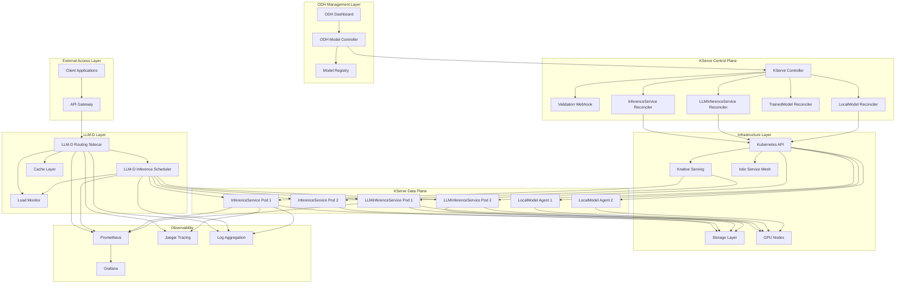
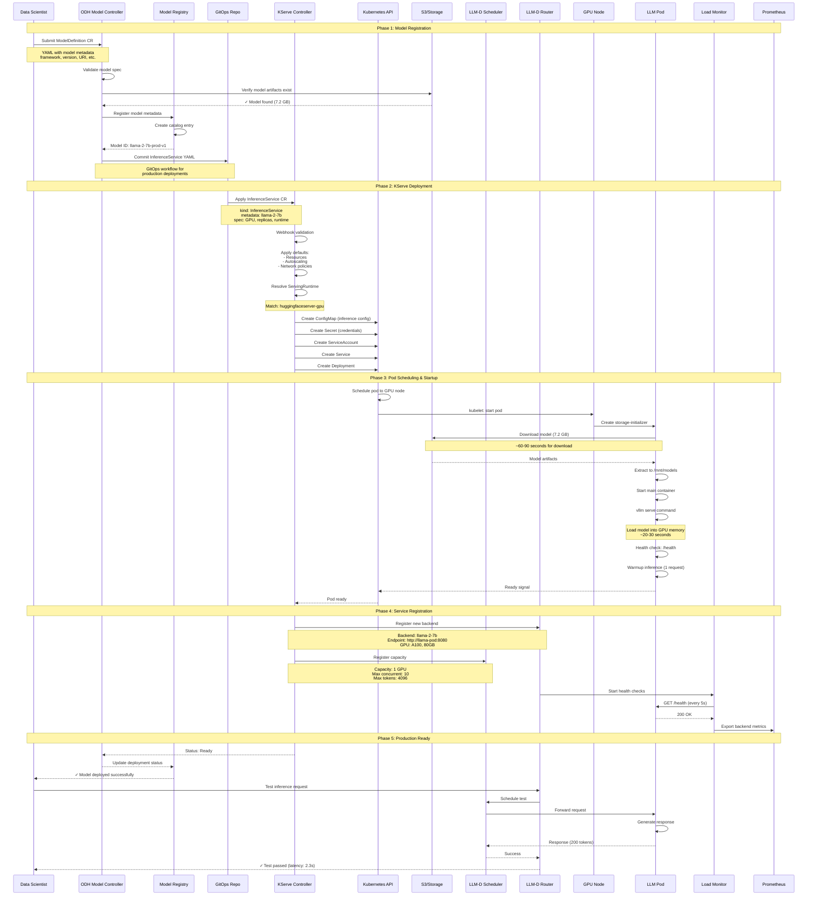

# OpenDataHub ML Serving - Complete Integration Deep Dive

## Comprehensive End-to-End Flows with All Components

This document provides **complete, detailed flows** showing exactly how all four components work together in real-world scenarios.

---

## Table of Contents

1. [Complete Architecture Stack](#complete-architecture-stack)
2. [Component Integration Matrix](#component-integration-matrix)
3. [Flow 1: LLM Deployment End-to-End](#flow-1-llm-deployment-end-to-end)
4. [Flow 2: LLM Inference Request - Complete Journey](#flow-2-llm-inference-request---complete-journey)
5. [Flow 3: Multi-Model LLM Serving with Dynamic Scaling](#flow-3-multi-model-llm-serving-with-dynamic-scaling)
6. [Flow 4: LocalModel Distributed Inference](#flow-4-localmodel-distributed-inference)
7. [Flow 5: Failure Recovery Across All Components](#flow-5-failure-recovery-across-all-components)
8. [Flow 6: Resource Optimization Workflow](#flow-6-resource-optimization-workflow)
9. [Implementation Details by Component](#implementation-details-by-component)

---

## Complete Architecture Stack

### Full System View



---

## Component Integration Matrix

| Source Component | Target Component | Integration Type | Protocol/API | Purpose |
|-----------------|------------------|------------------|--------------|---------|
| **Client** | Router Sidecar | HTTP/gRPC | REST/gRPC | Send inference requests |
| **Router Sidecar** | Cache | Redis Protocol | Redis | Cache lookups and storage |
| **Router Sidecar** | Scheduler | gRPC | Custom API | Request scheduling coordination |
| **Router Sidecar** | Load Monitor | gRPC | Metrics API | Query backend health/load |
| **Router Sidecar** | InferenceService | HTTP/gRPC | V2/OpenAI | Forward inference requests |
| **Scheduler** | InferenceService | HTTP/gRPC | V2/OpenAI | Execute scheduled tasks |
| **Scheduler** | Kubernetes API | K8s Client | REST | Resource queries and allocation |
| **Scheduler** | Load Monitor | gRPC | Metrics API | Real-time resource monitoring |
| **ODH Controller** | KServe Controller | K8s CR | Custom Resources | Create/manage InferenceServices |
| **ODH Controller** | Model Registry | REST API | HTTP | Register model metadata |
| **KServe Controller** | Kubernetes API | K8s Client | REST | Create Pods, Services, etc. |
| **KServe Controller** | Knative | K8s CR | KnativeService | Serverless deployments |
| **InferenceService** | Storage | S3/HTTP/PVC | Various | Download model artifacts |
| **InferenceService** | Prometheus | HTTP | Metrics endpoint | Export metrics |
| **LocalModel Agent** | Model Server | gRPC | V2 Protocol | Load/unload models dynamically |
| **All Components** | Jaeger | HTTP | OpenTelemetry | Distributed tracing |

---

## Flow 1: LLM Deployment End-to-End

### Complete deployment flow from data scientist to production



---

## Flow 2: LLM Inference Request - Complete Journey

### Every step from client request to response with all components

```mermaid
sequenceDiagram
    participant Client
    participant API as API Gateway
    participant Router as LLM-D Router
    participant Cache as Redis Cache
    participant Monitor as Load Monitor
    participant Scheduler as LLM-D Scheduler
    participant Queue as Request Queue
    participant ISVC1 as LLM Instance 1<br/>(A100 GPU)
    participant ISVC2 as LLM Instance 2<br/>(A100 GPU)
    participant Prom as Prometheus
    participant Trace as Jaeger
    
    Note over Client,Trace: Step 1: Request Ingress
    Client->>API: POST /v1/chat/completions
    Note over Client,API: Headers:<br/>- Authorization: Bearer token<br/>- Content-Type: application/json<br/>Body: {messages, model, params}
    
    API->>API: Validate API key
    API->>API: Extract user tier (premium)
    API->>API: Start trace span
    
    API->>Router: Forward request
    Note over API,Router: Add metadata:<br/>- User ID<br/>- Tier<br/>- Request ID<br/>- Trace context
    
    Note over Client,Trace: Step 2: Router Processing
    Router->>Trace: Create span: "router.process"
    Router->>Router: Parse request
    Router->>Router: Extract prompt (256 tokens)
    Router->>Router: Calculate prompt hash
    Note over Router: Hash: sha256(prompt) =<br/>a3f2d9...
    
    Router->>Router: Classify QoS tier
    Note over Router: User: premium → Priority: HIGH
    
    Note over Client,Trace: Step 3: Cache Lookup
    Router->>Cache: GET cache:a3f2d9...
    Note over Router,Cache: Check local cache first<br/>then Redis
    
    alt Cache Hit (30% of requests)
        Cache-->>Router: Cached response
        Router->>Prom: metric: cache_hit_total++
        Router->>Trace: End span (cache hit)
        Router-->>Client: Response (5ms latency)
        Note over Client,Trace: Fast path complete ✓
    else Cache Miss
        Cache-->>Router: null
        Router->>Prom: metric: cache_miss_total++
        Note over Router: Continue to backend...
    end
    
    Note over Client,Trace: Step 4: Load Monitoring
    Router->>Monitor: Query backend status
    Monitor->>Monitor: Check cached metrics<br/>(refreshed every 2s)
    
    par Query Instance 1
        Monitor->>ISVC1: GET /metrics
        ISVC1-->>Monitor: GPU: 45%<br/>Queue: 2<br/>Avg latency: 1.8s
    and Query Instance 2
        Monitor->>ISVC2: GET /metrics  
        ISVC2-->>Monitor: GPU: 85%<br/>Queue: 12<br/>Avg latency: 4.2s
    end
    
    Monitor->>Monitor: Calculate scores
    Note over Monitor: ISVC1 score: 85/100<br/>ISVC2 score: 35/100
    
    Monitor-->>Router: Backend ranking:<br/>1. ISVC1 (best)<br/>2. ISVC2 (loaded)
    
    Note over Client,Trace: Step 5: Scheduling Decision
    Router->>Scheduler: Request schedule
    Note over Router,Scheduler: Request details:<br/>- Priority: HIGH<br/>- Est tokens: 512<br/>- Timeout: 30s<br/>- Preferred: ISVC1
    
    Scheduler->>Scheduler: Check resource availability
    Scheduler->>Scheduler: Apply scheduling policy<br/>(Priority + Deadline)
    
    alt ISVC1 has capacity
        Scheduler->>Queue: Add to ISVC1 high-priority queue
        Note over Scheduler,Queue: Queue position: 2<br/>Est wait: 3.6s
        
        Scheduler-->>Router: Scheduled to ISVC1<br/>Queue pos: 2
    else ISVC1 saturated
        Scheduler->>Scheduler: Check preemption policy
        alt Can preempt lower priority
            Scheduler->>Queue: Preempt low-priority task
            Scheduler->>Queue: Add to ISVC1 queue (front)
        else Cannot preempt
            Scheduler->>Queue: Add to ISVC2 queue
            Note over Scheduler: Accept higher latency
        end
    end
    
    Note over Client,Trace: Step 6: Task Execution
    Scheduler->>ISVC1: Dequeue and execute
    Note over Scheduler,ISVC1: Wait for slot...<br/>Slot available!
    
    Scheduler->>Trace: Create span: "inference.execute"
    Scheduler->>ISVC1: POST /v1/chat/completions
    
    ISVC1->>ISVC1: Acquire GPU slot
    ISVC1->>ISVC1: Load prompt into GPU
    ISVC1->>ISVC1: Generate tokens (streaming)
    
    loop Token Generation
        ISVC1->>ISVC1: Generate next token
        Note over ISVC1: Token 1: "The"<br/>Token 2: " concept"<br/>...<br/>~20 tokens/sec
    end
    
    ISVC1->>ISVC1: Complete generation (512 tokens)
    ISVC1->>ISVC1: Release GPU slot
    
    Note over Client,Trace: Step 7: Response Path
    ISVC1-->>Scheduler: Response + metrics
    Note over ISVC1,Scheduler: Latency: 2.1s<br/>Tokens: 512<br/>GPU time: 1.9s
    
    Scheduler->>Prom: Record metrics
    Note over Scheduler,Prom: - inference_duration: 2.1s<br/>- tokens_generated: 512<br/>- gpu_utilization: 92%
    
    Scheduler->>Trace: End span (success)
    Scheduler-->>Router: Response
    
    Router->>Cache: SET cache:a3f2d9...<br/>TTL: 3600s
    Cache-->>Router: OK
    
    Router->>Prom: Record routing metrics
    Note over Router,Prom: - request_duration: 2.15s<br/>- backend: ISVC1<br/>- status: 200
    
    Router->>Trace: End span: "router.process"
    Router-->>API: Response
    API-->>Client: 200 OK + response
    
    Note over Client,Trace: ✓ Complete: 2.15s total<br/>Cache stored for future requests
```



---

## Flow 3: Multi-Model LLM Serving with Dynamic Scaling

### How multiple LLMs are managed dynamically with scaling

```mermaid
sequenceDiagram
    participant Admin
    participant ODH as ODH Controller
    participant KServe
    participant K8s
    participant HPA as Horizontal Pod Autoscaler
    participant Router
    participant Scheduler
    participant Monitor as Load Monitor
    participant LLMA as Llama-2-7b Pod
    participant LLMB as GPT-Neo-2.7b Pod
    participant LLMC as Mistral-7b Pod
    participant Prom as Prometheus
    
    Note over Admin,Prom: Scenario: Deploy 3 LLMs, scale based on demand
    
    Note over Admin,Prom: Phase 1: Initial Deployment
    par Deploy Llama-2
        Admin->>ODH: Deploy Llama-2-7b
        ODH->>KServe: Create ISVC: llama-2
        KServe->>K8s: Deploy Pod (minReplicas: 0)
        Note over K8s,LLMA: Initially scaled to 0<br/>(cost optimization)
    and Deploy GPT-Neo
        Admin->>ODH: Deploy GPT-Neo-2.7b
        ODH->>KServe: Create ISVC: gpt-neo
        KServe->>K8s: Deploy Pod (minReplicas: 1)
        K8s->>LLMB: Start pod
        LLMB->>LLMB: Load model (2.7 GB)
    and Deploy Mistral
        Admin->>ODH: Deploy Mistral-7b
        ODH->>KServe: Create ISVC: mistral
        KServe->>K8s: Deploy Pod (minReplicas: 1)
        K8s->>LLMC: Start pod
        LLMC->>LLMC: Load model (7.3 GB)
    end
    
    Note over Admin,Prom: Phase 2: Register with Router & Scheduler
    par Register Llama-2
        KServe->>Router: Register backend: llama-2<br/>Status: scaled-to-zero
        KServe->>Scheduler: Register capacity: 0 pods
    and Register GPT-Neo
        LLMB-->>K8s: Ready
        K8s-->>KServe: Pod ready
        KServe->>Router: Register backend: gpt-neo<br/>Endpoint: gpt-neo-pod:8080
        KServe->>Scheduler: Register capacity: 1 pod
    and Register Mistral
        LLMC-->>K8s: Ready
        K8s-->>KServe: Pod ready
        KServe->>Router: Register backend: mistral<br/>Endpoint: mistral-pod:8080
        KServe->>Scheduler: Register capacity: 1 pod
    end
    
    Router->>Monitor: Start monitoring all backends
    
    Note over Admin,Prom: Phase 3: Request Spike to Llama-2
    Note over Admin,Prom: 100 concurrent requests for Llama-2
    
    loop 100 requests
        Admin->>Router: Request for llama-2
        Router->>Scheduler: Schedule llama-2 request
        Scheduler->>Scheduler: Check capacity: 0 pods!
    end
    
    Note over Scheduler: Queue building up!<br/>100 requests queued
    
    Scheduler->>Prom: Report metrics:<br/>llama-2_queue_length: 100
    
    Prom->>HPA: Trigger alert
    HPA->>K8s: Scale llama-2: 0 → 5 pods
    
    K8s->>K8s: Create 5 pods
    par Scale up Llama-2 pods
        K8s->>LLMA: Start pod 1
        K8s->>LLMA: Start pod 2  
        K8s->>LLMA: Start pod 3
        K8s->>LLMA: Start pod 4
        K8s->>LLMA: Start pod 5
    end
    
    Note over K8s,LLMA: Cold start: ~90s per pod<br/>(download + load model)
    
    LLMA->>LLMA: Pods becoming ready...
    LLMA-->>K8s: Pod 1 ready
    LLMA-->>K8s: Pod 2 ready
    LLMA-->>K8s: Pod 3 ready
    
    K8s-->>Scheduler: New capacity available
    Scheduler->>Scheduler: Update capacity: 3 pods
    
    Scheduler->>Scheduler: Start draining queue
    loop Process queued requests
        Scheduler->>LLMA: Execute request
        LLMA->>LLMA: Generate response
        LLMA-->>Scheduler: Response
        Scheduler-->>Router: Response
        Router-->>Admin: Response
    end
    
    Note over Admin,Prom: Queue draining...<br/>100 requests → 0 in 45 seconds
    
    LLMA-->>K8s: All 5 pods ready
    Scheduler->>Scheduler: Update capacity: 5 pods
    
    Note over Admin,Prom: Phase 4: Load Balancing Across Models
    Note over Admin,Prom: Steady state: mixed requests
    
    loop Mixed traffic
        par Llama-2 requests
            Admin->>Router: Request for llama-2
            Router->>Monitor: Check load
            Monitor-->>Router: 5 pods, avg load: 60%
            Router->>Scheduler: Schedule to least loaded pod
            Scheduler->>LLMA: Execute
        and GPT-Neo requests
            Admin->>Router: Request for gpt-neo
            Router->>Monitor: Check load
            Monitor-->>Router: 1 pod, load: 40%
            Router->>Scheduler: Schedule
            Scheduler->>LLMB: Execute
        and Mistral requests
            Admin->>Router: Request for mistral
            Router->>Monitor: Check load
            Monitor-->>Router: 1 pod, load: 35%
            Router->>Scheduler: Schedule
            Scheduler->>LLMC: Execute
        end
    end
    
    Note over Admin,Prom: Phase 5: Scale Down (No Traffic)
    Note over Admin,Prom: No Llama-2 requests for 5 minutes
    
    Monitor->>Prom: Report: llama-2 idle
    Prom->>HPA: Idle threshold exceeded
    HPA->>K8s: Scale llama-2: 5 → 0 pods
    
    K8s->>LLMA: Terminate all pods
    LLMA->>LLMA: Graceful shutdown
    Note over LLMA: Save state (if needed)<br/>Release GPU
    
    LLMA-->>K8s: Terminated
    K8s-->>Scheduler: Capacity: 0 pods
    Scheduler->>Scheduler: Mark llama-2: scaled-to-zero
    
    Note over Admin,Prom: ✓ Cost optimization:<br/>GPU freed, $0/hour for Llama-2
```



---

## Flow 4: LocalModel Distributed Inference

### Distributed LLM inference across multiple nodes using LocalModel

```mermaid
sequenceDiagram
    participant Admin
    participant KServe
    participant K8s
    participant LMController as LocalModel Controller
    participant Node1 as GPU Node 1
    participant Node2 as GPU Node 2
    participant Node3 as GPU Node 3
    participant Agent1 as LocalModel Agent 1
    participant Agent2 as LocalModel Agent 2
    participant Agent3 as LocalModel Agent 3
    participant Router
    participant Scheduler
    participant Storage
    
    Note over Admin,Storage: Scenario: Deploy 70B LLM across 4 GPUs<br/>(tensor parallelism)
    
    Note over Admin,Storage: Phase 1: Create LocalModelNode Resources
    Admin->>KServe: Create LocalModelNode CRs
    Note over Admin,KServe: 3 nodes, each with 2x A100 GPUs
    
    par Register Node 1
        KServe->>K8s: Apply LocalModelNode: node-1
        K8s->>Node1: Deploy LocalModel agent
        Node1->>Agent1: Start agent
        Agent1->>Agent1: Discover GPUs:<br/>- GPU 0: A100 80GB<br/>- GPU 1: A100 80GB
        Agent1-->>KServe: Register: 2 GPUs available
    and Register Node 2
        KServe->>K8s: Apply LocalModelNode: node-2
        K8s->>Node2: Deploy LocalModel agent
        Node2->>Agent2: Start agent
        Agent2->>Agent2: Discover GPUs:<br/>- GPU 0: A100 80GB<br/>- GPU 1: A100 80GB
        Agent2-->>KServe: Register: 2 GPUs available
    and Register Node 3
        KServe->>K8s: Apply LocalModelNode: node-3
        K8s->>Node3: Deploy LocalModel agent
        Node3->>Agent3: Start agent
        Agent3->>Agent3: Discover GPUs:<br/>- GPU 0: A100 80GB<br/>- GPU 1: A100 80GB
        Agent3-->>KServe: Register: 2 GPUs available
    end
    
    KServe->>LMController: Total capacity: 6 GPUs
    
    Note over Admin,Storage: Phase 2: Deploy Distributed LLM
    Admin->>KServe: Create LocalModel CR
    Note over Admin,KServe: Model: Llama-2-70b<br/>Size: 140 GB<br/>Tensor parallel: 4<br/>Pipeline parallel: 1
    
    KServe->>LMController: Reconcile LocalModel
    LMController->>LMController: Calculate requirements:<br/>Need 4 GPUs in parallel
    
    LMController->>LMController: Schedule across nodes
    Note over LMController: Allocation:<br/>Node1: GPU 0, 1<br/>Node2: GPU 0, 1
    
    LMController->>Agent1: Deploy model shard 0-1
    LMController->>Agent2: Deploy model shard 2-3
    
    Note over Admin,Storage: Phase 3: Model Loading (Parallel)
    par Load Shard 0 on Node1-GPU0
        Agent1->>Storage: Download shard 0 (35 GB)
        Storage-->>Agent1: Shard 0 data
        Agent1->>Agent1: Load to GPU 0 memory
    and Load Shard 1 on Node1-GPU1
        Agent1->>Storage: Download shard 1 (35 GB)
        Storage-->>Agent1: Shard 1 data
        Agent1->>Agent1: Load to GPU 1 memory
    and Load Shard 2 on Node2-GPU0
        Agent2->>Storage: Download shard 2 (35 GB)
        Storage-->>Agent2: Shard 2 data
        Agent2->>Agent2: Load to GPU 0 memory
    and Load Shard 3 on Node2-GPU1
        Agent2->>Storage: Download shard 3 (35 GB)
        Storage-->>Agent2: Shard 3 data
        Agent2->>Agent2: Load to GPU 1 memory
    end
    
    Note over Agent1,Agent2: Loading time: ~5 minutes<br/>(parallel download + load)
    
    Note over Admin,Storage: Phase 4: Initialize Tensor Parallel Group
    Agent1->>Agent1: Initialize NCCL
    Agent2->>Agent2: Initialize NCCL
    
    Agent1->>Agent2: Establish NCCL connection
    Note over Agent1,Agent2: High-speed inter-node<br/>communication (RDMA/InfiniBand)
    
    Agent1->>Agent2: Synchronize shards
    Agent2-->>Agent1: Sync complete
    
    Agent1-->>LMController: Shard 0-1 ready
    Agent2-->>LMController: Shard 2-3 ready
    
    LMController->>LMController: All shards ready!
    LMController->>Router: Register distributed model
    Note over LMController,Router: Endpoint: distributed-llm-service<br/>Backend type: tensor-parallel<br/>GPUs: 4
    
    LMController->>Scheduler: Register capacity
    Note over LMController,Scheduler: Capacity: 1 distributed instance<br/>Max concurrent: 4<br/>Max tokens: 8192
    
    Note over Admin,Storage: Phase 5: Distributed Inference
    Admin->>Router: Inference request
    Router->>Scheduler: Schedule request
    Scheduler->>Agent1: Forward to coordinator (shard 0)
    
    Agent1->>Agent1: Distribute input to all shards
    
    par Parallel Computation
        Agent1->>Agent1: Compute on shard 0
        Note over Agent1: Layer computations<br/>on model partition 0
    and
        Agent1->>Agent1: Compute on shard 1
        Note over Agent1: Layer computations<br/>on model partition 1
    and
        Agent2->>Agent2: Compute on shard 2
        Note over Agent2: Layer computations<br/>on model partition 2
    and
        Agent2->>Agent2: Compute on shard 3
        Note over Agent2: Layer computations<br/>on model partition 3
    end
    
    Note over Agent1,Agent2: All-reduce synchronization<br/>via NCCL (every layer)
    
    loop Token Generation (auto-regressive)
        par Generate next token
            Agent1->>Agent1: Forward pass shard 0-1
            Agent2->>Agent2: Forward pass shard 2-3
        end
        
        Agent1->>Agent2: All-reduce
        Agent2-->>Agent1: Synchronized
        
        Agent1->>Agent1: Sample next token
        Note over Agent1: Token selected by shard 0<br/>(coordinator)
        
        Agent1->>Agent2: Broadcast token
    end
    
    Agent1->>Agent1: Complete generation (512 tokens)
    Agent1-->>Scheduler: Response
    Scheduler-->>Router: Response
    Router-->>Admin: Response
    
    Note over Admin,Storage: ✓ Distributed inference complete<br/>Latency: 3.5s (512 tokens)<br/>Throughput: ~146 tokens/sec
```



---

## Flow 5: Failure Recovery Across All Components

### Complete failure scenarios and recovery mechanisms

```mermaid
sequenceDiagram
    participant Client
    participant Router
    participant Cache
    participant Scheduler
    participant Monitor
    participant ISVC1 as LLM Instance 1
    participant ISVC2 as LLM Instance 2<br/>(Backup)
    participant K8s
    participant KServe
    participant Alert as Alert Manager
    
    Note over Client,Alert: Normal Operation
    Client->>Router: Inference request
    Router->>Cache: Check cache
    Cache-->>Router: Miss
    Router->>Monitor: Query backends
    Monitor-->>Router: ISVC1: healthy
    Router->>Scheduler: Schedule to ISVC1
    Scheduler->>ISVC1: Execute
    
    Note over Client,Alert: ⚠️ Failure Scenario 1: Pod Crash
    ISVC1-xISVC1: Pod crashes (OOM)
    ISVC1--xScheduler: Connection refused
    
    Scheduler->>Scheduler: Detect failure
    Scheduler->>Alert: Send alert: ISVC1 down
    
    Scheduler->>Scheduler: Apply retry policy
    Note over Scheduler: Retry count: 1/3<br/>Backoff: 100ms
    
    Scheduler->>ISVC1: Retry request
    ISVC1--xScheduler: Still down
    
    Note over Client,Alert: Failover to Backup
    Scheduler->>Scheduler: Mark ISVC1 unhealthy
    Scheduler->>Scheduler: Check circuit breaker
    Note over Scheduler: Failures: 5 in 10s<br/>Threshold exceeded!<br/>Open circuit for 60s
    
    Scheduler->>Monitor: Update backend status
    Monitor->>Monitor: ISVC1: circuit-open
    
    Scheduler->>Router: Failover to ISVC2
    Router->>Scheduler: Reschedule request
    Scheduler->>ISVC2: Execute on backup
    ISVC2->>ISVC2: Process request
    ISVC2-->>Scheduler: Success
    Scheduler-->>Router: Response
    Router-->>Client: Response (degraded mode)
    
    Note over Client,Alert: Kubernetes Recovery
    K8s->>K8s: Detect pod failure
    K8s->>K8s: Restart pod (restart policy)
    K8s->>ISVC1: Create new pod
    ISVC1->>ISVC1: Initialize
    ISVC1->>ISVC1: Load model
    ISVC1-->>K8s: Ready
    
    K8s-->>KServe: Pod recovered
    KServe->>Monitor: Update backend
    Monitor->>Monitor: ISVC1: healthy (tentative)
    
    Note over Client,Alert: Circuit Breaker Recovery
    Scheduler->>Scheduler: Circuit timeout (60s)
    Scheduler->>Scheduler: Half-open circuit
    
    Scheduler->>ISVC1: Test request
    ISVC1->>ISVC1: Process
    ISVC1-->>Scheduler: Success ✓
    
    Scheduler->>Scheduler: Close circuit
    Scheduler->>Monitor: ISVC1: fully healthy
    
    Note over Client,Alert: ⚠️ Failure Scenario 2: Network Partition
    Note over Router,ISVC1: Network partition<br/>Router can't reach ISVC1
    
    Client->>Router: New request
    Router->>Scheduler: Schedule
    Scheduler->>ISVC1: Forward request
    
    Note over Scheduler,ISVC1: Timeout after 30s
    Scheduler--xISVC1: Network timeout
    
    Scheduler->>Alert: Network issue detected
    Scheduler->>Monitor: Mark ISVC1: unreachable
    
    Scheduler->>ISVC2: Automatic failover
    ISVC2-->>Scheduler: Success
    Scheduler-->>Router: Response
    Router-->>Client: Response (high latency)
    
    Note over Router,ISVC1: Network recovered
    Monitor->>ISVC1: Health check
    ISVC1-->>Monitor: 200 OK
    Monitor->>Scheduler: ISVC1: recovered
    Scheduler->>Scheduler: Resume routing to ISVC1
    
    Note over Client,Alert: ⚠️ Failure Scenario 3: Cache Failure
    Client->>Router: Request
    Router->>Cache: Lookup
    Cache--xRouter: Redis connection refused
    
    Router->>Router: Cache failure detected
    Router->>Router: Bypass cache (degraded mode)
    Note over Router: Continue without cache<br/>Higher latency but functional
    
    Router->>Scheduler: Schedule (no cache)
    Scheduler->>ISVC1: Execute
    ISVC1-->>Scheduler: Response
    Scheduler-->>Router: Response
    Router-->>Client: Response (slower)
    
    Router->>Alert: Cache service down
    
    Note over Cache: Redis cluster recovers
    Cache->>Cache: Reconnect
    Cache-->>Router: Connection restored
    Router->>Router: Resume normal operation
    
    Note over Client,Alert: ⚠️ Failure Scenario 4: Scheduler Overload
    Note over Scheduler: 1000 concurrent requests!
    
    loop Queue building
        Client->>Router: Request
        Router->>Scheduler: Schedule
        Scheduler->>Scheduler: Add to queue
    end
    
    Scheduler->>Scheduler: Queue length: 1000
    Scheduler->>Scheduler: Check thresholds
    Note over Scheduler: Max queue: 500<br/>Threshold exceeded!
    
    Scheduler->>Router: Reject new requests (503)
    Router-->>Client: 503 Service Unavailable<br/>Retry-After: 30s
    
    Scheduler->>Alert: Overload condition
    Alert->>KServe: Trigger autoscaling
    
    KServe->>K8s: Scale ISVCs: 2 → 5
    K8s->>K8s: Create 3 new pods
    
    Note over K8s: New pods coming online...
    K8s-->>Scheduler: +3 capacity
    Scheduler->>Scheduler: Resume accepting requests
    
    Scheduler->>Scheduler: Drain queue
    Note over Scheduler: Queue: 1000 → 0<br/>Time: 2 minutes
    
    Scheduler-->>Router: Normal operation restored
    Router-->>Client: Accepting requests
    
    Note over Client,Alert: ✓ All failures handled<br/>System resilient and self-healing
```



---

## Flow 6: Resource Optimization Workflow

### How the system optimizes costs and performance automatically

```mermaid
sequenceDiagram
    participant Prom as Prometheus
    participant Monitor as Load Monitor
    participant Scheduler
    participant Router
    participant Optimizer as Resource Optimizer
    participant HPA as Horizontal Pod Autoscaler
    participant K8s
    participant GPU1 as GPU Instance 1<br/>(Expensive)
    participant GPU2 as GPU Instance 2<br/>(Medium)
    participant CPU as CPU Instance<br/>(Cheap)
    participant Alert
    
    Note over Prom,Alert: Phase 1: Monitoring & Analysis
    loop Every 30 seconds
        Monitor->>GPU1: Collect metrics
        GPU1-->>Monitor: GPU util: 40%<br/>Requests/min: 5<br/>Avg latency: 1.2s
        
        Monitor->>GPU2: Collect metrics
        GPU2-->>Monitor: GPU util: 70%<br/>Requests/min: 20<br/>Avg latency: 1.8s
        
        Monitor->>CPU: Collect metrics
        CPU-->>Monitor: CPU util: 30%<br/>Requests/min: 50<br/>Avg latency: 5.0s
        
        Monitor->>Prom: Export metrics
    end
    
    Note over Prom,Alert: Phase 2: Cost Analysis
    Optimizer->>Prom: Query metrics (5 min window)
    Prom-->>Optimizer: Aggregated data
    
    Optimizer->>Optimizer: Calculate costs
    Note over Optimizer: GPU1 (A100): $3.00/hr<br/>GPU2 (L40): $1.50/hr<br/>CPU: $0.30/hr<br/><br/>Total: $4.80/hr
    
    Optimizer->>Optimizer: Calculate utilization
    Note over Optimizer: GPU1: 40% underutilized<br/>GPU2: Optimal<br/>CPU: 30% underutilized
    
    Optimizer->>Optimizer: Analyze request patterns
    Note over Optimizer: Peak hours: 9AM-5PM<br/>Off-peak: 70% drop<br/>Weekend: 90% drop
    
    Note over Prom,Alert: Phase 3: Optimization Decisions
    Optimizer->>Optimizer: Decision: GPU1 underutilized
    Note over Optimizer: GPU1: 5 req/min<br/>GPU2 can handle 30 req/min<br/>Recommendation: Scale down GPU1
    
    Optimizer->>Scheduler: Update routing weights
    Note over Optimizer,Scheduler: GPU1 weight: 100 → 20<br/>GPU2 weight: 100 → 100<br/>CPU weight: 50 → 80
    
    Scheduler->>Router: Apply new routing policy
    Router->>Router: Update backend selection
    Note over Router: Prefer GPU2 and CPU<br/>Minimize GPU1 usage
    
    Note over Prom,Alert: Phase 4: Gradual Migration
    loop Next 5 minutes
        Router->>GPU2: Route request
        Router->>CPU: Route request
        Router->>GPU1: Route request (reduced)
    end
    
    Monitor->>Prom: Update metrics
    Prom-->>Optimizer: GPU1: 2 req/min (low)
    
    Optimizer->>Optimizer: GPU1 idle threshold reached
    Optimizer->>HPA: Recommendation: scale down
    
    HPA->>K8s: Scale GPU1: 1 → 0 replicas
    K8s->>GPU1: Graceful shutdown
    
    GPU1->>GPU1: Drain connections (30s)
    GPU1->>GPU1: Release GPU
    GPU1-->>K8s: Terminated
    
    Optimizer->>Alert: Cost reduction achieved
    Note over Optimizer,Alert: Savings: $3/hr → $1.80/hr<br/>40% cost reduction!
    
    Note over Prom,Alert: Phase 5: Traffic Spike Response
    Note over Prom,Alert: 10 AM: Traffic spike incoming
    
    Monitor->>Prom: Requests/min: 50 → 200
    Prom-->>Optimizer: Traffic increase detected
    
    Optimizer->>Optimizer: Analyze capacity
    Note over Optimizer: GPU2: 70% → 95% util<br/>CPU: 30% → 90% util<br/>Need more capacity!
    
    Optimizer->>Optimizer: Calculate optimal mix
    Note over Optimizer: Option A: +1 GPU1 ($3/hr)<br/>Option B: +2 GPU2 ($3/hr)<br/>Option C: +5 CPU ($1.50/hr)<br/><br/>Choose B: Best perf/cost
    
    Optimizer->>HPA: Scale GPU2: 1 → 3
    HPA->>K8s: Create 2 more GPU2 instances
    
    K8s->>GPU2: Start new pods
    Note over K8s,GPU2: Cold start: 90s
    
    GPU2-->>K8s: Pod 2 ready
    GPU2-->>K8s: Pod 3 ready
    K8s-->>Monitor: +2 capacity
    
    Monitor->>Scheduler: Update capacity
    Scheduler->>Router: Distribute load
    
    Router->>GPU2: Balanced routing
    Note over Router,GPU2: Load per instance:<br/>Pod 1: 65%<br/>Pod 2: 60%<br/>Pod 3: 58%
    
    Note over Prom,Alert: Phase 6: Smart Scheduling
    Optimizer->>Scheduler: Enable smart scheduling
    
    Scheduler->>Scheduler: Classify requests by size
    Note over Scheduler: Small (<100 tokens): CPU<br/>Medium (100-500): GPU2<br/>Large (>500): GPU1 (if available)
    
    loop Request classification
        Router->>Scheduler: Request: 50 tokens
        Scheduler->>CPU: Route to CPU
        
        Router->>Scheduler: Request: 300 tokens
        Scheduler->>GPU2: Route to GPU2
        
        Router->>Scheduler: Request: 1000 tokens
        Scheduler->>Scheduler: Need high-end GPU
        Scheduler->>HPA: Request GPU1 scale-up
        HPA->>K8s: Scale GPU1: 0 → 1
        K8s->>GPU1: Start pod
        GPU1-->>Scheduler: Ready
        Scheduler->>GPU1: Route large request
    end
    
    Note over Prom,Alert: Phase 7: Off-Peak Optimization
    Note over Prom,Alert: 8 PM: Traffic declining
    
    Monitor->>Prom: Requests/min: 200 → 30
    Prom-->>Optimizer: Off-peak detected
    
    Optimizer->>Optimizer: Apply off-peak policy
    Note over Optimizer: Scale down aggressive:<br/>Keep 1 GPU2 + 2 CPU<br/>Scale to zero others
    
    Optimizer->>HPA: Scale recommendations
    HPA->>K8s: Scale GPU1: 1 → 0
    HPA->>K8s: Scale GPU2: 3 → 1
    HPA->>K8s: Scale CPU: 5 → 2
    
    K8s->>K8s: Execute scale-down
    Note over K8s: Wait for idle (5 min)<br/>Then terminate
    
    Optimizer->>Alert: Off-peak mode active
    Note over Optimizer,Alert: New cost: $1.10/hr<br/>77% reduction from peak!
    
    Note over Prom,Alert: ✓ Continuous optimization<br/>Cost-efficient, performant, adaptive
```



---

## Implementation Details by Component

### KServe Controller - Reconciliation Logic

```go
// Simplified reconciliation logic
func (r *InferenceServiceReconciler) Reconcile(ctx context.Context, req ctrl.Request) (ctrl.Result, error) {
    isvc := &v1beta1.InferenceService{}
    if err := r.Get(ctx, req.NamespacedName, isvc); err != nil {
        return ctrl.Result{}, client.IgnoreNotFound(err)
    }
    
    // Phase 1: Resolve ServingRuntime
    runtime, err := r.resolveServingRuntime(ctx, isvc)
    if err != nil {
        return ctrl.Result{}, err
    }
    
    // Phase 2: Create/Update Resources based on deployment mode
    switch isvc.Spec.DeploymentMode {
    case constants.Serverless:
        return r.reconcileServerless(ctx, isvc, runtime)
    case constants.RawDeployment:
        return r.reconcileRaw(ctx, isvc, runtime)
    case constants.ModelMesh:
        return r.reconcileModelMesh(ctx, isvc, runtime)
    }
    
    // Phase 3: Update status
    r.updateStatus(ctx, isvc)
    
    return ctrl.Result{}, nil
}
```

### LLM-D Router - Backend Selection Algorithm

```python
# Simplified backend selection in Router
class BackendSelector:
    def select_backend(self, request, backends):
        # Step 1: Filter available backends
        available = [b for b in backends if b.health_status == 'healthy']
        
        # Step 2: Check cache-aware routing
        cache_backend = self.check_cache_affinity(request.prompt_hash)
        if cache_backend and cache_backend in available:
            return cache_backend
        
        # Step 3: Calculate scores for each backend
        scores = {}
        for backend in available:
            scores[backend] = self.calculate_score(backend)
        
        # Step 4: Apply QoS priorities
        if request.priority == 'high':
            # Filter to high-performance backends only
            available = [b for b in available if b.tier == 'high']
        
        # Step 5: Select highest scoring backend
        best_backend = max(available, key=lambda b: scores[b])
        
        return best_backend
    
    def calculate_score(self, backend):
        # Multi-factor scoring
        score = 100.0
        
        # GPU utilization (lower is better)
        score -= backend.gpu_utilization * 0.3
        
        # Queue length (shorter is better)
        score -= backend.queue_length * 5
        
        # Average latency (lower is better)
        score -= (backend.avg_latency_ms / 1000) * 10
        
        # Success rate (higher is better)
        score += backend.success_rate * 20
        
        return max(0, score)
```

### LLM-D Scheduler - Scheduling Algorithm

```python
# Simplified scheduling logic
class InferenceScheduler:
    def schedule_request(self, request):
        # Step 1: Classify request priority
        priority = self.classify_priority(request)
        
        # Step 2: Find available resources
        resources = self.resource_manager.get_available()
        
        if not resources:
            # Step 3: Check if preemption is possible
            if priority > PriorityLevel.STANDARD:
                preempted = self.try_preempt(priority)
                if preempted:
                    resources = [preempted]
        
        if not resources:
            # Step 4: Add to priority queue
            self.queues[priority].enqueue(request)
            return QueuedResponse(position=len(self.queues[priority]))
        
        # Step 5: Allocate resource and execute
        resource = self.select_optimal_resource(resources, request)
        task = self.create_task(request, resource)
        
        # Step 6: Execute asynchronously
        future = self.executor.submit(task)
        
        return TaskHandle(future, resource)
    
    def try_preempt(self, incoming_priority):
        # Find running tasks with lower priority
        running_tasks = self.get_running_tasks()
        
        for task in running_tasks:
            if task.priority < incoming_priority:
                # Checkpoint task state
                self.checkpoint_task(task)
                
                # Free the resource
                resource = task.resource
                self.terminate_task(task)
                
                # Re-queue preempted task
                self.queues[task.priority].enqueue(task.request)
                
                return resource
        
        return None
```

### LocalModel Agent - Model Management

```python
# Simplified LocalModel agent logic
class LocalModelAgent:
    def handle_model_load(self, model_spec):
        # Step 1: Download model if not cached
        if not self.is_cached(model_spec.uri):
            self.download_model(model_spec.uri, model_spec.shard_id)
        
        # Step 2: Allocate GPU memory
        gpu_id = self.allocate_gpu(model_spec.required_memory)
        
        # Step 3: Load model into GPU
        model_handle = self.load_to_gpu(
            model_spec.local_path,
            gpu_id,
            shard_id=model_spec.shard_id,
            tensor_parallel_size=model_spec.tp_size
        )
        
        # Step 4: Initialize communication for distributed inference
        if model_spec.tp_size > 1:
            self.init_distributed_comm(
                shard_id=model_spec.shard_id,
                world_size=model_spec.tp_size
            )
        
        # Step 5: Register with controller
        self.register_model(model_spec.name, model_handle, gpu_id)
        
        # Step 6: Health check
        self.run_warmup_inference(model_handle)
        
        return ModelLoadSuccess(model_id=model_spec.name)
    
    def execute_distributed_inference(self, request):
        # Tensor parallel inference
        if self.shard_id == 0:
            # Coordinator shard
            input_ids = self.tokenize(request.prompt)
            
            # Broadcast to all shards
            self.broadcast(input_ids)
        else:
            # Worker shard
            input_ids = self.receive_broadcast()
        
        # Each shard processes its partition
        output = self.model_handle.forward(
            input_ids,
            shard_id=self.shard_id
        )
        
        # All-reduce across shards
        synced_output = self.all_reduce(output)
        
        if self.shard_id == 0:
            # Coordinator returns final result
            return self.detokenize(synced_output)
        
        return None  # Only coordinator returns
```

---

## Summary: Complete Integration

### Data Flow Summary

1. **Request Ingress**: Client → API Gateway → Router
2. **Request Processing**: Router → Cache (check) → Load Monitor (query)
3. **Scheduling**: Router → Scheduler → Resource Allocation
4. **Execution**: Scheduler → InferenceService Pod → Model Inference
5. **Response**: Pod → Scheduler → Router → Cache (store) → Client

### Control Flow Summary

1. **Deployment**: ODH Controller → KServe Controller → Kubernetes → Pod Creation
2. **Registration**: Pod Ready → KServe → Router + Scheduler (register backend)
3. **Monitoring**: Load Monitor → Prometheus → Metrics Collection
4. **Scaling**: Metrics → HPA/KPA → Kubernetes → Pod Scaling
5. **Failure Handling**: Health Check Failure → Circuit Breaker → Failover → Recovery

### Key Integration Points

| Integration | Protocol | Purpose |
|-------------|----------|---------|
| Router ↔ Scheduler | gRPC | Request scheduling coordination |
| Router ↔ Cache | Redis | Response caching |
| Scheduler ↔ InferenceService | HTTP/gRPC | Inference execution |
| All ↔ Prometheus | HTTP | Metrics export |
| KServe ↔ Kubernetes | K8s API | Resource management |
| LocalModel ↔ Storage | S3/HTTP | Model artifact download |
| LocalModel Agents ↔ NCCL | RDMA/IB | Distributed inference communication |

---

**Document Version**: 1.0  
**Last Updated**: October 26, 2025  
**This document provides the COMPLETE integration flows with ALL components working together.**

