# OpenDataHub ML Serving Architecture - Complete Documentation

## Table of Contents
1. [Overview](#overview)
2. [Component 1: KServe](#component-1-kserve)
3. [Component 2: ODH Model Controller](#component-2-odh-model-controller)
4. [Component 3: LLM-D Routing Sidecar](#component-3-llm-d-routing-sidecar)
5. [Component 4: LLM-D Inference Scheduler](#component-4-llm-d-inference-scheduler)
6. [Complete System Integration Flows](#complete-system-integration-flows)
7. [Advanced Features and Use Cases](#advanced-features-and-use-cases)

---

## Overview

The OpenDataHub ML Serving ecosystem provides a comprehensive platform for deploying, managing, and serving machine learning models, with specialized support for Large Language Models (LLMs). The architecture consists of four main components working together to provide production-ready ML inference.

### Component Relationships

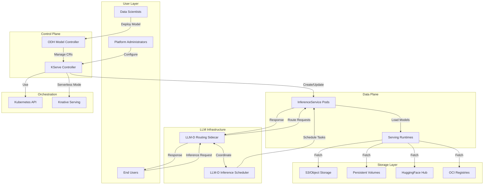

---

## Component 1: KServe

### Overview
KServe is a Kubernetes-based model inference platform that provides standardized interfaces for serving predictive and generative ML models. It's the core serving platform in the OpenDataHub ecosystem.

**Release Version**: v0.15

### Architecture

KServe follows a **Control Plane + Data Plane** architecture:

#### Control Plane Components
- **KServe Controller Manager**: Reconciles InferenceService CRDs
- **Webhook Server**: Validates and mutates InferenceService resources
- **Inference Graph Controller**: Manages complex model workflows
- **TrainedModel Controller**: Handles multi-model serving

#### Data Plane Components
- **Serving Runtimes**: Model server implementations
- **Model Agent**: Downloads and manages models
- **Router**: Routes requests in InferenceGraph
- **Queue Proxy**: Handles autoscaling metrics (Knative)

### Key Features

#### 1. InferenceService (Core API)

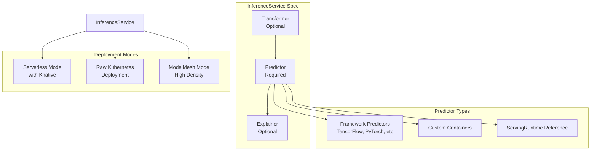

#### 2. Serving Runtimes

KServe supports multiple model servers through the `ServingRuntime` CRD:

| Runtime | Frameworks | Protocol | GPU Support | Multi-Model |
|---------|-----------|----------|-------------|-------------|
| **TensorFlow Serving** | TensorFlow | V1, gRPC | ✅ | ✅ |
| **TorchServe** | PyTorch | V1, V2 | ✅ | ✅ |
| **Triton Inference Server** | TensorFlow, PyTorch, ONNX, TensorRT | V2, gRPC | ✅ | ✅ |
| **MLServer** | SKLearn, XGBoost, LightGBM, MLflow | V2 | ❌ | ✅ |
| **SKLearnServer** | Scikit-Learn | V1, V2 | ❌ | ✅ |
| **XGBoostServer** | XGBoost | V1, V2 | ❌ | ✅ |
| **LightGBMServer** | LightGBM | V1, V2 | ❌ | ✅ |
| **PMMLServer** | PMML | V1, V2 | ❌ | ✅ |
| **PaddleServer** | PaddlePaddle | V1 | ✅ | ❌ |
| **HuggingFace Server** | Transformers, LLMs | V1, V2, OpenAI | ✅ | ❌ |

#### 3. Autoscaling

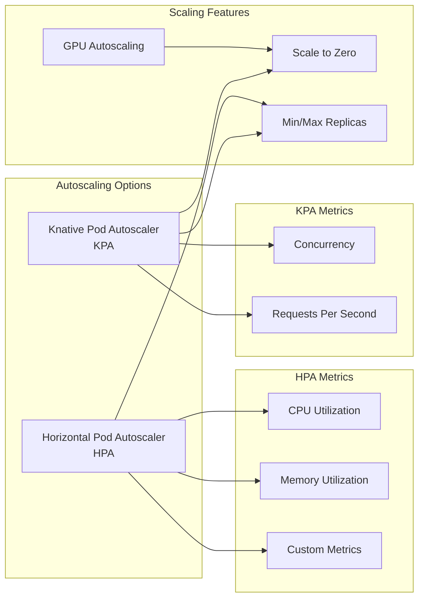

**Autoscaling Flow:**

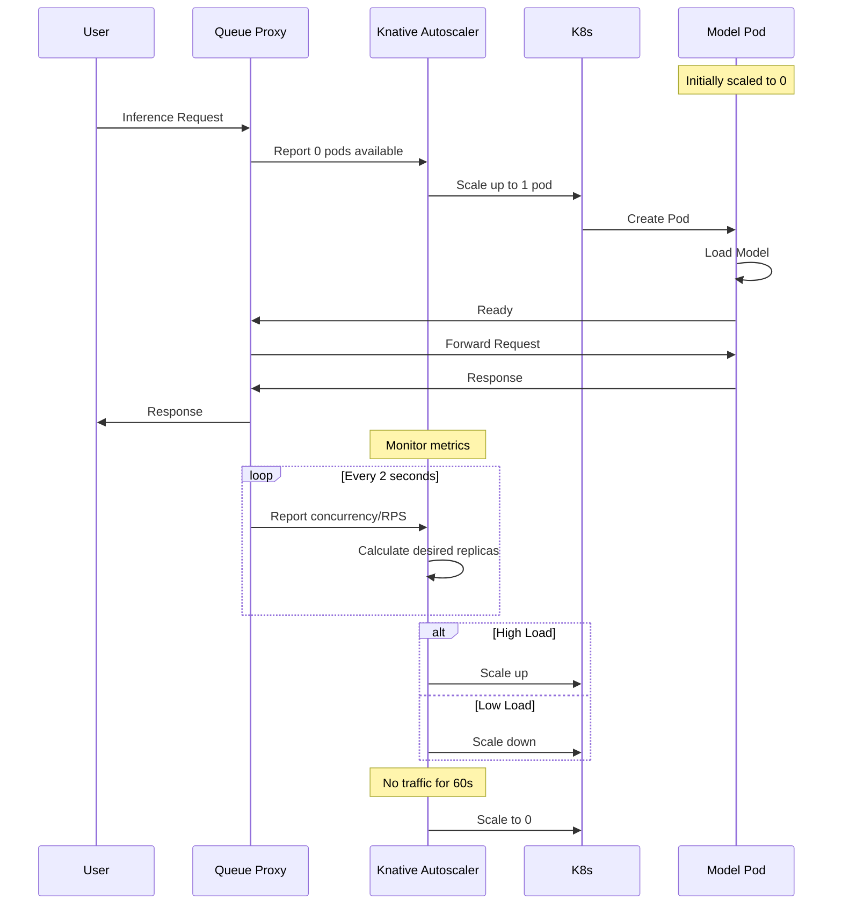

#### 4. Storage Support

KServe supports multiple storage backends:

```mermaid
graph TB
    subgraph "Storage Sources"
        S3[S3/MinIO<br/>s3://]
        GCS[Google Cloud Storage<br/>gs://]
        Azure[Azure Blob<br/>https://]
        PVC[PersistentVolumeClaim<br/>pvc://]
        HTTP[HTTP/HTTPS<br/>https://]
        HF[HuggingFace Hub<br/>hf://]
        HDFS[HDFS<br/>hdfs://]
        OCI[OCI Registry<br/>oci://]
        Local[Local Path<br/>file://]
    end
    
    subgraph "Storage Initializer"
        SI[Init Container]
    end
    
    subgraph "Model Storage"
        ModelDir[/mnt/models]
    end
    
    S3 --> SI
    GCS --> SI
    Azure --> SI
    HTTP --> SI
    HF --> SI
    HDFS --> SI
    
    PVC -.Direct Mount.-> ModelDir
    OCI -.Image Volume.-> ModelDir
    Local -.Volume Mount.-> ModelDir
    
    SI --> ModelDir
```

#### 5. InferenceGraph (Advanced Orchestration)

InferenceGraph enables complex model workflows with DAG-based routing:

**Node Types:**

1. **Sequence Node**: Chain models in sequence
2. **Switch Node**: Conditional routing
3. **Ensemble Node**: Parallel execution with response merging
4. **Splitter Node**: Traffic splitting (A/B testing, canary)

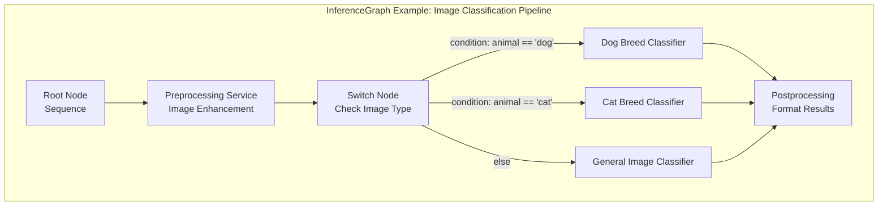

**Ensemble Example:**

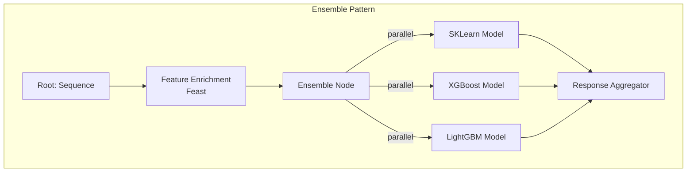

#### 6. Multi-Model Serving

Multi-model serving addresses scalability challenges when deploying thousands of models:

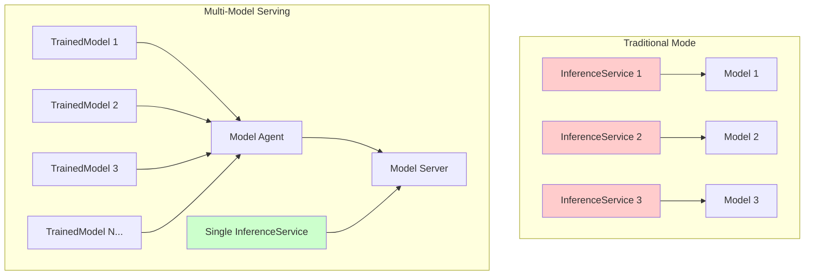

**Benefits:**
- **Reduced Resource Overhead**: Eliminate per-model sidecar costs
- **Higher Density**: More models per node
- **Dynamic Loading**: Load/unload models on-demand
- **Shared Resources**: Better GPU utilization

**Multi-Model Serving Flow:**

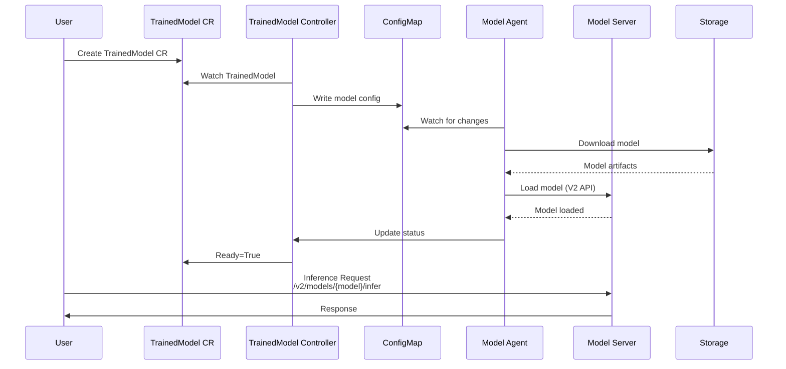

#### 7. Protocol Support

```mermaid
graph LR
    subgraph "V1 Protocol"
        V1Predict[/v1/models/:predict]
        V1Explain[/v1/models/:explain]
    end
    
    subgraph "V2 Protocol"
        V2Health[/v2/health]
        V2Metadata[/v2/models/{model}]
        V2Infer[/v2/models/{model}/infer]
        V2Load[/v2/repository/models/{model}/load]
        V2Unload[/v2/repository/models/{model}/unload]
    end
    
    subgraph "OpenAI Protocol"
        ChatCompletion[/v1/chat/completions]
        Completion[/v1/completions]
        Embeddings[/v1/embeddings]
        Models[/v1/models]
    end
    
    subgraph "gRPC"
        gRPCV2[V2 gRPC Protocol]
        gRPCTF[TensorFlow gRPC]
    end
```

#### 8. InferenceService Lifecycle

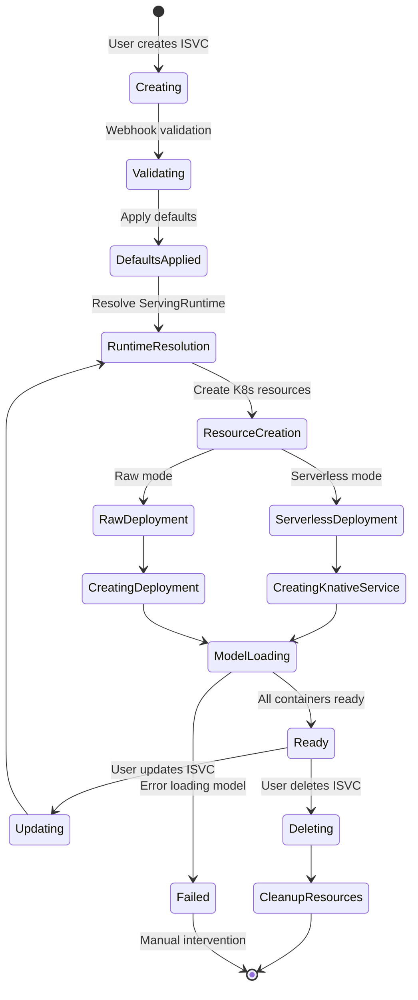

### Complete InferenceService Request Flow

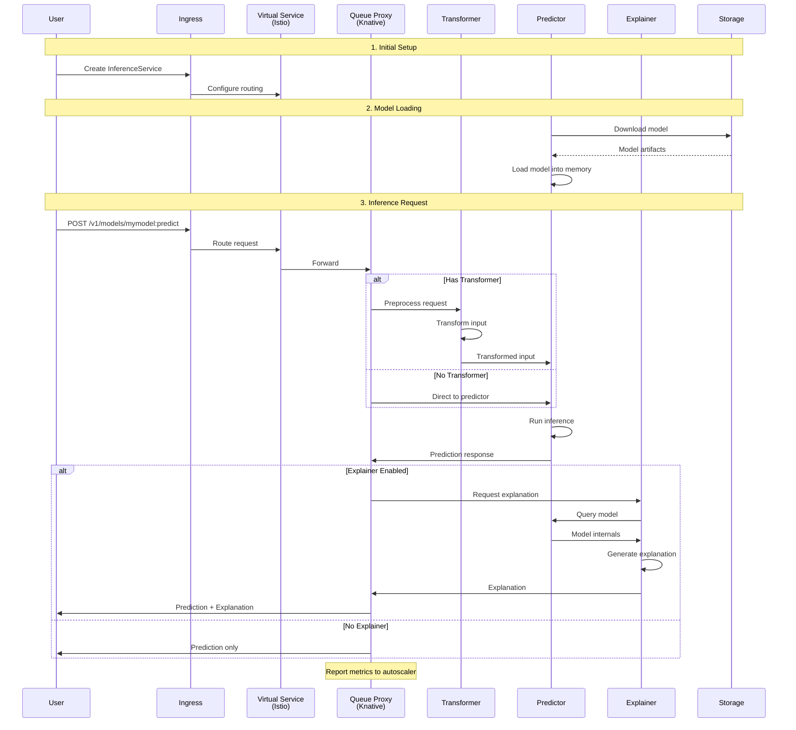

### Features Summary

| Feature Category | Features |
|-----------------|----------|
| **Deployment** | Serverless (Knative), RawDeployment, ModelMesh, Multi-Model |
| **Autoscaling** | Scale-to-Zero, GPU Autoscaling, KPA, HPA, Custom Metrics |
| **Protocols** | V1 REST, V2 REST, OpenAI, gRPC, Custom |
| **Runtimes** | TensorFlow, PyTorch, Triton, MLServer, SKLearn, XGBoost, LightGBM, PMML, Paddle, HuggingFace |
| **Storage** | S3, GCS, Azure, PVC, HTTP, HuggingFace Hub, HDFS, OCI |
| **Orchestration** | InferenceGraph (Sequence, Switch, Ensemble, Splitter) |
| **ML Pipeline** | Predictor, Transformer, Explainer |
| **Networking** | Istio, Knative, Gateway API, Custom Domains |
| **Observability** | Prometheus Metrics, Distributed Tracing, Logging |
| **Security** | mTLS, Authentication, Authorization, Network Policies |
| **Advanced** | Canary Rollouts, A/B Testing, Model Versioning, Batching |

---

## Component 2: ODH Model Controller

### Overview
The ODH Model Controller is a Kubernetes operator specifically designed for OpenDataHub that manages the lifecycle of machine learning models and their serving infrastructure.

**Purpose**: Simplify and automate model deployment and management within the OpenDataHub ecosystem.

### Architecture

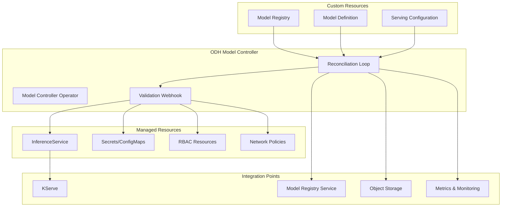

### Key Features

#### 1. Model Registration and Discovery

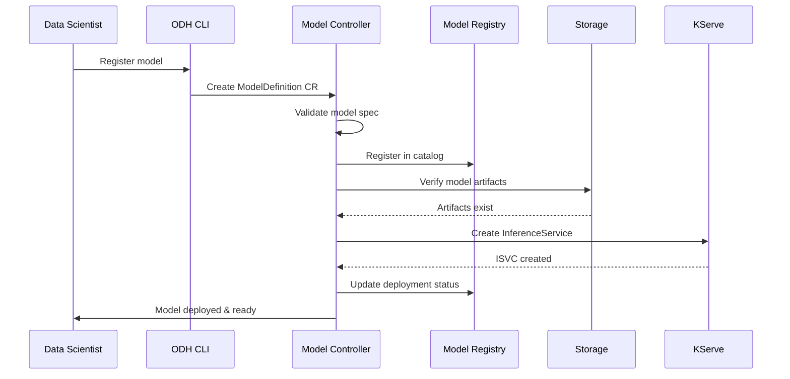

#### 2. Automated Deployment Pipeline

The controller automates the entire deployment workflow:

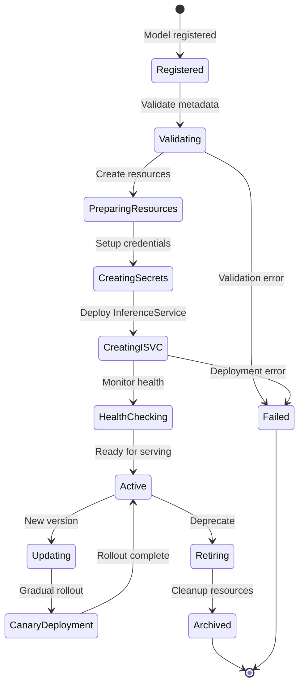

#### 3. Configuration Management

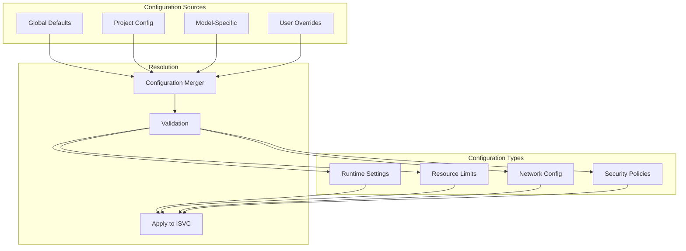

#### 4. Model Versioning and Lifecycle

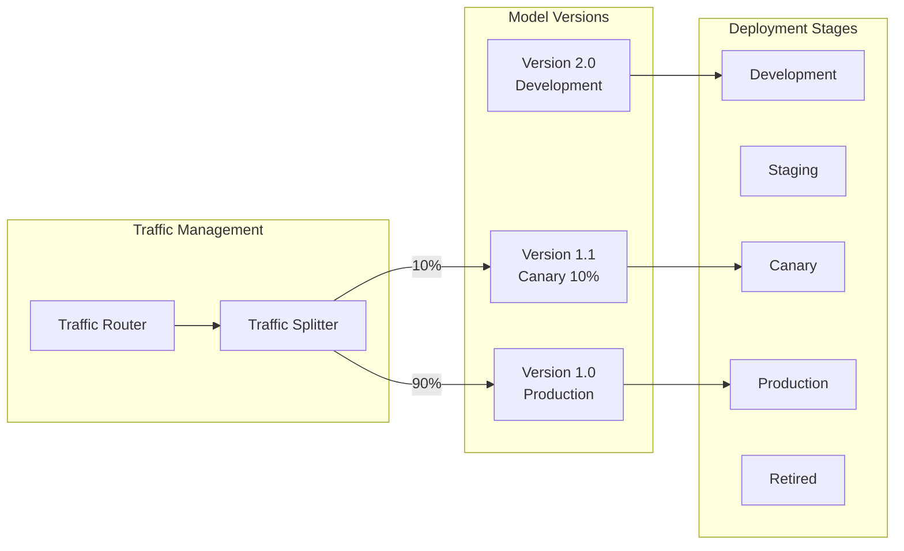

#### 5. Multi-Tenancy Support

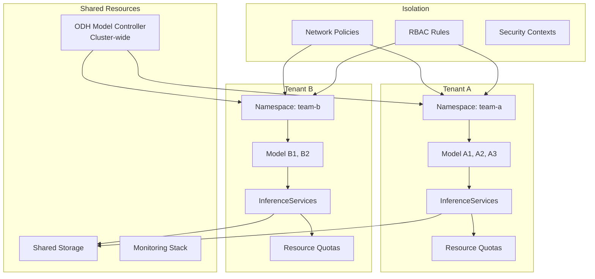

#### 6. Monitoring and Observability

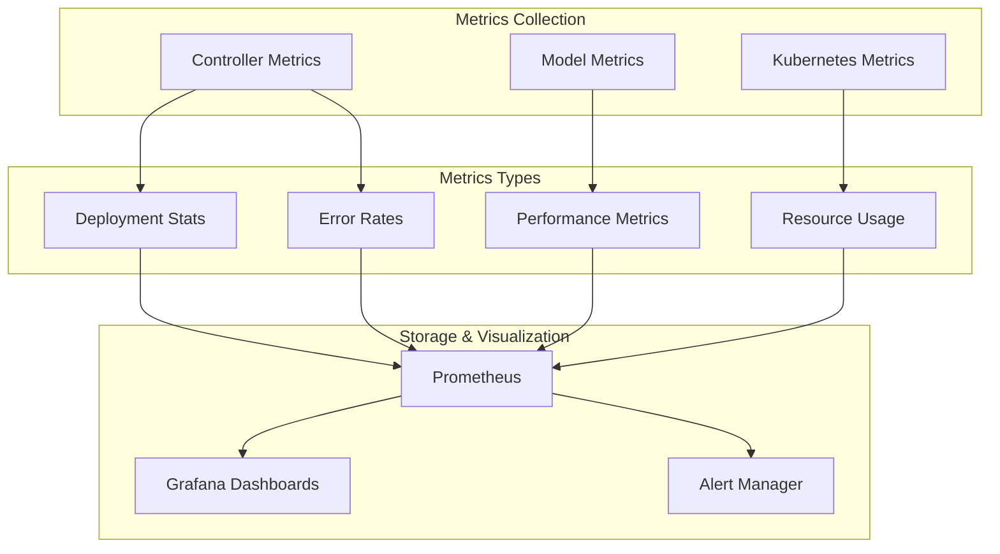

### Model Controller Features Summary

| Feature | Description |
|---------|-------------|
| **Model Registration** | Centralized model catalog and metadata management |
| **Automated Deployment** | One-click deployment from registry to production |
| **Version Control** | Multi-version management with traffic splitting |
| **Configuration Management** | Hierarchical config with inheritance and overrides |
| **Multi-Tenancy** | Namespace isolation, quotas, and RBAC |
| **Lifecycle Management** | Development → Staging → Canary → Production → Retired |
| **Integration** | Seamless KServe integration, model registry sync |
| **Monitoring** | Deployment tracking, health checks, metrics |
| **Security** | Secret management, credential injection, policies |
| **Audit Logging** | Complete audit trail of model deployments |

---

## Component 3: LLM-D Routing Sidecar

### Overview
The LLM-D Routing Sidecar is a specialized component designed for intelligent routing and load balancing of Large Language Model inference requests.

**Release Version**: 0.3  
**Purpose**: Optimize LLM inference through smart routing, caching, and load distribution.

### Architecture

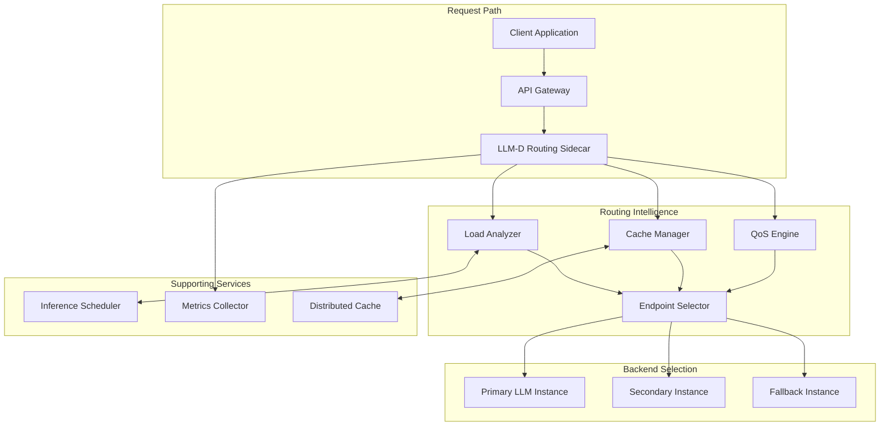

### Key Features

#### 1. Intelligent Request Routing

```mermaid
flowchart TD
    Start[Incoming Request] --> CheckCache{Check Cache}
    CheckCache -->|Hit| ReturnCached[Return Cached Response]
    CheckCache -->|Miss| AnalyzeRequest[Analyze Request]
    
    AnalyzeRequest --> CheckQoS{QoS Requirements?}
    CheckQoS -->|High Priority| SelectPrimary[Select Primary Instance]
    CheckQoS -->|Standard| CheckLoad{Check Load}
    
    CheckLoad -->|Low Load| SelectPrimary
    CheckLoad -->|Medium Load| SelectSecondary[Select Secondary Instance]
    CheckLoad -->|High Load| CheckFallback{Fallback Available?}
    
    CheckFallback -->|Yes| SelectFallback[Select Fallback]
    CheckFallback -->|No| QueueRequest[Queue Request]
    
    SelectPrimary --> SendRequest[Send to Backend]
    SelectSecondary --> SendRequest
    SelectFallback --> SendRequest
    QueueRequest --> WaitForCapacity[Wait for Capacity]
    WaitForCapacity --> SendRequest
    
    SendRequest --> CheckResponse{Response OK?}
    CheckResponse -->|Success| CacheResponse[Cache Response]
    CheckResponse -->|Failure| Retry{Retry Available?}
    
    Retry -->|Yes| SelectAlternate[Select Alternate Backend]
    Retry -->|No| ReturnError[Return Error]
    
    SelectAlternate --> SendRequest
    CacheResponse --> ReturnResponse[Return Response]
    ReturnCached --> End[End]
    ReturnResponse --> End
    ReturnError --> End
```

#### 2. Load-Aware Distribution

```mermaid
graph TB
    subgraph "Load Monitoring"
        Monitor[Real-time Monitor]
        Metrics[Metrics Collection]
    end
    
    subgraph "Load Metrics"
        QueueLen[Queue Length]
        ActiveReq[Active Requests]
        GPU[GPU Utilization]
        Latency[Response Latency]
        Throughput[Throughput]
    end
    
    subgraph "Decision Engine"
        Scorer[Load Scorer]
        Ranker[Backend Ranker]
        Selector[Instance Selector]
    end
    
    subgraph "Backend Instances"
        B1[Backend 1<br/>Score: 95]
        B2[Backend 2<br/>Score: 75]
        B3[Backend 3<br/>Score: 45]
        B4[Backend 4<br/>Score: 20]
    end
    
    Monitor --> QueueLen
    Monitor --> ActiveReq
    Monitor --> GPU
    Monitor --> Latency
    Monitor --> Throughput
    
    QueueLen --> Scorer
    ActiveReq --> Scorer
    GPU --> Scorer
    Latency --> Scorer
    Throughput --> Scorer
    
    Scorer --> Ranker
    Ranker --> Selector
    
    Selector -->|Highest Score| B1
    Selector -->|If B1 saturated| B2
    Selector -->|If B2 saturated| B3
    Selector -->|If B3 saturated| B4
```

#### 3. Cache-Aware Routing

The sidecar implements sophisticated caching strategies:

```mermaid
sequenceDiagram
    participant Client
    participant Sidecar
    participant LocalCache as Local Cache
    participant SharedCache as Shared Cache
    participant LLM as LLM Backend
    
    Client->>Sidecar: Request with prompt
    Sidecar->>Sidecar: Hash prompt
    
    Sidecar->>LocalCache: Check local cache
    alt Local Cache Hit
        LocalCache-->>Sidecar: Cached response
        Sidecar-->>Client: Return cached (1-2ms)
    else Local Cache Miss
        Sidecar->>SharedCache: Check shared cache
        alt Shared Cache Hit
            SharedCache-->>Sidecar: Cached response
            Sidecar->>LocalCache: Store locally
            Sidecar-->>Client: Return cached (5-10ms)
        else Shared Cache Miss
            Sidecar->>Sidecar: Select best backend
            Sidecar->>LLM: Forward request
            LLM->>LLM: Generate response
            LLM-->>Sidecar: Response (100-5000ms)
            
            par Store in caches
                Sidecar->>LocalCache: Store
                Sidecar->>SharedCache: Store
            end
            
            Sidecar-->>Client: Return response
        end
    end
```

**Cache Strategy Features:**
- **Prompt Hashing**: Semantic similarity detection
- **Partial Matching**: Prefix/suffix cache hits
- **TTL Management**: Time-based expiration
- **LRU Eviction**: Capacity-based eviction
- **Cache Warming**: Pre-populate common queries
- **Negative Caching**: Cache error responses temporarily

#### 4. Quality of Service (QoS) Management

```mermaid
graph TB
    subgraph "Request Classification"
        Incoming[Incoming Requests]
        Classifier[QoS Classifier]
    end
    
    subgraph "Priority Tiers"
        Critical[Critical/SLA<br/>Priority: 1]
        High[High Priority<br/>Priority: 2]
        Standard[Standard<br/>Priority: 3]
        BestEffort[Best Effort<br/>Priority: 4]
    end
    
    subgraph "Queue Management"
        Q1[Priority Queue 1]
        Q2[Priority Queue 2]
        Q3[Priority Queue 3]
        Q4[Priority Queue 4]
    end
    
    subgraph "Resource Allocation"
        Scheduler[Request Scheduler]
        ResourcePool[Backend Pool]
    end
    
    Incoming --> Classifier
    
    Classifier -->|SLA requirement| Critical
    Classifier -->|User tier: premium| High
    Classifier -->|User tier: standard| Standard
    Classifier -->|Batch requests| BestEffort
    
    Critical --> Q1
    High --> Q2
    Standard --> Q3
    BestEffort --> Q4
    
    Q1 -->|80% capacity| Scheduler
    Q2 -->|15% capacity| Scheduler
    Q3 -->|4% capacity| Scheduler
    Q4 -->|1% capacity| Scheduler
    
    Scheduler --> ResourcePool
```

#### 5. Failover and Resilience

```mermaid
stateDiagram-v2
    [*] --> RouteRequest: New Request
    RouteRequest --> SelectPrimary: Choose backend
    
    SelectPrimary --> SendToPrimary: Backend healthy
    SendToPrimary --> AwaitResponse: Request sent
    
    AwaitResponse --> Success: Response OK
    AwaitResponse --> Timeout: No response
    AwaitResponse --> Error: Error response
    
    Timeout --> RetryLogic: Check retry policy
    Error --> RetryLogic: Check retry policy
    
    RetryLogic --> SelectSecondary: Retry allowed
    SelectSecondary --> SendToSecondary
    SendToSecondary --> AwaitResponse2: Request sent
    
    AwaitResponse2 --> Success: Response OK
    AwaitResponse2 --> SelectFallback: Still failing
    
    SelectFallback --> SendToFallback
    SendToFallback --> FallbackResponse
    
    FallbackResponse --> Success: Degraded mode
    FallbackResponse --> FinalError: All failed
    
    Success --> UpdateMetrics
    UpdateMetrics --> [*]
    
    FinalError --> LogError
    LogError --> [*]
    
    RetryLogic --> FinalError: No retries left
```

#### 6. Request Flow with All Features

```mermaid
sequenceDiagram
    participant C as Client
    participant S as Sidecar
    participant LC as Local Cache
    participant SC as Shared Cache
    participant Sched as Scheduler
    participant M as Metrics
    participant B1 as Backend 1
    participant B2 as Backend 2
    
    C->>S: POST /v1/chat/completions
    S->>S: Extract API key, classify QoS
    S->>S: Hash prompt
    
    S->>LC: Check cache
    LC-->>S: Miss
    S->>SC: Check shared cache
    SC-->>S: Miss
    
    S->>M: Query backend metrics
    M-->>S: B1: 40% load, B2: 75% load
    
    S->>Sched: Request capacity
    Sched-->>S: B1 available
    
    S->>B1: Forward request
    Note over B1: Processing...
    
    alt Success
        B1-->>S: Response (200 OK)
        S->>LC: Store in local cache
        S->>SC: Store in shared cache
        S->>M: Record success, latency
        S-->>C: Return response
    else Timeout/Error
        B1--xS: Timeout
        S->>M: Record failure
        S->>S: Failover decision
        S->>B2: Retry on Backend 2
        B2-->>S: Response
        S->>M: Record success
        S-->>C: Return response
    end
```

### Routing Sidecar Features Summary

| Feature | Description |
|---------|-------------|
| **Intelligent Routing** | Load, cache, and QoS-aware endpoint selection |
| **Multi-Level Caching** | Local + shared cache with semantic matching |
| **Load Balancing** | Real-time load monitoring and distribution |
| **QoS Tiers** | Priority-based request handling |
| **Failover** | Automatic retry with alternate backends |
| **Circuit Breaker** | Protect unhealthy backends from overload |
| **Request Queuing** | Queue management during high load |
| **Metrics Collection** | Detailed routing and performance metrics |
| **Cost Optimization** | Route to cost-effective backends when possible |
| **Token Management** | Track and limit token usage |

---

## Component 4: LLM-D Inference Scheduler

### Overview
The LLM-D Inference Scheduler manages the scheduling and execution of LLM inference tasks across available resources, ensuring optimal resource utilization and meeting performance requirements.

**Release Version**: 0.3.1  
**Purpose**: Efficient scheduling and resource management for LLM workloads.

### Architecture

```mermaid
graph TB
    subgraph "Scheduler Core"
        API[Scheduler API]
        Queue[Task Queue]
        Engine[Scheduling Engine]
        Monitor[Resource Monitor]
    end
    
    subgraph "Scheduling Policies"
        FIFO[FIFO Policy]
        Priority[Priority-Based]
        Fair[Fair Share]
        Deadline[Deadline-Aware]
        SJF[Shortest Job First]
    end
    
    subgraph "Resource Pool"
        GPU1[GPU Node 1]
        GPU2[GPU Node 2]
        GPU3[GPU Node 3]
        CPU[CPU Nodes]
    end
    
    subgraph "Task Types"
        Interactive[Interactive Queries]
        Batch[Batch Processing]
        Stream[Streaming Inference]
        FineTune[Fine-tuning Jobs]
    end
    
    subgraph "Integration"
        Router[Routing Sidecar]
        K8s[Kubernetes]
        Metrics[Metrics System]
    end
    
    API --> Queue
    Queue --> Engine
    
    Engine --> FIFO
    Engine --> Priority
    Engine --> Fair
    Engine --> Deadline
    Engine --> SJF
    
    Monitor --> GPU1
    Monitor --> GPU2
    Monitor --> GPU3
    Monitor --> CPU
    
    Engine --> GPU1
    Engine --> GPU2
    Engine --> GPU3
    Engine --> CPU
    
    Interactive --> Queue
    Batch --> Queue
    Stream --> Queue
    FineTune --> Queue
    
    Router <--> API
    Engine <--> K8s
    Monitor --> Metrics
```

### Key Features

#### 1. Task Scheduling

```mermaid
flowchart TD
    Start[Task Submitted] --> Validate[Validate Task]
    Validate --> Classify[Classify Task Type]
    
    Classify --> Interactive{Interactive?}
    Interactive -->|Yes| HighPriority[High Priority Queue]
    Interactive -->|No| CheckBatch{Batch?}
    
    CheckBatch -->|Yes| Batchable[Batch Queue]
    CheckBatch -->|No| CheckStream{Streaming?}
    
    CheckStream -->|Yes| StreamQueue[Stream Queue]
    CheckStream -->|No| DefaultQueue[Default Queue]
    
    HighPriority --> ScheduleEngine[Scheduling Engine]
    Batchable --> ScheduleEngine
    StreamQueue --> ScheduleEngine
    DefaultQueue --> ScheduleEngine
    
    ScheduleEngine --> CheckResources{Resources<br/>Available?}
    
    CheckResources -->|Yes| SelectNode[Select Best Node]
    CheckResources -->|No| CheckPreempt{Can<br/>Preempt?}
    
    CheckPreempt -->|Yes| PreemptTask[Preempt Low Priority]
    CheckPreempt -->|No| WaitQueue[Wait in Queue]
    
    PreemptTask --> SelectNode
    WaitQueue --> Periodic[Periodic Reevaluation]
    Periodic --> CheckResources
    
    SelectNode --> AllocateGPU[Allocate GPU/CPU]
    AllocateGPU --> DispatchTask[Dispatch to Worker]
    
    DispatchTask --> Monitor[Monitor Execution]
    Monitor --> Complete{Task<br/>Complete?}
    
    Complete -->|Yes| ReleaseResources[Release Resources]
    Complete -->|No| CheckTimeout{Timeout?}
    
    CheckTimeout -->|Yes| ReleaseResources
    CheckTimeout -->|No| Monitor
    
    ReleaseResources --> UpdateMetrics[Update Metrics]
    UpdateMetrics --> End[End]
```

#### 2. Resource Allocation

```mermaid
graph TB
    subgraph "Resource Inventory"
        Nodes[Available Nodes]
        GPUs[GPU Inventory]
        Memory[Memory Pool]
        CPU[CPU Pool]
    end
    
    subgraph "Resource Requirements"
        TaskReq[Task Requirements]
        GPUReq[GPU: 1x A100]
        MemReq[Memory: 40GB]
        CPUReq[CPU: 8 cores]
    end
    
    subgraph "Allocation Strategy"
        BinPack[Bin Packing]
        Spread[Spread]
        Affinity[Affinity Rules]
        Fragmentation[Defragmentation]
    end
    
    subgraph "Allocation Decision"
        Scorer[Node Scoring]
        Ranker[Node Ranking]
        Selector[Node Selection]
    end
    
    subgraph "Selected Node"
        NodeX[Node: gpu-node-3]
        Allocated[Allocated Resources]
        Reserved[Reserved for Task]
    end
    
    TaskReq --> GPUReq
    TaskReq --> MemReq
    TaskReq --> CPUReq
    
    Nodes --> Scorer
    GPUs --> Scorer
    Memory --> Scorer
    CPU --> Scorer
    
    GPUReq --> Scorer
    MemReq --> Scorer
    CPUReq --> Scorer
    
    BinPack --> Scorer
    Spread --> Scorer
    Affinity --> Scorer
    
    Scorer --> Ranker
    Ranker --> Selector
    Selector --> NodeX
    NodeX --> Allocated
    Allocated --> Reserved
```

#### 3. GPU Sharing and Multi-Tenancy

```mermaid
graph TB
    subgraph "Physical GPU"
        GPU[NVIDIA A100 80GB]
    end
    
    subgraph "GPU Partitioning"
        MIG[MIG Instances]
        MIG1[MIG 1: 20GB]
        MIG2[MIG 2: 20GB]
        MIG3[MIG 3: 20GB]
        MIG4[MIG 4: 20GB]
        
        MIG --> MIG1
        MIG --> MIG2
        MIG --> MIG3
        MIG --> MIG4
    end
    
    subgraph "Time-Slicing"
        TimeSlice[Time-Sliced GPU]
        Slot1[Slot 1: 100ms]
        Slot2[Slot 2: 100ms]
        Slot3[Slot 3: 100ms]
        
        TimeSlice --> Slot1
        TimeSlice --> Slot2
        TimeSlice --> Slot3
    end
    
    subgraph "Model Instances"
        Model1[LLM Instance 1]
        Model2[LLM Instance 2]
        Model3[LLM Instance 3]
        Model4[LLM Instance 4]
        Model5[LLM Instance 5]
    end
    
    GPU --> MIG
    GPU --> TimeSlice
    
    MIG1 --> Model1
    MIG2 --> Model2
    MIG3 --> Model3
    
    Slot1 --> Model4
    Slot2 --> Model5
```

#### 4. Batch Processing

The scheduler can batch multiple requests to improve GPU utilization:

```mermaid
sequenceDiagram
    participant R1 as Request 1
    participant R2 as Request 2
    participant R3 as Request 3
    participant Scheduler
    participant Batcher
    participant GPU
    
    R1->>Scheduler: Submit (tokens: 100)
    Note over Scheduler: Wait for more requests
    R2->>Scheduler: Submit (tokens: 150)
    R3->>Scheduler: Submit (tokens: 120)
    
    Scheduler->>Batcher: Batch window closed
    Batcher->>Batcher: Group compatible requests
    Note over Batcher: Total tokens: 370<br/>Batch size: 3
    
    Batcher->>GPU: Send batch
    GPU->>GPU: Process batch in parallel
    GPU-->>Batcher: Batch results
    
    Batcher->>Batcher: Split results
    Batcher-->>R1: Response 1
    Batcher-->>R2: Response 2
    Batcher-->>R3: Response 3
    
    Note over Scheduler: Improved throughput:<br/>3x requests in 1 pass
```

**Batching Strategies:**
- **Static Batching**: Fixed batch size
- **Dynamic Batching**: Variable size based on load
- **Continuous Batching**: Ongoing batching for streaming
- **Padding Optimization**: Minimize padding overhead
- **Sequence Length Grouping**: Group similar length requests

#### 5. Scheduling Policies

```mermaid
graph LR
    subgraph "Policy Selection"
        Config[Scheduler Config]
        Workload[Workload Type]
        SLA[SLA Requirements]
    end
    
    subgraph "Available Policies"
        P1[FIFO<br/>First In First Out]
        P2[Priority<br/>Queue Priority]
        P3[Fair Share<br/>Tenant Quotas]
        P4[SJF<br/>Shortest Job First]
        P5[Deadline<br/>Deadline-Aware]
        P6[Backfill<br/>Resource Backfilling]
    end
    
    subgraph "Policy Characteristics"
        Simple[Simple/Fair]
        QoS[QoS Guarantee]
        Efficient[Resource Efficient]
        Complex[Complex Logic]
    end
    
    Config --> P1
    Config --> P2
    Config --> P3
    Config --> P4
    Config --> P5
    Config --> P6
    
    P1 --> Simple
    P2 --> QoS
    P3 --> Simple
    P4 --> Efficient
    P5 --> QoS
    P6 --> Efficient
```

**Policy Comparison:**

| Policy | Use Case | Pros | Cons |
|--------|----------|------|------|
| **FIFO** | Equal priority tasks | Simple, fair | No QoS guarantees |
| **Priority** | Mixed criticality | Meets SLAs | Starvation risk |
| **Fair Share** | Multi-tenant | Fair allocation | Complex accounting |
| **SJF** | Variable task lengths | High throughput | Starvation of long jobs |
| **Deadline** | Time-sensitive | Meets deadlines | Complex scheduling |
| **Backfill** | Mixed workload | High utilization | Scheduling overhead |

#### 6. Preemption and Eviction

```mermaid
stateDiagram-v2
    [*] --> Running: Task scheduled
    Running --> Checking: High-priority task arrives
    
    Checking --> EvaluatePreempt: Check preemption policy
    EvaluatePreempt --> CanPreempt: Low priority task
    EvaluatePreempt --> Running: Cannot preempt
    
    CanPreempt --> Checkpoint: Save state
    Checkpoint --> Evict: Release resources
    Evict --> Queued: Preempted task
    
    Queued --> ResourceAvailable: Resources freed
    ResourceAvailable --> Running: Resume/Restart
    
    Running --> Completed: Task finishes
    Completed --> [*]
```

#### 7. Deadlineline Scheduling

For time-sensitive inference tasks:

```mermaid
gantt
    title LLM Inference Task Scheduling with Deadlines
    dateFormat HH:mm
    axisFormat %H:%M
    
    section Critical Tasks
    Interactive Query 1 (Deadline: 10:05)    :crit, t1, 10:00, 3m
    Real-time Stream (Deadline: 10:07)       :crit, t2, 10:03, 2m
    
    section High Priority
    API Request Batch (Deadline: 10:15)      :active, t3, 10:05, 8m
    User Query (Deadline: 10:12)             :active, t4, 10:08, 3m
    
    section Standard
    Batch Processing (Deadline: 11:00)       :t5, 10:11, 40m
    
    section Best Effort
    Background Job (No deadline)             :t6, 10:15, 60m
```

#### 8. Complete Scheduling Flow

```mermaid
sequenceDiagram
    participant Client
    participant Router as Routing Sidecar
    participant Scheduler
    participant ResMonitor as Resource Monitor
    participant GPU1
    participant GPU2
    participant Metrics
    
    Client->>Router: Inference Request
    Router->>Scheduler: Submit Task<br/>{priority: high, est_tokens: 500}
    
    Scheduler->>Scheduler: Classify & Queue
    Scheduler->>ResMonitor: Query resources
    
    ResMonitor->>GPU1: Check availability
    GPU1-->>ResMonitor: 60% utilized, 40GB free
    ResMonitor->>GPU2: Check availability
    GPU2-->>ResMonitor: 90% utilized, 10GB free
    
    ResMonitor-->>Scheduler: GPU1 available
    
    Scheduler->>Scheduler: Score nodes
    Note over Scheduler: GPU1 score: 85<br/>GPU2 score: 35
    
    Scheduler->>GPU1: Allocate task
    GPU1->>GPU1: Execute inference
    
    loop Monitor Progress
        GPU1->>ResMonitor: Report status
        ResMonitor->>Metrics: Update metrics
    end
    
    GPU1-->>Scheduler: Task complete
    Scheduler->>Scheduler: Release resources
    Scheduler->>Metrics: Record completion
    Scheduler-->>Router: Task result
    Router-->>Client: Response
```

### Scheduler Features Summary

| Feature | Description |
|---------|-------------|
| **Multi-Policy Scheduling** | FIFO, Priority, Fair Share, SJF, Deadline-aware |
| **Resource Management** | GPU, CPU, Memory allocation and tracking |
| **GPU Sharing** | MIG, time-slicing, fractional GPU allocation |
| **Batch Processing** | Dynamic batching for improved throughput |
| **Preemption** | Priority-based task preemption |
| **Queue Management** | Multiple priority queues with fairness |
| **Deadline Scheduling** | Time-sensitive task scheduling |
| **Backfilling** | Fill gaps with compatible tasks |
| **Multi-Tenancy** | Quota management and isolation |
| **Auto-scaling** | Dynamic resource scaling based on demand |
| **Metrics & Monitoring** | Comprehensive scheduling metrics |
| **SLA Management** | Track and enforce SLA requirements |

---

## Complete System Integration Flows

### Flow 1: End-to-End Model Deployment

```mermaid
sequenceDiagram
    participant DS as Data Scientist
    participant ODH as ODH Model Controller
    participant Registry as Model Registry
    participant Storage as Object Storage
    participant KServe
    participant K8s as Kubernetes
    participant Knative
    participant ISVC as InferenceService
    
    DS->>ODH: Register Model
    Note over DS,ODH: ModelDefinition CR
    
    ODH->>Registry: Register metadata
    ODH->>Storage: Validate model artifacts
    Storage-->>ODH: ✓ Artifacts exist
    
    ODH->>KServe: Create InferenceService CR
    KServe->>KServe: Webhook validation
    KServe->>KServe: Apply defaults
    KServe->>KServe: Resolve ServingRuntime
    
    KServe->>K8s: Create ConfigMap/Secrets
    KServe->>Knative: Create KnativeService
    
    Knative->>K8s: Create Deployment
    K8s->>K8s: Schedule Pod
    K8s->>ISVC: Start Pod
    
    ISVC->>Storage: Download model
    Storage-->>ISVC: Model artifacts
    ISVC->>ISVC: Load model
    ISVC->>ISVC: Health check passes
    
    ISVC-->>K8s: Ready
    K8s-->>Knative: Pod ready
    Knative-->>KServe: Service ready
    KServe-->>ODH: ISVC ready
    ODH-->>DS: ✓ Model deployed
```

### Flow 2: LLM Inference with Full Stack

```mermaid
sequenceDiagram
    participant User
    participant LB as Load Balancer
    participant Router as Routing Sidecar
    participant Cache as Distributed Cache
    participant Scheduler as Inference Scheduler
    participant Monitor as Resource Monitor
    participant ISVC1 as LLM Instance 1
    participant ISVC2 as LLM Instance 2
    participant Metrics
    
    User->>LB: POST /v1/chat/completions
    LB->>Router: Forward request
    
    Router->>Router: Extract metadata<br/>(API key, priority)
    Router->>Cache: Check cache (prompt hash)
    Cache-->>Router: Cache miss
    
    Router->>Scheduler: Request scheduling
    Scheduler->>Monitor: Query backend status
    
    par Check Instance 1
        Monitor->>ISVC1: Get metrics
        ISVC1-->>Monitor: Load: 45%, Queue: 2
    and Check Instance 2
        Monitor->>ISVC2: Get metrics
        ISVC2-->>Monitor: Load: 85%, Queue: 12
    end
    
    Monitor-->>Scheduler: ISVC1 healthier
    Scheduler-->>Router: Route to ISVC1
    
    Router->>ISVC1: Forward request
    ISVC1->>ISVC1: Generate response
    Note over ISVC1: LLM inference<br/>~2000ms
    
    ISVC1-->>Router: Response
    Router->>Cache: Store in cache
    Router->>Metrics: Record metrics
    Router-->>LB: Response
    LB-->>User: Chat completion
    
    Note over Metrics: Update:<br/>- Latency: 2.1s<br/>- Tokens: 450<br/>- Cost: $0.002
```

### Flow 3: Canary Deployment with Traffic Splitting

```mermaid
sequenceDiagram
    participant Admin
    participant ODH as ODH Controller
    participant KServe
    participant ISVC_v1 as Model v1.0<br/>(90% traffic)
    participant ISVC_v2 as Model v1.1<br/>(10% traffic)
    participant Router as Routing Sidecar
    participant Metrics
    participant User
    
    Admin->>ODH: Deploy new model version
    ODH->>KServe: Create ISVC v1.1 (canary)
    KServe->>ISVC_v2: Deploy new version
    ISVC_v2->>ISVC_v2: Load model v1.1
    ISVC_v2-->>KServe: Ready
    
    Admin->>Router: Update routing rules<br/>(90% v1, 10% v2)
    
    loop Canary Testing Period
        User->>Router: Inference requests
        
        Router->>Router: Apply traffic split
        
        alt 90% of traffic
            Router->>ISVC_v1: Forward
            ISVC_v1-->>Router: Response
        else 10% of traffic
            Router->>ISVC_v2: Forward
            ISVC_v2-->>Router: Response
        end
        
        Router-->>User: Response
        Router->>Metrics: Record metrics
        
        Metrics->>Metrics: Compare v1 vs v2<br/>- Latency<br/>- Accuracy<br/>- Error rate
    end
    
    Admin->>Metrics: Review canary metrics
    
    alt Canary Success
        Admin->>Router: Increase v2 to 100%
        Admin->>KServe: Delete v1.0
    else Canary Failure
        Admin->>Router: Revert to v1 100%
        Admin->>KServe: Delete v1.1
    end
```

### Flow 4: Multi-Model Serving with Dynamic Loading

```mermaid
sequenceDiagram
    participant Admin
    participant TMC as TrainedModel Controller
    participant ConfigMap
    participant Agent as Model Agent
    participant Server as Triton Server
    participant Storage as S3 Storage
    participant User
    
    Note over Server: Empty model server running
    
    par Deploy Model A
        Admin->>TMC: Create TrainedModel A
        TMC->>ConfigMap: Write model-a.json
    and Deploy Model B
        Admin->>TMC: Create TrainedModel B
        TMC->>ConfigMap: Write model-b.json
    and Deploy Model C
        Admin->>TMC: Create TrainedModel C
        TMC->>ConfigMap: Write model-c.json
    end
    
    Agent->>ConfigMap: Watch changes
    ConfigMap-->>Agent: 3 new models
    
    par Load Models in Parallel
        Agent->>Storage: Download model A
        Storage-->>Agent: Model A artifacts
        Agent->>Server: Load model A
    and
        Agent->>Storage: Download model B
        Storage-->>Agent: Model B artifacts
        Agent->>Server: Load model B
    and
        Agent->>Storage: Download model C
        Storage-->>Agent: Model C artifacts
        Agent->>Server: Load model C
    end
    
    Server-->>Agent: All models loaded
    Agent->>TMC: Update status (3 ready)
    
    User->>Server: /v2/models/model-a/infer
    Server->>Server: Execute inference
    Server-->>User: Response
    
    Note over Agent: Model usage tracking
    Agent->>Agent: Model C: last used 2h ago
    Agent->>Server: Unload model C
    Server-->>Agent: Model C unloaded
```

### Flow 5: InferenceGraph Pipeline Execution

```mermaid
sequenceDiagram
    participant User
    participant Graph as InferenceGraph Router
    participant Preprocess as Preprocessing Service
    participant Classifier as Image Classifier
    participant Switch as Switch Node
    participant DogModel as Dog Breed Classifier
    participant CatModel as Cat Breed Classifier
    participant Postprocess as Postprocessing
    
    User->>Graph: POST /v1/models/pipeline:predict<br/>{image: base64}
    
    Note over Graph: Root node: Sequence
    Graph->>Preprocess: Step 1: Preprocess
    Preprocess->>Preprocess: Resize, normalize
    Preprocess-->>Graph: Preprocessed image
    
    Graph->>Classifier: Step 2: Classify animal
    Classifier->>Classifier: Run inference
    Classifier-->>Graph: {class: "dog", confidence: 0.95}
    
    Note over Graph: Step 3: Switch node
    Graph->>Graph: Evaluate condition<br/>.class == "dog"
    
    Graph->>DogModel: Condition matched
    DogModel->>DogModel: Identify breed
    DogModel-->>Graph: {breed: "golden_retriever", ...}
    
    Note over Graph: Step 4: Postprocess
    Graph->>Postprocess: Format results
    Postprocess->>Postprocess: Add metadata
    Postprocess-->>Graph: Final response
    
    Graph-->>User: {<br/>  animal: "dog",<br/>  breed: "golden_retriever",<br/>  confidence: 0.95<br/>}
```

### Flow 6: GPU Autoscaling (Scale from 0 to N)

```mermaid
sequenceDiagram
    participant User
    participant Ingress
    participant Activator as Knative Activator
    participant KPA as Knative Autoscaler
    participant K8s
    participant Node as GPU Node
    participant Pod as ISVC Pod
    participant Storage
    
    Note over Pod: No pods running (scaled to 0)
    
    User->>Ingress: Inference request
    Ingress->>Activator: Route to activator<br/>(no pods available)
    
    Activator->>KPA: Request scale up
    KPA->>K8s: Create pod (replicas: 1)
    K8s->>Node: Schedule on GPU node
    Node->>Pod: Start container
    
    Pod->>Storage: Download model<br/>(7GB LLM)
    Note over Storage,Pod: 30-60 seconds
    Storage-->>Pod: Model files
    
    Pod->>Pod: Load model into GPU memory
    Note over Pod: 10-20 seconds
    Pod->>Pod: Warmup inference
    Pod-->>K8s: Ready
    
    K8s-->>Activator: Pod ready
    Activator->>Pod: Forward buffered request
    Pod->>Pod: Inference
    Pod-->>Activator: Response
    Activator-->>User: Response (first request: ~60s)
    
    loop Continuous Traffic
        User->>Ingress: More requests
        Ingress->>Pod: Direct routing
        Pod-->>User: Response (~2s)
        
        Pod->>KPA: Report metrics
        KPA->>KPA: Calculate load
        
        alt High Load
            KPA->>K8s: Scale to 3 pods
        end
    end
    
    Note over User,Pod: No traffic for 60 seconds
    
    KPA->>KPA: Idle timeout reached
    KPA->>K8s: Scale to 0
    K8s->>Pod: Terminate
    Pod->>Pod: Cleanup
    Note over Pod: GPU released, cost $0
```

### Flow 7: Cross-Component Failure Handling

```mermaid
sequenceDiagram
    participant User
    participant Router
    participant Scheduler
    participant ISVC1
    participant ISVC2 as ISVC2 (Fallback)
    participant Metrics
    participant Alerting
    
    User->>Router: Inference request
    Router->>Scheduler: Request scheduling
    Scheduler-->>Router: Route to ISVC1
    
    Router->>ISVC1: Forward request
    Note over ISVC1: Pod crashes!
    ISVC1-xRouter: Connection refused
    
    Router->>Metrics: Record failure
    Router->>Router: Check retry policy
    
    Router->>Scheduler: Request alternative
    Scheduler->>Scheduler: Mark ISVC1 unhealthy
    Scheduler-->>Router: Route to ISVC2
    
    Router->>ISVC2: Retry request
    ISVC2->>ISVC2: Process successfully
    ISVC2-->>Router: Response
    Router-->>User: Response (with retry)
    
    Metrics->>Alerting: Failure threshold exceeded
    Alerting->>Alerting: Trigger alert
    
    Note over ISVC1: Kubernetes restarts pod
    ISVC1->>ISVC1: Recover
    ISVC1->>Scheduler: Health check passing
    Scheduler->>Scheduler: Mark ISVC1 healthy
```

---

## Advanced Features and Use Cases

### Use Case 1: Real-Time LLM Serving with Cost Optimization

```mermaid
graph TB
    subgraph "Request Classification"
        Incoming[Incoming Requests]
        Classifier[Request Classifier]
    end
    
    subgraph "Routing Strategy"
        Premium[Premium Tier<br/>Low Latency Required]
        Standard[Standard Tier<br/>Balanced]
        Batch[Batch Tier<br/>Cost Optimized]
    end
    
    subgraph "Backend Selection"
        A100[A100 GPU<br/>$3/hour<br/>High performance]
        L40[L40 GPU<br/>$1.5/hour<br/>Mid performance]
        CPU[CPU<br/>$0.3/hour<br/>Low performance]
    end
    
    subgraph "Features"
        Cache[Cache Layer]
        Batching[Dynamic Batching]
        ScaleZero[Scale to Zero]
    end
    
    Incoming --> Classifier
    
    Classifier --> Premium
    Classifier --> Standard
    Classifier --> Batch
    
    Premium --> A100
    Standard --> L40
    Standard --> Cache
    Batch --> CPU
    Batch --> Batching
    
    A100 --> ScaleZero
    L40 --> ScaleZero
    
    style Premium fill:#ff6b6b
    style Standard fill:#ffd93d
    style Batch fill:#6bcf7f
```

### Use Case 2: Multi-Region LLM Deployment

```mermaid
graph TB
    subgraph "Global Load Balancer"
        GLB[Global LB]
    end
    
    subgraph "Region: US-East"
        USE_Router[Routing Sidecar]
        USE_Scheduler[Scheduler]
        USE_ISVC1[LLM Instance 1]
        USE_ISVC2[LLM Instance 2]
    end
    
    subgraph "Region: EU-West"
        EUW_Router[Routing Sidecar]
        EUW_Scheduler[Scheduler]
        EUW_ISVC1[LLM Instance 1]
        EUW_ISVC2[LLM Instance 2]
    end
    
    subgraph "Region: AP-South"
        APS_Router[Routing Sidecar]
        APS_Scheduler[Scheduler]
        APS_ISVC1[LLM Instance 1]
    end
    
    subgraph "Shared Services"
        Cache[Global Cache<br/>Redis]
        Storage[Centralized Storage<br/>S3]
        Monitoring[Monitoring<br/>Prometheus + Grafana]
    end
    
    GLB -->|Geo-routing| USE_Router
    GLB -->|Geo-routing| EUW_Router
    GLB -->|Geo-routing| APS_Router
    
    USE_Router --> USE_Scheduler
    USE_Scheduler --> USE_ISVC1
    USE_Scheduler --> USE_ISVC2
    
    EUW_Router --> EUW_Scheduler
    EUW_Scheduler --> EUW_ISVC1
    EUW_Scheduler --> EUW_ISVC2
    
    APS_Router --> APS_Scheduler
    APS_Scheduler --> APS_ISVC1
    
    USE_Router <--> Cache
    EUW_Router <--> Cache
    APS_Router <--> Cache
    
    USE_ISVC1 --> Storage
    EUW_ISVC1 --> Storage
    APS_ISVC1 --> Storage
    
    USE_Router --> Monitoring
    EUW_Router --> Monitoring
    APS_Router --> Monitoring
```

### Use Case 3: A/B Testing with Multiple LLM Versions

```mermaid
graph TB
    subgraph "Experiment Configuration"
        Config[A/B Test Config]
        VariantA[Variant A: GPT-3.5<br/>Temperature: 0.7]
        VariantB[Variant B: GPT-4<br/>Temperature: 0.5]
        Control[Control: Current Production]
    end
    
    subgraph "Traffic Split"
        Router[Smart Router]
        Split[Traffic Splitter]
    end
    
    subgraph "User Segments"
        Segment1[Beta Users: 100% B]
        Segment2[Premium: 50/50 A/B]
        Segment3[Free: 100% Control]
    end
    
    subgraph "Metrics Collection"
        Latency[Latency Metrics]
        Quality[Quality Scores]
        Cost[Cost Analysis]
        UserSat[User Satisfaction]
    end
    
    subgraph "Decision Engine"
        Analyzer[Statistical Analyzer]
        Winner[Declare Winner]
    end
    
    Config --> VariantA
    Config --> VariantB
    Config --> Control
    
    Router --> Split
    
    Split -->|10%| VariantA
    Split -->|10%| VariantB
    Split -->|80%| Control
    
    Segment1 --> VariantB
    Segment2 --> Split
    Segment3 --> Control
    
    VariantA --> Latency
    VariantB --> Latency
    Control --> Latency
    
    VariantA --> Quality
    VariantB --> Quality
    Control --> Quality
    
    Latency --> Analyzer
    Quality --> Analyzer
    Cost --> Analyzer
    UserSat --> Analyzer
    
    Analyzer --> Winner
```

### Use Case 4: RAG Pipeline with InferenceGraph

```mermaid
graph TB
    subgraph "RAG Pipeline"
        Query[User Query]
        Root[Root: Sequence]
    end
    
    subgraph "Retrieval Stage"
        EmbedQuery[Embedding Service<br/>Generate query embedding]
        VectorDB[Vector Database<br/>Retrieve relevant docs]
        Rerank[Reranking Model<br/>Score relevance]
    end
    
    subgraph "Augmentation Stage"
        Context[Context Builder<br/>Format prompt]
        Ensemble[Ensemble: Multi-Source]
        KB[Knowledge Base]
        RealTime[Real-time Data API]
    end
    
    subgraph "Generation Stage"
        LLM[LLM Service<br/>Generate response]
        Filter[Safety Filter]
        Citation[Citation Adder]
    end
    
    subgraph "Post-Processing"
        Format[Response Formatter]
        Cache[Cache Result]
    end
    
    Query --> Root
    Root --> EmbedQuery
    EmbedQuery --> VectorDB
    VectorDB --> Rerank
    
    Rerank --> Context
    Context --> Ensemble
    Ensemble --> KB
    Ensemble --> RealTime
    
    Ensemble --> LLM
    LLM --> Filter
    Filter --> Citation
    Citation --> Format
    Format --> Cache
```

### Use Case 5: Model Performance Monitoring

```mermaid
graph TB
    subgraph "Data Collection"
        Requests[Request/Response Logs]
        Latency[Latency Metrics]
        Errors[Error Logs]
        Resources[Resource Usage]
    end
    
    subgraph "Analysis"
        Drift[Model Drift Detection]
        Performance[Performance Analysis]
        Anomaly[Anomaly Detection]
        Cost[Cost Analysis]
    end
    
    subgraph "Metrics"
        Accuracy[Accuracy Degradation]
        P50[P50/P95/P99 Latency]
        ErrorRate[Error Rate]
        Throughput[Throughput]
        GPU[GPU Utilization]
    end
    
    subgraph "Alerting"
        Rules[Alert Rules]
        Channels[Notification Channels]
        PagerDuty[PagerDuty]
        Slack[Slack]
        Email[Email]
    end
    
    subgraph "Actions"
        Rollback[Auto Rollback]
        Scale[Auto Scale]
        Retrain[Trigger Retraining]
    end
    
    Requests --> Drift
    Requests --> Performance
    Latency --> Performance
    Errors --> Anomaly
    Resources --> Cost
    
    Drift --> Accuracy
    Performance --> P50
    Anomaly --> ErrorRate
    Performance --> Throughput
    Resources --> GPU
    
    Accuracy --> Rules
    P50 --> Rules
    ErrorRate --> Rules
    GPU --> Rules
    
    Rules --> Channels
    Channels --> PagerDuty
    Channels --> Slack
    Channels --> Email
    
    Rules --> Rollback
    Rules --> Scale
    Rules --> Retrain
```

---

## Summary: Component Interaction Matrix

| Interaction | Description | Protocol/Mechanism |
|-------------|-------------|-------------------|
| **ODH Controller ↔ KServe** | Model deployment management | Kubernetes CR manipulation |
| **KServe ↔ Knative** | Serverless scaling | Knative Service CRD |
| **Routing Sidecar ↔ Scheduler** | Request routing coordination | gRPC API |
| **Scheduler ↔ InferenceService** | Task execution | HTTP/gRPC inference API |
| **Routing Sidecar ↔ Cache** | Response caching | Redis protocol |
| **InferenceService ↔ Storage** | Model loading | S3 API, PVC mounts, OCI pulls |
| **KServe ↔ Istio** | Network routing | VirtualService, Gateway |
| **All Components ↔ Prometheus** | Metrics collection | Prometheus scraping |
| **Autoscaler ↔ InferenceService** | Scaling decisions | Kubernetes HPA/Knative KPA |

## Key Takeaways

1. **KServe** provides the foundational serving platform with support for multiple frameworks and deployment modes
2. **ODH Model Controller** simplifies model lifecycle management and automates deployment workflows
3. **LLM-D Routing Sidecar** optimizes LLM request routing with intelligent load balancing and caching
4. **LLM-D Inference Scheduler** ensures efficient resource utilization and meets performance SLAs
5. All components work together to provide a **production-ready, scalable, and cost-effective** ML serving solution

---

**Document Version**: 1.0  
**Last Updated**: October 26, 2025  
**Maintained By**: OpenDataHub ML Platform Team

