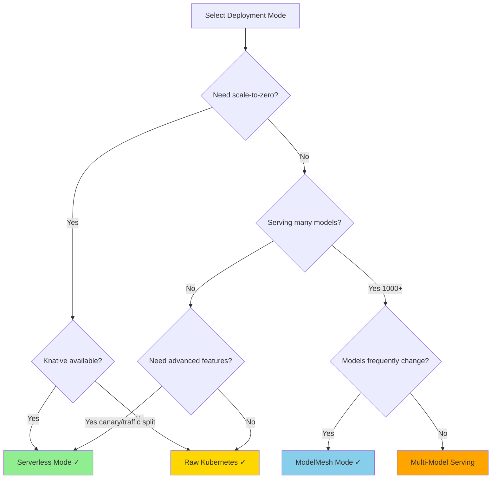
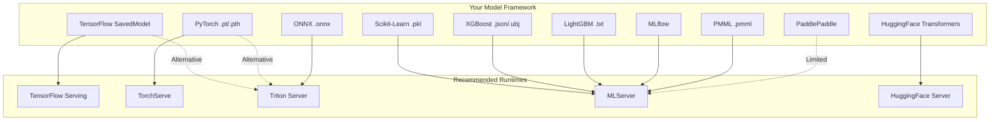
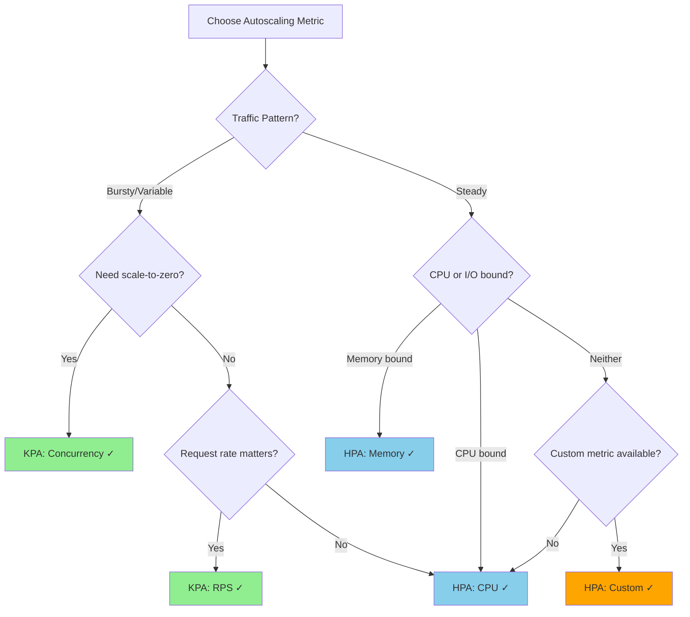

# OpenDataHub ML Serving - Quick Reference Guide

## Decision Matrices and Comparison Tables

### Table of Contents
1. [Component Quick Reference](#component-quick-reference)
2. [Deployment Mode Selection](#deployment-mode-selection)
3. [Serving Runtime Selection](#serving-runtime-selection)
4. [Storage Backend Selection](#storage-backend-selection)
5. [Autoscaling Strategy Selection](#autoscaling-strategy-selection)
6. [Protocol Selection](#protocol-selection)
7. [Architecture Decision Records](#architecture-decision-records)

---

## Component Quick Reference

### KServe

| Aspect | Details |
|--------|---------|
| **Primary Purpose** | Model inference platform |
| **Deployment Modes** | Serverless, RawDeployment, ModelMesh |
| **Key CRDs** | InferenceService, ServingRuntime, TrainedModel, InferenceGraph |
| **Protocols** | V1 REST, V2 REST, OpenAI, gRPC |
| **Supported Frameworks** | TensorFlow, PyTorch, Scikit-Learn, XGBoost, LightGBM, ONNX, Triton, HuggingFace |
| **Autoscaling** | KPA (scale-to-zero), HPA (CPU/Memory), Custom Metrics |
| **Key Features** | Multi-model serving, InferenceGraph, Canary rollouts, A/B testing |
| **Best For** | Production ML inference, Multi-framework support |
| **Port** | 8080 (HTTP), 8081 (HTTP/2), 9000 (gRPC) |

### ODH Model Controller

| Aspect | Details |
|--------|---------|
| **Primary Purpose** | Model lifecycle management |
| **Key CRDs** | ModelDefinition, ServingConfiguration |
| **Integration** | KServe, Model Registry |
| **Key Features** | Automated deployment, Version management, Multi-tenancy |
| **Best For** | Enterprise model governance, Team collaboration |
| **Management** | Model catalog, Deployment automation |

### LLM-D Routing Sidecar

| Aspect | Details |
|--------|---------|
| **Primary Purpose** | Intelligent request routing for LLMs |
| **Version** | 0.3 |
| **Key Features** | Load-aware routing, Multi-level caching, QoS management, Failover |
| **Routing Strategies** | Load-based, Cache-aware, QoS-based, Cost-optimized |
| **Caching** | Local + Distributed (Redis) |
| **Best For** | High-traffic LLM serving, Cost optimization |
| **Port** | 8080 (HTTP), 9090 (Metrics) |

### LLM-D Inference Scheduler

| Aspect | Details |
|--------|---------|
| **Primary Purpose** | Task scheduling and resource management |
| **Version** | 0.3.1 |
| **Policies** | FIFO, Priority, Fair Share, SJF, Deadline-aware |
| **GPU Features** | Time-slicing, MIG support, Fractional allocation |
| **Key Features** | Batch processing, Preemption, Backfilling, Multi-tenancy |
| **Best For** | Multi-user GPU environments, Resource optimization |
| **Port** | 8081 (API), 9091 (Metrics) |

---

## Deployment Mode Selection

### When to Use Each Mode



### Detailed Comparison

| Feature | Serverless | Raw Kubernetes | ModelMesh | Multi-Model |
|---------|-----------|----------------|-----------|-------------|
| **Scale to Zero** | ✅ Yes | ❌ No | ❌ No | ❌ No |
| **GPU Autoscaling** | ✅ Yes | ⚠️ Limited | ❌ No | ⚠️ Limited |
| **Canary Rollouts** | ✅ Yes | ⚠️ Manual | ❌ No | ❌ No |
| **Traffic Splitting** | ✅ Yes | ⚠️ Manual | ✅ Yes | ❌ No |
| **Cold Start** | ~30-60s | N/A | ~5-10s | ~1-2s |
| **Setup Complexity** | High | Low | High | Medium |
| **Resource Overhead** | Medium | Low | Low | Very Low |
| **Max Models/Cluster** | ~100s | ~100s | ~10,000s | ~1000s |
| **Model Loading** | On-demand | Always loaded | On-demand | Dynamic |
| **Dependencies** | Knative, Istio | None | ModelMesh | None |
| **Cost Efficiency** | High (idle $0) | Low | High | Very High |
| **Latency (P99)** | 50-500ms | 10-50ms | 20-100ms | 10-50ms |
| **Best Use Case** | Variable traffic | Steady traffic | Many models | Shared models |

### Recommendation Matrix

| Scenario | Recommended Mode | Reason |
|----------|-----------------|---------|
| **API with variable traffic** | Serverless | Scale-to-zero saves costs |
| **Batch processing** | Raw Kubernetes | Steady load, no need for scale-to-zero |
| **Development/Testing** | Serverless | Easy cleanup, cost effective |
| **10,000+ models** | ModelMesh | Designed for high-density serving |
| **Shared model pool** | Multi-Model | Efficient resource sharing |
| **Real-time, low latency** | Raw Kubernetes | No cold start penalty |
| **GPU inference with sporadic use** | Serverless | GPU expensive, scale to zero |
| **Production critical** | Raw Kubernetes | Predictable performance |

---

## Serving Runtime Selection

### Framework to Runtime Mapping



### Runtime Comparison Table

| Runtime | Frameworks | Protocol | GPU | Multi-Model | Perf. | Complexity | Best For |
|---------|-----------|----------|-----|-------------|-------|------------|----------|
| **TF Serving** | TensorFlow | V1, gRPC | ✅ | ✅ | ⭐⭐⭐⭐⭐ | Low | TF models, high throughput |
| **TorchServe** | PyTorch | V1, V2 | ✅ | ✅ | ⭐⭐⭐⭐ | Medium | PyTorch models |
| **Triton** | Multi-framework | V2, gRPC | ✅ | ✅ | ⭐⭐⭐⭐⭐ | High | NVIDIA GPUs, mixed frameworks |
| **MLServer** | SKLearn, XGB, LGB | V2 | ❌ | ✅ | ⭐⭐⭐ | Low | CPU models, Python ML libs |
| **HF Server** | Transformers, LLMs | V1, V2, OpenAI | ✅ | ❌ | ⭐⭐⭐⭐ | Medium | LLMs, text generation |
| **SKLearn Server** | Scikit-Learn | V1, V2 | ❌ | ✅ | ⭐⭐⭐ | Low | SKLearn only |
| **XGBoost Server** | XGBoost | V1, V2 | ❌ | ✅ | ⭐⭐⭐ | Low | XGBoost only |
| **LightGBM Server** | LightGBM | V1, V2 | ❌ | ✅ | ⭐⭐⭐ | Low | LightGBM only |
| **PMML Server** | PMML | V1, V2 | ❌ | ✅ | ⭐⭐ | Low | PMML models |

### Selection Decision Tree

```
1. Do you need GPU acceleration?
   ├─ Yes → Is it TensorFlow?
   │         ├─ Yes → TensorFlow Serving
   │         └─ No → Is it PyTorch?
   │                  ├─ Yes → TorchServe
   │                  └─ No → Triton Inference Server
   │
   └─ No → What framework?
            ├─ Scikit-Learn → MLServer or SKLearnServer
            ├─ XGBoost → MLServer or XGBoostServer
            ├─ LightGBM → MLServer or LightGBMServer
            └─ MLflow → MLServer

2. Do you need LLM-specific features?
   └─ Yes → HuggingFace Server (OpenAI API support)

3. Do you have multiple model formats?
   └─ Yes → Triton (supports TF, PyTorch, ONNX, TensorRT)

4. Do you need maximum performance?
   └─ Yes → TensorFlow Serving (TF) or Triton (mixed)
```

---

## Storage Backend Selection

### Storage Backend Comparison

| Backend | Use Case | Speed | Cost | Complexity | Best For |
|---------|----------|-------|------|------------|----------|
| **S3/MinIO** | Cloud/On-prem object storage | ⭐⭐⭐ | Low | Low | General purpose, large models |
| **PVC** | Kubernetes persistent volume | ⭐⭐⭐⭐⭐ | Medium | Medium | Fast loading, frequently used |
| **HuggingFace Hub** | HF models | ⭐⭐⭐ | Free | Low | Public HF models |
| **OCI Registry** | Container registry | ⭐⭐⭐⭐ | Low | Medium | Version control, immutability |
| **GCS** | Google Cloud Storage | ⭐⭐⭐ | Low | Low | GCP deployments |
| **Azure Blob** | Azure storage | ⭐⭐⭐ | Low | Low | Azure deployments |
| **HTTP/HTTPS** | Any web server | ⭐⭐ | Varies | Low | Public URLs |
| **HDFS** | Hadoop clusters | ⭐⭐⭐ | Medium | High | Big data environments |

### Model Size Considerations

| Model Size | Recommended Storage | Cold Start Time | Strategy |
|-----------|-------------------|-----------------|----------|
| **< 100MB** | Any | < 5s | Direct download OK |
| **100MB - 1GB** | S3, PVC | 5-30s | Consider PVC for frequent use |
| **1GB - 10GB** | PVC, S3 with cache | 30-120s | Use PVC or model caching |
| **10GB - 50GB** | PVC, OCI | 2-10min | PVC mandatory, or OCI image |
| **> 50GB** | PVC, Distributed | 10+ min | Use PVC + pre-loading |

### Storage Configuration Examples

#### S3-Compatible Storage

```yaml
apiVersion: v1
kind: Secret
metadata:
  name: s3-credentials
type: Opaque
stringData:
  AWS_ACCESS_KEY_ID: "your-access-key"
  AWS_SECRET_ACCESS_KEY: "your-secret-key"
  AWS_ENDPOINT_URL: "https://s3.amazonaws.com"  # or MinIO URL
  AWS_REGION: "us-east-1"
---
apiVersion: serving.kserve.io/v1beta1
kind: InferenceService
metadata:
  annotations:
    serving.kserve.io/s3-secret-name: s3-credentials
spec:
  predictor:
    model:
      storageUri: s3://my-bucket/models/my-model
```

#### PVC Storage

```yaml
apiVersion: v1
kind: PersistentVolumeClaim
metadata:
  name: model-storage
spec:
  accessModes:
  - ReadWriteOnce
  resources:
    requests:
      storage: 100Gi
  storageClassName: fast-ssd
---
apiVersion: serving.kserve.io/v1beta1
kind: InferenceService
spec:
  predictor:
    model:
      storageUri: pvc://model-storage/path/to/model
```

#### HuggingFace Hub

```yaml
apiVersion: v1
kind: Secret
metadata:
  name: hf-token
type: Opaque
stringData:
  HF_TOKEN: "hf_xxxxxxxxxxxxxxxxxxxxx"
---
apiVersion: serving.kserve.io/v1beta1
kind: InferenceService
metadata:
  annotations:
    serving.kserve.io/storage-spec-key: hf-token
spec:
  predictor:
    model:
      storageUri: hf://meta-llama/Llama-2-7b-hf
```

---

## Autoscaling Strategy Selection

### Autoscaler Comparison

| Aspect | KPA (Knative) | HPA (Kubernetes) |
|--------|---------------|------------------|
| **Scale to Zero** | ✅ Yes | ❌ No |
| **Metrics** | Concurrency, RPS | CPU, Memory, Custom |
| **Reaction Time** | Fast (~2s) | Slower (~15s) |
| **Min Replicas** | 0 or 1+ | 1+ |
| **Dependencies** | Knative Serving | Kubernetes Metrics Server |
| **Complexity** | Medium | Low |
| **Cold Start** | Yes (if min=0) | No |
| **Best For** | Variable, bursty traffic | Steady, predictable traffic |

### Metric Selection Guide



### Configuration Examples by Use Case

#### High-Throughput API (Concurrency-based)

```yaml
metadata:
  annotations:
    autoscaling.knative.dev/class: "kpa.autoscaling.knative.dev"
    autoscaling.knative.dev/metric: "concurrency"
    autoscaling.knative.dev/target: "100"
    autoscaling.knative.dev/target-utilization-percentage: "70"
spec:
  predictor:
    minReplicas: 2
    maxReplicas: 20
    containerConcurrency: 150
```

#### Batch Processing (CPU-based)

```yaml
metadata:
  annotations:
    autoscaling.knative.dev/class: "hpa.autoscaling.knative.dev"
    autoscaling.knative.dev/metric: "cpu"
    autoscaling.knative.dev/target: "80"
spec:
  predictor:
    minReplicas: 5
    maxReplicas: 50
```

#### LLM Serving (RPS-based with scale-to-zero)

```yaml
metadata:
  annotations:
    autoscaling.knative.dev/metric: "rps"
    autoscaling.knative.dev/target: "10"
spec:
  predictor:
    minReplicas: 0  # Scale to zero when idle
    maxReplicas: 10
```

---

## Protocol Selection

### Protocol Comparison

| Protocol | Version | Transport | Use Case | Complexity | Performance |
|----------|---------|-----------|----------|------------|-------------|
| **V1 REST** | Legacy | HTTP | TensorFlow, PyTorch | Low | ⭐⭐⭐ |
| **V2 REST** | Standard | HTTP | All frameworks | Low | ⭐⭐⭐⭐ |
| **V2 gRPC** | Standard | gRPC | High performance | Medium | ⭐⭐⭐⭐⭐ |
| **OpenAI** | LLM-specific | HTTP | LLMs, ChatGPT-compatible | Low | ⭐⭐⭐⭐ |

### When to Use Each Protocol

```
V1 REST:
✓ Legacy TensorFlow models
✓ Simple request/response
✓ Quick migration from TF Serving
✗ Limited features
✗ Being deprecated

V2 REST:
✓ Standard protocol across frameworks
✓ Multi-input/output support
✓ Model repository management
✓ Better metadata support
✓ Recommended for most use cases

V2 gRPC:
✓ High performance requirements
✓ Low latency critical
✓ Efficient binary serialization
✓ Streaming support
✗ More complex client implementation

OpenAI API:
✓ LLMs (GPT, Llama, etc.)
✓ Chat applications
✓ Compatible with OpenAI clients
✓ Standard for generative AI
```

### Request Format Examples

**V1 Protocol:**
```json
{
  "instances": [[1.0, 2.0, 3.0, 4.0]]
}
```

**V2 Protocol:**
```json
{
  "inputs": [
    {
      "name": "input",
      "shape": [1, 4],
      "datatype": "FP32",
      "data": [1.0, 2.0, 3.0, 4.0]
    }
  ]
}
```

**OpenAI Protocol:**
```json
{
  "model": "llama-2-7b",
  "messages": [
    {"role": "user", "content": "Hello!"}
  ]
}
```

---

## Architecture Decision Records

### ADR-001: Choosing Between Raw and Serverless Deployment

**Context:**
Deploying a production model inference service with variable traffic patterns.

**Decision Matrix:**

| Factor | Raw Kubernetes | Serverless (Knative) | Weight | Raw Score | Serverless Score |
|--------|----------------|---------------------|--------|-----------|------------------|
| Cost (scale-to-zero) | ❌ | ✅ | 30% | 0 | 30 |
| Cold start acceptable | ✅ | ⚠️ | 25% | 25 | 12 |
| Setup complexity | ✅ | ❌ | 10% | 10 | 0 |
| Traffic splitting | ⚠️ | ✅ | 20% | 5 | 20 |
| Operational overhead | ✅ | ⚠️ | 15% | 15 | 7 |
| **Total** | | | **100%** | **55** | **69** |

**Decision:** Choose **Serverless** for cost savings and traffic management features. Accept cold start trade-off.

### ADR-002: Multi-Model vs. Individual InferenceServices

**Scenario:** 500 small ML models, each < 100MB

**Option 1: Individual InferenceServices**
- Pros: Isolation, independent scaling
- Cons: High overhead (500 pods), resource waste
- Cost: ~250 CPU cores overhead (sidecars)

**Option 2: Multi-Model Serving**
- Pros: Low overhead (5-10 pods), efficient resources
- Cons: Shared failure domain, complex debugging
- Cost: ~5 CPU cores overhead

**Decision:** Use **Multi-Model Serving** with TrainedModel CRs. Cost savings: 98%

### ADR-003: Caching Strategy for LLM Serving

**Requirements:**
- 10,000 requests/day
- 30% identical prompts
- Average response time: 2 seconds
- GPU cost: $3/hour

**Without Caching:**
- Total GPU time: 10,000 * 2s = 5.56 hours
- Cost: 5.56 * $3 = $16.68/day

**With Caching (30% hit rate):**
- Cached: 3,000 * 0.005s = 15s
- GPU: 7,000 * 2s = 3.89 hours
- Cost: 3.89 * $3 = $11.67/day
- Savings: 30% ($5/day = $1,825/year)

**Decision:** Implement multi-level caching with routing sidecar. ROI: 180%

---

## Component Interaction Cheat Sheet

### Request Path: Client → Model

```
1. Serverless Mode:
Client → Ingress → Istio VirtualService → Knative Service
  → Queue Proxy → [Transformer] → Predictor → [Explainer]

2. Raw Mode:
Client → Ingress → Kubernetes Service → Pod
  → [Transformer] → Predictor → [Explainer]

3. With LLM Routing:
Client → LoadBalancer → Routing Sidecar → Scheduler
  → InferenceService → Model
```

### Model Loading Path

```
1. S3/Cloud Storage:
InferenceService Created → Storage Initializer Init Container
  → Download from S3 → Extract to /mnt/models
  → Main Container Starts → Model Server Loads Model

2. PVC:
InferenceService Created → PVC Mounted at /mnt/models
  → Main Container Starts → Model Server Loads Model

3. Multi-Model:
TrainedModel Created → Controller Updates ConfigMap
  → Model Agent Watches ConfigMap → Downloads Model
  → Calls Model Server Load API → Model Ready
```

### Autoscaling Flow

```
KPA (Knative):
Traffic → Queue Proxy → Reports Metrics (every 2s)
  → Autoscaler → Calculates Desired Replicas
  → Updates KnativeService → K8s Scales Pods

HPA (Kubernetes):
Metrics Server → Collects Pod Metrics (every 15s)
  → HPA Controller → Calculates Desired Replicas
  → Updates Deployment → K8s Scales Pods
```

---

## Resource Sizing Guidelines

### Small Models (< 1GB)

```yaml
resources:
  requests:
    cpu: "500m"
    memory: 2Gi
  limits:
    cpu: "2"
    memory: 4Gi
```

**Recommendation:** CPU-only, 2-5 replicas for production

### Medium Models (1-10GB)

```yaml
resources:
  requests:
    cpu: "2"
    memory: 8Gi
  limits:
    cpu: "4"
    memory: 16Gi
```

**Recommendation:** Consider GPU for latency-critical applications

### Large Models (10-50GB, LLMs)

```yaml
resources:
  requests:
    cpu: "4"
    memory: 32Gi
    nvidia.com/gpu: "1"
  limits:
    cpu: "8"
    memory: 64Gi
    nvidia.com/gpu: "1"
```

**Recommendation:** GPU mandatory, A100 or H100, single replica with autoscaling

### Very Large Models (> 50GB, Large LLMs)

```yaml
resources:
  requests:
    cpu: "8"
    memory: 128Gi
    nvidia.com/gpu: "2"  # or "4" or "8"
  limits:
    cpu: "16"
    memory: 256Gi
    nvidia.com/gpu: "2"
```

**Recommendation:** Multi-GPU, tensor parallelism, consider model quantization

---

## Common Patterns Quick Reference

### Pattern: Canary Deployment

```yaml
# Deploy new version with 10% traffic
apiVersion: serving.kserve.io/v1beta1
kind: InferenceService
metadata:
  name: my-model
spec:
  predictor:
    canaryTrafficPercent: 10
    model:
      # New version
```

### Pattern: A/B Testing

```yaml
# Use InferenceGraph Splitter
apiVersion: serving.kserve.io/v1alpha1
kind: InferenceGraph
spec:
  nodes:
    root:
      routerType: Splitter
      steps:
      - serviceName: model-a
        weight: 50
      - serviceName: model-b
        weight: 50
```

### Pattern: Model Chaining

```yaml
# Use InferenceGraph Sequence
apiVersion: serving.kserve.io/v1alpha1
kind: InferenceGraph
spec:
  nodes:
    root:
      routerType: Sequence
      steps:
      - serviceName: preprocessor
      - serviceName: model
      - serviceName: postprocessor
```

### Pattern: Ensemble Prediction

```yaml
# Use InferenceGraph Ensemble
apiVersion: serving.kserve.io/v1alpha1
kind: InferenceGraph
spec:
  nodes:
    root:
      routerType: Ensemble
      steps:
      - serviceName: model-1
      - serviceName: model-2
      - serviceName: model-3
```

---

## Troubleshooting Quick Checks

### Model Won't Load
```bash
# 1. Check storage credentials
kubectl get secret <secret-name> -o yaml

# 2. Check storage URI accessibility
kubectl run -it --rm debug --image=amazon/aws-cli -- \
  s3 ls s3://bucket/path

# 3. Check init container logs
kubectl logs <pod> -c storage-initializer
```

### Pod Won't Scale
```bash
# 1. Check autoscaler config
kubectl get configmap config-autoscaler -n knative-serving

# 2. Check KPA status
kubectl get kpa -n <namespace>

# 3. Check metrics
kubectl top pods -n <namespace>
```

### Slow Inference
```bash
# 1. Check resource limits
kubectl describe pod <pod-name>

# 2. Check concurrent requests
kubectl logs <pod> -c queue-proxy | grep concurrency

# 3. Check model server metrics
curl http://<pod-ip>:8080/metrics
```

---

## Cost Optimization Checklist

- [ ] Enable scale-to-zero for variable traffic workloads
- [ ] Use multi-model serving for small models
- [ ] Implement caching for repeated requests
- [ ] Use CPU for small models (< 1GB)
- [ ] Reserve GPU only for models requiring it
- [ ] Use spot/preemptible instances for batch workloads
- [ ] Set appropriate min/max replicas
- [ ] Monitor and right-size resource requests
- [ ] Use model quantization (INT8 vs FP32)
- [ ] Implement request batching
- [ ] Use cheaper storage (S3 vs PVC for rarely used models)
- [ ] Delete unused InferenceServices

---

## Security Checklist

- [ ] Enable mTLS between services
- [ ] Use NetworkPolicies for isolation
- [ ] Store credentials in Secrets, not ConfigMaps
- [ ] Enable RBAC for namespace isolation
- [ ] Use ServiceAccounts with minimal permissions
- [ ] Scan container images for vulnerabilities
- [ ] Enable audit logging
- [ ] Implement rate limiting
- [ ] Use API keys/authentication for external access
- [ ] Encrypt data at rest (PVC, S3)
- [ ] Regularly rotate credentials
- [ ] Monitor for anomalous traffic patterns

---

## Performance Tuning Checklist

- [ ] Set appropriate containerConcurrency
- [ ] Configure batch size for batch inference
- [ ] Tune autoscaling target and window
- [ ] Use gRPC for low-latency requirements
- [ ] Enable HTTP/2 keep-alive
- [ ] Optimize model server threads (OMP_NUM_THREADS)
- [ ] Use GPU when beneficial (not all models benefit)
- [ ] Implement model caching strategies
- [ ] Pre-warm models if scale-to-zero is used
- [ ] Monitor and optimize P99 latency
- [ ] Use model optimization (ONNX, TensorRT)
- [ ] Enable request batching where appropriate

---

**Quick Reference Version**: 1.0  
**Last Updated**: October 26, 2025  
**For Full Details**: See ODH-ML-SERVING-ARCHITECTURE.md

