# OpenDataHub ML Serving - Simple Architecture & Flows

## Easy-to-Understand Guide with Flowcharts

This document explains **how everything works** using simple language and flowcharts. No complex technical jargon - just clear explanations anyone can follow.

---

## Table of Contents

1. [What Is This System?](#what-is-this-system)
2. [The Four Main Components](#the-four-main-components)
3. [How They Work Together](#how-they-work-together)
4. [Complete Flows with Flowcharts](#complete-flows-with-flowcharts)
5. [Feature-by-Feature Explanation](#feature-by-feature-explanation)

---

## What Is This System?

Imagine you have trained a machine learning model (like ChatGPT, but yours). Now you want to:
- **Deploy it** so people can use it
- **Scale it** when lots of people use it
- **Manage it** without breaking a sweat
- **Optimize costs** so you're not paying for idle resources

This is what the OpenDataHub ML Serving system does for you!

### The Big Picture

```mermaid
flowchart TB
    User[👤 User<br/>Wants AI Response] --> System[🎯 ODH ML Serving System]
    System --> Model[🤖 Your AI Model]
    Model --> Response[💬 AI Response]
    Response --> User
    
    style User fill:#e1f5ff
    style System fill:#fff4e1
    style Model fill:#e8f5e9
    style Response fill:#f3e5f5
```

**That's it!** User asks → System handles → Model responds → User happy.

But what happens inside the system? Let's break it down...

---

## The Four Main Components

Think of building a restaurant 🍽️ to understand these components:

### 1. KServe (The Kitchen) 🏪

**What it does**: Runs your AI models (like a kitchen cooks food)

**Key Features**:
- Serves different types of models (TensorFlow, PyTorch, LLMs)
- Scales up when busy, scales down when quiet
- Can serve multiple models at once
- Handles the heavy lifting

**Real-World Example**: Like a cloud kitchen that can cook Italian, Chinese, and Indian food all at once.

---

### 2. ODH Model Controller (The Restaurant Manager) 👔

**What it does**: Manages the whole operation (like a restaurant manager)

**Key Features**:
- Keeps track of all your models
- Decides which models to deploy
- Monitors if models are working
- Handles versions (Model v1, v2, v3)

**Real-World Example**: The manager who knows the menu, trains the staff, and keeps everything running smoothly.

---

### 3. LLM-D Routing Sidecar (The Smart Waiter) 🚶

**What it does**: Routes customer requests to the best available chef (model)

**Key Features**:
- Checks who's busy and who's free
- Remembers previous orders (caching)
- Sends urgent orders first (priority)
- Finds backup if main chef is busy

**Real-World Example**: A waiter who knows which chef is fastest and assigns orders smartly.

---

### 4. LLM-D Inference Scheduler (The Kitchen Coordinator) 📋

**What it does**: Organizes the cooking schedule (who cooks what and when)

**Key Features**:
- Manages the cooking queue
- Prioritizes urgent orders
- Balances workload across chefs
- Decides when to call more chefs (scaling)

**Real-World Example**: The person with a clipboard organizing which orders go to which chef.

---

## How They Work Together

### The Restaurant Analogy - Complete Picture

```mermaid
flowchart TB
    subgraph "Front of House"
        Customer[👤 Customer]
        Waiter[Smart Waiter<br/>Router]
    end
    
    subgraph "Management"
        Manager[Restaurant Manager<br/>ODH Controller]
        MenuBook[Menu Book<br/>Model Registry]
    end
    
    subgraph "Kitchen - Back of House"
        Coordinator[Kitchen Coordinator<br/>Scheduler]
        Chef1[👨‍🍳 Chef 1<br/>Model Instance]
        Chef2[👨‍🍳 Chef 2<br/>Model Instance]
        Chef3[👨‍🍳 Chef 3<br/>Model Instance]
        Kitchen[Kitchen Equipment<br/>KServe Platform]
    end
    
    subgraph "Storage"
        Pantry[Pantry<br/>Model Storage]
        RecipeCache[Recipe Cache<br/>Response Cache]
    end
    
    Customer -->|Places Order| Waiter
    Waiter -->|Check Cache| RecipeCache
    RecipeCache -.Already Made.-> Waiter
    Waiter -->|New Order| Coordinator
    
    Manager -->|Updates Menu| MenuBook
    Manager -->|Hire/Fire Chefs| Kitchen
    
    Kitchen -->|Get Recipes| Pantry
    Kitchen -->|Creates| Chef1
    Kitchen -->|Creates| Chef2
    Kitchen -->|Creates| Chef3
    
    Coordinator -->|Assign Order| Chef1
    Coordinator -->|Assign Order| Chef2
    Coordinator -->|Assign Order| Chef3
    
    Chef1 -->|Cooked Food| Coordinator
    Coordinator -->|Deliver| Waiter
    Waiter -->|Serve| Customer
    
    style Customer fill:#e1f5ff
    style Waiter fill:#fff9c4
    style Manager fill:#ffccbc
    style Coordinator fill:#fff4e1
    style Chef1 fill:#c8e6c9
    style Chef2 fill:#c8e6c9
    style Chef3 fill:#c8e6c9
    style Kitchen fill:#b2dfdb
```

---

## Complete Flows with Flowcharts

### Flow 1: Deploying a New Model (Chef Onboarding)

**Simple Explanation**: Getting a new chef ready to cook

```mermaid
flowchart TB
    Start([👨‍💻 Data Scientist<br/>Has Trained Model]) --> Upload[Upload Model to Storage<br/>Like Storing Recipe]
    
    Upload --> Register[Tell Manager about Model<br/>ODH Controller]
    
    Register --> Manager{Manager Checks}
    Manager -->|Model Good?| Approve[✅ Approved]
    Manager -->|Model Bad?| Reject[❌ Rejected - Fix Issues]
    
    Reject --> Start
    
    Approve --> Kitchen[Tell Kitchen to Prepare<br/>KServe]
    
    Kitchen --> Download[Download Model<br/>Get Recipe & Ingredients]
    
    Download --> Load[Load Model into Memory<br/>Chef Memorizes Recipe]
    
    Load --> Test[Test Model<br/>Chef Cooks Test Dish]
    
    Test --> Ready{Test Passed?}
    
    Ready -->|Yes| Register2[Register with Waiter & Coordinator<br/>Router + Scheduler]
    Ready -->|No| Debug[Debug Model]
    
    Debug --> Download
    
    Register2 --> Live([🎉 Model LIVE!<br/>Ready to Serve Customers])
    
    style Start fill:#e1bee7
    style Upload fill:#bbdefb
    style Register fill:#ffccbc
    style Manager fill:#fff4e1
    style Approve fill:#c8e6c9
    style Reject fill:#ffcdd2
    style Kitchen fill:#b2dfdb
    style Download fill:#c5cae9
    style Load fill:#fff9c4
    style Test fill:#ffe0b2
    style Ready fill:#fff4e1
    style Register2 fill:#c8e6c9
    style Live fill:#a5d6a7
    style Debug fill:#ffccbc
```

**Step-by-Step**:
1. **Upload**: Put your model files in storage (like S3)
2. **Register**: Tell ODH Controller "I have a new model!"
3. **Check**: Controller validates it's a real model
4. **Prepare**: KServe downloads the model
5. **Load**: Model gets loaded into memory (GPU/CPU)
6. **Test**: Run a test inference
7. **Register**: Tell Router and Scheduler "New chef available!"
8. **Live**: Start accepting real requests! 🎉

**Time**: Usually 1-2 minutes for small models, 5-10 minutes for large LLMs

---

### Flow 2: User Makes a Request (Customer Orders Food)

**Simple Explanation**: What happens when someone asks your AI a question

```mermaid
flowchart TB
    Start([👤 User Sends Request<br/>Ask AI Question]) --> Gateway[API Gateway<br/>Front Door]
    
    Gateway --> Auth{Check<br/>Authentication}
    Auth -->|Invalid| Reject([❌ Access Denied])
    Auth -->|Valid| Router[Smart Waiter<br/>Routing Sidecar]
    
    Router --> Cache{Check Cache<br/>Already Answered This?}
    
    Cache -->|Hit - Found It!| FastReturn([⚡ Return Cached Answer<br/>5ms - Super Fast!])
    
    Cache -->|Miss - Not in Cache| CheckStatus[Check Kitchen Status<br/>Load Monitor]
    
    CheckStatus --> GetMetrics[Get Chef Status:<br/>- Who's busy?<br/>- Who's free?<br/>- Who's fast?]
    
    GetMetrics --> Scheduler[Kitchen Coordinator<br/>Scheduler]
    
    Scheduler --> PickChef{Pick Best Chef}
    
    PickChef -->|Chef 1 Free & Fast| Chef1[👨‍🍳 Assign to Chef 1]
    PickChef -->|Chef 1 Busy| Chef2[👨‍🍳 Assign to Chef 2]
    PickChef -->|All Busy| WaitQueue[⏳ Wait in Queue]
    
    WaitQueue --> Chef1
    
    Chef1 --> Process[Chef Cooks<br/>Model Generates Answer]
    Chef2 --> Process
    
    Process --> Quality{Check<br/>Quality}
    
    Quality -->|Good| SaveCache[Save to Cache<br/>For Next Time]
    Quality -->|Error| Retry[Retry or Fallback]
    
    Retry --> Chef2
    
    SaveCache --> Return([✅ Return Answer to User<br/>2-5 seconds])
    
    style Start fill:#e1f5ff
    style Gateway fill:#c5cae9
    style Auth fill:#fff4e1
    style Reject fill:#ffcdd2
    style Router fill:#fff9c4
    style Cache fill:#ffe0b2
    style FastReturn fill:#a5d6a7
    style CheckStatus fill:#b2dfdb
    style GetMetrics fill:#c5cae9
    style Scheduler fill:#fff4e1
    style PickChef fill:#ffccbc
    style Chef1 fill:#c8e6c9
    style Chef2 fill:#c8e6c9
    style WaitQueue fill:#ffccbc
    style Process fill:#fff9c4
    style Quality fill:#ffe0b2
    style SaveCache fill:#c5cae9
    style Return fill:#a5d6a7
    style Retry fill:#ffccbc
```

**Performance Numbers**:
- **Cache Hit**: 5-10ms (instant!)
- **Small Model**: 100-500ms
- **Medium LLM**: 1-3 seconds
- **Large LLM**: 3-10 seconds

---

### Flow 3: Scaling Up (Rush Hour!)

**Simple Explanation**: What happens when suddenly 1000 customers show up

```mermaid
flowchart TB
    Start([📈 Sudden Traffic Spike<br/>1000 Requests!]) --> Detect[Monitor Detects<br/>Queue Building Up]
    
    Detect --> Alert[⚠️ Alert System<br/>Need More Chefs!]
    
    Alert --> Decide{Check Resources}
    
    Decide -->|Have Budget| Approve[✅ Approved to Scale]
    Decide -->|No Budget| Queue[😅 Queue Requests<br/>Slower Service]
    
    Approve --> Calculate[Calculate How Many:<br/>Need 5 more chefs]
    
    Calculate --> Create[Create New Model Instances<br/>Hire 5 Chefs]
    
    Create --> Wait[⏳ Wait 60-90 seconds<br/>Cold Start Time<br/>Loading Models]
    
    Wait --> Ready1[Chef 1 Ready]
    Wait --> Ready2[Chef 2 Ready]
    Wait --> Ready3[Chef 3 Ready]
    Wait --> Ready4[Chef 4 Ready]
    Wait --> Ready5[Chef 5 Ready]
    
    Ready1 --> Register[Register New Chefs<br/>with Router & Scheduler]
    Ready2 --> Register
    Ready3 --> Register
    Ready4 --> Register
    Ready5 --> Register
    
    Register --> Distribute[Distribute Load<br/>Balance Requests]
    
    Distribute --> Serve[🎉 Serving All Customers<br/>Queue Draining Fast]
    
    Serve --> Monitor[Continue Monitoring]
    
    Monitor --> Normal{Traffic<br/>Back to Normal?}
    
    Normal -->|Still High| Monitor
    Normal -->|Back to Normal| ScaleDown[Scale Down<br/>Release Extra Chefs<br/>Save Money! 💰]
    
    ScaleDown --> End([✅ Optimized & Efficient])
    
    style Start fill:#ffccbc
    style Detect fill:#fff4e1
    style Alert fill:#ffcdd2
    style Decide fill:#fff4e1
    style Approve fill:#c8e6c9
    style Queue fill:#ffccbc
    style Calculate fill:#c5cae9
    style Create fill:#b2dfdb
    style Wait fill:#ffe0b2
    style Ready1 fill:#c8e6c9
    style Ready2 fill:#c8e6c9
    style Ready3 fill:#c8e6c9
    style Ready4 fill:#c8e6c9
    style Ready5 fill:#c8e6c9
    style Register fill:#c5cae9
    style Distribute fill:#fff9c4
    style Serve fill:#a5d6a7
    style Monitor fill:#c5cae9
    style Normal fill:#fff4e1
    style ScaleDown fill:#fff9c4
    style End fill:#a5d6a7
```

**Key Points**:
- **Cold Start**: 60-90 seconds to start a new model
- **Warm Start**: If model is cached, only 5-10 seconds
- **Scale to Zero**: Can go down to 0 instances when no traffic (save money!)
- **Auto-scaling**: Completely automatic, no manual work

---

### Flow 4: Multi-Model Serving (Multiple Restaurants)

**Simple Explanation**: Running multiple AI models at once

```mermaid
flowchart TB
    Start([👨‍💻 Deploy Multiple Models]) --> List[Model List:<br/>1. GPT Model<br/>2. Translation Model<br/>3. Image Model]
    
    List --> Deploy1[Deploy GPT<br/>For Chat]
    List --> Deploy2[Deploy Translator<br/>For Languages]
    List --> Deploy3[Deploy Vision<br/>For Images]
    
    Deploy1 --> Register[Register All Models<br/>with System]
    Deploy2 --> Register
    Deploy3 --> Register
    
    Register --> Ready([All Models Running])
    
    Ready --> Request1[User Request:<br/>Chat Question]
    Ready --> Request2[User Request:<br/>Translate Text]
    Ready --> Request3[User Request:<br/>Analyze Image]
    
    Request1 --> Router{Smart Router}
    Request2 --> Router
    Request3 --> Router
    
    Router -->|Chat| GPT[GPT Model]
    Router -->|Translate| Trans[Translation Model]
    Router -->|Image| Vision[Vision Model]
    
    GPT --> Response[Return Responses]
    Trans --> Response
    Vision --> Response
    
    Response --> Monitor[Monitor Usage]
    
    Monitor --> Optimize{Optimize<br/>Resources}
    
    Optimize -->|GPT Used Most| ScaleGPT[Scale UP GPT<br/>Scale DOWN Others]
    Optimize -->|Translation Unused| ScaleDown[Scale Down to 0<br/>Save Money]
    Optimize -->|All Used Equally| Balance[Keep Balanced]
    
    ScaleGPT --> End([💰 Cost Optimized])
    ScaleDown --> End
    Balance --> End
    
    style Start fill:#e1bee7
    style List fill:#c5cae9
    style Deploy1 fill:#bbdefb
    style Deploy2 fill:#b2dfdb
    style Deploy3 fill:#ffe0b2
    style Register fill:#fff9c4
    style Ready fill:#c8e6c9
    style Request1 fill:#e1f5ff
    style Request2 fill:#e1f5ff
    style Request3 fill:#e1f5ff
    style Router fill:#fff4e1
    style GPT fill:#c8e6c9
    style Trans fill:#c8e6c9
    style Vision fill:#c8e6c9
    style Response fill:#a5d6a7
    style Monitor fill:#c5cae9
    style Optimize fill:#fff4e1
    style ScaleGPT fill:#fff9c4
    style ScaleDown fill:#ffccbc
    style Balance fill:#c8e6c9
    style End fill:#a5d6a7
```

**Benefits**:
- Run 10, 100, or 1000 models together
- Each model scales independently
- Unused models cost nothing (scale to zero)
- Smart router picks the right model automatically

---

### Flow 5: When Things Go Wrong (Error Handling)

**Simple Explanation**: What happens when a chef gets sick or equipment breaks

```mermaid
flowchart TB
    Start([Request Coming In]) --> Send[Send to Model]
    
    Send --> Check{Model<br/>Responds?}
    
    Check -->|Success| Happy([✅ All Good!])
    
    Check -->|Timeout| Problem1[⚠️ Problem Detected<br/>Model Not Responding]
    Check -->|Error| Problem1
    Check -->|Crash| Problem1
    
    Problem1 --> Count{How Many<br/>Failures?}
    
    Count -->|First Failure| Retry1[Retry Once<br/>Maybe Network Glitch]
    Count -->|2-3 Failures| Retry2[Try Backup Model]
    Count -->|5+ Failures| CircuitBreaker[🔴 Circuit Breaker!<br/>Stop Trying]
    
    Retry1 --> Check
    
    Retry2 --> BackupModel[Use Backup Model]
    BackupModel --> Success1{Works?}
    Success1 -->|Yes| Notify[Notify Team<br/>Main Model Down]
    Success1 -->|No| Error
    
    CircuitBreaker --> Notify2[🚨 Alert Team<br/>Critical Issue!]
    
    Notify --> Recover[Auto-Recovery Process]
    Notify2 --> Recover
    
    Recover --> RestartPod[Kubernetes Restarts Pod]
    RestartPod --> LoadModel[Reload Model]
    LoadModel --> TestModel[Test Model]
    
    TestModel --> TestResult{Test<br/>Passes?}
    
    TestResult -->|Yes| BackOnline[✅ Back Online!<br/>Resume Traffic]
    TestResult -->|No| ManualFix[Need Human Help]
    
    BackOnline --> Monitor[Continue Monitoring]
    
    ManualFix --> DevTeam[👨‍💻 Dev Team Investigates]
    
    Check -->|Slow Response| Timeout[Taking Too Long]
    Timeout --> CheckLoad{Check System<br/>Load}
    CheckLoad -->|Overloaded| ScaleUp[Scale Up More Instances]
    CheckLoad -->|Normal| CheckModel[Check Model Health]
    
    ScaleUp --> Happy
    CheckModel --> Recover
    
    Error([❌ Error Returned<br/>with Backup])
    
    style Start fill:#e1f5ff
    style Send fill:#c5cae9
    style Check fill:#fff4e1
    style Happy fill:#a5d6a7
    style Problem1 fill:#ffccbc
    style Count fill:#fff4e1
    style Retry1 fill:#ffe0b2
    style Retry2 fill:#ffe0b2
    style CircuitBreaker fill:#ffcdd2
    style BackupModel fill:#c8e6c9
    style Success1 fill:#fff4e1
    style Notify fill:#ffe0b2
    style Notify2 fill:#ffcdd2
    style Recover fill:#c5cae9
    style RestartPod fill:#b2dfdb
    style LoadModel fill:#c8e6c9
    style TestModel fill:#fff9c4
    style TestResult fill:#fff4e1
    style BackOnline fill:#a5d6a7
    style ManualFix fill:#ffccbc
    style Monitor fill:#c5cae9
    style DevTeam fill:#e1bee7
    style Timeout fill:#ffe0b2
    style CheckLoad fill:#fff4e1
    style ScaleUp fill:#c8e6c9
    style CheckModel fill:#c5cae9
    style Error fill:#ffccbc
```

**Failure Recovery Features**:
- **Automatic Retries**: Try again automatically
- **Backup Models**: Switch to alternate model
- **Circuit Breaker**: Stop trying after too many failures
- **Auto-restart**: Kubernetes automatically restarts failed pods
- **Monitoring**: Alerts sent to team immediately
- **Gradual Recovery**: Test before sending real traffic

---

## Feature-by-Feature Explanation

### Feature 1: Model Storage & Loading

**What it does**: Gets your model from storage and loads it into memory

**How it works**:

```mermaid
flowchart LR
    subgraph Storage Options
        S3[☁️ Cloud Storage<br/>S3, GCS, Azure]
        PVC[💾 Kubernetes Volume<br/>Fast Access]
        HF[🤗 HuggingFace Hub<br/>Public Models]
        OCI[📦 Container Registry<br/>Versioned Models]
    end
    
    subgraph Loading Process
        Download[⬇️ Download]
        Extract[📂 Extract Files]
        LoadMem[🧠 Load to Memory]
        LoadGPU[🎮 Load to GPU]
    end
    
    subgraph Result
        Ready[✅ Ready to Serve]
    end
    
    S3 --> Download
    PVC --> Download
    HF --> Download
    OCI --> Download
    
    Download --> Extract
    Extract --> LoadMem
    LoadMem --> LoadGPU
    LoadGPU --> Ready
    
    style S3 fill:#bbdefb
    style PVC fill:#c8e6c9
    style HF fill:#fff9c4
    style OCI fill:#ffe0b2
    style Download fill:#c5cae9
    style Extract fill:#fff4e1
    style LoadMem fill:#ffccbc
    style LoadGPU fill:#ffcdd2
    style Ready fill:#a5d6a7
```

**Simple Explanation**:
1. **Store**: Put model in S3 bucket (like Google Drive)
2. **Download**: System downloads when needed
3. **Extract**: Unzip files if compressed
4. **Load**: Put model in RAM/GPU memory
5. **Ready**: Model ready to use!

**Time**: 30 seconds to 10 minutes depending on model size

---

### Feature 2: Autoscaling (Scale Up & Down)

**What it does**: Automatically adds or removes model instances based on traffic

**How it works**:

```mermaid
flowchart TB
    Start[Monitor Traffic] --> Measure[Measure:<br/>- Requests per second<br/>- Queue length<br/>- Response time<br/>- GPU usage]
    
    Measure --> Decision{Traffic<br/>Pattern?}
    
    Decision -->|High Traffic<br/>Queue > 50| ScaleUp[⬆️ Scale UP]
    Decision -->|Low Traffic<br/>Idle > 5min| ScaleDown[⬇️ Scale DOWN]
    Decision -->|Normal| Stay[👍 Stay Current]
    
    ScaleUp --> Calculate1[Calculate Need:<br/>Current: 2 instances<br/>Queue: 100 requests<br/>Need: 5 instances]
    
    Calculate1 --> Add[Add 3 New Instances]
    Add --> Wait1[Wait for Ready<br/>90 seconds]
    Wait1 --> Distribute[Distribute Traffic]
    
    ScaleDown --> Calculate2[Calculate Savings:<br/>Current: 5 instances<br/>Traffic: Low<br/>Need: 1 instance]
    
    Calculate2 --> Drain[Drain Connections<br/>Finish Current Requests]
    Drain --> Remove[Remove 4 Instances]
    Remove --> Save[💰 Save Money]
    
    Stay --> Continue[Continue Monitoring]
    
    Distribute --> Continue
    Save --> Continue
    Continue --> Start
    
    style Start fill:#c5cae9
    style Measure fill:#fff4e1
    style Decision fill:#ffe0b2
    style ScaleUp fill:#ffccbc
    style ScaleDown fill:#c8e6c9
    style Stay fill:#fff9c4
    style Calculate1 fill:#ffccbc
    style Add fill:#ffcdd2
    style Wait1 fill:#ffe0b2
    style Distribute fill:#c8e6c9
    style Calculate2 fill:#c5cae9
    style Drain fill:#fff9c4
    style Remove fill:#c8e6c9
    style Save fill:#a5d6a7
    style Continue fill:#c5cae9
```

**Simple Explanation**:
- **Busy Time**: Automatically add more models
- **Quiet Time**: Remove unused models (save money!)
- **Scale to Zero**: Go to 0 instances when no traffic
- **Fully Automatic**: No manual work needed

**Example**:
- 9 AM: Traffic starts → Scale from 0 to 3 instances
- 12 PM: Lunch rush → Scale from 3 to 10 instances
- 6 PM: Traffic drops → Scale from 10 to 2 instances
- 10 PM: No traffic → Scale to 0 instances (free!)

---

### Feature 3: Caching (Remember Answers)

**What it does**: Remembers answers to questions you've seen before

**How it works**:

```mermaid
flowchart TB
    Request[New Request Comes In] --> Hash[Create Unique ID<br/>Hash the Question]
    
    Hash --> CheckLocal{Check<br/>Local Cache}
    
    CheckLocal -->|Found!| ReturnFast([⚡ Return in 5ms<br/>Super Fast!])
    
    CheckLocal -->|Not Found| CheckRedis{Check<br/>Shared Cache}
    
    CheckRedis -->|Found!| SaveLocal[Save to Local]
    SaveLocal --> Return2([✅ Return in 10ms<br/>Still Fast!])
    
    CheckRedis -->|Not Found| RunModel[Run Model<br/>Generate Answer]
    
    RunModel --> SaveBoth[Save to Both Caches]
    SaveBoth --> Local[Local Cache]
    SaveBoth --> Redis[Shared Cache]
    
    Local --> Return3([Return in 2000ms<br/>Normal Speed])
    Redis --> Return3
    
    Return3 --> NextTime[Next Time:<br/>Instant from Cache!]
    
    style Request fill:#e1f5ff
    style Hash fill:#c5cae9
    style CheckLocal fill:#fff4e1
    style ReturnFast fill:#a5d6a7
    style CheckRedis fill:#fff4e1
    style SaveLocal fill:#ffe0b2
    style Return2 fill:#c8e6c9
    style RunModel fill:#ffccbc
    style SaveBoth fill:#c5cae9
    style Local fill:#fff9c4
    style Redis fill:#ffe0b2
    style Return3 fill:#c8e6c9
    style NextTime fill:#a5d6a7
```

**Simple Explanation**:
1. **First Time**: Question asked, model generates answer (slow: 2 seconds)
2. **Save**: Answer saved in cache
3. **Second Time**: Same question? Return cached answer (fast: 5ms)
4. **Result**: 400x faster! 🚀

**Cache Hit Rate**: Usually 30-50% of requests are cached

---

### Feature 4: Load Balancing (Share the Work)

**What it does**: Distributes work evenly across all model instances

**How it works**:

```mermaid
flowchart TB
    Requests[100 Incoming Requests] --> Monitor[Monitor All Models]
    
    Monitor --> Check1[Model 1 Status:<br/>Load: 30%<br/>Queue: 2<br/>Latency: 1.5s]
    
    Monitor --> Check2[Model 2 Status:<br/>Load: 80%<br/>Queue: 15<br/>Latency: 4.0s]
    
    Monitor --> Check3[Model 3 Status:<br/>Load: 50%<br/>Queue: 5<br/>Latency: 2.0s]
    
    Check1 --> Score[Calculate Scores:<br/>Model 1: 90/100 ⭐⭐⭐<br/>Model 2: 40/100 ⭐<br/>Model 3: 70/100 ⭐⭐]
    Check2 --> Score
    Check3 --> Score
    
    Score --> Distribute[Distribute Requests]
    
    Distribute --> Send1[Send 50 requests<br/>to Model 1<br/>Best Score!]
    Distribute --> Send2[Send 10 requests<br/>to Model 2<br/>Busy!]
    Distribute --> Send3[Send 40 requests<br/>to Model 3<br/>OK]
    
    Send1 --> Balance[⚖️ Balanced Load]
    Send2 --> Balance
    Send3 --> Balance
    
    Balance --> Result[All Models:<br/>~60% Load<br/>Optimal!]
    
    style Requests fill:#e1f5ff
    style Monitor fill:#c5cae9
    style Check1 fill:#c8e6c9
    style Check2 fill:#ffccbc
    style Check3 fill:#fff9c4
    style Score fill:#fff4e1
    style Distribute fill:#ffe0b2
    style Send1 fill:#a5d6a7
    style Send2 fill:#ffccbc
    style Send3 fill:#c8e6c9
    style Balance fill:#c5cae9
    style Result fill:#a5d6a7
```

**Simple Explanation**:
- **Monitor**: Check which models are busy or free
- **Score**: Calculate best model (least busy, fastest)
- **Distribute**: Send more work to free models
- **Result**: Everyone gets fair share, no one overloaded

---

### Feature 5: Priority Queues (VIP Service)

**What it does**: Handles urgent requests first

**How it works**:

```mermaid
flowchart TB
    Requests[Incoming Requests] --> Classify{Classify<br/>Priority}
    
    Classify --> Critical[🔴 Critical<br/>System Alerts<br/>Priority: 1]
    Classify --> High[🟡 High<br/>Paid Users<br/>Priority: 2]
    Classify --> Normal[🟢 Normal<br/>Regular Users<br/>Priority: 3]
    Classify --> Low[⚪ Low<br/>Batch Jobs<br/>Priority: 4]
    
    Critical --> Q1[Priority Queue 1<br/>80% Resources]
    High --> Q2[Priority Queue 2<br/>15% Resources]
    Normal --> Q3[Priority Queue 3<br/>4% Resources]
    Low --> Q4[Priority Queue 4<br/>1% Resources]
    
    Q1 --> Process[Process Requests]
    Q2 --> Process
    Q3 --> Process
    Q4 --> Process
    
    Process --> Result1[Critical: <1s ⚡]
    Process --> Result2[High: <3s 🚀]
    Process --> Result3[Normal: <10s ✅]
    Process --> Result4[Low: When Available ⏰]
    
    style Requests fill:#e1f5ff
    style Classify fill:#fff4e1
    style Critical fill:#ffcdd2
    style High fill:#fff9c4
    style Normal fill:#c8e6c9
    style Low fill:#e0e0e0
    style Q1 fill:#ffcdd2
    style Q2 fill:#fff9c4
    style Q3 fill:#c8e6c9
    style Q4 fill:#e0e0e0
    style Process fill:#c5cae9
    style Result1 fill:#ffcdd2
    style Result2 fill:#fff9c4
    style Result3 fill:#c8e6c9
    style Result4 fill:#e0e0e0
```

**Simple Explanation**:
- **VIP Lane**: Critical requests skip the queue
- **Express**: High priority gets most resources
- **Regular**: Normal requests wait their turn
- **Batch**: Background jobs run when system is free

**Example**:
- Emergency alert: Immediate (100ms)
- Paid customer: Fast (1-2 seconds)
- Free user: Normal (3-5 seconds)
- Bulk report: Slow but cheap (minutes)

---

### Feature 6: Distributed Inference (Team Cooking)

**What it does**: Splits huge models across multiple GPUs

**How it works**:

```mermaid
flowchart TB
    HugeModel[🐘 Huge 70B Model<br/>140 GB - Too Big!] --> Split{Split Model}
    
    Split --> Part1[Part 1:<br/>35 GB]
    Split --> Part2[Part 2:<br/>35 GB]
    Split --> Part3[Part 3:<br/>35 GB]
    Split --> Part4[Part 4:<br/>35 GB]
    
    Part1 --> GPU1[GPU 1<br/>Node 1]
    Part2 --> GPU2[GPU 2<br/>Node 1]
    Part3 --> GPU3[GPU 3<br/>Node 2]
    Part4 --> GPU4[GPU 4<br/>Node 2]
    
    GPU1 --> Load[All Parts Loaded]
    GPU2 --> Load
    GPU3 --> Load
    GPU4 --> Load
    
    Load --> Connect[Connect GPUs<br/>High-Speed Network]
    
    Connect --> Request[Request Comes In]
    
    Request --> Distribute[Distribute to All GPUs]
    
    Distribute --> Compute1[GPU 1<br/>Computes Part 1]
    Distribute --> Compute2[GPU 2<br/>Computes Part 2]
    Distribute --> Compute3[GPU 3<br/>Computes Part 3]
    Distribute --> Compute4[GPU 4<br/>Computes Part 4]
    
    Compute1 --> Sync[Synchronize Results]
    Compute2 --> Sync
    Compute3 --> Sync
    Compute4 --> Sync
    
    Sync --> Combine[Combine Answers]
    
    Combine --> Final[Final Answer]
    
    Final --> Fast[⚡ 4x Faster!<br/>All GPUs Working Together]
    
    style HugeModel fill:#ffccbc
    style Split fill:#fff4e1
    style Part1 fill:#bbdefb
    style Part2 fill:#c8e6c9
    style Part3 fill:#fff9c4
    style Part4 fill:#ffe0b2
    style GPU1 fill:#bbdefb
    style GPU2 fill:#c8e6c9
    style GPU3 fill:#fff9c4
    style GPU4 fill:#ffe0b2
    style Load fill:#c5cae9
    style Connect fill:#ffe0b2
    style Request fill:#e1f5ff
    style Distribute fill:#fff4e1
    style Compute1 fill:#bbdefb
    style Compute2 fill:#c8e6c9
    style Compute3 fill:#fff9c4
    style Compute4 fill:#ffe0b2
    style Sync fill:#ffccbc
    style Combine fill:#c5cae9
    style Final fill:#c8e6c9
    style Fast fill:#a5d6a7
```

**Simple Explanation**:
1. **Too Big**: Model doesn't fit in one GPU
2. **Split**: Divide model into 4 parts
3. **Distribute**: Put each part on different GPU
4. **Parallel**: All GPUs work together
5. **Combine**: Merge results
6. **Fast**: 4 GPUs = 4x speed!

**Use Cases**:
- GPT-3 size models (175B parameters)
- LLaMA 70B
- Any model > 20GB

---

### Feature 7: Cost Optimization (Save Money!)

**What it does**: Automatically reduces costs while maintaining performance

**How it works**:

```mermaid
flowchart TB
    Start[Monitor Costs & Usage] --> Analyze[Analyze:<br/>- GPU utilization<br/>- Traffic patterns<br/>- Response times<br/>- $ Spent per hour]
    
    Analyze --> FindWaste{Find<br/>Waste}
    
    FindWaste --> Idle[Idle GPU:<br/>30% used<br/>$3/hour wasted]
    FindWaste --> Oversize[Oversized:<br/>A100 for small model<br/>Use cheaper L40]
    FindWaste --> NightTime[Night time:<br/>Zero traffic<br/>Keep running?]
    
    Idle --> Action1[Scale Down:<br/>5 → 2 GPUs<br/>Save: $9/hour]
    
    Oversize --> Action2[Switch to L40:<br/>Same speed<br/>Save: $1.50/hour]
    
    NightTime --> Action3[Scale to Zero:<br/>0 instances at night<br/>Save: $15/hour]
    
    Action1 --> Calculate[Calculate Savings]
    Action2 --> Calculate
    Action3 --> Calculate
    
    Calculate --> Savings[Total Savings:<br/>$25.50/hour<br/>$18,360/month<br/>$220,320/year! 💰]
    
    Savings --> Monitor[Continue Monitoring]
    
    Monitor --> Quality{Quality<br/>Maintained?}
    
    Quality -->|Yes| Great[✅ Great!<br/>Optimized]
    Quality -->|No| Adjust[Adjust Settings<br/>Add Resources]
    
    Adjust --> Monitor
    Great --> Start
    
    style Start fill:#c5cae9
    style Analyze fill:#fff4e1
    style FindWaste fill:#ffccbc
    style Idle fill:#ffcdd2
    style Oversize fill:#ffe0b2
    style NightTime fill:#fff9c4
    style Action1 fill:#c8e6c9
    style Action2 fill:#c8e6c9
    style Action3 fill:#c8e6c9
    style Calculate fill:#c5cae9
    style Savings fill:#a5d6a7
    style Monitor fill:#c5cae9
    style Quality fill:#fff4e1
    style Great fill:#a5d6a7
    style Adjust fill:#ffe0b2
```

**Simple Explanation**:
- **Monitor**: Watch where money is wasted
- **Optimize**: Automatically adjust resources
- **Scale**: Add/remove based on need
- **Result**: Pay only for what you use

**Real Savings Example**:
- Before: 10 GPUs running 24/7 = $7,200/month
- After: Average 3 GPUs (auto-scaled) = $2,160/month
- **Savings**: $5,040/month = 70% reduction! 🎉

---

## Summary: Why This System is Awesome

### Benefits

```mermaid
flowchart LR
    System[ODH ML Serving] --> Benefit1[🚀 Fast<br/>5ms-5s responses]
    System --> Benefit2[📈 Scalable<br/>1 to 1000s of models]
    System --> Benefit3[💰 Cost-Effective<br/>Pay only what you use]
    System --> Benefit4[🛡️ Reliable<br/>Auto-recovery from failures]
    System --> Benefit5[🤹 Flexible<br/>Any ML framework]
    System --> Benefit6[⚙️ Automated<br/>No manual work]
    
    style System fill:#e1bee7
    style Benefit1 fill:#a5d6a7
    style Benefit2 fill:#81c784
    style Benefit3 fill:#fff9c4
    style Benefit4 fill:#64b5f6
    style Benefit5 fill:#ba68c8
    style Benefit6 fill:#4dd0e1
```

### What You Get

✅ **Deploy models in minutes** - Not hours or days  
✅ **Automatic scaling** - Handles traffic spikes  
✅ **Cost optimization** - Save 60-80% on infrastructure  
✅ **High availability** - 99.9% uptime with auto-recovery  
✅ **Multi-model support** - Run hundreds of models  
✅ **Zero ops work** - System manages itself  

### Use Cases

| Use Case | Why This System? |
|----------|-----------------|
| **ChatGPT-like service** | Scales from 0 to millions of users automatically |
| **Translation service** | Supports multiple languages, auto-scales, caches common translations |
| **Image generation** | GPU auto-scaling, only pay when generating |
| **Code completion** | Ultra-low latency with caching, 5ms response time |
| **Content moderation** | High throughput, handles spikes, 99.9% uptime |
| **Enterprise AI** | Multi-model, secure, cost-optimized |

---

## Quick Reference

### Component Cheat Sheet

| Component | Think of it as | Main Job | Key Feature |
|-----------|---------------|----------|-------------|
| **KServe** | Kitchen | Runs models | Serves AI models |
| **ODH Controller** | Manager | Manages models | Tracks & deploys |
| **Router** | Smart Waiter | Routes requests | Picks best model |
| **Scheduler** | Coordinator | Organizes queue | Schedules tasks |

### Performance Numbers

| Operation | Time | Notes |
|-----------|------|-------|
| Deploy new model | 1-10 min | Depends on size |
| Cache hit | 5-10 ms | Super fast! |
| Small model inference | 100-500 ms | Traditional ML |
| Large LLM inference | 2-10 sec | GPT-size models |
| Scale up (cold start) | 60-90 sec | First instance |
| Scale up (warm) | 5-10 sec | Cached model |
| Scale down | 30-60 sec | Graceful drain |

### Cost Examples

| Scenario | Before | After | Savings |
|----------|--------|-------|---------|
| Always-on GPU | $7,200/mo | $2,160/mo | 70% 💰 |
| Dev/test environment | $3,600/mo | $360/mo | 90% 💰 |
| Sporadic API | $5,000/mo | $500/mo | 90% 💰 |

---

**Document Version**: 1.0  
**Last Updated**: October 26, 2025  
**Difficulty**: ⭐ Easy - Anyone can understand this!

---

**🎉 That's it! You now understand how the complete OpenDataHub ML Serving system works!**

Remember: It's like running a smart restaurant where everything is automated, costs are optimized, and customers are happy! 🍽️✨

