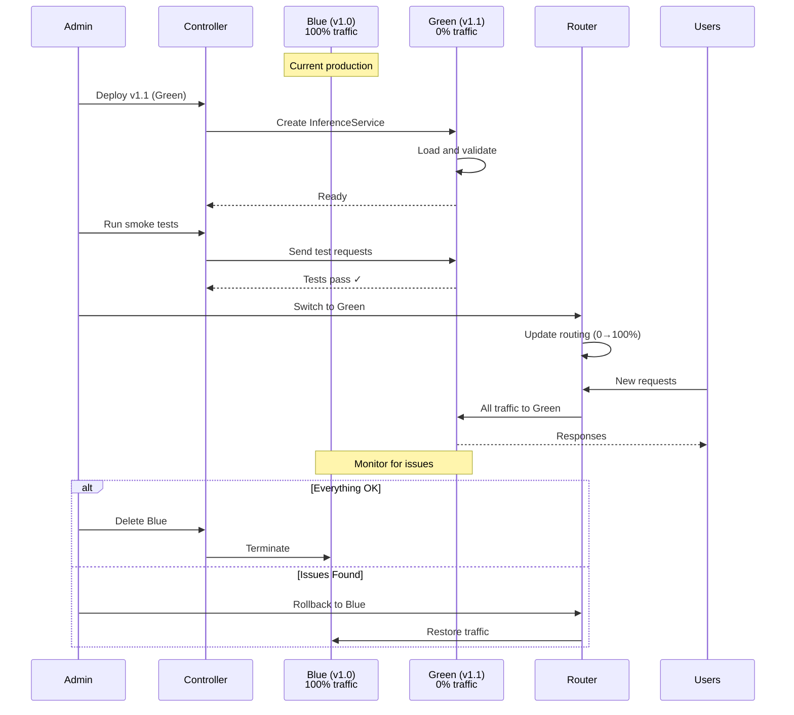

# OpenDataHub ML Serving - Technical Reference Guide

## Configuration Examples and API Specifications

### Table of Contents
1. [KServe Configuration Examples](#kserve-configuration-examples)
2. [ODH Model Controller Examples](#odh-model-controller-examples)
3. [Routing Sidecar Configuration](#routing-sidecar-configuration)
4. [Scheduler Configuration](#scheduler-configuration)
5. [Advanced Deployment Patterns](#advanced-deployment-patterns)
6. [Troubleshooting Guide](#troubleshooting-guide)

---

## KServe Configuration Examples

### 1. Basic InferenceService Configuration

#### Simple Predictor (TensorFlow)

```yaml
apiVersion: serving.kserve.io/v1beta1
kind: InferenceService
metadata:
  name: tensorflow-flowers
  namespace: models
spec:
  predictor:
    model:
      modelFormat:
        name: tensorflow
      storageUri: s3://my-bucket/models/flowers
      resources:
        limits:
          cpu: "2"
          memory: 4Gi
        requests:
          cpu: "1"
          memory: 2Gi
```

#### With Transformer and Explainer

```yaml
apiVersion: serving.kserve.io/v1beta1
kind: InferenceService
metadata:
  name: sklearn-iris-pipeline
  namespace: models
  annotations:
    serving.kserve.io/deploymentMode: "Serverless"
    autoscaling.knative.dev/target: "10"
    autoscaling.knative.dev/class: "kpa.autoscaling.knative.dev"
spec:
  predictor:
    model:
      modelFormat:
        name: sklearn
      protocolVersion: v2
      storageUri: s3://models/sklearn/iris
      resources:
        requests:
          cpu: 500m
          memory: 1Gi
        limits:
          cpu: "1"
          memory: 2Gi
  transformer:
    containers:
    - name: transformer
      image: myorg/iris-transformer:v1
      env:
      - name: STORAGE_URI
        value: s3://models/transformers/iris
      resources:
        requests:
          cpu: 100m
          memory: 256Mi
        limits:
          cpu: "1"
          memory: 1Gi
  explainer:
    alibi:
      type: AnchorTabular
      storageUri: s3://models/explainers/iris
      resources:
        requests:
          cpu: 500m
          memory: 512Mi
```

### 2. LLM InferenceService with GPU

```yaml
apiVersion: serving.kserve.io/v1beta1
kind: InferenceService
metadata:
  name: llama2-7b
  namespace: llm-models
  annotations:
    serving.kserve.io/deploymentMode: "RawDeployment"
    autoscaling.knative.dev/target: "1"
    autoscaling.knative.dev/metric: "concurrency"
spec:
  predictor:
    minReplicas: 0
    maxReplicas: 3
    scaleMetric: concurrency
    scaleTarget: 1
    model:
      modelFormat:
        name: huggingface
      protocolVersion: v1
      storageUri: hf://meta-llama/Llama-2-7b-chat-hf
      env:
      - name: HUGGINGFACE_HUB_CACHE
        value: /models-cache
      - name: TENSOR_PARALLEL_SIZE
        value: "1"
      - name: MAX_MODEL_LEN
        value: "4096"
      resources:
        requests:
          cpu: "4"
          memory: 16Gi
          nvidia.com/gpu: "1"
        limits:
          cpu: "8"
          memory: 32Gi
          nvidia.com/gpu: "1"
      nodeSelector:
        nvidia.com/gpu.product: NVIDIA-A100-SXM4-80GB
      tolerations:
      - key: nvidia.com/gpu
        operator: Exists
        effect: NoSchedule
```

### 3. Multi-Model Serving Setup

#### Step 1: Create Model-less InferenceService

```yaml
apiVersion: serving.kserve.io/v1beta1
kind: InferenceService
metadata:
  name: multi-model-server
  namespace: models
spec:
  predictor:
    model:
      modelFormat:
        name: sklearn
      protocolVersion: v2
      # No storageUri - empty model server
      runtime: kserve-mlserver
      resources:
        requests:
          cpu: "2"
          memory: 8Gi
        limits:
          cpu: "4"
          memory: 16Gi
```

#### Step 2: Deploy TrainedModels

```yaml
apiVersion: serving.kserve.io/v1alpha1
kind: TrainedModel
metadata:
  name: model-1
  namespace: models
spec:
  inferenceService: multi-model-server
  model:
    modelFormat:
      name: sklearn
    storageUri: s3://models/sklearn/model-1
    memory: 1Gi
---
apiVersion: serving.kserve.io/v1alpha1
kind: TrainedModel
metadata:
  name: model-2
  namespace: models
spec:
  inferenceService: multi-model-server
  model:
    modelFormat:
      name: sklearn
    storageUri: s3://models/sklearn/model-2
    memory: 1Gi
---
apiVersion: serving.kserve.io/v1alpha1
kind: TrainedModel
metadata:
  name: model-3
  namespace: models
spec:
  inferenceService: multi-model-server
  model:
    modelFormat:
      name: sklearn
    storageUri: s3://models/sklearn/model-3
    memory: 1Gi
```

### 4. InferenceGraph Examples

#### Sequence Pipeline

```yaml
apiVersion: serving.kserve.io/v1alpha1
kind: InferenceGraph
metadata:
  name: nlp-pipeline
  namespace: models
spec:
  nodes:
    root:
      routerType: Sequence
      steps:
      - serviceName: text-preprocessor
        data: $request
      - serviceName: sentiment-classifier
        data: $response
      - serviceName: entity-extractor
        data: $response
      - serviceName: result-formatter
        data: $response
```

#### Switch Node (Conditional Routing)

```yaml
apiVersion: serving.kserve.io/v1alpha1
kind: InferenceGraph
metadata:
  name: animal-classifier
  namespace: models
spec:
  nodes:
    root:
      routerType: Sequence
      steps:
      - serviceName: image-preprocessor
      - nodeName: animal-router
        data: $response
    
    animal-router:
      routerType: Switch
      steps:
      - serviceName: dog-breed-classifier
        condition: "{ .predictions[0].class == 'dog' }"
      - serviceName: cat-breed-classifier
        condition: "{ .predictions[0].class == 'cat' }"
      - serviceName: bird-species-classifier
        condition: "{ .predictions[0].class == 'bird' }"
      - serviceName: general-animal-classifier
        # Default route when no conditions match
```

#### Ensemble Node (Parallel Execution)

```yaml
apiVersion: serving.kserve.io/v1alpha1
kind: InferenceGraph
metadata:
  name: ensemble-predictor
  namespace: models
spec:
  nodes:
    root:
      routerType: Sequence
      steps:
      - serviceName: feature-transformer
      - nodeName: model-ensemble
        data: $response
      - serviceName: result-aggregator
        data: $response
    
    model-ensemble:
      routerType: Ensemble
      steps:
      - serviceName: sklearn-model
      - serviceName: xgboost-model
      - serviceName: lightgbm-model
      - serviceName: catboost-model
```

#### Splitter Node (A/B Testing)

```yaml
apiVersion: serving.kserve.io/v1alpha1
kind: InferenceGraph
metadata:
  name: ab-test-graph
  namespace: models
spec:
  nodes:
    root:
      routerType: Splitter
      steps:
      - serviceName: model-v1
        weight: 80
      - serviceName: model-v2
        weight: 20
```

### 5. Custom ServingRuntime

```yaml
apiVersion: serving.kserve.io/v1alpha1
kind: ClusterServingRuntime
metadata:
  name: custom-triton-runtime
spec:
  supportedModelFormats:
  - name: tensorrt
    version: "8"
    autoSelect: true
  - name: onnx
    version: "1"
    autoSelect: true
  protocolVersions:
  - v2
  - grpc-v2
  containers:
  - name: kserve-container
    image: nvcr.io/nvidia/tritonserver:23.10-py3
    args:
    - tritonserver
    - --model-store=/mnt/models
    - --grpc-port=9000
    - --http-port=8080
    - --allow-grpc=true
    - --allow-http=true
    - --strict-model-config=false
    - --log-verbose=1
    env:
    - name: OMP_NUM_THREADS
      value: "1"
    resources:
      requests:
        cpu: "2"
        memory: 8Gi
        nvidia.com/gpu: "1"
      limits:
        cpu: "4"
        memory: 16Gi
        nvidia.com/gpu: "1"
    livenessProbe:
      httpGet:
        path: /v2/health/live
        port: 8080
      initialDelaySeconds: 30
      periodSeconds: 10
    readinessProbe:
      httpGet:
        path: /v2/health/ready
        port: 8080
      initialDelaySeconds: 30
      periodSeconds: 10
```

### 6. Autoscaling Configurations

#### Scale to Zero (GPU)

```yaml
apiVersion: serving.kserve.io/v1beta1
kind: InferenceService
metadata:
  name: gpu-model-scale-zero
  annotations:
    autoscaling.knative.dev/target: "1"
    autoscaling.knative.dev/metric: "concurrency"
    autoscaling.knative.dev/window: "60s"
    autoscaling.knative.dev/scale-down-delay: "0s"
    autoscaling.knative.dev/stable-window: "60s"
spec:
  predictor:
    minReplicas: 0  # Enable scale to zero
    maxReplicas: 5
    model:
      modelFormat:
        name: pytorch
      storageUri: s3://models/pytorch/resnet
      resources:
        limits:
          nvidia.com/gpu: "1"
```

#### HPA with Custom Metrics

```yaml
apiVersion: serving.kserve.io/v1beta1
kind: InferenceService
metadata:
  name: cpu-model-hpa
  annotations:
    autoscaling.knative.dev/class: "hpa.autoscaling.knative.dev"
    autoscaling.knative.dev/metric: "cpu"
    autoscaling.knative.dev/target: "70"
spec:
  predictor:
    minReplicas: 2
    maxReplicas: 10
    model:
      modelFormat:
        name: sklearn
      storageUri: s3://models/sklearn/classifier
```

#### Concurrency-based Autoscaling

```yaml
apiVersion: serving.kserve.io/v1beta1
kind: InferenceService
metadata:
  name: high-concurrency-model
  annotations:
    autoscaling.knative.dev/target: "100"
    autoscaling.knative.dev/metric: "concurrency"
    autoscaling.knative.dev/target-utilization-percentage: "70"
spec:
  predictor:
    minReplicas: 3
    maxReplicas: 20
    containerConcurrency: 150  # Hard limit
    model:
      modelFormat:
        name: tensorflow
      storageUri: s3://models/tensorflow/serving
```

---

## ODH Model Controller Examples

### 1. Model Definition CR

```yaml
apiVersion: datasciencecluster.opendatahub.io/v1
kind: ModelDefinition
metadata:
  name: fraud-detection-v1
  namespace: data-science
  labels:
    model-type: classification
    team: fraud-detection
    environment: production
spec:
  modelInfo:
    name: Fraud Detection Model
    version: "1.2.0"
    description: "ML model for real-time fraud detection"
    framework: xgboost
    frameworkVersion: "1.7.0"
    modelType: classification
    metrics:
      accuracy: 0.95
      precision: 0.93
      recall: 0.91
      f1Score: 0.92
    owner: fraud-team@company.com
    tags:
    - fraud
    - classification
    - production
  
  artifact:
    storageUri: s3://ml-models/fraud-detection/v1.2.0
    checksum: sha256:abcdef1234567890...
    size: 1.5GB
  
  servingSpec:
    runtime: kserve-xgbserver
    replicas:
      min: 2
      max: 10
    resources:
      requests:
        cpu: "1"
        memory: 2Gi
      limits:
        cpu: "2"
        memory: 4Gi
    autoscaling:
      metric: concurrency
      target: 50
  
  deployment:
    strategy: canary
    canaryTrafficPercent: 10
    promotionDelay: 300s
  
  monitoring:
    enabled: true
    alerting:
      errorRateThreshold: 0.05
      latencyP99Threshold: 500ms
```

### 2. Serving Configuration

```yaml
apiVersion: datasciencecluster.opendatahub.io/v1
kind: ServingConfiguration
metadata:
  name: team-serving-config
  namespace: data-science
spec:
  defaults:
    runtime: kserve-mlserver
    resources:
      requests:
        cpu: 500m
        memory: 1Gi
      limits:
        cpu: "2"
        memory: 4Gi
    autoscaling:
      minReplicas: 1
      maxReplicas: 5
      metric: rps
      target: 100
  
  runtimeTemplates:
    sklearn:
      runtime: kserve-sklearnserver
      protocolVersion: v2
    xgboost:
      runtime: kserve-xgbserver
      protocolVersion: v2
    tensorflow:
      runtime: kserve-tensorflow-serving
      protocolVersion: v1
  
  networkPolicies:
    enabled: true
    allowedNamespaces:
    - production-apps
    - monitoring
  
  storage:
    defaultBucket: ml-models
    credentials: s3-credentials-secret
```

---

## Routing Sidecar Configuration

### 1. Sidecar Deployment Configuration

```yaml
apiVersion: apps/v1
kind: Deployment
metadata:
  name: llm-routing-sidecar
  namespace: llm-serving
spec:
  replicas: 3
  selector:
    matchLabels:
      app: llm-router
  template:
    metadata:
      labels:
        app: llm-router
    spec:
      containers:
      - name: router
        image: quay.io/opendatahub/llm-d-routing-sidecar:0.3
        ports:
        - containerPort: 8080
          name: http
        - containerPort: 9090
          name: metrics
        env:
        - name: ROUTING_MODE
          value: "load-aware"
        - name: CACHE_ENABLED
          value: "true"
        - name: CACHE_BACKEND
          value: "redis"
        - name: REDIS_URL
          value: "redis://redis-cluster:6379"
        - name: CACHE_TTL
          value: "3600"
        - name: QOS_ENABLED
          value: "true"
        - name: FAILOVER_ENABLED
          value: "true"
        - name: MAX_RETRIES
          value: "2"
        - name: TIMEOUT_MS
          value: "30000"
        - name: CIRCUIT_BREAKER_THRESHOLD
          value: "5"
        - name: CIRCUIT_BREAKER_TIMEOUT
          value: "60"
        volumeMounts:
        - name: config
          mountPath: /etc/router
        resources:
          requests:
            cpu: "1"
            memory: 2Gi
          limits:
            cpu: "2"
            memory: 4Gi
      volumes:
      - name: config
        configMap:
          name: router-config
```

### 2. Router Configuration

```yaml
apiVersion: v1
kind: ConfigMap
metadata:
  name: router-config
  namespace: llm-serving
data:
  router.yaml: |
    routing:
      strategy: load-aware
      load_metrics:
      - queue_length
      - active_requests
      - gpu_utilization
      - response_latency
      
      scoring:
        weights:
          queue_length: 0.3
          active_requests: 0.3
          gpu_utilization: 0.2
          response_latency: 0.2
    
    backends:
    - name: llm-instance-1
      endpoint: http://llm-1.llm-serving.svc.cluster.local:8080
      weight: 1.0
      priority: 1
      max_concurrent_requests: 10
      timeout_ms: 30000
    
    - name: llm-instance-2
      endpoint: http://llm-2.llm-serving.svc.cluster.local:8080
      weight: 1.0
      priority: 1
      max_concurrent_requests: 10
      timeout_ms: 30000
    
    - name: llm-instance-3
      endpoint: http://llm-3.llm-serving.svc.cluster.local:8080
      weight: 0.5
      priority: 2
      max_concurrent_requests: 5
      timeout_ms: 30000
    
    qos:
      tiers:
      - name: critical
        priority: 1
        max_queue_time_ms: 1000
        reserved_capacity: 0.3
      
      - name: high
        priority: 2
        max_queue_time_ms: 5000
        reserved_capacity: 0.4
      
      - name: standard
        priority: 3
        max_queue_time_ms: 30000
        reserved_capacity: 0.25
      
      - name: best-effort
        priority: 4
        max_queue_time_ms: 120000
        reserved_capacity: 0.05
    
    cache:
      enabled: true
      backend: redis
      ttl_seconds: 3600
      max_size_mb: 1024
      eviction_policy: lru
      
      strategies:
      - type: exact-match
        enabled: true
      
      - type: prefix-match
        enabled: true
        min_prefix_length: 50
      
      - type: semantic-similarity
        enabled: false
        threshold: 0.95
    
    failover:
      enabled: true
      max_retries: 2
      retry_delay_ms: 100
      backoff_multiplier: 2.0
      
      circuit_breaker:
        enabled: true
        failure_threshold: 5
        success_threshold: 2
        timeout_seconds: 60
    
    monitoring:
      metrics_port: 9090
      metrics_path: /metrics
      detailed_logging: true
```

### 3. Cache Configuration (Redis)

```yaml
apiVersion: v1
kind: ConfigMap
metadata:
  name: redis-cache-config
  namespace: llm-serving
data:
  redis.conf: |
    maxmemory 4gb
    maxmemory-policy allkeys-lru
    save ""
    appendonly no
    tcp-backlog 511
    timeout 0
    tcp-keepalive 300
---
apiVersion: apps/v1
kind: StatefulSet
metadata:
  name: redis-cluster
  namespace: llm-serving
spec:
  serviceName: redis-cluster
  replicas: 3
  selector:
    matchLabels:
      app: redis
  template:
    metadata:
      labels:
        app: redis
    spec:
      containers:
      - name: redis
        image: redis:7.2-alpine
        ports:
        - containerPort: 6379
        command:
        - redis-server
        - /etc/redis/redis.conf
        volumeMounts:
        - name: config
          mountPath: /etc/redis
        - name: data
          mountPath: /data
        resources:
          requests:
            cpu: "1"
            memory: 4Gi
          limits:
            cpu: "2"
            memory: 8Gi
      volumes:
      - name: config
        configMap:
          name: redis-cache-config
  volumeClaimTemplates:
  - metadata:
      name: data
    spec:
      accessModes: [ "ReadWriteOnce" ]
      resources:
        requests:
          storage: 20Gi
```

---

## Scheduler Configuration

### 1. Scheduler Deployment

```yaml
apiVersion: apps/v1
kind: Deployment
metadata:
  name: llm-inference-scheduler
  namespace: llm-serving
spec:
  replicas: 2
  selector:
    matchLabels:
      app: llm-scheduler
  template:
    metadata:
      labels:
        app: llm-scheduler
    spec:
      serviceAccountName: llm-scheduler
      containers:
      - name: scheduler
        image: quay.io/opendatahub/llm-d-inference-scheduler:0.3.1
        ports:
        - containerPort: 8081
          name: api
        - containerPort: 9091
          name: metrics
        env:
        - name: SCHEDULING_POLICY
          value: "priority-deadline"
        - name: GPU_SHARING_MODE
          value: "time-slicing"
        - name: BATCH_PROCESSING_ENABLED
          value: "true"
        - name: PREEMPTION_ENABLED
          value: "true"
        - name: BACKFILL_ENABLED
          value: "true"
        volumeMounts:
        - name: config
          mountPath: /etc/scheduler
        resources:
          requests:
            cpu: "1"
            memory: 2Gi
          limits:
            cpu: "2"
            memory: 4Gi
      volumes:
      - name: config
        configMap:
          name: scheduler-config
```

### 2. Scheduler Configuration

```yaml
apiVersion: v1
kind: ConfigMap
metadata:
  name: scheduler-config
  namespace: llm-serving
data:
  scheduler.yaml: |
    scheduling:
      policy: priority-deadline
      
      policies:
        fifo:
          enabled: false
        
        priority:
          enabled: true
          preemption_enabled: true
          starvation_prevention: true
        
        fair_share:
          enabled: true
          enforcement_interval: 30s
        
        deadline:
          enabled: true
          slack_time_ms: 1000
        
        sjf:
          enabled: false
        
        backfill:
          enabled: true
          max_backfill_tasks: 10
    
    resource_management:
      gpu_sharing:
        mode: time-slicing  # or 'mig' or 'none'
        time_slice_ms: 100
      
      allocation_strategy: bin-packing  # or 'spread'
      
      fragmentation_threshold: 0.3
      defragmentation_enabled: true
    
    batch_processing:
      enabled: true
      
      dynamic_batching:
        enabled: true
        max_batch_size: 32
        batch_timeout_ms: 100
        
      continuous_batching:
        enabled: true
      
      padding_optimization: true
    
    priorities:
    - name: critical
      level: 1
      quota_percent: 30
      preempt_lower: true
    
    - name: high
      level: 2
      quota_percent: 40
      preempt_lower: false
    
    - name: standard
      level: 3
      quota_percent: 25
      preempt_lower: false
    
    - name: best-effort
      level: 4
      quota_percent: 5
      preempt_lower: false
    
    resource_pools:
    - name: gpu-a100-pool
      nodes:
      - gpu-node-1
      - gpu-node-2
      - gpu-node-3
      resources:
        gpu_type: a100
        gpu_memory_gb: 80
        total_gpus: 12
    
    - name: gpu-l40-pool
      nodes:
      - gpu-node-4
      - gpu-node-5
      resources:
        gpu_type: l40
        gpu_memory_gb: 48
        total_gpus: 8
    
    - name: cpu-pool
      nodes:
      - cpu-node-*
      resources:
        total_cpu_cores: 256
        total_memory_gb: 1024
    
    monitoring:
      metrics_enabled: true
      metrics_port: 9091
      
      metrics:
      - queue_length
      - scheduling_latency
      - task_wait_time
      - resource_utilization
      - preemption_count
```

### 3. RBAC for Scheduler

```yaml
apiVersion: v1
kind: ServiceAccount
metadata:
  name: llm-scheduler
  namespace: llm-serving
---
apiVersion: rbac.authorization.k8s.io/v1
kind: ClusterRole
metadata:
  name: llm-scheduler-role
rules:
- apiGroups: [""]
  resources: ["nodes"]
  verbs: ["get", "list", "watch"]
- apiGroups: [""]
  resources: ["pods"]
  verbs: ["get", "list", "watch", "create", "update", "patch", "delete"]
- apiGroups: [""]
  resources: ["pods/status"]
  verbs: ["get", "update", "patch"]
- apiGroups: ["serving.kserve.io"]
  resources: ["inferenceservices"]
  verbs: ["get", "list", "watch"]
- apiGroups: ["serving.kserve.io"]
  resources: ["inferenceservices/status"]
  verbs: ["get", "update", "patch"]
---
apiVersion: rbac.authorization.k8s.io/v1
kind: ClusterRoleBinding
metadata:
  name: llm-scheduler-binding
roleRef:
  apiGroup: rbac.authorization.k8s.io
  kind: ClusterRole
  name: llm-scheduler-role
subjects:
- kind: ServiceAccount
  name: llm-scheduler
  namespace: llm-serving
```

---

## Advanced Deployment Patterns

### 1. Blue-Green Deployment



**Configuration:**

```yaml
# Blue (Current Production)
apiVersion: serving.kserve.io/v1beta1
kind: InferenceService
metadata:
  name: model-blue
  labels:
    version: v1.0
    deployment: blue
spec:
  predictor:
    model:
      modelFormat:
        name: sklearn
      storageUri: s3://models/model-v1.0
---
# Green (New Version)
apiVersion: serving.kserve.io/v1beta1
kind: InferenceService
metadata:
  name: model-green
  labels:
    version: v1.1
    deployment: green
spec:
  predictor:
    model:
      modelFormat:
        name: sklearn
      storageUri: s3://models/model-v1.1
---
# VirtualService for Traffic Management
apiVersion: networking.istio.io/v1beta1
kind: VirtualService
metadata:
  name: model-routing
spec:
  hosts:
  - model-service.example.com
  http:
  - match:
    - headers:
        version:
          exact: "v1.1"
    route:
    - destination:
        host: model-green
      weight: 100
  - route:
    - destination:
        host: model-blue
      weight: 100  # Initially 100% to blue
    - destination:
        host: model-green
      weight: 0    # Initially 0% to green
```

### 2. Shadow Deployment (Traffic Mirroring)

```yaml
apiVersion: networking.istio.io/v1beta1
kind: VirtualService
metadata:
  name: shadow-deployment
  namespace: models
spec:
  hosts:
  - model-service
  http:
  - route:
    - destination:
        host: model-production
      weight: 100
    mirror:
      host: model-candidate
    mirrorPercentage:
      value: 100.0
```

### 3. Multi-Region Deployment

```yaml
apiVersion: serving.kserve.io/v1beta1
kind: InferenceService
metadata:
  name: global-model
  labels:
    topology.kubernetes.io/region: us-east-1
spec:
  predictor:
    model:
      modelFormat:
        name: tensorflow
      storageUri: s3://models/global-model
---
apiVersion: serving.kserve.io/v1beta1
kind: InferenceService
metadata:
  name: global-model
  labels:
    topology.kubernetes.io/region: eu-west-1
spec:
  predictor:
    model:
      modelFormat:
        name: tensorflow
      storageUri: s3://models/global-model
---
apiVersion: networking.istio.io/v1beta1
kind: VirtualService
metadata:
  name: global-routing
spec:
  hosts:
  - model.example.com
  http:
  - match:
    - headers:
        x-region:
          exact: "us-east"
    route:
    - destination:
        host: global-model.us-east-1
  - match:
    - headers:
        x-region:
          exact: "eu-west"
    route:
    - destination:
        host: global-model.eu-west-1
```

---

## Troubleshooting Guide

### Common Issues and Solutions

#### Issue 1: Model Loading Timeout

**Symptoms:**
- Pod stuck in `ContainerCreating` state
- Timeout errors in storage initializer logs

**Diagnosis:**
```bash
kubectl describe pod <pod-name> -n <namespace>
kubectl logs <pod-name> -c storage-initializer -n <namespace>
```

**Solutions:**

1. Increase timeout:
```yaml
apiVersion: serving.kserve.io/v1beta1
kind: InferenceService
metadata:
  annotations:
    serving.kserve.io/storage-initializer-timeout: "600"  # 10 minutes
```

2. Check storage credentials:
```bash
kubectl get secret <storage-secret> -n <namespace> -o yaml
```

3. Use PVC for large models:
```yaml
spec:
  predictor:
    model:
      storageUri: pvc://model-pvc/path/to/model
```

#### Issue 2: Scale to Zero Not Working

**Symptoms:**
- Pods not scaling down despite no traffic
- Autoscaler not reacting

**Diagnosis:**
```bash
kubectl get inferenceservice <name> -n <namespace> -o yaml
kubectl get kpa -n <namespace>
kubectl logs -n knative-serving -l app=autoscaler
```

**Solutions:**

1. Check Knative configuration:
```bash
kubectl get configmap config-autoscaler -n knative-serving -o yaml
```

2. Verify annotations:
```yaml
annotations:
  autoscaling.knative.dev/min-scale: "0"
  autoscaling.knative.dev/scale-down-delay: "0s"
```

#### Issue 3: High Latency

**Symptoms:**
- Slow inference response times
- Timeouts on requests

**Diagnosis:**
```bash
# Check pod resources
kubectl top pod -n <namespace>

# Check metrics
kubectl port-forward svc/<isvc>-predictor 8080:8080
curl http://localhost:8080/metrics

# Check queue proxy metrics
kubectl logs <pod> -c queue-proxy
```

**Solutions:**

1. Increase resources:
```yaml
resources:
  requests:
    cpu: "4"
    memory: 16Gi
  limits:
    cpu: "8"
    memory: 32Gi
```

2. Enable batching:
```yaml
annotations:
  serving.kserve.io/enable-batch: "true"
  serving.kserve.io/batch-size: "32"
  serving.kserve.io/batch-timeout: "100ms"
```

3. Use GPU if available:
```yaml
resources:
  limits:
    nvidia.com/gpu: "1"
```

#### Issue 4: Out of Memory (OOM)

**Symptoms:**
- Pod crashes with exit code 137
- OOMKilled in pod status

**Diagnosis:**
```bash
kubectl describe pod <pod-name>
# Look for "Reason: OOMKilled"

kubectl logs <pod-name> --previous
```

**Solutions:**

1. Increase memory limits:
```yaml
resources:
  requests:
    memory: 16Gi
  limits:
    memory: 32Gi
```

2. Use multi-model serving to share memory
3. Enable model unloading in multi-model mode
4. Use smaller model variants

#### Issue 5: Authentication Errors

**Symptoms:**
- 401/403 errors
- "Authentication failed" in logs

**Diagnosis:**
```bash
kubectl get secret -n <namespace>
kubectl describe inferenceservice <name>
```

**Solutions:**

1. Create storage credentials secret:
```bash
kubectl create secret generic storage-config \
  --from-literal=AWS_ACCESS_KEY_ID=<key> \
  --from-literal=AWS_SECRET_ACCESS_KEY=<secret> \
  -n <namespace>
```

2. Annotate InferenceService:
```yaml
metadata:
  annotations:
    serving.kserve.io/s3-secret-name: storage-config
```

### Debugging Commands

```bash
# Get all KServe resources
kubectl get inferenceservices,trainedmodels,servingruntimes -A

# Describe InferenceService
kubectl describe isvc <name> -n <namespace>

# Get logs from all containers
kubectl logs <pod-name> -c storage-initializer
kubectl logs <pod-name> -c kserve-container
kubectl logs <pod-name> -c queue-proxy

# Check KServe controller logs
kubectl logs -n kserve -l control-plane=kserve-controller-manager

# Check webhook logs
kubectl logs -n kserve -l control-plane=kserve-controller-manager -c manager

# Port forward for local testing
kubectl port-forward svc/<isvc>-predictor-default 8080:80

# Test inference endpoint
curl -X POST http://localhost:8080/v1/models/<model>:predict \
  -H "Content-Type: application/json" \
  -d @input.json

# Get events
kubectl get events -n <namespace> --sort-by='.lastTimestamp'

# Check Knative Service
kubectl get ksvc -n <namespace>
kubectl describe ksvc <name> -n <namespace>
```

### Performance Tuning

```yaml
apiVersion: serving.kserve.io/v1beta1
kind: InferenceService
metadata:
  name: optimized-model
  annotations:
    # Autoscaling
    autoscaling.knative.dev/target: "100"
    autoscaling.knative.dev/metric: "concurrency"
    autoscaling.knative.dev/target-utilization-percentage: "70"
    
    # Timeouts
    serving.knative.dev/timeout-seconds: "300"
    
    # Batching
    serving.kserve.io/enable-batch: "true"
    serving.kserve.io/batch-size: "32"
    serving.kserve.io/batch-timeout: "100ms"
spec:
  predictor:
    minReplicas: 2
    maxReplicas: 10
    containerConcurrency: 150
    model:
      modelFormat:
        name: tensorflow
      storageUri: s3://models/optimized
      env:
      - name: TF_NUM_INTRAOP_THREADS
        value: "4"
      - name: TF_NUM_INTEROP_THREADS
        value: "2"
      - name: OMP_NUM_THREADS
        value: "4"
      resources:
        requests:
          cpu: "4"
          memory: 8Gi
        limits:
          cpu: "8"
          memory: 16Gi
```

---

## API Reference

### V1 Protocol (Legacy)

**Predict:**
```bash
POST /v1/models/<model-name>:predict
Content-Type: application/json

{
  "instances": [
    [1.0, 2.0, 3.0, 4.0]
  ]
}
```

**Response:**
```json
{
  "predictions": [
    [0.1, 0.2, 0.7]
  ]
}
```

### V2 Protocol (Recommended)

**Health:**
```bash
GET /v2/health/live
GET /v2/health/ready
```

**Model Metadata:**
```bash
GET /v2/models/<model-name>
GET /v2/models/<model-name>/versions/<version>
```

**Inference:**
```bash
POST /v2/models/<model-name>/infer
Content-Type: application/json

{
  "inputs": [
    {
      "name": "input-0",
      "shape": [1, 4],
      "datatype": "FP32",
      "data": [1.0, 2.0, 3.0, 4.0]
    }
  ]
}
```

**Response:**
```json
{
  "model_name": "my-model",
  "model_version": "1",
  "outputs": [
    {
      "name": "output-0",
      "shape": [1, 3],
      "datatype": "FP32",
      "data": [0.1, 0.2, 0.7]
    }
  ]
}
```

### OpenAI Protocol (LLMs)

**Chat Completions:**
```bash
POST /v1/chat/completions
Content-Type: application/json
Authorization: Bearer <token>

{
  "model": "llama-2-7b",
  "messages": [
    {"role": "system", "content": "You are a helpful assistant."},
    {"role": "user", "content": "What is machine learning?"}
  ],
  "temperature": 0.7,
  "max_tokens": 500
}
```

**Streaming Response:**
```bash
POST /v1/chat/completions
Content-Type: application/json

{
  "model": "llama-2-7b",
  "messages": [...],
  "stream": true
}
```

---

**Document Version**: 1.0  
**Last Updated**: October 26, 2025

